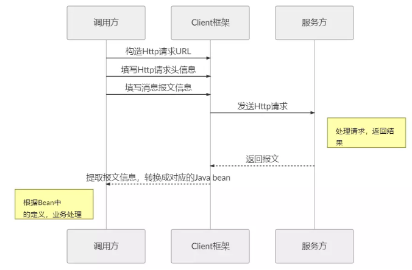
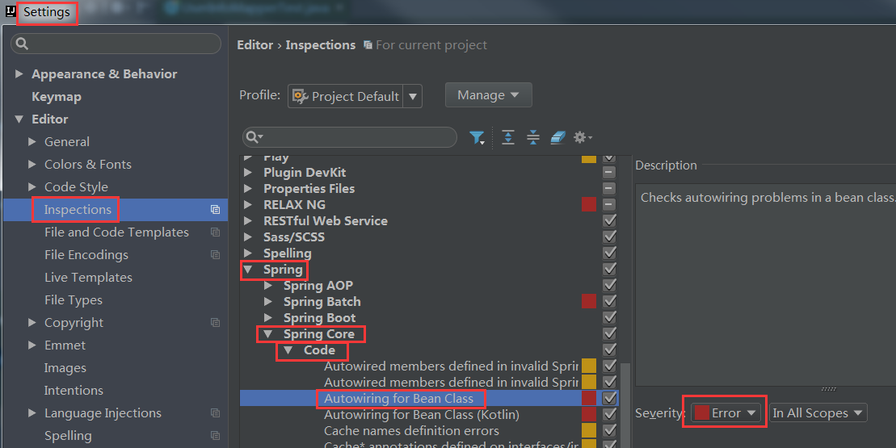

# SpringCloud（二）

课程回顾：SpringCloud

1、项目架构的演变过程

- 单体架构
- 垂直架构（“拆”：应用）
- 分布式架构/SOA：面向服务（“拆”：业务）    
  - 需要使用新的技术：RPC    Dubbo
- 微服务架构：“拆”分颗粒度更小
  - 存在一系列的问题：Springcloud去解决（提供很多组件）

2、Springcloud介绍

- Springcloud它是一个工具箱（各种各样的工具--->组件    不同的组件解决不同的问题）
- 版本：
  - springcloud版本号：伦敦地名     springcloud  与  springboot版本对应。
  - 其他的框架/中间版本号：数字     5.0.2    2.1.4         OS：x.y.z-n    16.8.32-64

3、服务间的调用

- RestTemplate对象：http的客户端工具
  - 需要手动注册该Bean
- HttpClient：原生api（工具类）

4、模拟服务间调用：略

- 被调用方是集群部署，该调用哪个？
- 被调用方如果服务下线了，如何处理？
- 调用方在调用的过程中：url地址硬编码了
- 服务没有被管理？

5、注册中心：Eureka

- 概念：两个角色
  - Eureka  Server：注册中心
  - Eureka  Client：服务提供方、消费方
- 编写程序：
  - 注册中心：搭建eureka      启动类上：@EnableEurekaServer
  - 服务提供方、消费方：具体程序       启动类上：@EnableEurekaClient

6、负载均衡组件：Ribbon

- 在注册的RestTemplate上添加：@LoadBalanced
- 调用时：ip:port<===>提供方的服务名称
- 默认使用的LB的策略：轮询      演示：随机
- Ribbon：提供IRule接口（实现类）

7、熔断器/断路器：hystrix

- 作用：与空气开关一样，保护整个线路
- 开发中：A--->B---->C---->D      时间的推移：导致整个服务全部奔溃     雪崩
- 当第一个服务出现问题：服务降级   提供方法（兜底方法）
  - 降级：作用在方法上
  - 降级：作用在类上       针对所有的方法

8、RPC-TCP和Http区别

- 协议不同、传输效率、性能不同


课程目标：

1、能够使用Feign进行远程调用【必须掌握】

2、能够搭建Spring Cloud Gateway网关【必须掌握】

- 本身的使用外，学会自定义过滤器

3、能够搭建Spring Cloud Config配置中心【学会使用】

4、能够使用Spring Cloud Bus消息总线【略】

- 自动更新配置     zk  watch


# 1 Feign进行远程调用


一、Feign的代码编写：

1、添加feign的依赖

2、在启动类上：开启feign客户端

3、编写Feign（interface）：完成调用（提供方）

- 编写方法，在方法中需要请求http的请求地址（调用谁以及该方法的完整路径）

4、在controller中注入Feign，完成调用。


二、支持负载均衡（可以在配置文件中指定LB的策略）


三、支持熔断器

1、在配置文件中：开启熔断支持

2、编写熔断类，需要实现Feign接口（实现所有方法---对每个方法进行兜底）


## 1.1 介绍

Feign 的英文表意为“假装，伪装，变形”， 是一个**http请求调用的轻量级框架**，可以以Java接口注解的方式调用Http请求，而不用像Java中通过封装HTTP请求报文的方式直接调用。Feign通过处理注解，将请求模板化，当实际调用的时候，传入参数，根据参数再应用到请求上，进而转化成真正的请求，这种请求相对而言比较直观。**Feign被广泛应用在Spring Cloud 的解决方案中**，是学习基于Spring Cloud 微服务架构不可或缺的重要组件。

**http调用过程，如图：**



Feign是声明式的web service客户端，它**让微服务之间的调用变得更简单了，类似controller调用service**。Spring Cloud集成了Ribbon和Eureka，可在使用Feign时提供负载均衡的http客户端。 

开源项目地址： [https://github.com/OpenFeign/feign](https://links.jianshu.com/go?to=https%3A%2F%2Fgithub.com%2FOpenFeign%2Ffeign)

综上，Feign的好处：

~~~properties
- 集成Ribbon的负载均衡功能
- 集成Eureka服务注册与发现功能
- 集成了Hystrix的熔断器功能
- 支持请求压缩
- Feign以更加优雅的方式编写远程调用代码，并简化重复代码
~~~

## 1.2 入门程序

### 1.2.1 需求

使用Feign替代RestTemplate发送Rest请求

### 1.2.2 代码实现

#### 1.2.2.1 添加依赖

在**服务消费方**【本次工程：eureka-client-consumer】添加Feign依赖：

```xml
<!--feign-->
<dependency>
   <groupId>org.springframework.cloud</groupId>
   <artifactId>spring-cloud-starter-openfeign</artifactId>
</dependency>
```


#### 1.2.2.2 编写Feign

在服务消费方编写Feign客户端接口UserFeign，用于发送请求。


~~~java
@FeignClient(name = "eureka-client-provider")//开启Feign(name="提供者工程名")
public interface UserFeign {

    @GetMapping("/api/user/findById/{id}")
    String findById(@PathVariable(value = "id") Integer id);
}
~~~


#### 1.2.2.3 编写Controller

在服务消费方编写FeignConsumerController，注入UserFeign并发送请求。


~~~java
package com.itheima.controller;

import com.itheima.service.UserFeign;
import org.springframework.beans.factory.annotation.Autowired;
import org.springframework.web.bind.annotation.GetMapping;
import org.springframework.web.bind.annotation.PathVariable;
import org.springframework.web.bind.annotation.RequestMapping;
import org.springframework.web.bind.annotation.RestController;

/**
 * @Author: wzw
 * @Date: 2020/11/29 17:50
 * @version: 1.8
 */
@RestController
@RequestMapping("/feign")
public class FeignConsumerController {

    //注入Feign接口
    @Autowired(required = false)
    private UserFeign userFeign;

    /**
     * 要Fegin替换RestTamplate
     * @param id 查询条件
     * @return  查询对象
     */
    @GetMapping("/findById/{id}")
    public String findById(@PathVariable(value = "id") Integer id){
        //Feign接口调用,接口中定义的就是Strin类型
        String json = userFeign.findById(id);
        //返回的就是json字符串
        return json;
    }
}

~~~


~~~properties
PS：
	在controller中注入UserFeign报错但是可以正常编译并且访问，注意了这只是IDEA工具的检测问题，可以在IDEA中修改检测级别。
~~~

- IDEA 2018版：做如下配置

  

- IDEA 2017版：并没有这些选项，因此我们直接修改代码：@Autowired(required = false)


#### 1.2.2.4 开启Feign功能

在启动类中添加**@EnableFeignClients注解**，开启Feign功能。

~~~java
@SpringCloudApplication
@EnableFeignClients	// 开启Feign客户端功能
public class EurekaClientConsumerApplication {

	public static void main(String[] args) {
		SpringApplication.run(EurekaClientConsumerApplication.class, args);
	}

	@Bean
	@LoadBalanced
    public RestTemplate restTemplate(){
	    return new RestTemplate();
    }

}
~~~


#### 1.2.2.5 测试

启动服务并且进行访问测试。`<http://localhost:8080/feign/findById/1>`


#### 1.2.2.6 坑

~~~properties
使用Feign的时候,如果参数中带有@PathVariable形式的参数,
则要用value属性去指定。
标明对应的参数,否则会抛出IllegalStateException异常，
异常信息：Feign PathVariable annotation was empty on param 0.
~~~


注意:

## 1.3 负载均衡

Feign本身集成了Ribbon依赖和自动配置，因此不需要额外引入依赖，也不需要再注入RestTemplate对象。Feign内置的ribbon默认设置了请求超时时长，默认是1000ms，可以修改ribbon内部有重试机制，一旦超时，会自动重新发起请求。如果不希望重试可以关闭配置。

我们可以在服务`消费方`application.yml中配置如下内容：

~~~yaml
# 配置负载均衡
eureka-client-provider:
  ribbon:
    NFLoadBalancerRuleClassName: com.netflix.loadbalancer.RandomRule # 配置为随机
    ConnectTimeout: 1000 # 指的是建立连接所用的时间
    ReadTimeout: 2000    # 指的是建立连接后从服务器读取到可用资源所用的时间
    MaxAutoRetries: 0    # 最大重试次数(第一个服务)
    MaxAutoRetriesNextServer: 0   # 最大重试下一个服务次数(集群的情况才会用到)
    OkToRetryOnAllOperations: false # 是否对所有的请求都重试
~~~


## 1.4 熔断支持

Feign默认对Hystrix支持。


### 1.4.1 需求

调用服务时，如果服务出现宕机，给用户响应一个友好提示。

### 1.4.2 代码实现

#### 1.4.2.1 开起Feign对熔断器支持

开启Feign对熔断器支持，默认是关闭的。在服务`消费方`的application.yml文件中配置如下内容：


~~~yaml
feign:
  hystrix:
    enabled: true
~~~


#### 1.4.2.2 编写Fallback处理类

创建熔断器的处理类，需要实现Feign客户端的接口。


~~~java
@Component
public class UserFeignFallback implements UserFeign {

    @Override
    public String findById(Integer id) {
        return "该用户异常。。。";
    }
}
~~~


#### 1.4.2.3 调用Fallback

在`Feign接口类`(Feign客户端)上的FeignClient注解加入需要调用熔断器的处理类。


~~~java
@FeignClient(name = "eureka-client-provider", fallback = UserFeignFallback.class) //Feign客户端
public interface UserFeign {

    @GetMapping("/api/user/findById/{id}")
    String findById(@PathVariable(value = "id") Integer id);
}
~~~


#### 1.4.2.4 测试

PS：在消费方的controller中就无需添加@HystrixCommand、@DefaultProperties相关注解了。

停止服务提供方程序，发送请求`<http://localhost:8080/feign/findById/1>` ，结果如下：


## 1.5 日志配置

日志配置：feign调用的过程中，可以在控制台打印（日志信息）整个调用的过程。

Feign调用的日志级别：略

### 1.5.1 介绍

Feign 提供了日志打印功能，可以通过配置来调整日志级别，从而了解 Feign 中 Http 请求的细节。 说白了就是对接口的调用情况进行监控和输出 。

~~~properties
日志级别： 
          NONE: 默认的，不显示任何日志

          BASIC：仅记录请求方法、URL、响应状态码以及执行时间

          HEADERS：除了BASIC中定义的信息以外，还有请求和响应的头信息

          FULL： 除了HEADERS中定义的信息之外，还有请求和响应的正文及元数据
~~~

### 1.5.2 代码实现

1、创建`Feign的配置类`：创建`<com.itheima.config.FeignConfig>`

~~~java
@Configuration
public class FeignConfig {

    @Bean
    public Logger.Level feignLoggerLevel(){
        return Logger.Level.FULL;//显示所有数据
    }
}
~~~


2、在配置文件中开Feign客户端日志

~~~yaml
#开启Feign客户端日志  也可以直接扫描com.itheima.feign包  com.itheima.feign： debug
logging:
  level:
    com.itheima: debug
~~~

`注意:`

​		1.Level的包别错了


2.扫描的包路径要对,如果扫描全部可以改为com.itheima


### 1.5.3 测试

重启消费方并发送请求，idea的控制台结果如下：


## 1.6 请求压缩（了解）

servlet：gzip          Linux：xxx.tar.gz   xxx.tar.bz2


SpringCloudFeign支持对请求和响应进行GZIP压缩，以减少通信过程中的性能损耗。通过配置开启请求与响应的压缩功能：

- 开启压缩功能

~~~yaml
feign:
	compression:
        request:
            enabled: true # 开启请求压缩
        response:
            enabled: true # 开启响应压缩
~~~

- 对请求类型以及压缩大小进行限制

~~~yaml
# 无注释版
feign:
	compression:
		request:
			enabled: true
			mime-types:	text/html,application/xml,application/json
			min-request-size: 2048 
#  Feign配置
feign:
	compression:
		response:
			enabled: true # 开启请求压缩
			mime-types:	text/html,application/xml,application/json # 设置压缩的数据类型
			min-response-size: 2048 # 设置触发压缩的大小下限
			#以上数据类型，压缩大小下限均为默认值
~~~


# 2 Spring Cloud Gateway网关

## 2.1 API网关

API 网关出现的原因是微服务架构的出现，不同的微服务一般会有不同的网络地址，而外部客户端可能需要调用多个服务的接口才能完成一个业务需求，如果让客户端直接与各个微服务通信，会有以下的问题： 

- 客户端会多次请求不同的微服务，增加了客户端的复杂性。
- 存在跨域请求（CORS     A服务器---->B服务器资源），在一定场景下处理相对复杂。
- 认证复杂，每个服务都需要独立认证。  url ：token（令牌or票据）=3434duri4fdewfdjsdiuresirwerwewsfh
- 难以重构，随着项目的迭代，可能需要重新划分微服务。例如，可能将多个服务合并成一个或者将一个服务拆分成多个。如果客户端直接与微服务通信，那么重构将会很难实施。
- 某些微服务可能使用了防火墙 （花钱买）/ 浏览器不友好的协议，直接访问会有一定的困难。

以上这些问题可以借助 API 网关解决。API 网关是介于客户端和服务器端之间的中间层，所有的外部请求都会先经过 API 网关这一层。也就是说，API 的实现方面更多的考虑业务逻辑，而安全、性能、监控可以交由 API 网关来做，这样既提高业务灵活性又不缺安全性，架构图如图所示： 


使用 API 网关后的优点如下：

- 易于监控。可以在网关收集监控数据并将其推送到外部系统进行分析。
- 易于认证。可以在网关上进行认证，然后再将请求转发到后端的微服务，而无须在每个微服务中进行认证。
- 减少了客户端与各个微服务之间的交互次数。


## 2.2 网关选型

### 2.2.1 网关选型

微服务架构中常用的网关，如下：


 

### 2.2.2 Spring Cloud Gateway

#### 2.2.2.1 介绍

Spring Cloud Gateway 是 Spring Cloud 的一个**全新项目**，该项目是基于 Spring 5.0，Spring Boot 2.x 和 Project Reactor 等技术开发的网关，它旨在为微服务架构提供一种简单有效的统一的 API 路由管理方式。 

Spring Cloud Gateway 作为 Spring Cloud 生态系统中的网关，目标是替代 Netflix Zuul，其不仅提供统一的路由方式，并且基于 Filter 链的方式提供了网关基本的功能，例如：安全、监控、限流等。

#### 2.2.2.2 术语

- **Route（路由）**：这是网关的基本构建块。它由一个 ID，一个目标 URI，一组断言和一组过滤器定义。如果断言为真，则路由匹配。
- **Predicate（断言）**：这是一个 [Java 8 的 Predicate](http://docs.oracle.com/javase/8/docs/api/java/util/function/Predicate.html)。输入类型是一个 [`ServerWebExchange`](https://docs.spring.io/spring/docs/5.0.x/javadoc-api/org/springframework/web/server/ServerWebExchange.html)。我们可以使用它来匹配来自 HTTP 请求的任何内容，例如 headers 或参数。    请求做一些配置
- **Filter（过滤器）**：这是`org.springframework.cloud.gateway.filter.GatewayFilter`的实例，我们可以使用它修改请求和响应

#### 2.2.2.3 流程

客户端向 Spring Cloud Gateway 发出请求。然后在 Gateway Handler Mapping 中找到与请求相匹配的路由，将其发送到 Gateway Web Handler。Handler 再通过指定的过滤器链来将请求发送到我们实际的服务执行业务逻辑，然后返回。 过滤器之间用虚线分开是因为过滤器可能会在发送代理请求之前（“pre”）或之后（“post”）执行业务逻辑。


## 2.3 入门程序

### 2.3.1 创建maven工程

在springcloud-microservice父工程下`创建api-gateway子工程`，并且添加需要的依赖

~~~xml
<dependencies>
    <!--网关依赖-->
    <dependency>
        <groupId>org.springframework.cloud</groupId>
        <artifactId>spring-cloud-starter-gateway</artifactId>
    </dependency>
    <dependency>
        <groupId>org.springframework.cloud</groupId>
        <artifactId>spring-cloud-starter-netflix-eureka-client</artifactId>
    </dependency>

    <dependency>
        <groupId>org.springframework.boot</groupId>
        <artifactId>spring-boot-devtools</artifactId>
        <scope>runtime</scope>
        <optional>true</optional>
    </dependency>
    <dependency>
        <groupId>org.springframework.boot</groupId>
        <artifactId>spring-boot-starter-test</artifactId>
        <scope>test</scope>
    </dependency>
</dependencies>
~~~


### 2.3.2 编写启动类

创建的工程也属于一个服务，因此我们也需要启动并且`交给Eureka注册中心管理`。

* 创建:`<com.itheima.ApiGatewayApplication>`启动类
  * 并在`启动类`中
    * 添加@EnableDiscoveryClient注解
    * 或者@EnableEurekaClient。

~~~java
@SpringBootApplication
@EnableEurekaClient
public class ApiGatewayApplication {

    public static void main(String[] args) {
        SpringApplication.run(ApiGatewayApplication.class, args);
    }
}
~~~

### 2.3.3 编写application.yml文件

1、配置Eureka

2、配置api的路由规则

~~~yaml
#注释
server:
  port: 10010  #端口
spring:
  application:
    name: api-gateway   #本网关工程名
  cloud:
    gateway:
      # 路由(集合， - 代表集合)
      routes:
        - id: eureka-client-provider-route  # id唯一标识，(可自定义)
          uri: http://127.0.0.1:9091        # 路由服务提供方地址
          predicates:                       # 路由拦截地址的规则(断言)
            - Path=/api/user/**             # 拦截以/api/user开头请求的url
eureka:
  client:
    service-url:
      defaultZone: http://127.0.0.1:10086/eureka #默认到配置中心
~~~


### 2.3.4 测试

启动所有服务，访问测试：`<http://localhost:10010/api/user/findById/1>` 


## 2.4 动态路由（LB）

- 刚才路由规则中，我们把路径对应服务`地址写死了`！如果服务提供者集群的话，这样做不合理。应该是**根据服务名称**，去Eureka注册中心查找服务对应的所有实例列表，然后进行`动态路由`！配置如下：

~~~yaml
#uri: http://127.0.0.1:9091		 #直接指定路由服务提供方IP地址和端口
uri: lb://eureka-client-provider #动态路由:提供者名称
~~~


- 启动网关服务再次访问：本次测试访问4次结果如下（

- 结果：会路由不到不同的服务提供方    

- PS：不同的负载均衡策略可能查看的结果不一样。）：`<http://localhost:10010/api/user/findById/1>`

  


## 2.5 过滤器-重要

由filter工作流程点，可以知道filter有着非常重要的作用，在“pre”类型的过滤器可以做参数校验、权限校验、流量监控、日志输出、协议转换等，在“post”类型的过滤器中可以做响应内容、响应头的修改，日志的输出，流量监控等。 (过滤器, 处理请求, 可以修改请求前的数据和返回后的数据, 类似于spring webmvc的interceptor)

当我们有很多个服务时，比如下图中的user-service、goods-service、sales-service等服务，客户端请求各个服务的Api时，每个服务都需要做相同的事情，比如鉴权、限流、日志输出等。 


对于这样重复的工作，有没有办法做的更好，答案是肯定的。在微服务的上一层加一个全局的权限控制、限流、日志输出的Api Gatewat服务，然后再将请求转发到具体的业务服务层。这个Api Gateway服务就是起到一个服务边界的作用，外接的请求访问系统，必须先通过网关层。 


Spring Cloud Gateway同zuul类似，有“pre”和“post”两种方式的filter。客户端的请求先经过“pre”类型的filter，然后将请求转发到具体的业务服务，比如上图中的user-service，收到业务服务的响应之后，再经过“post”类型的filter处理，最后返回响应到客户端。


与zuul不同的是，filter除了分为“pre”和“post”两种方式的filter外，在Spring Cloud Gateway中，filter从作用范围可分为另外两种，一种是针对于单个路由的gateway filter，它在配置文件中的写法同predict类似；另外一种是针对于所有路由的global gateway filer。现在从作用范围划分的维度来讲解这两种filter。

### 2.5.1 过滤器分类

- 默认过滤器：出厂自带，实现好了拿来就用，不需要实现
  - 全局默认过滤器
  - 局部默认过滤器
- 自定义过滤器：根据需求自己实现，实现后需配置，然后才能用哦。
  - 全局过滤器：作用在所有路由上。
  - 局部过滤器：配置在具体路由下，只作用在当前路由上。

默认过滤器几十个，常见如下：

| 过滤器名称           | 说明                         |
| -------------------- | ---------------------------- |
| AddRequestHeader     | 对匹配上的请求加上Header     |
| AddRequestParameters | 对匹配上的请求路由           |
| AddResponseHeader    | 对从网关返回的响应添加Header |
| StripPrefix          | 对匹配上的请求路径去除前缀   |

详细说明官方[链接](https://cloud.spring.io/spring-cloud-static/spring-cloud-gateway/2.1.1.RELEASE/single/spring-cloud-gateway.html#_gatewayfilter_factories)

### 2.5.2 配置过滤器

#### 2.5.2.1 配置全局过滤器

举个栗子：设置响应的头信息。

- 第一步：修改application.yml文件

  ~~~yaml
  #注释
  server:
    port: 10010
  spring:
    application:
      name: api-gateway
    cloud:
      gateway:
        # 路由(集合， - 代表集合)
        routes:
          - id: eureka-client-provider-route  # id唯一标识，(可自定义)
  #          uri: http://127.0.0.1:9091        # 路由服务提供方地址
            uri: lb://eureka-client-provider   # 动态路由
            predicates:                       # 路由拦截地址的规则(断言)
              - Path=/api/user/**            # 拦截以/api/user开头请求的url
        default-filters:			#添加点:默认过滤器 key和value以逗号为分割
          - AddResponseHeader=X-Response-Default-MyName,itheima
  eureka:
    client:
      service-url:
        defaultZone: http://127.0.0.1:10086/eureka
  ~~~

  

- 第二步：通过浏览器查看

  

#### 2.5.2.2 配置局部过滤器

- 添加请求路径前缀

  - 第一步：修改application.yml文件

    ~~~yaml
    #注释
    server:
      port: 10010
    spring:
      application:
        name: api-gateway
      cloud:
        gateway:
          # 路由(集合， - 代表集合)
          routes:
            - id: eureka-client-provider-route  # id唯一标识，(可自定义)
              uri: lb://eureka-client-provider  # 动态路由
              predicates:                       # 路由拦截地址的规则(断言)
    #            - Path=/api/user/**            # 修改点:拦截以/api/user开头请求的url
                - Path=/**                      # 添加点:匹配多级目录
              filters:
                - PrefixPath=/api/user/findById # 添加点:指定请求的前缀，我们在访问的时候就不需要添加了
          default-filters:
            - AddResponseHeader=X-Response-Default-MyName,itheima
    eureka:
      client:
        service-url:
          defaultZone: http://127.0.0.1:10086/eureka
    ~~~

    

  - 第二步：重启网关服务：略

  - 第三步：测试：`<http://localhost:10010/1>`

    

  - 路由说明：

    | 配置                 | 访问api网关地址          | 路由地址                         |
    | -------------------- | ------------------------ | -------------------------------- |
    | PrefixPath=/user     | http://localhost:10010/8 | http://localhost:9091/user/8     |
    | PrefixPath=/user/abc | http://localhost:10010/8 | http://localhost:9091/user/abc/8 |

- 去除请求路径前缀

  ~~~properties
  在gateway中通过配置路由过滤器StripPrefix，来指定路由要去掉的前缀个数。以实现映射路径中地址的去除。
  例1：StripPrefix=1
  路径/api/user/1将会被路由到/user/1
  
  例2：StripPrefix=2
  路径/api/user/1将会被路由到/1
  ~~~

  - 第一步：修改application.yml文件

    ~~~yaml
    #注释
    server:
      port: 10010
    spring:
      application:
        name: api-gateway
      cloud:
        gateway:
          # 路由(集合， - 代表集合)
          routes:
            - id: eureka-client-provider-route  # id唯一标识，(可自定义)
              uri: lb://eureka-client-provider  # 动态路由
              predicates:                       # 路由拦截地址的规则(断言)
    #            - Path=/api/user/**            # 拦截以/api/user开头请求的url
                - Path=/**                      # 匹配多级目录
              filters:
    #            - PrefixPath=/api/user/findById #修改点:注释
                - StripPrefix=1                 # 添加点:带前缀
          default-filters:
            - AddResponseHeader=X-Response-Default-MyName,itheima
    eureka:
      client:
        service-url:
          defaultZone: http://127.0.0.1:10086/eureka
    ~~~

    

  - 第二步：重启网关服务

  - 第三步：测试：`<http://localhost:10010/xxx/api/user/findById/1>`

    

  - 路由说明：

    | 配置          | 访问网关地址                      | 路由地址（提供方）           |
    | ------------- | --------------------------------- | ---------------------------- |
    | StripPrefix=1 | http://localhost:1001/api/user/1  | http://localhost:9091/user/1 |
    | StripPrefix=2 | http://localhost:10010/api/user/1 | http://localhost:9091/1      |
  
  #### 注意
  
  如果是2只能定两个,一个都不少,也不能多
  
  

### 2.5.3 自定义过滤器

自定义过滤器：参考官方的文档

1、自定义全局的过滤器：必须实现接口：GlobalFilter、可以实现Ordered接口（指定该过滤器的执行顺序）

- 需求：发送的请求中，必须携带令牌（无法访问）

2、自定义局部的过滤器：必须实现接口：AbstractGatewayFilterFactory 

- 需求：限定请求的ip（A  可以访问    其他公司：不能访问）
- 自定义局部过滤器类的名称：不能随便写     XxxGatewayFilterFactory


#### 2.5.3.1 自定义全局过滤器

Spring Cloud 中常见的内置过滤器如下：


如果要自定义全局过滤，我们需要实现GlobalFilter接口（也可以实现Ordered接口，该接口中的方法代表该过滤器执行的优先级，值越小，优先级越高）。

**PS：如果不会自定义全局过滤器，可以参考官方已实现的过滤器**。（`https://cloud.spring.io/spring-cloud-static/Greenwich.SR2/single/spring-cloud.html `）

`主要第三个`


##### 2.5.3.1.1 需求

判断请求是否包含了请求参数“token”，如果不包含请求参数“token”则不转发路由，否则执行正常的业务逻辑。 

##### 2.5.3.1.2 自定义全局过滤器

在网关服务工程中（在com.itheima.filter包下），自定义全局过滤器。


~~~java
@Component
public class TokenFilter implements GlobalFilter, Ordered{

    /**
     * @author 栗子
     * @Description 判断请求中是否携带token
     * @Date 23:11 2020/5/17
     * @param exchange 封装了request和response
     * @param chain 过滤器链
     * @return reactor.core.publisher.Mono<java.lang.Void>
     **/
    @Override
    public Mono<Void> filter(ServerWebExchange exchange, GatewayFilterChain chain) {
        // 1、获取request和response
        ServerHttpRequest request = exchange.getRequest();
        ServerHttpResponse response = exchange.getResponse();
        // 2、判断请求参数是否携带token
        String token = request.getQueryParams().getFirst("token");
        if (token == null) {
            System.out.println("token is empty!!!");
            response.setStatusCode(HttpStatus.UNAUTHORIZED);    // 设置响应状态码
            // 不放行
            return response.setComplete();
        }
        // 放行，加入过滤器链中
        return chain.filter(exchange);
    }

    /**
     * @author 栗子
     * @Description 指定过滤器的执行顺序，值越小优先级越高
     * @Date 23:17 2020/5/17
     * @param
     * @return int
     **/
    @Override
    public int getOrder() {
        return 0;
    }
}

PS：方法参数说明
ServerWebExchange exchange：Contract for an HTTP request-response interaction. Provides access to the HTTP request and response and also exposes additional server-side processing related properties and features such as request attributes（官方）
ServerWebExchange是一个HTTP请求-响应交互的契约。提供对HTTP请求和响应的访问，并公开额外的 服务器 端处理相关属性和特性，如请求属性。（存放着重要的请求-响应属性、请求实例和响应实例等等，有点像 Context 的角色）

GatewayFilterChain chain：过滤器链（将所有的过滤器加入该链中，相当于我们之前学习的springmvc的拦截器链）
~~~


##### 2.5.3.1.3 测试

启动网关服务，发送请求：

- 不携带token请求：`<http://localhost:10010/xxx/api/user/findById/1>`

  

- 携带token请求：`<http://localhost:10010/xxx/api/user/findById/1?token=666>`

  


#### 2.5.3.2 自定义局部过滤器

实现局部过滤器，我们需要继承抽象类：AbstractGatewayFilterFactory 


##### 2.5.3.2.1 需求

需求是如果在配置文件配置了一个IP，那么该ip就可以访问，其它IP通通不能访问。如果不使用该过滤器，那么所有IP都可以访问服务。

##### 2.5.3.2.2 自定义局部过滤器

创建自定义局部过滤器，代码实现如下：（定义局部过滤器时，要求过滤器类的名称有一定的规范性。XxxGatewayFilterFactory ）


~~~java
@Component
public class IpForbidGatewayFilterFactory extends AbstractGatewayFilterFactory<IpForbidGatewayFilterFactory.Config> {
	//构造函数
    public IpForbidGatewayFilterFactory() {
        super(Config.class);
    }

    /**
     * @author 栗子
     * @Description 指定字段(属性)的顺序（必须）
     * @Date 23:42 2020/5/17
     * @return java.util.List<java.lang.String>
     **/
    @Override
    public List<String> shortcutFieldOrder() {
        return Arrays.asList("ip");
    }

    @Override
    public GatewayFilter apply(Config config) {
        // grab configuration from Config object
        return (exchange, chain) -> {
            // 1、获取request和response
            ServerHttpRequest request = exchange.getRequest();
            ServerHttpResponse response = exchange.getResponse();
            // 2、获取服务器端ip
            String hostAddress = request.getRemoteAddress().getAddress().getHostAddress();
            // 3、获取配置文件中的ip
            String ip = config.getIp();
            System.out.println(ip);
            if (ip.equals(hostAddress)){
                // 放行
                return chain.filter(exchange);
            }
            // 设置响应的状态码
            response.setStatusCode(HttpStatus.FORBIDDEN);
            return response.setComplete();
        };
    }

    /**
     * @author 栗子
     * @Description 将配置文件中的局部过滤器的值映射到该属性上
     * @Date 23:41 2020/5/17
     * @return
     **/
    public static class Config {
        private String ip;

        public String getIp() {
            return ip;
        }

        public void setIp(String ip) {
            this.ip = ip;
        }
    }
}
~~~


##### 2.5.3.2.3 配置局部过滤器（坑）

~~~properties
坑：在定义局部过滤器时，要求过滤器类的名称有一定的规范性。例如：XxxGatewayFilterFactory。配置局部过滤的名称时，并不是任意写，默认截取该类的XxxGatewayFilterFactory的GatewayFilterFactory前半部分，例如为Xxx。
~~~


```yml
#注释
server:
  port: 10010
spring:
  application:
    name: api-gateway
  cloud:
    gateway:
      # 路由(集合， - 代表集合)
      routes:
        - id: eureka-client-provider-route  # id唯一标识，(可自定义)
#          uri: http://127.0.0.1:9091        # 路由服务提供方地址
          uri: lb://eureka-client-provider  #动态路由:提供者名称
          predicates:                       # 路由拦截地址的规则(断言)
#            - Path=/api/user/**             # 拦截以/api/user开头请求的url
            - Path=/**                      # 匹配多级目录
          filters:
#            - PrefixPath=/api/user/findById # 指定请求的前缀，我们在访问的时候就不需要添加了
            - StripPrefix=1                 # 带前缀
            - IpForbid=0:0:0:0:0:0:0:1      #添加点:自定义过滤的IP v6的地址
          default-filters:                  #默认过滤器 key和value以逗号为分割
            - AddResponseHeader=X-Response-Default-MyName,wzw
eureka:
  client:
    service-url:
      defaultZone: http://127.0.0.1:10086/eureka
```


##### 2.5.3.2.4 测试 

启动网关服务，发送请求：`<http://localhost:10010/xxx/api/user/findById/1?token=666>` 


~~~java
温馨提示：
JAVA Web开发过程中,很多场景下需要获取访问终端的IP,对应方法getRemoteAddress。0:0:0:0:0:0:0:1，这个是IPv6地址,当前互联网环境下仍以ipv4为主。在较高版本的操作系统，Win7/Win10等启用了ipv6，大家需要手工禁止，或者通过参数控制。

在jvm命令行添加以下参数
-Djava.net.preferIPv4Stack=true

~~~


注意要将`网关`的配置文件IP地址`改为IP v4`的

```yml
#注释
server:
  port: 10010
spring:
  application:
    name: api-gateway
  cloud:
    gateway:
      # 路由(集合， - 代表集合)
      routes:
        - id: eureka-client-provider-route  # id唯一标识，(可自定义)
#          uri: http://127.0.0.1:9091        # 路由服务提供方地址
          uri: lb://eureka-client-provider  #动态路由:提供者名称
          predicates:                       # 路由拦截地址的规则(断言)
#            - Path=/api/user/**             # 拦截以/api/user开头请求的url
            - Path=/**                      # 匹配多级目录
          filters:
#            - PrefixPath=/api/user/findById # 指定请求的前缀，我们在访问的时候就不需要添加了
            - StripPrefix=1                 # 带前缀
            - IpForbid=127.0.0.1			#添加点:自定义过滤的ipv4
#            - IpForbid=0:0:0:0:0:0:0:1      #自定义过滤的IP v6的地址

          default-filters:                  #默认过滤器 key和value以逗号为分割
            - AddResponseHeader=X-Response-Default-MyName,wzw
eureka:
  client:
    service-url:
      defaultZone: http://127.0.0.1:10086/eureka
```


### JVM的流程 

1、将java--->编译--->class文件

2、类加载器：加载到jvm，涉及到的设计模式

- 双亲委派机制     （责任链模式）

3、Java  Runtime  Data：数据区    User u = new User()

- 堆：分配的内存
  - JMM：新生代（e,s1,s2）   老年代   永久带
- 栈：u --->指向内存地址
- 程序计数器
- 方法区
- 本地方法区    Navicat    hashcode  （openjdk    c语言）


# 3 Spring Cloud Config配置中心

## 3.1 介绍

在传统的单体式应用系统中，我们通常会将配置文件和代码放在一起，但随着系统越来越大，需要实现的功能越来越多时，我们又不得不将系统升级为分布式系统，同时也会将系统的功能进行更加细化的拆分。拆分后，所有的服务应用都会有自己的配置文件，当需要修改某个服务的配置时，我们可能需要修改很多处，并且为了某一项配置的修改，可能需要重启这个服务相关的所有服务，这显然是非常麻烦的。

分布式系统中，由于服务数量非常多，配置文件分散在不同微服务项目中，管理极其不方便。为了便于集中配置的统一管理，在分布式架构中通常会使用分布式配置中心组件，目前比较流行的分布式配置中心组件有百度的disconf、阿里的diamond、携程的apollo和Spring Cloud的Config等 。相对于同类产品而言，Spring Cloud Config最大的优势就是和Spring的无缝集成，对于已有的Spring应用程序的迁移成本非常低，结合Spring Boot可使项目有更加统一的标准（包括依赖版本和约束规范），避免了因集成不同开发软件造成的版本依赖冲突等问题 。也支持配置文件放在远程仓库Git(GitHub、**码云**)。配置中心本质上是一个微服务，同样需要注册到Eureka服务中心！


## 3.2 GIT远程仓库配置（码云）

- 知名的Git远程仓库有国外的GitHub和国内的码云(gitee)；
- GitHub主服务在外网，访问经常不稳定，如果希望服务稳定，可以使用码云；
- 码云访问地址：http://gitee.com

### 3.2.1 创建远程仓库

- 第一步：新建仓库

  

- 第二步：编写仓库相关信息

  

### 3.2.2 创建配置文件

- 第一步：创建配置文件：统一管理

  - 配置文件命名规则：{application}-{profile}.yml或{application}-{profile}.properties
    - application：应用名称，例如：user
    - profile：指定应用环境，例如：开发环境dev，测试环境test，生产环境pro等
      - 开发环境 user-dev.yml
      - 测试环境 user-test.yml
      - 生产环境 user-pro.yml

  

- 第二步：创建配置文件并`提交`：将工程服务提供方工程【eureka-client-provider】下的配置文件内容复制过来

  

  ```yml
  server:
    port: ${port}
  # DB 配置
  spring:
    datasource:
      driver-class-name: com.mysql.cj.jdbc.Driver
      url: jdbc:mysql://localhost:3306/springcloud?useUnicode=true&characterEncoding=UTF-8&serverTimezone=UTC
      password: root
      username: root
    application:
      name: eureka-client-provider
  #配置eureka server
  eureka:
    client:
      service-url:
        defaultZone: http://127.0.0.1:10086/eureka  #注册中心地址
  ```

  

- 第三步：配置中心如下

  


## 3.3 搭建配置中心服务

### 3.3.1 创建工程

在父工程`<springcloud-microservice>`下继续创建配置中心服务工程`<config-center-server>`，并且需要注册到注册中心，因此需要添加如下依赖：

~~~xml
<dependencies>
    <!--配置中心-->
    <dependency>
        <groupId>org.springframework.cloud</groupId>
        <artifactId>spring-cloud-config-server</artifactId>
    </dependency>
    <dependency>
        <groupId>org.springframework.cloud</groupId>
        <artifactId>spring-cloud-starter-netflix-eureka-client</artifactId>
    </dependency>

    <dependency>
        <groupId>org.springframework.boot</groupId>
        <artifactId>spring-boot-devtools</artifactId>
        <scope>runtime</scope>
        <optional>true</optional>
    </dependency>
    <dependency>
        <groupId>org.springframework.boot</groupId>
        <artifactId>spring-boot-starter-test</artifactId>
        <scope>test</scope>
    </dependency>
</dependencies>
~~~


### 3.3.2 编写启动类

在启动类中添加**@EnableConfigServer**、**@EnableDiscoveryClient**


~~~java
@SpringBootApplication	//启动类注解
@EnableDiscoveryClient	// 开启eureka
@EnableConfigServer // 开启config服务支持
public class ConfigCenterServerApplication {

	public static void main(String[] args) {
		SpringApplication.run(ConfigCenterServerApplication.class, args);
	}

}
~~~


### 3.3.3 编写配置文件

编写application.yml文件，配置内容如下：

~~~yaml
server:
  port: 12000 # 端口号
spring:
  application:
    name: config-center-server # 应用名
  cloud:
    config:
      server:
        git:
          # 要修改的点:配置gitee的仓库地址
          uri: https://gitee.com/ruanwen/itheima-spring-cloud-config.git
# Eureka服务中心配置
eureka:
  client:
    service-url:
      # 注册Eureka Server集群
      defaultZone: http://127.0.0.1:10086/eureka
# com.itheima 包下的日志级别都为Debug
logging:
  level:
    com: debug

~~~

### 3.3.4 启动测试

- 启动注册中心服务以及该服务进行测试：`<http://localhost:12000/user-dev.yml> `


- 修改``码云中配置内容`，再去刷新看看配置`是否能同步`：可以的。

  


## 3.4 服务获取配置中心配置信息

### 3.4.1 需求

服务提供方工程中，配置文件内容不在由该服务自己去提供，而是从配置中心上获取。

### 3.4.2 添加依赖

在**服务提供方**`【eureka-client-provider】`添加Spring Cloud Config依赖。

~~~xml
<!--spring cloud 配置中心-->
<dependency>
    <groupId>org.springframework.cloud</groupId>
    <artifactId>spring-cloud-starter-config</artifactId>
</dependency>
~~~


### 3.4.3 修改配置

- 删除提供方application.yml文件；   

- 添加bootstrap.yml文件，配置内容如下

  

~~~yaml
spring:
  cloud:
    config:
      name: user # 与远程仓库中的配置文件的application保持一致，{application}-{profile}.yml
      profile: dev # 远程仓库中的配置文件的profile保持一致
      label: master # 远程仓库中的版本保持一致
      discovery:
        enabled: true # 使用配置中心
        service-id: config-center-server # 配置中心服务id,要一致

#向Eureka服务中心集群注册服务
eureka:
  client:
    service-url:
      defaultZone: http://127.0.0.1:10086/eureka
~~~


- 当使用 Spring Cloud 的时候，配置信息一般是从 config server 加载的，为了取得配置信息（比如密码等），你需要一些提早的或引导配置。因此，把 config server 信息放在 bootstrap.yml，用来加载真正需要的配置信息。 

- application.yml和bootstrap.yml文件的说明

  - bootstrap.yml文件是SpringBoot的默认配置文件，而且其加载时间相比于application.yml优先级更高（优先加载）
  - bootstrap.yml（系统级别）可以理解成系统级别的一些参数配置，一般不会变动
  - application.yml（应用级别）用来定义应用级别的参数

  

### 3.4.4 启动测试


启动注册中心、服务提供方、网关服务、配置中心服务，判断是否能够进行调用：


# 4 Spring Cloud Bus消息总线【略】

作用：当gitee上的配置文件发生改变

- 程序：必须重启才能获取最新的配置。
- bus：当gitee上的配置发生改变，程序不需要重启即可获取最新的配置。
  - 需要集成第三的MQ：Message  Queue   消息队列     RabbitMQ
  - 额外手动：**手动广播**   推送消息。


原因：

1、zk   watch：监控。

2、springcloudalibaba-nacos    管理配置。


## 4.1 需求

获取配置中心的属性值：例如，获取test.hello对应的value值。


## 4.2 代码实现

### 4.2.1 修改代码

修改服务提供方controller代码，如下：


### 4.2.2 测试

- 启动提供方，测试：`<http://localhost:10010/abc/user/findUserById/1?token=srre878ererrdr43> `

  

- 重新编辑：配置中心的值，再次去测试：

  

- 问题：当我们修改配置中心的值后，获取的数据还是原有的。提供方并没有及时同步到最新的数据。这个时候我们要重启服务提供方即可。

  

## 4.3 思考

如果有1000个（甚至更多）服务连接该配置中心，而每个服务又有多个实例（集群），那么都需要重启需要大量开销。而且在生产环境下也不允许这样去做，有可能会影响到线上的业务。因此，在这个问题当中我们可以通过Spring Cloud Bus消息总线去解决该问题。

## 4.4 Spring Cloud Bus介绍

### 4.4.1 Bus介绍

Spring Cloud Bus是用轻量的消息代理将分布式的节点连接起来,可以用于**广播**配置文件的更改或者服务的监控管理。一个关键的思想就是,消息总线可以为微服务做监控,也可以实现应用程序之间相互通信。 Spring Cloud Bus可选的消息代理线线泡括RabbitMQ、Kaka等。本次我们用 RabbitMQ作为 Spring Cloud的消息组件去刷新更改微服务的配置文件。

Spring Cloud Bus的一个功能就是让这个过程变得简单,当远程Git仓库的配置更改后,只需要向某一个微服务实例发送一个**Post请求**,通过消息组件通知其他微 服务实例重新拉取配置文件。 


### 4.4.2 入门程序

#### 4.4.2.1 安装RabbitMQ

安装后并启动：略。（可参考文档中的安装步骤）

#### 4.4.2.2 更新配置中心服务

- 第一步：在`<config-center-server>`工程中添加依赖

  

  ~~~xml
  <!--消息总线依赖-->
  <dependency>
      <groupId>org.springframework.cloud</groupId>
      <artifactId>spring-cloud-bus</artifactId>
  </dependency>
  <!--RabbitMQ依赖-->
  <dependency>
      <groupId>org.springframework.cloud</groupId>
      <artifactId>spring-cloud-stream-binder-rabbit</artifactId>
  </dependency>
  ~~~

- 第二步：修改application.yml文件

  ~~~yaml
  # rabbitmq的配置信息；如下配置的rabbit都是默认值，其实可以完全不配置
  spring:
    rabbitmq:
      host: localhost
      port: 5672
      username: guest
      password: guest
  # 暴露触发消息总线的地址
  management:
    endpoints:
      web:
        exposure:
          # 暴露触发消息总线的地址
          include: bus-refresh
  ~~~

  

#### 4.4.2.3 更新服务提供方服务

- 第一步：在`<eureka-client-provider>`工程中添加依赖：

  ~~~xml
  <!--消息总线依赖-->
  <dependency>
      <groupId>org.springframework.cloud</groupId>
      <artifactId>spring-cloud-bus</artifactId>
  </dependency>
  <!--RabbitMQ依赖-->
  <dependency>
      <groupId>org.springframework.cloud</groupId>
      <artifactId>spring-cloud-stream-binder-rabbit</artifactId>
  </dependency>
  <!--健康监控依赖-->
  <dependency>
      <groupId>org.springframework.boot</groupId>
      <artifactId>spring-boot-starter-actuator</artifactId>
  </dependency>
  ~~~

- 第二步：修改bootstrap.yml文件：

  ~~~yaml
  spring:
    rabbitmq:
      host: localhost
      port: 5672
      username: guest
      password: guest
  ~~~

  

- 第三步：修改UserController，添加**@RefreshScope**注解，刷新配置。

  

#### 4.4.2.4 启动相关服务测试

- 修改码云上配置文件：略。

- 广播：发送POST请求，地址：`<http://127.0.0.1:12000/actuator/bus-refresh>`

  

- 再测试：效果如下：

  


# 5 Spring Cloud总架构


