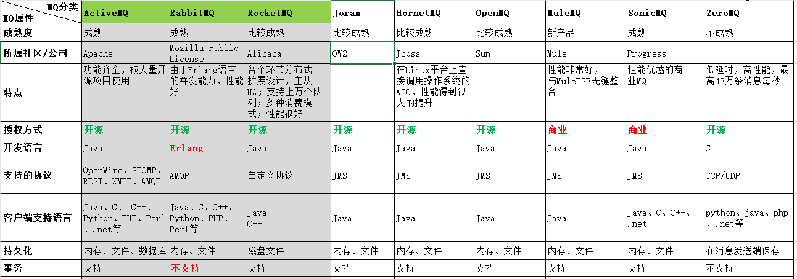
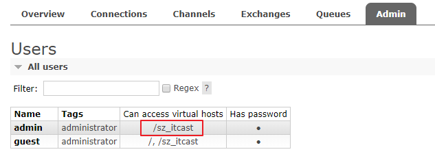

# RabbitMQ（一）

课程回顾：Springcloud的组件


1、Feign使用（http请求  http://eureka-client-provider   http://ip:port）


- 介绍
  - 完成服务间的调用   
  - RestTemplate能够调用，为什么还要用feign
    - feign：对ribbon、hystrix等进行了整合（封装好了），让开发更简单
    - 调用过程中日志显示：调用的完整过程
    - 支持请求/响应的压缩（指定文件大小）
    - 更加符合程序员开发的思维/逻辑     Controller：注入service（feign）
- 代码实现：
  - 在启动类开启Feign：@EnableFeignClients
  - 编写Feign（interface）：注解@FeignClient(name="被调用的服务名",  fallBack="T.class")
- 打印Feign调用过程中的日志：Logger.Level.FULL
- 支持熔断：
  - 编写熔断类：实现feign接口（实现了所有方法）
  - 配置文件中：开启feign
- 支持负载均衡：略
  - 使用LB哪种策略：谁调用就在这里配置

2、Springcloud  Gateway（网关）

- 网关使用场景：
  - 认证
  - 鉴权
  - 限流
  - 记录日志
- Gateway术语
  - 路由：将请求转发到某个服务
  - 断言：配置请求规则
  - 过滤器：对请求进行处理（业务来决定）
- 入门程序编写：略
- 过滤器的使用：
  - 有出厂自带过滤器（内置）：略。
  - 自定义过滤器
    - 全局过滤器
      - 必须实现GlobalFilter接口，还可以实现Ordered接口（指定过滤器的执行顺序）。
    - 局部过滤器
      - 继承AbstractGatewayFilterFactory
      - 自定义的局部过滤器的类名：XxxGatewayFilterFactory
      - 使用：配置文件中    -xxx=value

3、Springcloud config：配置中心

- 用来统一管理配置文件
- 使用：配置文件存放到git仓库--->配置中心服务（连接Git仓库）---->各个服务（连接配置中心）。

4、Springcloud Bus：消息总线          springcloudalibaba-nacos

- 当仓库中的配置文件发生改变了，不需要重新启动即可获取最新的配置。
- 结合：MQ        配置修改后，需要进行广播


学习目标：全部掌握

1、消息队列MQ介绍

- 是什么
- 能干啥

2、RabbitMQ介绍以及安装

3、编写RabbitMQ的入门程序

4、RabbitMQ的五种通信方式

5、SpringBoot整合RabbitMQ


# 1. 消息队列概述

~~~properties
什么是消息队列MQ： 
1、Message  Queue
2、在消息传输过程中保存消息的容器。
~~~


## 1.1. 什么是MQ

消息队列（MQ）是一种应用程序对应用程序的通信方法。应用程序通过写和检索出入列队的针对应用程序的数据（消息）来通信，而无需专用连接来链接它们。消息传递指的是程序之间通过在消息中发送数据进行通信，而不是通过直接调用彼此来通信，直接调用通常是用于诸如远程过程调用的技术。排队指的是应用程序通过队列来通信。队列的使用除去了接收和发送应用程序同时执行的要求。 

MQ全称为Message Queue，消息队列作用在（一个）应用程序和（一个或多个）应用程序之间进行通信过程中保存消息的容器。【是在消息的传输过程中保存消息的容器 】


## 1.2 常见产品

场景的消息中间件（MOM）产品有：



- kafka

~~~properties
Apache下的一个子项目，使用scala实现的一个高性能分布式Publish/Subscribe消息队列系统。
	1.快速持久化：通过磁盘顺序读写与零拷贝机制，可以在O(1)的系统开销下进行消息持久化；
	2.高吞吐：在一台普通的服务器上既可以达到10W/s的吞吐速率；
	3.高堆积：支持topic下消费者较长时间离线，消息堆积量大；
	4.完全的分布式系统：Broker、Producer、Consumer都原生自动支持分布式，依赖zookeeper自动实现复杂均衡；
	5.支持Hadoop数据并行加载：对于像Hadoop的一样的日志数据和离线分析系统，但又要求实时处理的限制，这是一个可行的解决方案。
~~~


## 1.3 MQ的常见应用场景

### 1.3.1 应用解耦

双11是购物狂节,用户下单后,订单系统需要通知库存系统,传统的做法就是订单系统调用库存系统的接口.这种做法有一个缺点:当库存系统出现故障时,订单就会失败。(这样某云、某东将少赚好多好多钱)订单系统和库存系统高耦合.

- 用户提交订单：同步处理，需要执行的时间：50ms * n


- 思考：在上述业务逻辑中，其实用户只需要关心自己的订单提交是否成功即可，至于其他的服务（业务）处理与用户是没有任何关系的，因此针对这个场景，我们是否可以这样去做呢？


由此可以看出,引入消息队列后，用户的响应时间就等于写入数据库的时间+写入消息队列的时间(可以忽略不计),引入消息队列后处理后,响应时间提高3倍。 

订单系统:用户下单后,订单系统完成持久化处理,将消息写入消息队列,返回用户订单下单成功。库存系统:订阅下单的消息,获取下单消息,进行库操作。就算库存系统出现故障,消息队列也能保证消息的可靠投递,不会导致消息丢失。

### 1.3.2 异步处理

例如：用户注册。

- 用户注册，将数据写入数据库，然后等待系统发送短信，收到短信后继续等待系统发送邮件。这个过程中短信业务与邮件业务与用户也是无关的，因此也可以通过MQ去解决


- MQ：用户注册过程中，只需要将手机号和email发送到MQ中即可，然后由其他服务监听MQ然后获取消息并且处理相关业务。


### 1.3.3 流量削峰


流量削峰一般在秒杀活动中应用广泛。场景:秒杀活动，一般会因为流量过大，导致应用挂掉,为了解决这个问题，一般在应用前端加入消息队列。 作用: 

- 可以控制活动人数，超过此一定阀值的订单直接丢弃(这就是为什么秒杀一次都没有成功过:cry:) 
- 可以缓解短时间的高流量压垮应用(应用程序按自己的最大处理能力获取订单) 
- 用户的请求,服务器收到之后,首先写入消息队列,加入消息队列长度超过最大值,则直接抛弃用户请求或跳转到错误页面 
- 秒杀业务根据消息队列中的请求信息，再做后续业务处理 


## 1.4 思考

所有服务间调用是否都可以使用MQ？**不是**。

记住一个原则：调用方实时依赖执行结果的业务场景，使用直接调用，而不是MQ 。


## 1.5 AMQP 和 JMS

amqp：协议

jms：java  消息服务     ：操作mq的api


- AMQP高级消息队列协议，是一个进程间传递异步消息的网络协议，更准确的说是一种binary wire-level protocol（链接协议）。这是其和JMS的本质差别，AMQP不从API层进行限定，而是直接定义网络交换的数据格式。

- JMS即Java消息服务（JavaMessage Service）应用程序接口，是一个Java平台中关于面向消息中间件（MOM）的API，用于在两个应用程序之间，或分布式系统中发送消息，进行异步通信。

- JMS和AMQP区别
  - JMS是定义了统一的接口，来对消息操作进行统一；AMQP是通过规定协议来统一数据交互的格式

  - JMS限定了必须使用Java语言；AMQP只是协议，不规定实现方式，因此是跨语言的。

  - JMS规定了两种消息模式（P2P、P/S）；而AMQP的消息模式更加丰富

    

# 2. RabbitMQ介绍以及安装

1、先安装：erlang的运行环境（类似：jdk）

2、再安装RabbitMQ（计算机名称：中文） 


访问地址：`<http://localhost:15672/>`


## 2.1 RabbitMQ介绍

RabbitMQ是由erlang语言开发，基于AMQP（Advanced Message Queue 高级消息队列协议）协议实现的消息队列，它是一种应用程序之间的通信方法，消息队列在分布式系统开发中应用非常广泛。

RabbitMQ官方地址：http://www.rabbitmq.com/

RabbitMQ提供了6种模式：简单模式，work模式，Publish/Subscribe发布与订阅模式，Routing路由模式，Topics主题模式，RPC远程调用模式（远程调用，不太算MQ；不作介绍）；

官网对应模式介绍：https://www.rabbitmq.com/getstarted.html


## 2.2. 安装说明

略：详细查看 `资料/软件/安装Windows RabbitMQ.pdf` 文档。


## 2.3 用户以及Virtual Hosts配置

### 2.3.1 配置账号

RabbitMQ在安装好后，可以访问http://localhost:15672 ；其自带了guest/guest的用户名和密码；如果需要创建自定义用户；那么也可以登录管理界面后，如下操作：


创建用户后效果如下：


- **角色说明**：
  - 超级管理员(administrator)：可登陆管理控制台，可查看所有的信息，并且可以对用户，策略(policy)进行操作。
  -  监控者(monitoring)：可登陆管理控制台，同时可以查看rabbitmq节点的相关信息(进程数，内存使用情况，磁盘使用情况等)
  -  策略制定者(policymaker)：可登陆管理控制台, 同时可以对policy进行管理。但无法查看节点的相关信息(上图红框标识的部分)。
  - 普通管理者(management)：仅可登陆管理控制台，无法看到节点信息，也无法对策略进行管理。
  -  其他：无法登陆管理控制台，通常就是普通的生产者和消费者。


### 2.3.2 配置Virtual Hosts

像mysql拥有数据库的概念并且可以指定用户对库和表等操作的权限。RabbitMQ也有类似的权限管理；在RabbitMQ中可以虚拟消息服务器Virtual Host，每个Virtual Hosts相当于一个相对独立的RabbitMQ服务器，每个VirtualHost之间是相互隔离的。exchange、queue、message不能互通。 相当于mysql的db。**Virtual Name一般以/开头**。

**第一步：创建Virtual Hosts**


**第二步：设置Virtual Hosts权限**

首先：点击【名称】


权限设置：进入权限设置页面后，关联一个用户，然后确定【Set permission】。


效果如下：



参数说明：

```properties
user：用户名
configure ：一个正则表达式，用户对符合该正则表达式的所有资源拥有 configure 操作的权限
write：一个正则表达式，用户对符合该正则表达式的所有资源拥有 write 操作的权限
read：一个正则表达式，用户对符合该正则表达式的所有资源拥有 read 操作的权限
```


# 3 RabbitMQ入门程序

入门案例将使用RabbitMQ的简单模式实现。

## 3.1 创建工程

创建工程：rabbitmq-day01-demo1


添加依赖：

```xml
<!--添加mq依赖-->
<dependencies>
    <dependency>
        <groupId>com.rabbitmq</groupId>
        <artifactId>amqp-client</artifactId>
        <version>5.6.0</version>
    </dependency>
</dependencies>
```


## 3.2 创建生产者

### 3.2.1 实现步骤

创建生产者具体步骤：

~~~properties
// 1.创建链接工厂对象
// 2.设置RabbitMQ服务主机地址,默认localhost
// 3.设置RabbitMQ服务端口,默认5672
// 4.设置虚拟主机名字，默认/
// 5.设置用户连接名，默认guest
// 6.设置链接密码，默认guest
// 7.创建一个新链接
// 8.创建消息通道
// 9.创建队列
// 10.创建消息
// 11.消息发送
// 12.关闭资源
~~~


创建com.itheima.quickstart.Producer类，代码如下：

```java
public class Producer {

    public static void main(String[] args) throws IOException, TimeoutException {
        // 1.创建链接工厂对象
        ConnectionFactory connectionFactory = new ConnectionFactory();
        // 2.设置RabbitMQ服务主机地址,默认localhost
        connectionFactory.setHost("localhost");
        // 3.设置RabbitMQ服务端口,默认5672
        connectionFactory.setPort(5672);
        // 4.设置虚拟主机名字，默认/
        connectionFactory.setVirtualHost("/sz_itcast");
        // 5.设置用户连接名，默认guest
        connectionFactory.setUsername("admin");
        // 6.设置链接密码，默认guest
        connectionFactory.setPassword("123456");
        // 7.创建链接
        Connection connection = connectionFactory.newConnection();
        // 8.创建消息通道
        Channel channel = connection.createChannel();
        // 9.创建队列
        // arg0：队列名称 arg1：是否持久化 arg2：是否排外 arg3：关闭连接时队列是否自动删除 arg4：队列其他参数
        channel.queueDeclare("simple_queue", true, false, false, null);
        // 10.创建消息
        String message = "你好，欢迎来到黑马程序员。";
        // 11.消息发送
        // arg0：交换机名称，没有指定使用默认的Default Exchange
        // arg1：路由key，点对点模式可以使用队列名称 arg2：指定消息其他属性 arg3：消息的字节码
        channel.basicPublish("", "simple_queue", null, message.getBytes());
        // 12.关闭资源
        channel.close();
        connection.close();
    }
}

PS：参数详细说明
arg2 boolean exclusive 是否排外
如果不是排外的，可以使用两个消费者都访问同一个队列，没有任何问题，如果是排外的，会对当前队列加锁，其他通道channel是不能访问的，如果强制访问会报异常。

arg4:队列其他参数设置
- Message TTL 设置消息生命周期
- Auto Expire 当队列在指定的时间没有被访问就会被删除
- Max Length 限定队列的消息的最大值长度，超过指定长度将会把最早的几条删除掉
- Max Length Bytes 限定队列最大占用的空间大小
- DLX 当队列消息长度大于最大长度、或者过期的等，将从队列中删除的消息推送到指定的交换机中去而不是丢弃掉
- DLK 将删除的消息推送到指定交换机的指定路由键的队列中去
- Maximum priority 声明优先级队列
- Lazy mode 先将消息保存到磁盘上，不放在内存中，当消费者开始消费的时候才加载到内存中
```

### 3.2.2 效果

在执行上述的消息发送之后；可以登录rabbitMQ的管理控制台：


如果想查看消息，可以点击`队列名称->Get Messages`,如下图：


### 3.2.3 Queues列表说明

~~~properties
PS：列表说明
- Features消息特征：
  - D：持久化
- State：当前的状态
  - running：运行中
  - idle：空闲。 
- Ready：待消费的消息总数 
- Unacked：待应答的消息总数 
- total：消息总数 = Ready+Unacked 
- incoming：消息进入的速率
- deliver/get：消息获取的速率
- ack：消息应答的速率

~~~

 


## 3.3 创建消费者

消费者创建可以按照如下步骤实现：

```properties
// 1.创建链接工厂对象
// 2.设置RabbitMQ服务主机地址,默认localhost
// 3.设置RabbitMQ服务端口,默认5672
// 4.设置虚拟主机名字，默认/
// 5.设置用户连接名，默认guest
// 6.设置链接密码，默认guest
// 7.创建一个新链接
// 8.创建消息通道
// 9.创建队列
// 10.创建消费者，并设置消息处理
// 11.消息监听
// 12.关闭资源(不建议关闭，建议一直监听消息)
```

按照上面的步骤创建消息消费者com.itheima.rabbitmq.simple.Consumer代码如下：

```java
public class Consumer {

    public static void main(String[] args) throws IOException, TimeoutException {
        // 1.创建链接工厂对象
        ConnectionFactory connectionFactory = new ConnectionFactory();
        // 2.设置RabbitMQ服务主机地址,默认localhost
        connectionFactory.setHost("localhost");
        // 3.设置RabbitMQ服务端口,默认5672
        connectionFactory.setPort(5672);
        // 4.设置虚拟主机名字，默认/
        connectionFactory.setVirtualHost("/sz_itcast");
        // 5.设置用户连接名，默认guest
        connectionFactory.setUsername("admin");
        // 6.设置链接密码，默认guest
        connectionFactory.setPassword("123456");
        // 7.创建一个新链接
        Connection connection = connectionFactory.newConnection();
        // 8.创建消息通道
        Channel channel = connection.createChannel();
        // 9.创建队列
        channel.queueDeclare("simple_queue", true, false, false, null);
        // 10.创建消费者，并消费消息
        DefaultConsumer consumer = new DefaultConsumer(channel){
            /**
             * @param consumerTag 消费者标签，在channel.basicConsume时候可以指定
             * @param envelope 消息包的内容，可从中获取消息id，消息routing key，交换机，消息和重发标志(收到消息失败后是否需要重新发送)
             * @param properties 消息属性信息
             * @param body 消息体
             **/
            @Override
            public void handleDelivery(String consumerTag, Envelope envelope, AMQP.BasicProperties properties, byte[] body) throws IOException {
                // 路由
                String routingKey = envelope.getRoutingKey();
                // 交换机
                String exchange = envelope.getExchange();
                // 消息id
                long deliveryTag = envelope.getDeliveryTag();
                // 消息体
                String message = new String(body, "UTF-8");
                System.out.println("路由：" + routingKey + ",交换机：" + exchange + ",消息id：" + deliveryTag + ",消息体：" + message);
            }
        };
        // 11.消息监听 arg0：监听的队列名称
        // arg1：是否自动应答，设置为true为表示消息接收到自动向mq回复接收到了，mq接收到回复会删除消息，设置为false则需要手动确认
        // arg2：消费者接收消息到后回调（消费消息）
        channel.basicConsume("simple_queue", true, consumer);
        // 12.关闭资源(不建议关闭，建议一直监听消息)
    }
}

PS：同一个会话， consumerTag 是固定的 可以做此会话的名字， deliveryTag 每次接收消息+1，可以做此消息处理通道的名字
```

### 3.3.2 console控制台

执行后，控制台输入如下：


### 3.3.3 RabbitMQ控制台


## 3.4 代码抽取

- 重复代码：


无论是消费者，还是生产者，都需要创建连接，因此我们可以将这段公共的代码抽取到工具类中。创建com.itheima.rabbitmq.util.ConnectionUtil工具类对象，用于创建Connection，代码如下：


```java
public class ConnectionUtils {

    // 提供一个公共的静态的访问方法
    public static Connection getConnection() throws Exception {
        // 1.创建链接工厂对象
        ConnectionFactory connectionFactory = new ConnectionFactory();
        // 2.设置RabbitMQ服务主机地址,默认localhost
        connectionFactory.setHost("localhost");
        // 3.设置RabbitMQ服务端口,默认5672
        connectionFactory.setPort(5672);
        // 4.设置虚拟主机名字，默认/
        connectionFactory.setVirtualHost("/sz_itcast");
        // 5.设置用户连接名，默认guest
        connectionFactory.setUsername("admin");
        // 6.设置链接密码，默认guest
        connectionFactory.setPassword("123456");
        // 7.创建链接
        Connection connection = connectionFactory.newConnection();
        return connection;
    }
}
```

- 生产者优化

修改Producer，链接对象使用上面的ConnectionUtil工具类创建，代码如下：

```java
//创建链接
Connection connection = ConnectionUtil.getConnection();
```

- 消费者优化

修改Consumer，链接对象使用上面的ConnectionUtil工具类创建，代码如下：

```java
//创建链接
Connection connection = ConnectionUtil.getConnection();
```


## 3.4 小结

上述的入门案例中使用的是如下的AMQP最简单的P2P通信方式：


在上图的模型中，有以下概念：

```properties
P：生产者，也就是要发送消息的程序
C：消费者：消息的接受者，会一直等待消息到来。
queue：消息队列，图中红色部分。类似一个邮箱，可以缓存消息；生产者向其中投递消息，消费者从其中取出消息。

在rabbitMQ中的消费者是一定要监听某个消息队列才能获取消息。
```


# 4. RabbitMQ工作模式

RabbitMQ提供了6种模式：简单模式，work模式，Publish/Subscribe发布与订阅模式，Routing路由模式，Topics主题模式，RPC远程调用模式（远程调用，不太算MQ；不作介绍）。

## 4.1 Work queues工作队列模式

### 4.1.1 模式说明


`Work Queues`与入门程序的`简单模式`相比，多了一个或多个消费端，多个消费端共同消费同一个队列中的消息。

**应用场景**：对于任务过重或任务较多情况使用工作队列可以提高任务处理的速度（也就是多人处理）。

### 4.1.2 代码实现

`Work Queues`与入门程序的`简单模式`的代码是几乎一样的；可以完全复制，并复制多一个消费者进行多个消费者同时消费消息的测试。


#### 4.1.2.1 创建生产者

创建WorkProducer消息生产者对象，代码如下：

```java
public class WorkProducer {

    public static void main(String[] args) throws IOException, TimeoutException {
        // 获取连接
        Connection connection = ConnectionUtils.getConnection();
        // 创建消息通道
        Channel channel = connection.createChannel();
        channel.queueDeclare("work_queue", true, false, false, null);
        for (int i = 0; i < 10; i++){
            // 创建消息
            String message = "你好，欢迎来到黑马程序员，学号：" + i;
            // 消息发送
            channel.basicPublish("", "work_queue", null, message.getBytes());
        }
        // 关闭资源
        channel.close();
        connection.close();
    }
}
```


#### 4.1.2.2 创建消费者1

WorkConsumer1,代码如下：

```java
public class WorkConsumer1 {

    public static void main(String[] args) throws IOException, TimeoutException {
        // 获取连接
        Connection connection = ConnectionUtils.getConnection();
        // 创建消息通道
        Channel channel = connection.createChannel();
        // 创建队列
        channel.queueDeclare("work_queue", true, false, false, null);
        // 创建消费者，并消费消息
        DefaultConsumer consumer = new DefaultConsumer(channel){
            @Override
            public void handleDelivery(String consumerTag, Envelope envelope, AMQP.BasicProperties properties, byte[] body) throws IOException {
                // 路由
                String routingKey = envelope.getRoutingKey();
                // 交换机
                String exchange = envelope.getExchange();
                // 消息id
                long deliveryTag = envelope.getDeliveryTag();
                // 消息体
                String message = new String(body, "UTF-8");
                System.out.println("消费者1获取的数据：" + "路由：" + routingKey + ",交换机：" + exchange + ",消息id：" + deliveryTag + ",消息体：" + message);
            }
        };
        // 11.消息监听 arg0：监听的队列名称
        channel.basicConsume("work_queue", true, consumer);
    }
}
```


#### 4.1.2.3 创建消费者2

创建WorkConsumer2，代码如下：

```java
public class WorkConsumer2 {

    public static void main(String[] args) throws IOException, TimeoutException {
        // 获取连接
        Connection connection = ConnectionUtils.getConnection();
        // 创建消息通道
        Channel channel = connection.createChannel();
        // 创建队列
        channel.queueDeclare("work_queue", true, false, false, null);
        // 创建消费者，并消费消息
        DefaultConsumer consumer = new DefaultConsumer(channel){
            @Override
            public void handleDelivery(String consumerTag, Envelope envelope, AMQP.BasicProperties properties, byte[] body) throws IOException {
                // 路由
                String routingKey = envelope.getRoutingKey();
                // 交换机
                String exchange = envelope.getExchange();
                // 消息id
                long deliveryTag = envelope.getDeliveryTag();
                // 消息体
                String message = new String(body, "UTF-8");
                System.out.println("消费者2获取的数据：" + "路由：" + routingKey + ",交换机：" + exchange + ",消息id：" + deliveryTag + ",消息体：" + message);
            }
        };
        // 11.消息监听 arg0：监听的队列名称
        channel.basicConsume("work_queue", true, consumer);
    }
}
```


### 4.1.3 测试

启动两个消费者，然后再启动生产者发送消息；到IDEA的两个消费者对应的控制台查看是否竞争性的接收到消息。

- 消费者1：


- 消费者2：


### 4.1.4 小结

在一个队列中如果有多个消费者，那么消费者之间对于同一个消息的关系是**竞争**的关系。

默认，RabbitMQ会一个一个的发送信息给下一个消费者(consumer)，而不考虑每个任务的时长且**是一次性分配，并非一个一个分配**。平均的每个消费者将会获得相等数量的消息。这种发送消息得方式叫做——轮询（round-robin）。 


## 4.2 Fanout广播模式

### 4.2.1 模式说明


发布订阅模式：

```properties
1.每个消费者监听自己的队列。
2.生产者将消息发给broker，由交换机将消息转发到绑定此交换机的每个队列，每个绑定交换机的队列都将接收
到消息
```

而在订阅模型中，多了一个exchange角色，而且过程略有变化：

```properties
P：生产者，也就是要发送消息的程序，但是不再发送到队列中，而是发给X（交换机）
C：消费者，消息的接受者，会一直等待消息到来。
Queue：消息队列，接收消息、缓存消息。
Exchange：交换机，图中的X。一方面，接收生产者发送的消息。另一方面，知道如何处理消息，例如递交给某个特别队列、递交给所有队列、或是将消息丢弃。到底如何操作，取决于Exchange的类型。Exchange有常见以下3种类型：
	Fanout：广播，将消息交给所有绑定到交换机的队列
	Direct：定向，把消息交给符合指定routing key 的队列
	Topic：通配符，把消息交给符合routing pattern（路由模式） 的队列
```

**Exchange（交换机）只负责转发消息，不具备存储消息的能力**，因此如果没有任何队列与Exchange绑定，或者没有符合路由规则的队列，那么消息会丢失！

### 4.2.2 代码

#### 4.2.2.1 创建生产者

生产者需要注意如下3点：

```properties
1.声明交换机
2.声明队列
3.队列需要绑定指定的交换机
```

创建FanoutProducer消息生产者，代码如下：

```java
public class FanoutProducer {

    public static void main(String[] args) throws IOException, TimeoutException {
        // 获取连接
        Connection connection = ConnectionUtils.getConnection();
        // 创建消息通道
        Channel channel = connection.createChannel();
        // 创建队列
        channel.queueDeclare("fanout_queue1", true, false, false, null);
        channel.queueDeclare("fanout_queue2", true, false, false, null);
        // 创建交换机：arg0,交换机名称  arg1,交换机类型（广播）
        channel.exchangeDeclare("fanout_exchange", BuiltinExchangeType.FANOUT);
        // 将队列绑定到交换机
        channel.queueBind("fanout_queue1", "fanout_exchange", "");
        channel.queueBind("fanout_queue2", "fanout_exchange", "");
        for (int i = 0; i < 10; i++){
            // 创建消息
            String message = "你好，欢迎来到黑马程序员，fanout：" + i;
            // 消息发送
            channel.basicPublish("fanout_exchange", "", null, message.getBytes());
        }
        // 关闭资源
        channel.close();
        connection.close();
    }
}
```


#### 4.2.2.2 创建消费者1

创建FanoutConsumer1消费者，代码如下：

```java
public class FanoutConsumer1 {

    public static void main(String[] args) throws IOException, TimeoutException {
        // 获取连接
        Connection connection = ConnectionUtils.getConnection();
        // 创建消息通道
        Channel channel = connection.createChannel();
        // 创建队列
        channel.queueDeclare("fanout_queue1", true, false, false, null);
        // 创建消费者，并消费消息
        DefaultConsumer consumer = new DefaultConsumer(channel){
            @Override
            public void handleDelivery(String consumerTag, Envelope envelope, AMQP.BasicProperties properties, byte[] body) throws IOException {
                // 路由
                String routingKey = envelope.getRoutingKey();
                // 交换机
                String exchange = envelope.getExchange();
                // 消息id
                long deliveryTag = envelope.getDeliveryTag();
                // 消息体
                String message = new String(body, "UTF-8");
                System.out.println("消费者1获取的数据：" + "路由：" + routingKey + ",交换机：" + exchange + ",消息id：" + deliveryTag + ",消息体：" + message);
            }
        };
        // 11.消息监听 arg0：监听的队列名称
        channel.basicConsume("fanout_queue1", true, consumer);
    }
}
```


#### 4.2.2.3 创建消费者2

创建FanoutConsumer2消费者，代码如下：

```java
public class FanoutConsumer2 {

    public static void main(String[] args) throws IOException, TimeoutException {
        // 获取连接
        Connection connection = ConnectionUtils.getConnection();
        // 创建消息通道
        Channel channel = connection.createChannel();
        // 创建队列
        channel.queueDeclare("fanout_queue2", true, false, false, null);
        // 创建消费者，并消费消息
        DefaultConsumer consumer = new DefaultConsumer(channel){
            @Override
            public void handleDelivery(String consumerTag, Envelope envelope, AMQP.BasicProperties properties, byte[] body) throws IOException {
                // 路由
                String routingKey = envelope.getRoutingKey();
                // 交换机
                String exchange = envelope.getExchange();
                // 消息id
                long deliveryTag = envelope.getDeliveryTag();
                // 消息体
                String message = new String(body, "UTF-8");
                System.out.println("消费者2获取的数据：" + "路由：" + routingKey + ",交换机：" + exchange + ",消息id：" + deliveryTag + ",消息体：" + message);
            }
        };
        // 11.消息监听 arg0：监听的队列名称
        channel.basicConsume("fanout_queue2", true, consumer);
    }
}
```


### 4.2.3 测试

启动所有消费者，然后使用生产者发送消息；在每个消费者对应的控制台可以查看到生产者发送的所有消息；到达**广播**的效果。

消费者1：


消费者2：


在执行完测试代码后，其实到RabbitMQ的管理后台找到`Exchanges`选项卡，点击 `fanout_exchange` 的交换机，可以查看到如下的绑定：


### 4.2.4 小结

交换机需要与队列进行绑定，绑定之后；一个消息可以被多个消费者都收到。

**发布订阅模式与work队列模式的区别**

```properties
1、work队列模式不用定义交换机，而发布/订阅模式需要定义交换机。 
2、发布/订阅模式的生产方是面向交换机发送消息，work队列模式的生产方是面向队列发送消息(底层使用默认交换机)。
3、发布/订阅模式需要设置队列和交换机的绑定，work队列模式不需要设置，实际上work队列模式会将队列绑 定到默认的交换机 。
```


## 4.3 Routing路由模式

### 4.3.1. 模式说明

路由模式特点：

```properties
1.队列与交换机的绑定，不能是任意绑定了，而是要指定一个RoutingKey（路由key）
2.消息的发送方在 向 Exchange发送消息时，也必须指定消息的 RoutingKey。
3.Exchange不再把消息交给每一个绑定的队列，而是根据消息的Routing Key进行判断，只有队列的Routingkey与消息的 Routing key完全一致，才会接收到消息
```


图解：

```properties
P：生产者，向Exchange发送消息，发送消息时，会指定一个routing key。
X：Exchange（交换机），接收生产者的消息，然后把消息递交给 与routing key完全匹配的队列
C1：消费者，其所在队列指定了需要routing key 为 error 的消息
C2：消费者，其所在队列指定了需要routing key 为 info、error、warning 的消息
```


### 4.3.2 代码

在编码上与 `Publish/Subscribe发布与订阅模式` 的区别是交换机的类型为：Direct，还有队列绑定交换机的时候需要指定routing key。

#### 4.3.2.1 创建生产者

创建RoutingKeyProducer消息生产者，代码如下：

```java
public class RoutingKeyProducer {

    public static void main(String[] args) throws IOException, TimeoutException {
        // 获取连接
        Connection connection = ConnectionUtils.getConnection();
        // 创建消息通道
        Channel channel = connection.createChannel();
        // 创建队列
        channel.queueDeclare("routing_key_queue1", true, false, false, null);
        channel.queueDeclare("routing_key_queue2", true, false, false, null);
        // 创建交换机：arg0,交换机名称  arg1,交换机类型（广播）
        channel.exchangeDeclare("routing_key_exchange", BuiltinExchangeType.DIRECT);
        // 将队列绑定到交换机
        // routing_key_queue1：error
        // routing_key_queue2：error、info、warning
        channel.queueBind("routing_key_queue1", "routing_key_exchange", "error");
        channel.queueBind("routing_key_queue2", "routing_key_exchange", "error");
        channel.queueBind("routing_key_queue2", "routing_key_exchange", "info");
        channel.queueBind("routing_key_queue2", "routing_key_exchange", "warning");
        for (int i = 0; i < 10; i++){
            // 创建消息
            String message = "你好，欢迎来到黑马程序员，routing_key：" + i;
            String routingKey = "";
            if (i%2 == 0){ // routing_key_queue1、routing_key_queue2 0、2、4、6、8
                routingKey = "error";
            }else if (i%5 == 0){    // routing_key_queue2：5
                routingKey = "info";
            }else { // 0、1、5
                routingKey = "warning";
            }
            message += "--->" + routingKey;

            // 消息发送
            channel.basicPublish("routing_key_exchange", routingKey, null, message.getBytes());
        }
        // 关闭资源
        channel.close();
        connection.close();
    }
}
```

#### 4.3.2.2 创建消费者1

创建RoutingKeyConsumer1，代码如下：

```java
public class RoutingKeyConsumer1 {

    public static void main(String[] args) throws IOException, TimeoutException {
        // 获取连接
        Connection connection = ConnectionUtils.getConnection();
        // 创建消息通道
        Channel channel = connection.createChannel();
        // 创建队列
        channel.queueDeclare("routing_key_queue1", true, false, false, null);
        // 创建消费者，并消费消息
        DefaultConsumer consumer = new DefaultConsumer(channel){
            @Override
            public void handleDelivery(String consumerTag, Envelope envelope, AMQP.BasicProperties properties, byte[] body) throws IOException {
                // 路由
                String routingKey = envelope.getRoutingKey();
                // 交换机
                String exchange = envelope.getExchange();
                // 消息id
                long deliveryTag = envelope.getDeliveryTag();
                // 消息体
                String message = new String(body, "UTF-8");
                System.out.println("消费者1获取的数据：" + "路由：" + routingKey + ",交换机：" + exchange + ",消息id：" + deliveryTag + ",消息体：" + message);
            }
        };
        // 11.消息监听 arg0：监听的队列名称
        channel.basicConsume("routing_key_queue1", true, consumer);
    }
}
```

#### 4.3.2.3 创建消费者2

创建RoutingKeyConsumer2，代码如下：

```java
public class RoutingKeyConsumer2 {

    public static void main(String[] args) throws IOException, TimeoutException {
        // 获取连接
        Connection connection = ConnectionUtils.getConnection();
        // 创建消息通道
        Channel channel = connection.createChannel();
        // 创建队列
        channel.queueDeclare("routing_key_queue2", true, false, false, null);
        // 创建消费者，并消费消息
        DefaultConsumer consumer = new DefaultConsumer(channel){
            @Override
            public void handleDelivery(String consumerTag, Envelope envelope, AMQP.BasicProperties properties, byte[] body) throws IOException {
                // 路由
                String routingKey = envelope.getRoutingKey();
                // 交换机
                String exchange = envelope.getExchange();
                // 消息id
                long deliveryTag = envelope.getDeliveryTag();
                // 消息体
                String message = new String(body, "UTF-8");
                System.out.println("消费者2获取的数据：" + "路由：" + routingKey + ",交换机：" + exchange + ",消息id：" + deliveryTag + ",消息体：" + message);
            }
        };
        // 11.消息监听 arg0：监听的队列名称
        channel.basicConsume("routing_key_queue2", true, consumer);
    }
}
```


### 4.3.3 测试

启动所有消费者，然后使用生产者发送消息；在消费者对应的控制台可以查看到生产者发送对应routing key对应队列的消息；到达**按照需要接收**的效果。

消费者1：


消费者2：


在执行完测试代码后，其实到RabbitMQ的管理后台找到`Exchanges`选项卡，点击 `direct_exchange` 的交换机，可以查看到如下的绑定：


### 4.3.4 小结

Routing模式要求队列在绑定交换机时要指定routing key，消息会转发到符合routing key的队列。


## 4.4 Topics通配符模式

### 4.4.1 模式说明


`Topic`类型与`Direct`相比，都是可以根据`RoutingKey`把消息路由到不同的队列。只不过`Topic`类型`Exchange`可以让队列在绑定`Routing key` 的时候**使用通配符**！

`Routingkey` 一般都是有一个或多个单词组成，多个单词之间以”.”分割，例如： `item.insert`

 通配符规则：

`#`：匹配一个或多个词

`*`：匹配不多不少恰好1个词


举例：

`item.#`：能够匹配`item.insert.abc` 或者 `item.insert`

`item.*`：只能匹配`item.insert`


图解：

- 红色Queue：绑定的是`usa.#` ，因此凡是以 `usa.`开头的`routing key` 都会被匹配到
- 黄色Queue：绑定的是`#.news` ，因此凡是以 `.news`结尾的 `routing key` 都会被匹配


### 4.4.2 代码

#### 4.4.2.1 创建生产者

创建TopicProducer实现消息生产者，代码如下：

```java
public class TopicProducer {

    public static void main(String[] args) throws IOException, TimeoutException {
        // 获取连接
        Connection connection = ConnectionUtils.getConnection();
        // 创建消息通道
        Channel channel = connection.createChannel();
        // 创建队列
        channel.queueDeclare("topic_queue1", true, false, false, null);
        channel.queueDeclare("topic_queue2", true, false, false, null);
        // 创建交换机：arg0,交换机名称  arg1,交换机类型（广播）
        channel.exchangeDeclare("topic_exchange", BuiltinExchangeType.TOPIC);
        // 将队列绑定到交换机
        channel.queueBind("topic_queue1", "topic_exchange", "*.orange.*");
        channel.queueBind("topic_queue2", "topic_exchange", "*.*.rabbit");
        channel.queueBind("topic_queue2", "topic_exchange", "lazy.#");
        // 发送消息
        String msg = "欢迎来到黑马学习quick.orange.rabbit";
        byte[] body = msg.getBytes("UTF-8");
        channel.basicPublish("topic_exchange", "quick.orange.rabbit", null, body);  // 1/2

        String msg2 = "欢迎来到黑马学习lazy.pink.rabbit";
        byte[] body2 = msg2.getBytes("UTF-8");
        channel.basicPublish("topic_exchange", "lazy.pink.rabbit", null, body2);     // 1
        // 关闭资源
        channel.close();
        connection.close();
    }
}
```

#### 4.4.2.2 创建消费者1

创建TopicConsumer1，代码如下：

```java
public class TopicConsumer1 {

    public static void main(String[] args) throws IOException, TimeoutException {
        // 获取连接
        Connection connection = ConnectionUtils.getConnection();
        // 创建消息通道
        Channel channel = connection.createChannel();
        // 创建队列
        channel.queueDeclare("topic_queue1", true, false, false, null);
        // 创建消费者，并消费消息
        DefaultConsumer consumer = new DefaultConsumer(channel){
            @Override
            public void handleDelivery(String consumerTag, Envelope envelope, AMQP.BasicProperties properties, byte[] body) throws IOException {
                // 路由
                String routingKey = envelope.getRoutingKey();
                // 交换机
                String exchange = envelope.getExchange();
                // 消息id
                long deliveryTag = envelope.getDeliveryTag();
                // 消息体
                String message = new String(body, "UTF-8");
                System.out.println("消费者1获取的数据：" + "路由：" + routingKey + ",交换机：" + exchange + ",消息id：" + deliveryTag + ",消息体：" + message);
            }
        };
        // 11.消息监听 arg0：监听的队列名称
        channel.basicConsume("topic_queue1", true, consumer);
    }
}
```

#### 4.4.2.3 创建消费者2

创建TopicConsumer2，代码如下：

```java
public class TopicConsumer2 {

    public static void main(String[] args) throws IOException, TimeoutException {
        // 获取连接
        Connection connection = ConnectionUtils.getConnection();
        // 创建消息通道
        Channel channel = connection.createChannel();
        // 创建队列
        channel.queueDeclare("topic_queue2", true, false, false, null);
        // 创建消费者，并消费消息
        DefaultConsumer consumer = new DefaultConsumer(channel){
            @Override
            public void handleDelivery(String consumerTag, Envelope envelope, AMQP.BasicProperties properties, byte[] body) throws IOException {
                // 路由
                String routingKey = envelope.getRoutingKey();
                // 交换机
                String exchange = envelope.getExchange();
                // 消息id
                long deliveryTag = envelope.getDeliveryTag();
                // 消息体
                String message = new String(body, "UTF-8");
                System.out.println("消费者2获取的数据：" + "路由：" + routingKey + ",交换机：" + exchange + ",消息id：" + deliveryTag + ",消息体：" + message);
            }
        };
        // 11.消息监听 arg0：监听的队列名称
        channel.basicConsume("topic_queue2", true, consumer);
    }
}

```

### 4.4.3 测试

启动所有消费者，然后使用生产者发送消息；在消费者对应的控制台可以查看到生产者发送对应routing key对应队列的消息；到达**按照需要接收**的效果；并且这些routing key可以使用通配符。

消费者1：


消费者2：


在执行完测试代码后，其实到RabbitMQ的管理后台找到`Exchanges`选项卡，点击 `topic_exchange` 的交换机，可以查看到如下的绑定：


### 4.4.4 小结

Topic主题模式可以实现 `Publish/Subscribe发布与订阅模式` 和 ` Routing路由模式` 的功能；只是Topic在配置routing key 的时候可以使用通配符，显得更加灵活。


## 4.5 RabbitMQ工作模式总结

RabbitMQ工作模式：
**1、简单模式 HelloWorld**
一个生产者、一个消费者，不需要设置交换机（使用默认的交换机）

**2、工作队列模式 Work Queue**
一个生产者、多个消费者（竞争关系），不需要设置交换机（使用默认的交换机）

**3、发布订阅模式 Publish/subscribe**
需要设置类型为fanout的交换机，并且交换机和队列进行绑定，当发送消息到交换机后，交换机会将消息发送到绑定的队列

**4、路由模式 Routing**
需要设置类型为direct的交换机，交换机和队列进行绑定，并且指定routing key，当发送消息到交换机后，交换机会根据routing key将消息发送到对应的队列

**5、通配符模式 Topic**
需要设置类型为topic的交换机，交换机和队列进行绑定，并且指定通配符方式的routing key，当发送消息到交换机后，交换机会根据routing key将消息发送到对应的队列


# 5 Spring Boot整合RabbitMQ

broker：正在运行的mq的服务。

- 编写生产者程序
  - 创建队列、交换机，并且将队列绑定到交换机
  - 发送消息
- 编写消费者程序
  - （监听器）监听队列并且消费消息（现在：仅仅只是打印     消费消息：根据消息完成业务处理）。


## 5.1 简介

在Spring项目中，可以使用Spring-Rabbit去操作RabbitMQ
https://github.com/spring-projects/spring-amqp

尤其是在spring boot项目中只需要引入对应的amqp启动器依赖即可，方便的使用RabbitTemplate发送消息，使用注解接收消息。

*一般在开发过程中*：

**生产者工程：**

1. application.yml文件配置RabbitMQ相关信息；
2. 在生产者工程中编写配置类，用于创建交换机和队列，并进行绑定

3. 注入RabbitTemplate对象，通过RabbitTemplate对象发送消息到交换机

**消费者工程：**

1. application.yml文件配置RabbitMQ相关信息

2. 创建消息处理类，用于接收队列中的消息并进行处理


## 5.2 搭建生产者工程

### 5.2.1 创建工程

创建生产者工程`<springboot-rabbitmq-producer>`：略。

### 5.2.2 添加依赖

修改pom.xml文件内容为如下：

```xml
<parent>
    <groupId>org.springframework.boot</groupId>
    <artifactId>spring-boot-starter-parent</artifactId>
    <version>2.1.6.RELEASE</version>
    <relativePath/>
</parent>

<dependencies>
    <dependency>
        <groupId>org.springframework.boot</groupId>
        <artifactId>spring-boot-starter-amqp</artifactId>
    </dependency>

    <dependency>
        <groupId>org.springframework.boot</groupId>
        <artifactId>spring-boot-starter-test</artifactId>
        <scope>test</scope>
    </dependency>
</dependencies>

```


### 5.2.3 启动类

创建启动类`<com.itheima.ProducerApplication>`，代码如下：

```java
@SpringBootApplication
public class RabbitMqProviderApplication {

	public static void main(String[] args) {
		SpringApplication.run(RabbitMqProviderApplication.class, args);
	}

	// 创建队列
	@Bean
	public Queue topicQueue(){
		return new Queue("topic_queue_spring_boot");
	}

	// 创建交换机
	@Bean
	public Exchange topicExchange(){
		return new TopicExchange("topic_exchange_spring_boot");
	}

	// 将队列绑定到交换机
	@Bean
	public Binding topicQueueBind(Queue topicQueue, Exchange topicExchange){
		return BindingBuilder.bind(topicQueue).to(topicExchange).with("item.#").noargs();
	}

}
```


### 5.2.4 配置RabbitMQ

application.yml配置文件

```yaml
spring:
  rabbitmq:
    host: localhost  #连接地址
    port: 5672		 #连接端口
    virtual-host: /sz_itcast #虚拟机
    username: admin  #账号
    password: 123456 #密码
```


## 5.3 搭建消费者工程

### 5.3.1 创建工程

创建消费者工程`<springboot-rabbitmq-consumer>`,工程坐标如下：

```xml
<groupId>com.itheima</groupId>
<artifactId>springboot-rabbitmq-consumer</artifactId>
<version>1.0-SNAPSHOT</version>
```


### 5.3.2 添加依赖

修改pom.xml文件内容为如下：

```xml
<parent>
    <groupId>org.springframework.boot</groupId>
    <artifactId>spring-boot-starter-parent</artifactId>
    <version>2.1.6.RELEASE</version>
    <relativePath/>
</parent>

<dependencies>
    <dependency>
        <groupId>org.springframework.boot</groupId>
        <artifactId>spring-boot-starter-amqp</artifactId>
    </dependency>

    <dependency>
        <groupId>org.springframework.boot</groupId>
        <artifactId>spring-boot-starter-test</artifactId>
        <scope>test</scope>
    </dependency>
</dependencies>
```


### 5.3.3 启动类

创建启动类`<com.itheima.ConsumerApplication>`，代码如下：

```java
@SpringBootApplication
public class ConsumerApplication {

    public static void main(String[] args) {
        SpringApplication.run(ConsumerApplication.class);
    }
}
```


### 5.3.4 配置RabbitMQ

创建`<application.yml>`，内容如下：

```yaml
spring:
  rabbitmq:
    host: localhost  #连接地址
    port: 5672		 #连接端口
    virtual-host: /sz_itcast #虚拟机
    username: admin  #账号
    password: 123456 #密码
```


### 5.3.5 消息监听处理类

编写消息监听器`<com.itheima.listener.MessageListener>`，代码如下：

```java
@Component
public class MessageListener {

    /**
     * 监听某个队列的消息
     * @param message 接收到的消息
     */
    @RabbitListener(queues = "topic_queue_spring_boot")
    public void myListener1(String message){
        System.out.println("消费者接收到的消息为：" + message);
    }
}
```


## 5.4 测试

在`生产者(提供者)`工程rabbitmq-producer中`创建`测试类`<com.itheima.test.RabbitMQTest>`，发送消息：

```java
@RunWith(SpringRunner.class)
@SpringBootTest
public class RabbitMQTest {

    //注入队列模块,和RestTemplate一样
	@Autowired
	private RabbitTemplate rabbitTemplate;

    //添加数据
	@Test
	public void contextLoads() {
        //向交换机中添加数据:发送消息(交换机名,路由key(规则),内容)
		rabbitTemplate.convertAndSend("topic_exchange_spring_boot","item.update", "更新");
		rabbitTemplate.convertAndSend("topic_exchange_spring_boot","item.brand.insert", "插入");
	}

}
```


先运行上述测试程序（交换机和队列才能先被声明和绑定），然后启动消费者；在消费者工程springboot-rabbitmq-consumer中控制台查看是否接收到对应消息。


另外；也可以在RabbitMQ的管理控制台中查看到交换机与队列的绑定：


# 6 安装问题

计算机名称是中文（下划线、中华线、特殊字符）无法启动RabbitMQ解决方案：

~~~java
1、管理员运行cmd然后打开RabbitMQ安装目录
2、rabbitmq-service.bat remove
3、set RABBITMQ_BASE=D:\rabbitmq_server\data
4、rabbitmq-service.bat install
5、rabbitmq-plugins enable rabbitmq_management
~~~

最后到

