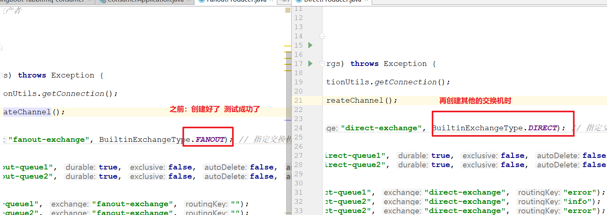
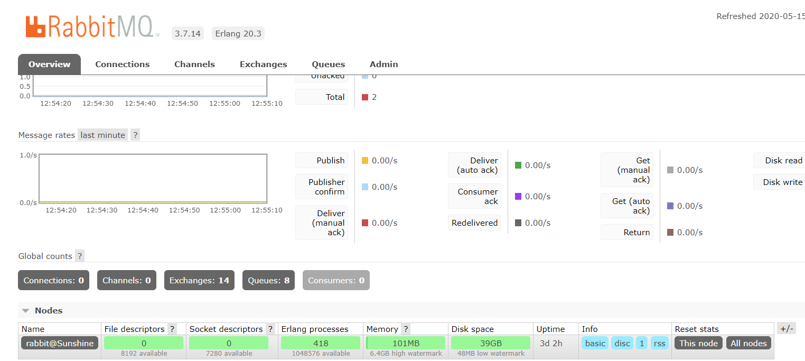

# RabbitMQ高级特性（二）

课程回顾：MOM 中间件---消息队列中间件---RabbitMQ

1、什么是MQ

~~~properties
MQ：message  queue，消息队列。

在消息传输过程中用来保存消息的容器。

一个程序与一个或者多个程序间传输数据的，该数据保存到容器中。

消息：业务数据

生产者：生产消息，将消息发送到MQ中
消费者：先监听，再消费（消费消息：处理等待处理的业务）
~~~

2、常见的产品

~~~properties
ActiveMQ：有管控台         java     扩展起来更加简单

RocketMQ：它是没有管控台    java

RabbitMQ：有管控台		  erlang   后期的扩展成本高

kafka：大数据应用，处理效率高   支持流计算
~~~

3、应用场景

~~~properties
1、应用解耦：最多的
   eg：提交订单  --->  其他业务的处理（库存服务、用户服务、交易服务、物流服务等等）

2、异步通信：略

3、流量削峰：限流
~~~

4、RabbitMQ的安装

~~~properties
1、先安装：erlang  mq运行环境

2、再安装：RabbitMQ

3、计算机名    按照课件第6教程
~~~

5、RabbitMQ五种通信方式-原生API操作

~~~properties
1、简单队列
   1.1 一个生产者对应一个消费者
   1.2 路由器名称 == 队列名称
   1.3 没有交换机（不需要手动创建交换机-默认）
   
2、工作队列
   2.1 一个生产者对应多个消费者
   2.2 路由器名称 == 队列名称
   2.3 没有交换机（不需要手动创建交换机-默认）
   2.4 多个消费者：共同处理消息（公平竞争-轮询）

3、广播模式（消息不分类） type=fanout
   3.1 需要手动创建交换机
   3.2 队列需要与交换机绑定
   3.3 每个队列接收到所有的数据（对消息不分类）

4、路由模式（消息分类） type=direct
   4.1 需要手动创建交换机
   4.2 队列需要与交换机绑定
   4.3 通过路由器（规则），将消费发送不同的队列中

5、主题模式（消息分类） type=topic
   5.1 需要手动创建交换机
   5.2 队列需要与交换机绑定
   5.3 通过路由器（通过通配符进行匹配  */#），将消费发送不同的队列中

~~~

6、springboot集成RabbitMQ     RestTemplate手动注入    大部分springboot都是自动配置的：jdbc/Rdis/es/rabbitTemplate

- 生产者：发消息，直接注入**RabbitTemplate**      convertAndSend
- 消费者：消费消息    编写监听   **@RabbitListener**


错误：最简单  将mq中所有的数据删除。

- 如果自己指定了mq数据存储的位置：略。
- 默认：c盘-用户-->用户名-->AppData---->Roaming--->RabbitMQ
- 单独删除队列、交换机【推荐】




课程计划：

1、消息的可靠性投递：发送失败了，如何解决

2、消费端ack机制：消费失败，如何解决

3、消费端限流

4、延时队列 

5、RabbitMQ相关应用问题

6、RabbitMQ集群：在docker安装   今天不讲----等学了docker后，在搭建。


# 1 消息的可靠性投递

## 1.1 什么是可靠性投递

在使用RabbitMQ的时候，作为消息的发送方希望杜绝任何**消息丢失或者投递失败**的场景。如果消息投递失败，RabbitMQ为我们提供了两种模式用来控制消息的可靠投递。

- confirm：确认模式
- return：退回模式

我们都知道MQ消息投递的流程，producer--->exchange--->routingKey--->queue--->consumer。如图所示：


那么这两种模式又是如何工作的呢？

- confirm模式：

  - 首先需要开启confirm模式
  - 消息**从producer到达exchange**后，会执行一个confirmCallback回调函数
  - 该回调函数的方法中有个ack参数
    - ack = true，则发送成功
    - ack = false，则发送失败

- return模式：

  - 首先需要开启return模式
  - 消息从exchange路由到queue后
    - 如果投递成功，不会执行一个returnCallback回调函数
    - 如果投递失败，则会执行一个returnCallback回调函数

  

## 1.2 confirm模式

### 1.2.1 创建工程

创建`<rabbitmq-day02-demo1-reliable>`工程并且添加依赖


pom文件：

~~~xml
<!--起步依赖-->
<parent>
    <groupId>org.springframework.boot</groupId>
    <artifactId>spring-boot-starter-parent</artifactId>
    <version>2.1.4.RELEASE</version>
</parent>
<dependencies>
    <dependency>
        <groupId>org.springframework.boot</groupId>
        <artifactId>spring-boot-starter-amqp</artifactId>
    </dependency>
    <dependency>
        <groupId>org.springframework.boot</groupId>
        <artifactId>spring-boot-starter-test</artifactId>
    </dependency>
</dependencies>
~~~


### 1.2.2 编写启动类

`<com.itheima.ReliableApplication>`编写启动类:


~~~java
@SpringBootApplication
public class ReliableApplication {

    public static void main(String[] args) {
        SpringApplication.run(ReliableApplication.class, args);
    }

}
~~~

### 1.2.3 编写创建队列的配置类

创建配置类`<com.itheima.config.ConfirmQueueConfig>`   或者 我们也可以在启动类中创建队列。


~~~java
@Configuration
public class ConfirmQueueConfig {

    // 创建队列
    @Bean
    public Queue confirmQueue(){
        return new Queue("confirm-queue", true);
    }

    // 创建交换机
    @Bean
    public Exchange confirmExchange(){
        return new DirectExchange("confirm-exchange", true, false);
    }

    // 队列绑定到交换机
    @Bean
    public Binding queueBindToExchangeByConfirm(Queue confirmQueue, Exchange confirmExchange){
        return BindingBuilder.bind(confirmQueue).to(confirmExchange).with("confirm-routing-key").noargs();
    }
}

~~~


### 1.2.4 添加yml文件

在resources目录下添加application.yml文件：

~~~yaml
spring:
  rabbitmq:
    host: localhost
    port: 5672
    username: guest
    password: guest
    # 开启confirm模式
    publisher-confirms: true
~~~


### 1.2.5 编写单元测试

在test包下编写单元测试类：`<com.itheima.ReliableTest>`


~~~java
@SpringBootTest
@RunWith(SpringRunner.class)
public class ReliableTest {

    @Autowired
    private RabbitTemplate rabbitTemplate;

    /**
     * @author 栗子
     * @Description confirm模式测试
     * @Date 13:15 2020/5/12
     * @param
     * @return void
     **/
    @Test
    public void testConfirm(){
        // 1、设置回调函数
        rabbitTemplate.setConfirmCallback(new RabbitTemplate.ConfirmCallback() {
            /**
             * @author 栗子
             * @Description
             * @Date 13:15 2020/5/12
             * @param correlationData   其他相关属性
             * @param ack               应答，成功或失败
             * @param cause             失败原因
             * @return void
             **/
            @Override
            public void confirm(CorrelationData correlationData, boolean ack, String cause) {
                if (ack){
                    System.out.println("我成功接收到消息了。。。");
                }else {
                    System.out.println("我没有接收得到消息，原因是：" + cause);
                }
            }
        });
        // 2-1、正确发送消息
        rabbitTemplate.convertAndSend("confirm-exchange", "confirm-routing-key", "confirm确认模式。。。");
        // 2-2、错误发送消息，我们可以指定一个不存在的交换机
        // rabbitTemplate.convertAndSend("confirm-exchange-001", "confirm-routing-key", "confirm确认模式。。。");
    }
}
~~~

### 1.2.6 测试结果

发送消息成功：


发送消息失败：**【温馨提示：confirm模式只针对交换机，因此在测试过程中指定错误路由则callback回调函数中的ack依然为true。】**


`多线程错误`

* 因为多线程+异步
* 让其有一条线程无法读取到内容

* 导致没有接收得到消息
* 一般都是睡两秒,让其线程走完

## 1.3 return模式

### 1.3.1 创建队列

编写创建队列的配置类`<com.itheima.config.ReturnQueueConfig>`。

~~~java
@Configuration
public class ReturnQueueConfig {

    // 创建队列
    @Bean
    public Queue returnQueue(){
        return new Queue("return-queue", true);
    }

    // 创建交换机
    @Bean
    public Exchange returnExchange(){
        return new DirectExchange("return-exchange", true, false);
    }

    // 队列绑定到交换机
    @Bean
    public Binding queueBindToExchangeByReturn(Queue returnQueue, Exchange returnExchange){
        return BindingBuilder.bind(returnQueue).to(returnExchange).with("return-routing-key").noargs();
    }
}
~~~


### 1.3.2 编写yml文件

开启return模式。

~~~yaml
spring:
  rabbitmq:
    host: localhost
    port: 5672
    username: guest
    password: guest
    # 开启confirm模式
    publisher-confirms: true
    # 开启return模式
    publisher-returns: true
~~~


### 1.3.3 编写单元测试

在`<ReliableTest>`测试类中添加方法：

~~~java
@Test
public void testReturn(){
    // 1、消息处理方式 true：消息通过交换机无法匹配到队列时会返回给生产者  false：匹配不到直接丢弃消息
    //        rabbitTemplate.setMandatory(true); // 默认则为true，如果设置为false就算发送失败也不会执行callback方法，因为消息被丢弃
    // 2、设置回调函数
    rabbitTemplate.setReturnCallback(new RabbitTemplate.ReturnCallback() {
        /**
             * @author 栗子
             * @Description
             * @Date 15:08 2020/5/12
             * @param message    消息体
             * @param replyCode  响应码
             * @param replyText  响应信息
             * @param exchange
             * @param routingKey
             * @return void
             **/
        @Override
        public void returnedMessage(Message message, int replyCode, String replyText, String exchange, String routingKey) {
            System.out.println("消息路由失败会执行该方法。。。");
            System.out.println("发送的消息体：" + new String(message.getBody()));
            System.out.println("响应码：" + replyCode);
            System.out.println("响应信息：" + replyText);
        }
    });
    // 3-1、正确发送消息
    //         rabbitTemplate.convertAndSend("return-exchange", "return-routing-key", "return退回模式。。。");
    // 3-2、错误发送消息，我们可以指定一个不存在的路由
    rabbitTemplate.convertAndSend("test-return-exchange", "return-routing-key", "return退回模式。。。");
}
~~~


### 1.3.4 测试结果

PS：当程序中指定一个不存在的routingKey的时候，发送失败则会触发returnCallback回调方法。（温馨提示：`指定错误的exchange无效`。）


## 1.4 总结

1、confirm确认模式：

- 开启confirm模式（application.yml   **spring.publisher-confirms=true**）
- 设置回调函数：rabbitTemplate.setConfirmCallback
  - 若ack=true，消息投递成功
  - 若ack=false，消息投递失败

2、return退回模式：

- 开启return模式（application.yml   **spring.publisher-returns=true**）
- 设置消息处理方式：rabbitTemplate.setMandatory(true) 【可以省略，默认为true。】
- 设置回调函数：rabbitTemplate.setReturnCallback
  - 投递失败，则会执行该方法。
- `如果发送错误的消息,不执行回调`
  - setMandatory设置为false
  - 指定交换机名不对
    - (因为这里针对routingkey的值)
    - 所以交换机的名对不对应都可以成功


# 2 消费端ack机制

## 2.1 什么是ack

在第一章节中我们就生产者发送消息如何保证消息可靠性投递进行了处理，也就是说需要保证消息能够成功发送到broker中，但是如果消费者消费消息失败那又该如何处理呢？

如果在处理消息的过程中，消费者的服务在处理消息的时候出现异常，那么可能这条正在处理的消息就没有完成消息消费，数据就会丢失。为了确保数据不会丢失，RabbitMQ支持确认机制ACK （Acknowledge）。

消费端接收到消息后有`三种ack方式`：

- 不确认：ack = "none"
- 手动确认：ack = "manual"
- 自动确认：ack = "auto"

`自动确认`是指，消息一旦被consumer接收到则自动确认收到，并将相应的message从RabbitMQ的消息缓存中移除。

但是在`实际的业务处理中`，很可能是消息被接收到了，但是`业务处理出现了异常`，那么消息从缓存中移除即该消息就被丢弃了。

`如果设置了手动确认`，则需要在业务处理成功后，调用**channel.baavksicAck()方法手动签收**，

``如果出现了异常`，则调用**channel.basicNack()方法，让其自动重发消息**。


## 2.2 ack代码实现

### 2.2.1 创建工程

创建工程`<rabbitmq-day02-demo2-ack>`并且添加依赖。


pom.xml文件：

~~~xml
<!--起步依赖-->
<parent>
    <groupId>org.springframework.boot</groupId>
    <artifactId>spring-boot-starter-parent</artifactId>
    <version>2.1.4.RELEASE</version>
</parent>
<dependencies>
    <dependency>
        <groupId>org.springframework.boot</groupId>
        <artifactId>spring-boot-starter-amqp</artifactId>
    </dependency>
    <dependency>
        <groupId>org.springframework.boot</groupId>
        <artifactId>spring-boot-starter-web</artifactId>
    </dependency>
    <dependency>
        <groupId>org.springframework.boot</groupId>
        <artifactId>spring-boot-starter-test</artifactId>
    </dependency>
</dependencies>
~~~

### 2.2.2 编写启动类


~~~java
@SpringBootApplication
public class AckApplication {

    public static void main(String[] args) {
        SpringApplication.run(AckApplication.class, args);
    }
}
~~~


### 2.2.3 添加application.yml文件

在resources目录下添加yml文件：

~~~yaml
spring:
  rabbitmq:
    host: localhost
    port: 5672
    username: guest
    password: guest
    # 消息确认方式
    listener:
      simple:
        acknowledge-mode: manual  # 手动确认
~~~


### 2.2.4 编写监听器

在`<com.itheima.listener>包下创建AckListener监听器`

~~~java
@Component
@RabbitListener(queues = {"confirm-queue"})
public class AckListener {

    @RabbitHandler
    public void readMsg(String msg, Message message, Channel channel){
        System.out.println("获取到的消息体：" + new String(message.getBody()));
        long id = message.getMessageProperties().getDeliveryTag();
        try {
            System.out.println("业务处理成功...");
            // 业务处理成功：手动签收
            channel.basicAck(id, true);
        } catch (Exception e) {
            System.out.println("业务处理失败...");
            try {
                Thread.sleep(2000); // 消息每隔2s发送一次
                // 业务处理失败：拒收，并且让消息重回队列
                channel.basicNack(id, true, true);
            } catch (Exception e1) {
                e1.printStackTrace();
            }
        }
    }
}
~~~

注意需要导入的到包

Channel


Message


### 2.2.5 测试

我们可以模拟一个业务处理失败的场景。例如：


RabbitMQ的介绍


## 2.3 总结

~~~properties
MQ消息的可靠性：
1、持久化：exchange、queue、message都需要持久化
2、生产者确保消息被成功发送，confirm
3、消费者保证消息被消费，ack
4、搭建Broker的高可用性
~~~


# 3 消费端限流

## 3.1 限流介绍

如果并发访问量大的情况下，生产方不停的发送消息，消费端可能处理不了那么多消息，此时消息在队列中堆积很多，当消费端启动，瞬间就会涌入很多消息，消费端有可能瞬间垮掉，这时我们可以在消费端进行限流操作，每秒钟拉取多少个消息。这样就可以进行并发量的控制，减轻系统的负载，提供系统的可用性，这种效果往往可以在秒杀和抢购中进行使用。rabbitmq中有限流的配置。


## 3.2 代码实现

### 3.2.1 开启限流

这里我们就不在单独的去创建工程了，我们在`<rabbitmq-day02-demo2-ack>`工程中application.yml中添加限流配置。

~~~yaml
spring:
  rabbitmq:
    host: localhost
    port: 5672
    username: guest
    password: guest
    # 确认方式
    listener:
      simple:
        acknowledge-mode: manual
        # 每次拉取消息的数量(限流)
        prefetch: 5
~~~


### 3.2.2 单元测试

#### 3.2.2.1 发送n条消息

在`<rabbitmq-day02-demo1-reliable>工程的测试类ReliableTest中添加测试方法`

~~~java
// 发送10条消息
@Test
public void testSendMsg(){
    for (int i = 1; i <= 10; i++) {
        rabbitTemplate.convertAndSend("confirm-exchange", "confirm-routing-key", "发送消息：" + i);
    }
}

~~~

#### 3.2.2.2 修改监听器代码

修改`<rabbitmq-day02-demo2-ack>`工程中监听器代码

- 删除异常代码`<System.out.println(9/0)>`
- 并且在try代码块让程序进行休眠，例如：休眠5s

~~~java
@Component
@RabbitListener(queues = {"confirm-queue"})
public class AckListener {

    @RabbitHandler
    public void readMsg(String msg, Message message, Channel channel){
        System.out.println("获取到的消息体：" + new String(message.getBody()));
        long id = message.getMessageProperties().getDeliveryTag();
        try {
            Thread.sleep(5000);
            System.out.println("业务处理成功...");
            // 业务处理成功：手动签收签收
            channel.basicAck(id, true);
        } catch (Exception e) {

            System.out.println("业务处理失败...");
            try {
                Thread.sleep(2000); // 消息每隔2s发送一次
                // 业务处理失败：拒收，并且让消息重回队列
                channel.basicNack(id, true, true);
            } catch (Exception e1) {
                e1.printStackTrace();
            }
        }
    }
}
~~~

#### 3.2.2.3 结果说明

生产者发送消息（没有启动消费者）：


- Ready：待消费的消息总数，10条
- Unacked：待应答的消息总数，0条

启动消费端后：


- Ready：待消费的消息总数，5条
- Unacked：待应答的消息总数，5条


# 4 延时队列

**环境搭建：**

创建`<rabbitmq-day02-demo3-delay>`工程并且添加依赖。

~~~xml
<!--起步依赖-->
<parent>
    <groupId>org.springframework.boot</groupId>
    <artifactId>spring-boot-starter-parent</artifactId>
    <version>2.1.4.RELEASE</version>
</parent>
<dependencies>
    <dependency>
        <groupId>org.springframework.boot</groupId>
        <artifactId>spring-boot-starter-amqp</artifactId>
    </dependency>
    <dependency>
        <groupId>org.springframework.boot</groupId>
        <artifactId>spring-boot-starter-web</artifactId>
    </dependency>
    <dependency>
        <groupId>org.springframework.boot</groupId>
        <artifactId>spring-boot-starter-test</artifactId>
    </dependency>
</dependencies>
~~~


编写启动类`<DelayApplication>`

~~~java
@SpringBootApplication
public class DelayApplication {

    public static void main(String[] args) {
        SpringApplication.run(DelayApplication.class, args);
    }
}
~~~


编写application.yml文件

~~~yaml
spring:
  rabbitmq:
    host: localhost
    port: 5672
    username: guest
    password: guest
~~~


## 4.1 TTL

### 4.1.1 概念

- TTL：Time To Live（存活时间/过期时间）

- 当消息到达存活时间后，该消息还没有被消费，会自动被清除

- RabbitMQ可以对消息设置过期时间也可以对整个队列设置过期时间

  - 如果都设置了，哪个时间先到则生效

- 举个最常见了栗子：当我们在某个平台购买商品或者火车票、机票等，如果半个小时内没有支付，则该订单失效。

  

### 4.1.2 代码实现

#### 4.1.2.1 创建队列

在工程中创建队列的配置类`<com.itheima.config.TTLConfig>`

~~~java
@Configuration
public class TTLConfig {

    // 创建队列
    @Bean
    public Queue ttlQueue(){
        //创建队列,并指定队列的过期时间
        //创建队列(队列名).设置队列过期时间(声明周期关键字,生命时间)
        return QueueBuilder.durable("ttl-queue").withArgument("x-message-ttl", 10000).build();
    }

    @Bean
    public Exchange ttlExchange(){
        // 注意，由于routingkey我们使用了匹配，因此我们要创建topic类型的交换机
        return new TopicExchange("ttl-exchange", true, false);
    }

    // 队列绑定到交换机
    @Bean
    public Binding queueBindToExchangeByTTL(Queue ttlQueue, Exchange ttlExchange){
        return BindingBuilder.bind(ttlQueue).to(ttlExchange).with("ttl.#").noargs();
    }
}
~~~


#### 4.1.2.2 编写单元测试

在工程的test包下创建测试类`<com.itheima.DelayTest>`


~~~java
package com.itheima;

import org.junit.Test;
import org.junit.runner.RunWith;
import org.springframework.amqp.AmqpException;
import org.springframework.amqp.core.Message;
import org.springframework.amqp.core.MessagePostProcessor;
import org.springframework.amqp.rabbit.core.RabbitTemplate;
import org.springframework.beans.factory.annotation.Autowired;
import org.springframework.boot.test.context.SpringBootTest;
import org.springframework.test.context.junit4.SpringRunner;

/**
 * @Author: wzw
 * @Date: 2020/12/2 17:14
 * @version: 1.8
 */
@RunWith(SpringRunner.class)
@SpringBootTest
public class DelayTest {

    @Autowired
    private RabbitTemplate rabbitTemplate;

    @Test
    public void testTTL(){
        //可以设置消息的属性消息
        MessagePostProcessor messagePostProcessor = new MessagePostProcessor() {
            //重写方法
            @Override
            public Message postProcessMessage(Message message) throws AmqpException {
                //设置消息的过期时间 5s
                message.getMessageProperties().setExpiration("5000");
                return message;
            }
        };
        //发送消息
        rabbitTemplate.convertAndSend("ttl-exchange","ttl.hahaha","ttl消息体",messagePostProcessor);
    }
}


PS：温馨提示，如果同时设置了队列过期时间和消息的过期时间，那么时间越短的先生效。
~~~


### 4.1.3 客户端创建队列【了解】

* 可以创建交换机
* 可以创建队列
  * 设置过期消息,时间一到,
  * 队列中的消息`全部过期`
* 可以创建消息
  * 但不能设置消息过期时间
  * 不过队列已经设置过期时间,所以效果一样能达到

1、创建队列(不能和队列中的名字相同)

​		相同除非一样不会有变化,其他都会报错


2、创建交换机


3、队列绑定交换机


4、发送消息【PS：**Delivery mode ：2 - Persistent，指定为消息持久化**】


## 4.2 DLX

### 4.2.1 概念

DLX：Dead-Letter-Exchange，死信交换机。当消息成为Dead Message后，可以被重新发送到另一个交换机，这个交换机就称为死信交换机。

DLX其始就是一个Exchange，和一般的Exchange没有区别，仅仅只是设置某个队列的属性而已。当这个队列中有死信时，RabbitMQ就会自动的将这个消息重新发布到设置的Exchange上去，进而被路由到另一个队列。消费端可以监听这个队列中的消息做相应的处理。

### 4.2.2 处理过程

1、生成者将消息发送到交换机后，由交换机路由到指定的队列

2、当该消息成为了死信后并且将该消息发送给DLX。PS：成为死信的三种情况

- 队列消息长度达到限制
- 消费者拒签消息
- 原队列中存在消息过期设置，消息到达超时时间未被消费

3、DLX再将这个消息路由给死信队列，并且由对应的消费者消费


### 4.2.3 代码实现

创建配置类：`<DLXConfig>`

~~~java
@Configuration
public class DLXConfig {

    // 创建交换机
    @Bean
    public Exchange delayExchange(){
        return new DirectExchange("delay-exchange");
    }
    // 创建队列
    @Bean
    public Queue delayQueue(){
        //1.创建map集合存要设置的内容
        Map<String, Object> args = new HashMap<>();
         // 设置队列过期时间
        args.put("x-message-ttl", 20000);    
         // 设置绑定死信交换机
        args.put("x-dead-letter-exchange", "dlx-exchange");   
         // 设置绑定死信路由器
        args.put("x-dead-letter-routing-key", "dlx-routing-key");  
        
        //2.创建队列,将map中的内容,添加到队列的属性中
        //注意这里withArguments要s
        return QueueBuilder.durable("delay-queue").withArguments(args).build();
    }

    // 将队列绑定到交换机
    @Bean
    public Binding delayBinding(Queue delayQueue, Exchange delayExchange){
        
        return BindingBuilder.bind(delayQueue).to(delayExchange).with("delay-routing-key").noargs();
    }

    // 创建死信交换机
    @Bean
    public Exchange dlxExhange(){
        //创建广播交换机
		//名称和Map中的一致
        return new DirectExchange("dlx-exchange");
    }

    // 创建死信队列
    @Bean
    public Queue dlxQueue(){
        return new Queue("dlx-queue");
    }

    // 将死信队列绑定到死信交换机上
    @Bean
    public Binding dlxBinding(Queue dlxQueue, Exchange dlxExhange){
        return BindingBuilder.bind(dlxQueue).to(dlxExhange).with("dlx-routing-key").noargs();
    }

}
~~~


单元测试：

~~~java
@Test
public void testDLX(){
    // 发送消息
    rabbitTemplate.convertAndSend("delay-exchange","delay-routing-key", "死信消息");
}
~~~


发送消息：


20S后，我们再看：


## 4.3 延时队列

### 4.3.1 什么是延时队列

延时队列，即消息进入队列后不会被立即消费，只有到达指定的时间后才会被消费。比较遗憾的是，RabbitMQ本身没有直接支持延迟队列的功能，但是可以通过TTL + DLX组合来实现延时队列的效果。

### 4.3.2 需求	

例如：用户下单后，30分钟内未完成支付，取消订单回滚库存。

解决方案：

- 定时器
- 延时队列


### 4.3.3 代码实现

在【4.2章节中】我们其始已实现了延时队列了。我们只需要在`<rabbitmq-day02-demo3-delay>`工程中去监听`死信队列`去`消费消息`即可。创建监听器类`<com.itheima.listener.DelayListener>`，如下：

~~~java
@Component
public class DelayListener {

    @RabbitListener(queues = {"dlx-queue"})
    public void readMsg(String msg){
        SimpleDateFormat sdf = new SimpleDateFormat("yyyy-MM-dd hh:mm:ss");
        System.out.println("消费消息时间：" + sdf.format(new Date()));
        System.out.println("获取到的消息为：" + msg);
    }
}
~~~

在`<com.itheima.DelayTest>`测试类中写

```java
// 单元测试
@Test
public void testDLX(){
    // 发送消息
    rabbitTemplate.convertAndSend("delay-exchange","delay-routing-key", "死信消息");
    SimpleDateFormat sdf = new SimpleDateFormat("yyyy-MM-dd hh:mm:ss");
    System.out.println("发送消息时间：" + sdf.format(new Date()));
}
```


# 5 RabbitMQ应用

## 5.1 日志与监控

### 5.1.1 日志-与数据在同个目录下

- Linux OS下：

  RabbitMQ默认存放日志的路径：/var/log/rabbitmq/rabbit@xxx.log

- Windows OS下，例如：


windows默认存储的位置：


### 5.1.2 管控台监控




## 5.2 消息补偿

需求：100%保证消息发送成功


## 5.3 消息幂等性保障

幂等性：指一次或多次请求某一个资源，对于资源本身应该具有同样的结果。也就是说，任意多次请求对资源本身所产生的影响均与一次请求所产生的影响相同。在MQ中，消费多条相同的消息，得到与消费该消息一次相同的结果。


# 6 RabbitMQ集群-了解

注意：在学习docker的时候我们在给大家演示如何搭建集群。


 


