# 容器部署解决方案Docker

课程回顾：

- 后面能够根据词条查询是因为在mapping中设置了ik分词器么？

  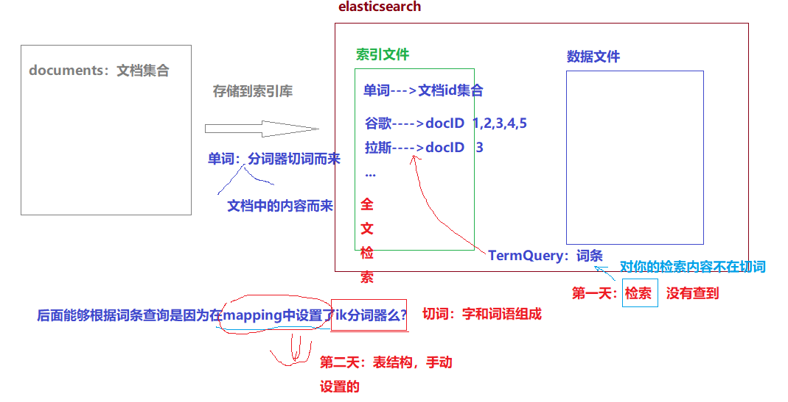

- 相似度查询    

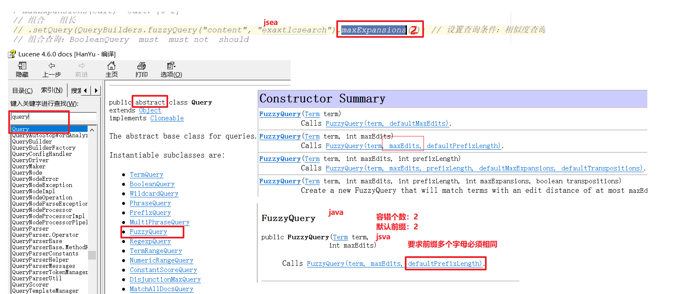


1、es的原生api的操作

- 索引操作
  - 创建索引
  - 删除索引
- 创建映射：表结构      XContentBuilder
- 文档操作
  - 添加文档数据
    - map构建文档数据
    - XContentBuilder构建文档数据
    - pojo构建文档数据
  - 更新文档
    - preparedUpdate
    - update
  - 删除文档
  - 批量添加文档数据
- 文档的检索/查询【重要的】
  - 根据id查询
  - 查询所有
  - 字符串查询、词条查询、相似度查询、模糊查询、范围查询、组合查询（设置多个条件）
  - 对结果：分页和排序
  - 对检索的内容进行高亮显示
    - 高亮概念：对检索的内容添加HTML标签，并且通过样式进行修饰
    - 高亮的实现：继续添加条件

2、SpringData集成Elasticsearch

- SpringDataXxx：操作数据库    对原生api的封装，简化开发
- SpringData集成Elasticsearch开发中的要求
  - dao接口：需要extends ElasticsearchRepository<T, Id>    CURD
  - pojo: index   document  mapping  
- 擴展方法：方法名有要求。


3、搭建Es cluster

- 偽集群    在同一個機器運行三個節點
- 三個節點：需要通信（配置文件中配置）


学习目标：虛擬容器    docker---運維       Linux運維工程師   12年左右

1、了解Docker与虚拟机的不同点，相比的优势
2、掌握Docker的启动方法
**3、掌握Docker镜像操作**
**4、掌握Docker容器操作**
5、掌握Mysql tomcat Nginx Redis等容器部署
6、掌握 Docker的备份与迁移方法


# 第1章 Docker简介

考慮錢，購買電腦：

- 上網、辦公等等：不會買配置高的      沒用，浪費。

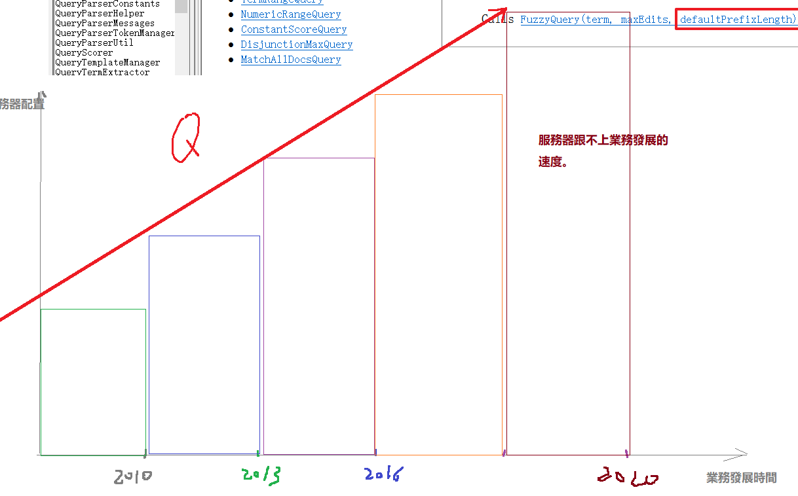

虛擬化：


## 1.1虚拟化

### 1.1.1什么是虚拟化

在计算机中，虚拟化（英语：Virtualization）是一种资源管理技术，是将计算机的各种实体资源，如服务器、网络、内存及存储等，予以抽象、转换后呈现出来，打破实体结构间的不可切割的障碍，使用户可以比原本的组态更好的方式来应用这些资源。这些资源的新虚拟部份是不受现有资源的架设方式，地域或物理组态所限制。一般所指的虚拟化资源包括计算能力和资料存储。

在实际的生产环境中，虚拟化技术主要用来解决高性能的物理硬件产能过剩和老的旧的硬件产能过低的重组重用，透明化底层物理硬件，从而最大化的利用物理硬件   **虚拟化对资源充分利用**

虚拟化技术种类很多，例如：软件虚拟化、硬件虚拟化、内存虚拟化、网络虚拟化(vip)、桌面虚拟化、服务虚拟化、虚拟机      iv-t  麽有開啓     等等。

### 1.1.2虚拟化种类

#### 1.1.2.1 全虚拟化架构

虚拟机的监视器（hypervisor）是类似于用户的应用程序运行在主机的OS之上，如VMware的workstation，这种虚拟化产品提供了虚拟的硬件。

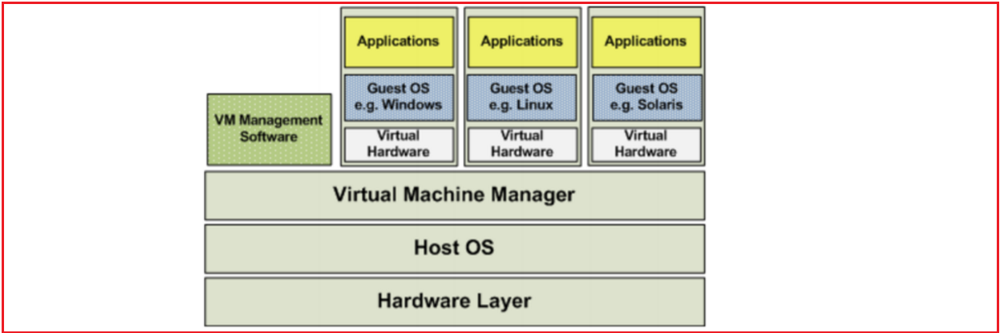


#### 1.1.2.2 OS层虚拟化架构

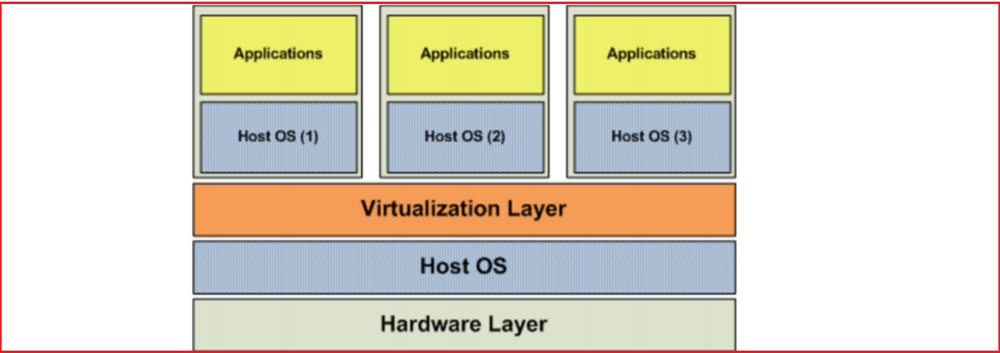


#### 1.1.2.3 硬件层虚拟化

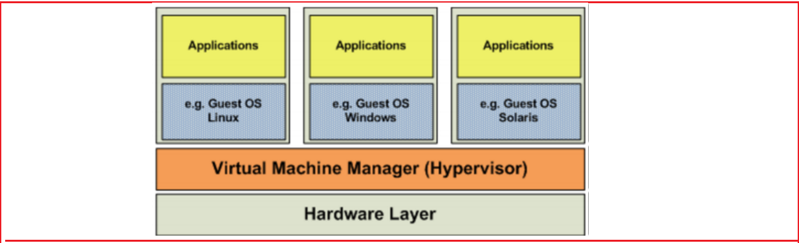

硬件层的虚拟化具有高性能和隔离性，因为hypervisor直接在硬件上运行，有利于控制VM的OS访问硬件资源，使用这种解决方案的产品有VMware ESXi 和 Xen server

Hypervisor是一种运行在物理服务器和操作系统之间的中间软件层,可允许多个操作系统和应用共享一套基础物理硬件，因此也可以看作是虚拟环境中的“元”操作系统，它可以协调访问服务器上的所有物理设备和虚拟机，也叫虚拟机监视器（Virtual Machine Monitor，VMM）。

**Hypervisor是所有虚拟化技术的核心**。当服务器启动并执行Hypervisor时，它会给每一台虚拟机分配适量的内存、CPU、网络和磁盘，并加载所有虚拟机的客户操作系统。  宿主机

Hypervisor是所有虚拟化技术的核心，软硬件架构和管理更高效、更灵活，硬件的效能能够更好地发挥出来。常见的产品有：VMware、KVM、Xen等等。Openstack


## 1.2 什么是Docker


### 1.2.1容器技术-LXC

在计算机的世界中，**容器**拥有一段漫长且传奇的历史。容器与管理程序虚拟化（hypervisor virtualization，HV）有所不同，管理程序虚拟化通过中间层将一台或者多台独立的机器虚拟运行与物理硬件之上，而**容器则是直接运行在操作系统内核之上的用户空间**。因此，容器虚拟化也被称为“操作系统级虚拟化”，容器技术可以让多个独立的用户空间运行在同一台宿主机上。

由于“客居”于操作系统，容器只能运行与底层宿主机相同或者相似的操作系统，这看起来并不是非常灵活。例如：可以在Ubuntu服务中运行Redhat Enterprise Linux，但无法再Ubuntu服务器上运行Microsoft Windows。

相对于彻底隔离的管理程序虚拟化，容器被认为是不安全的。而反对这一观点的人则认为，由于虚拟容器所虚拟的是一个完整的操作系统，这无疑增大了攻击范围，而且还要考虑管理程序层潜在的暴露风险。

尽管有诸多局限性，容器还是被广泛部署于各种各样的应用场合。在超大规模的多租户服务部署、轻量级沙盒以及对安全要求不太高的隔离环境中，容器技术非常流行。最常见的一个例子就是“权限隔离监牢”（chroot jail），它创建一个隔离的目录环境来运行进程。如果权限隔离监牢正在运行的进程被入侵者攻破，入侵者便会发现自己“身陷囹圄”，因为权限不足被困在容器所创建的目录中，无法对宿主机进一步破坏。

最新的容器技术引入了OpenVZ、Solaris Zones以及Linux容器（LXC）。使用这些新技术，容器不在仅仅是一个单纯的运行环境。在自己的权限类内，容器更像是一个完整的宿主机。对Docker来说，它得益于现代Linux特性，如控件组（control group）、命名空间（namespace）技术，容器和宿主机之间的隔离更加彻底，容器有独立的网络和存储栈，还拥有自己的资源管理能力，使得同一台宿主机中的多个容器可以友好的共存。

容器被认为是精益技术，因为容器需要的开销有限。和传统虚拟化以及半虚拟化相比，容器不需要模拟层（emulation layer）和管理层（hypervisor layer），而是使用操作系统的系统调用接口。这降低了运行单个容器所需的开销，也使得宿主机中可以运行更多的容器。

尽管有着光辉的历史，容器仍未得到广泛的认可。一个很重要的原因就是容器技术的复杂性：容器本身就比较复杂，不易安装，管理和自动化也很困难。而Docker就是为了改变这一切而生的。


### 1.2.2容器与虚拟机比较

虚拟机已死   容器（趋势）才是未来

#### 1.2.2.1 本质上的区别

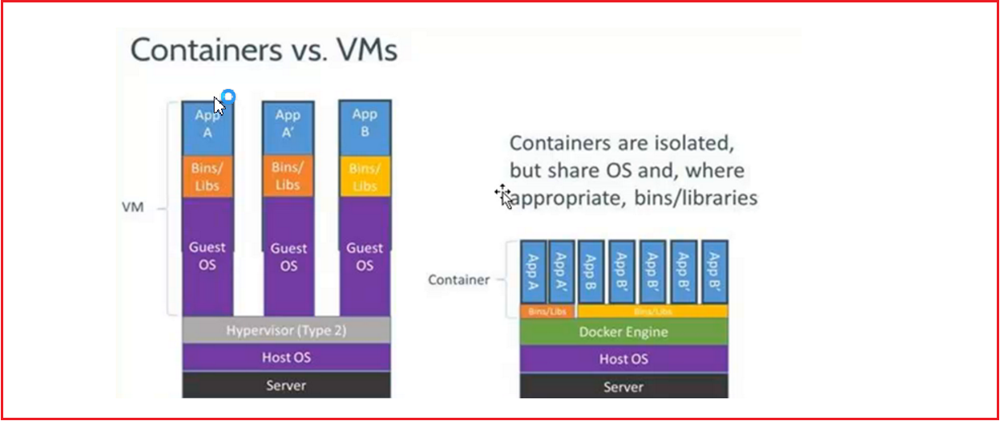

#### 1.2.2.2 使用上的区别

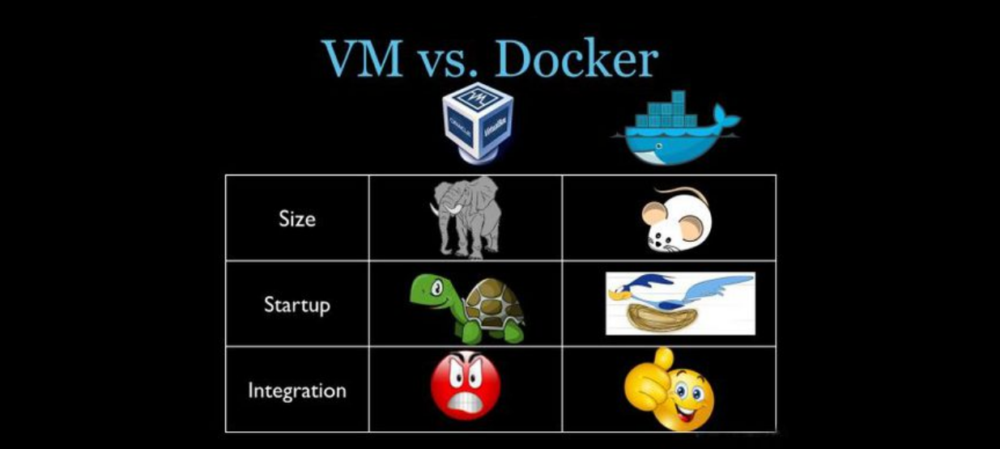


### 1.2.3 Docker特点

#### 1.2.3.1 上手快

用户只需要几分钟，就可以把自己的程序“Docker化”。Docker依赖于“写时复制”（copy-on-write）模型，使修改应用程序也非常迅速，可以说达到“随心所致，代码即改”的境界。

​	随后，就可以创建容器来运行应用程序了。大多数Docker容器只需要不到1秒中即可启动。由于去除了管理程序的开销，Docker容器拥有很高的性能，同时同一台宿主机中也可以运行更多的容器，使用户尽可能的充分利用系统资源。

#### 1.2.3.2 职责的逻辑分离

使用Docker，开发人员只需要关心容器中运行的应用程序，而运维人员只需要关心如何管理容器。Docker设计的目的就是要加强开发人员写代码的开发环境与应用程序要部署的生产环境一致性。从而降低那种“开发时一切正常，肯定是运维的问题（测试环境都是正常的，上线后出了问题就归结为肯定是运维的问题）”


#### 1.2.3.3 快速高效的开发生命周期

Docker的目标之一就是缩短代码从开发、测试到部署、上线运行的周期，让你的应用程序具备可移植性，易于构建，并易于协作。（通俗一点说，Docker就像一个盒子，里面可以装很多物件，如果需要这些物件的可以直接将该大盒子拿走，而不需要从该盒子中一件件的取。）

#### 1.2.3.4 鼓励使用面向服务的架构

Docker还鼓励面向服务的体系结构和微服务架构。Docker推荐单个容器只运行一个应用程序或进程，这样就形成了一个分布式的应用程序模型，在这种模型下，应用程序或者服务都可以表示为一系列内部互联的容器，从而使分布式部署应用程序，扩展或调试应用程序都变得非常简单，同时也提高了程序的内省性。（当然，可以在一个容器中运行多个应用程序）

 

## 1.3 Docker组件

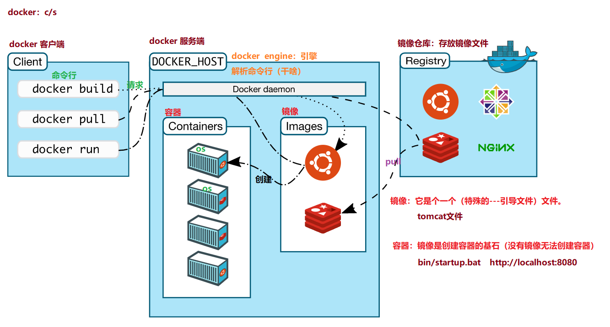

### 1.3.1 Docker客户端和服务器

Docker是一个客户端-服务器（C/S）架构程序。Docker客户端只需要向Docker服务器或者守护进程发出请求，服务器或者守护进程将完成所有工作并返回结果。Docker提供了一个命令行工具Docker以及一整套RESTful API。你可以在同一台宿主机上运行Docker守护进程和客户端，也可以从本地的Docker客户端连接到运行在另一台宿主机上的远程Docker守护进程。

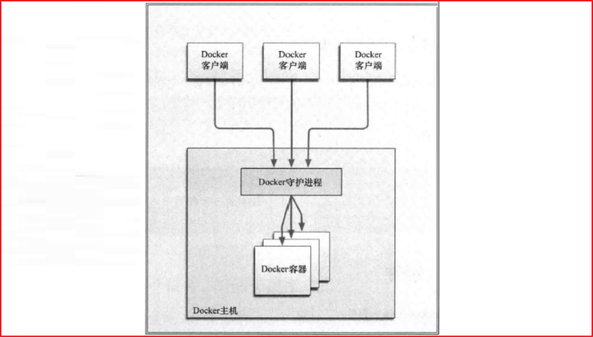


### 1.3.2 Docker镜像

镜像是构建Docker的基石。用户基于镜像来运行自己的容器。镜像也是Docker生命周期中的“构建”部分。镜像是基于联合文件系统的一种层式结构，由一系列指令一步一步构建出来。例如：

添加一个文件；

执行一个命令；

打开一个窗口。

也可以将镜像当作容器的“源代码”。镜像体积很小，非常“便携”，易于分享、存储和更新。

### 1.3.3 Registry（注册中心）

Docker用Registry来保存用户构建的镜像。Registry分为公共和私有两种。Docker公司运营公共的Registry叫做Docker Hub。用户可以在Docker Hub注册账号，分享并保存自己的镜像（说明：在Docker Hub下载镜像巨慢，可以自己构建私有的Registry）。

### 1.3.4 Docker容器

Docker可以帮助你构建和部署容器，你只需要把自己的应用程序或者服务打包放进容器即可。容器是基于镜像启动起来的，容器中可以运行一个或多个进程。我们可以认为，镜像是Docker生命周期中的构建或者打包阶段，而容器则是启动或者执行阶段。  容器基于镜像启动，一旦容器启动完成后，我们就可以登录到容器中安装自己需要的软件或者服务。

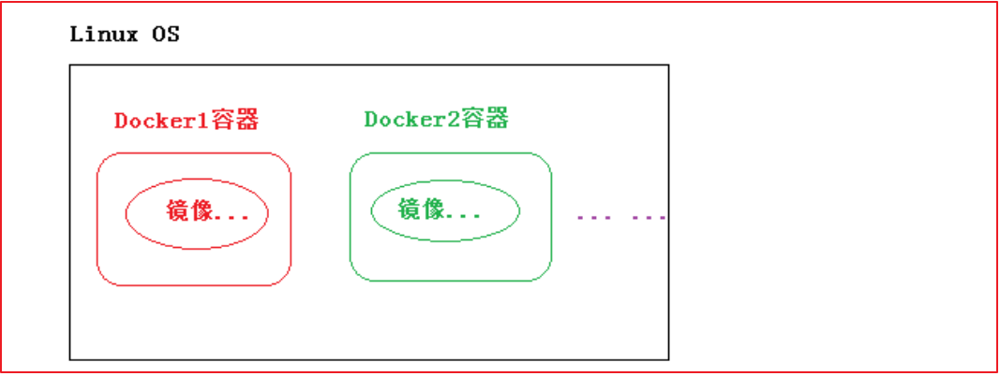

所以Docker容器就是：

一个镜像格式；

一些列标准操作；

一个执行环境。

Docker借鉴了标准集装箱的概念。标准集装箱将货物运往世界各地，Docker将这个模型运用到自己的设计中，唯一不同的是：集装箱运输货物，而Docker运输软件。

​	和集装箱一样，Docker在执行上述操作时，并不关心容器中到底装了什么，它不管是web服务器，还是数据库，或者是应用程序服务器什么的。所有的容器都按照相同的方式将内容“装载”进去。

​	Docker也不关心你要把容器运到何方：我们可以在自己的笔记本中构建容器，上传到Registry，然后下载到一个物理的或者虚拟的服务器来测试，在把容器部署到具体的主机中。像标准集装箱一样，Docker容器方便替换，可以叠加，易于分发，并且尽量通用。

​	使用Docker，我们可以快速的构建一个应用程序服务器、一个消息总线、一套实用工具、一个持续集成（CI）测试环境或者任意一种应用程序、服务或工具。我们可以在本地构建一个完整的测试环境，也可以为生产或开发快速复制一套复杂的应用程序栈。

# 第2章 Docker安装与启动

## 2.1 安装环境说明

Docker官方建议在Ubuntu中安装，因为Docker是基于Ubuntu发布的，而且一般Docker出现的问题Ubuntu是最先更新或者打补丁的。在很多版本的CentOS中是不支持更新最新的一些补丁包的。

由于我们学习的环境都使用的是CentOS，因此这里我们将Docker安装到CentOS上。注意：这里建议安装在CentOS7.x(宿主机)以上的版本，在CentOS6.x的版本中，安装前需要安装其他很多的环境而且Docker很多补丁不支持更新。

## 2.2 在VMware Workstation中安装CentOS7

资料已经准备了安装好的镜像，直接挂载即可。

挂载后，使用ip addr命令查看本地IP

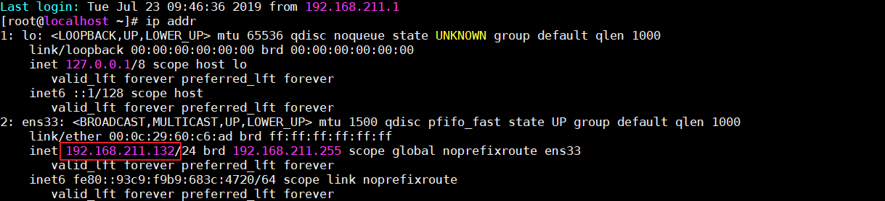

账号：root

密码：123456


提供虚拟机：root/itcast


## 2.3 安装Docker

使用yum命令在线安装

```properties
yum install docker
```

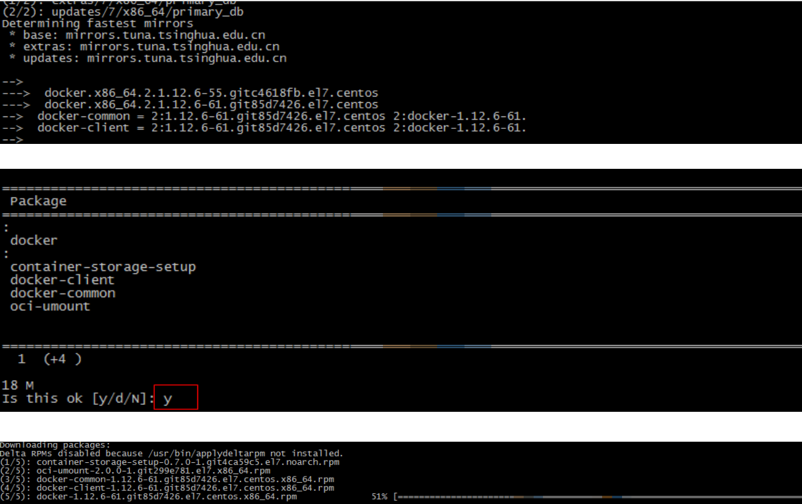


## 2.4 安装后查看Docker版本

```properties
docker -v
```

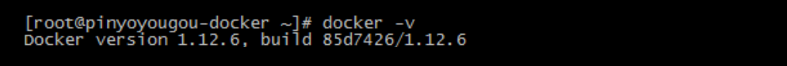


## 2.5 启动与停止Docker

**systemctl**命令是系统服务管理器指令，它是 service 和 chkconfig 两个命令组合。

l 启动docker：systemctl start docker

l 停止docker：systemctl stop docker

l 重启docker：systemctl restart docker

l 查看docker状态：systemctl status docker

l 开机启动：systemctl enable docker

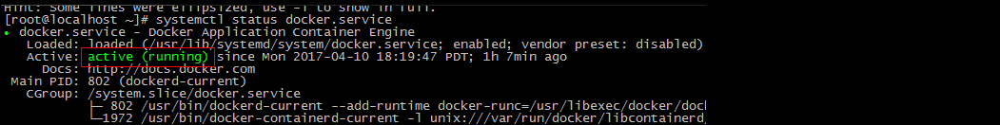

l 查看docker概要信息：docker info

l 查看docker帮助文档：**docker --help**


# 第3章 Docker镜像操作

## 3.1 什么是Docker镜像

Docker镜像是由文件系统叠加而成（是一种文件的存储形式）。最底端是一个文件引导系统，即bootfs，这很像典型的Linux/Unix的引导文件系统。Docker用户几乎永远不会和引导系统有什么交互。实际上，当一个容器启动后，它将会被移动到内存中，而引导文件系统则会被卸载，以留出更多的内存供磁盘镜像使用。Docker容器启动是需要的一些文件，而这些文件就可以称为Docker镜像。

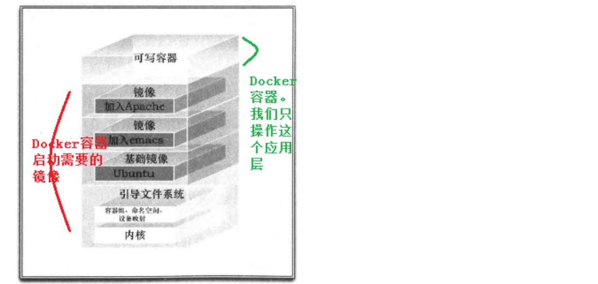


## 3.2 列出镜像

列出docker下的所有镜像：docker images

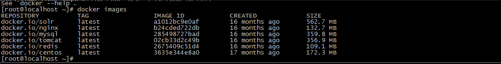

l REPOSITORY：镜像所在的仓库名称

l TAG：镜像标签

l IMAGE ID：镜像ID

l CREATED：镜像的创建日期（不是获取该镜像的日期）

l SIZE：镜像大小

l 这些镜像都是存储在Docker宿主机的/var/lib/docker目录下

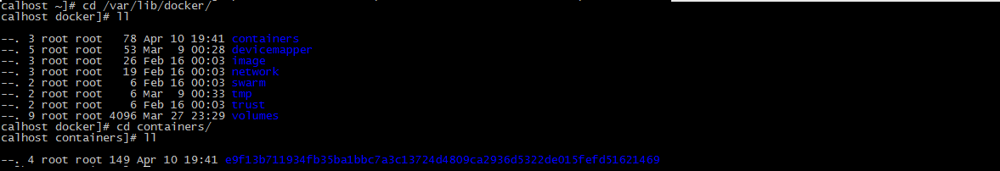

为了区分同一个仓库下的不同镜像，Docker提供了一种称为标签（Tag）的功能。每个镜像在列出来时都带有一个标签，例如12.10、12.04等等。每个标签对组成特定镜像的一些镜像层进行标记（比如，标签12.04就是对所有Ubuntu12.04镜像层的标记）。这种机制使得同一个仓库中可以存储多个镜像。--- 版本号

​	我们在运行同一个仓库中的不同镜像时，可以通过在仓库名后面加上一个冒号和标签名来指定该仓库中的某一具体的镜像，例如docker run --name custom_container_name –i –t docker.io/ubunto:12.04 /bin/bash，表明从镜像Ubuntu:12.04启动一个容器，而这个镜像的操作系统就是Ubuntu:12.04。在构建容器时指定仓库的标签也是一个好习惯。


## 3.3 搜索镜像

如果你需要从网络中查找需要的镜像，可以通过以下命令搜索

```properties
docker search 镜像名称
```

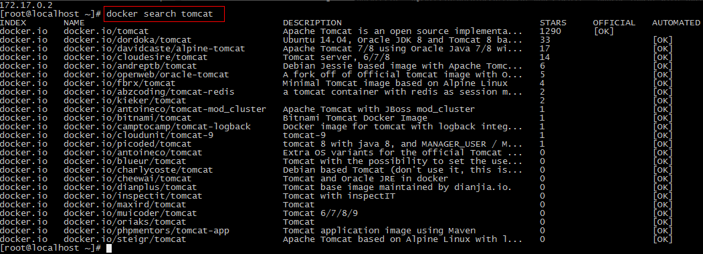

n NAME：仓库名称

n DESCRIPTION：镜像描述

n STARS：用户评价，反应一个镜像的受欢迎程度

n OFFICIAL：是否官方

AUTOMATED：自动构建，表示该镜像由Docker Hub自动构建流程创建的


## 3.4 拉取镜像[获取镜像]

### 3.4.1 从Docker Hub拉取

Docker镜像首页，包括官方镜像和其它公开镜像。Docker Hub上最受欢迎的10大镜像（通过Docker registry API获取不了镜像被pull的个数，只能通过镜像的stars数量，来衡量镜像的流行度。毫无疑问，拥有最高stars数量的库都是官方库）。

https://hub.docker.com/search?image_filter=official&type=image

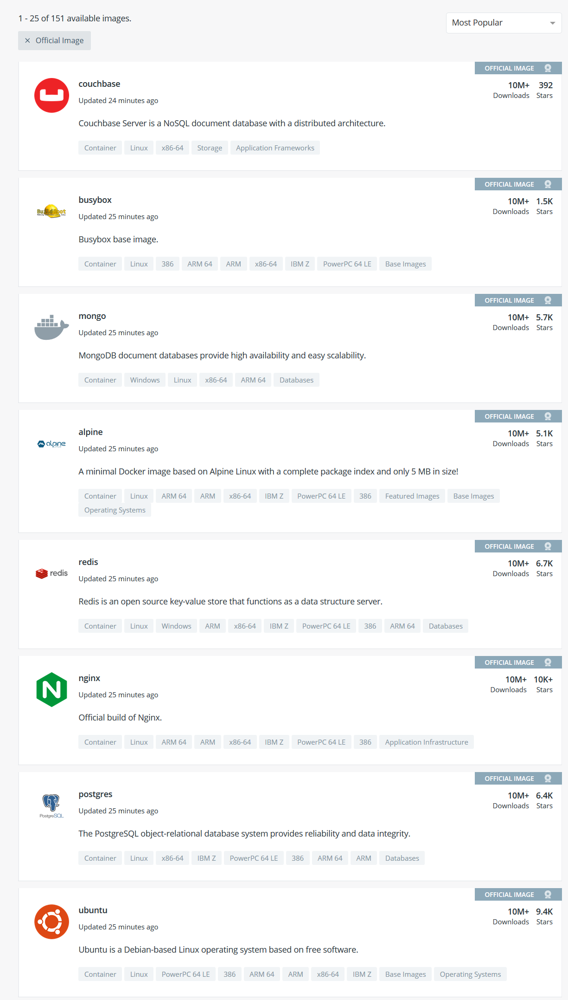

国情的原因，国内下载 Docker HUB 官方的相关镜像比较慢，可以使用国内（docker.io）的一些镜像加速器，镜像保持和官方一致，关键是速度块，推荐使用。Mirror与Private Registry的区别：

Private Registry（私有仓库）是开发者或者企业自建的镜像存储库，通常用来保存企业内部的 Docker 镜像，用于内部开发流程和产品的发布、版本控制。

Mirror是一种代理中转服务，我们(比如daocloud)提供的Mirror服务，直接对接Docker Hub的官方Registry。Docker Hub 上有数以十万计的各类 Docker 镜像。

在使用Private Registry时，需要在Docker Pull 或Dockerfile中直接键入Private Registry 的地址，通常这样会导致与 Private Registry 的绑定，缺乏灵活性。

使用 Mirror 服务，只需要在 Docker 守护进程（Daemon）的配置文件中加入 Mirror 参数，即可在全局范围内透明的访问官方的 Docker Hub，避免了对 Dockerfile 镜像引用来源的修改。

简单来说，Mirror类似CDN，本质是官方的cache；Private Registry类似私服，跟官方没什么关系。对用户来说，由于用户是要拖docker hub上的image，对应的是Mirror。yum/apt-get的Mirror又有点不一样，它其实是把官方的库文件整个拖到自己的服务器上做镜像，并定时与官方做同步；而Docker Mirror只会缓存曾经使用过的image。

使用命令拉取：

```
docker pull centos:7
```

目前国内访问docker hub速度上有点尴尬，使用docker Mirror势在必行。现有国内提供docker镜像加速服务的商家有不少，下面重点ustc镜像。

### 3.4.2 ustc的镜像

ustc是老牌的linux镜像服务提供者了，还在遥远的ubuntu 5.04版本的时候就在用。ustc的docker镜像加速器速度很快。ustc docker mirror的优势之一就是不需要注册，是真正的公共服务。

<https://lug.ustc.edu.cn/wiki/mirrors/help/docker>

**步骤：**

（1）编辑该文件：vi /etc/docker/daemon.json  // 如果该文件不存在就手动创建；说明：在centos7.x下，通过vi。

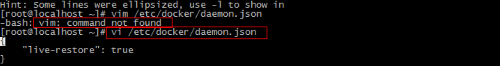

（2）在该文件中输入如下内容：

```properties
{
	"registry-mirrors": ["https://docker.mirrors.ustc.edu.cn"]
}
```

（3）注意：一定要重启docker服务，如果重启docker后无法加速，可以重新启动OS

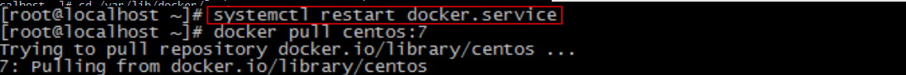

然后通过docker pull命令下载镜像：速度杠杠的。

 

## 3.5 删除镜像

1、 docker rmi $IMAGE_ID：删除指定镜像

2、 docker rmi `docker images -q`：删除所有镜像


# 第4章 Docker容器操作

## 4.1 查看容器

l 查看正在运行容器：

```properties
docker ps
```

l 查看所有的容器（启动过的历史容器）：

```properties
docker ps –a
```

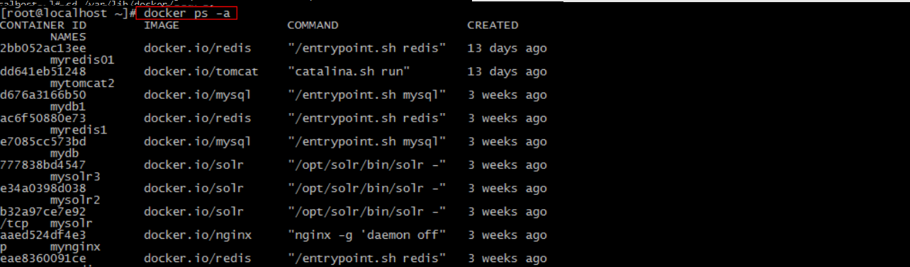

l 查看最后一次运行的容器：

```properties
docker ps –l
```

l 查看停止的容器

```properties
docker ps -f status=exited
```


## 4.2 创建与启动容器

l 创建容器常用的参数说明：

l 创建容器命令：docker run

l -i：表示运行容器

l -t：表示容器启动后会进入其命令行。加入这两个参数后，容器创建就能登录进去。即分配一个伪终端。

l --name :为创建的容器命名。

l -v：表示目录映射关系（前者是宿主机目录，后者是映射到宿主机上的目录），可以使用多个－v做多个目录或文件映射。注意：最好做目录映射，在宿主机上做修改，然后共享到容器上。

l -d：在run后面加上-d参数,则会创建一个守护式容器在后台运行（这样创建容器后不会自动登录容器，如果只加-i -t两个参数，创建后就会自动进去容器）。

l -p：表示端口映射，前者是宿主机端口，后者是容器内的映射端口。可以使用多个－p做多个端口映射


### 4.1.1 交互式容器

创建一个交互式容器并取名为mycentos

```shell
docker run -i -t --name=c1 centos /bin/bash
```

这时我们通过ps命令查看，发现可以看到启动的容器，状态为启动状态

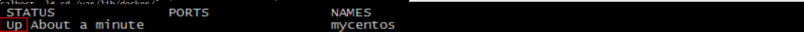

使用exit命令 退出当前容器

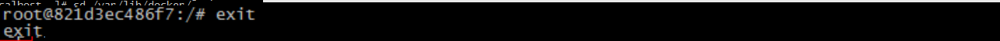

然后用ps -a 命令查看发现该容器也随之停止：

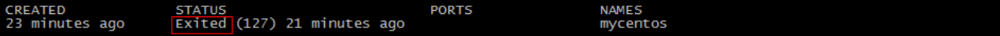


### 4.1.2 守护式容器

创建一个守护式容器：如果对于一个需要长期运行的容器来说，我们可以创建一个守护式容器。命令如下（容器名称不能重复）：

~~~shell
docker run -i -d --name=c2 centos /bin/bash
~~~


l 登录守护式容器方式：

docker exec -it container_name (或者 container_id)  /bin/bash（exit退出时，容器不会停止）

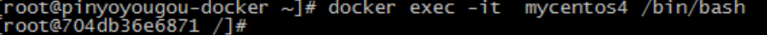


## 4.3 停止与启动容器

l 停止正在运行的容器：docker stop $CONTAINER_NAME/ID

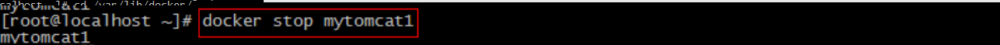

l 启动已运行过的容器：docker start $CONTAINER_NAME/ID

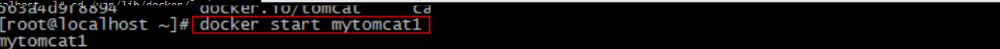


## 4.4 文件拷贝

如果我们需要将文件拷贝到容器内可以使用cp命令

```
docker cp 需要拷贝的文件或目录 容器名称:容器目录
例如：docker cp 1.txt c2:/root
```

也可以将文件从容器内拷贝出来

```
docker cp 容器名称:容器目录 需要拷贝的文件或目录
例如：docker cp c2:/root/2.txt /root
```


## 4.5 目录挂载

我们可以在创建容器的时候，将宿主机的目录与容器内的目录进行映射，这样我们就可以通过修改宿主机某个目录的文件从而去影响容器。

创建容器 添加-v参数 后边为   宿主机目录:容器目录

```
docker run -id --name=c4 -v /opt/:/usr/local/myhtml centos
```

如果你共享的是多级的目录，可能会出现权限不足的提示。

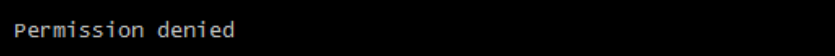

这是因为CentOS7中的安全模块selinux把权限禁掉了，我们需要添加参数  --privileged=true  来解决挂载的目录没有权限的问题

```properties

docker run -id --privileged=true --name=c4 -v /opt/:/usr/local/myhtml centos
```


## 4.6 查看容器IP地址

我们可以通过以下命令查看容器运行的各种数据

```
docker inspect mycentos2
```

也可以直接执行下面的命令直接输出IP地址

```
docker inspect --format='{{.NetworkSettings.IPAddress}}' c1
```


## 4.7 删除容器

l 删除指定的容器：docker rm $CONTAINER_ID/NAME

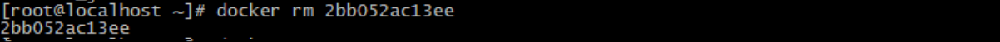

注意，只能删除停止的容器

l 删除所有容器：docker rm $(docker ps -a -q)

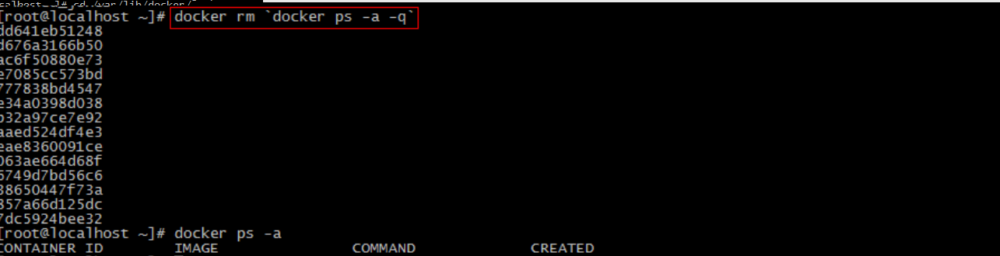


# 第5章 部署应用

- 拉取镜像
- 创建容器


- 查看防火墙状态：firewall-cmd --state
- 关闭防火墙：systemctl stop firewalld.service 
- 禁止firewall开机启动：systemctl disable firewalld.service  

## 5.1 MySQL部署

### 5.1.1 拉取MySQL镜像

 ```properties
docker pull mysql:5.7
 ```


### 5.1.2 创建MySQL容器

```properties
docker run -di --name mysql -p 33306:3306 -e MYSQL_ROOT_PASSWORD=123456 mysql:5.7
```

-p 代表端口映射，格式为  宿主机映射端口:容器运行端口

-e 代表添加环境变量  MYSQL_ROOT_PASSWORD是root用户的登陆密码


### 5.1.3 远程登陆MySQL

（1）我们在我们本机的电脑上去连接虚拟机Centos中的Docker容器，这里192.168.200.136是虚拟机操作系统的IP 

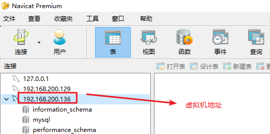


**PS：**

~~~mysql
# 如果是最新版本的MySQL，不支持native插件，需要进入mysql中执行该语句
docker exec -it mysql /bin/bash
mysql -u root -p 123456
ALTER USER 'root'@'%' IDENTIFIED WITH mysql_native_password BY '123456';
~~~


（2）在本地客户端执行建库脚本

执行“资源/建库语句/springboot.sql” 

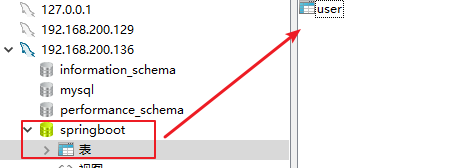


### 5.1.4 查看容器IP地址

我们可以通过以下命令查看容器运行的各种数据

```
docker inspect mysql
```

运行效果如下：

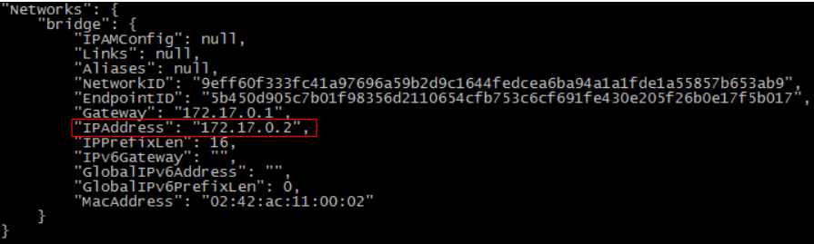

 我们可以看到我们的数据库服务器的IP是172.17.0.2 


## 5.2 tomcat部署

### 5.2.1 拉取tomcat镜像

```properties
docker pull docker.io/silentheartbeat/tomcat8-jre8
```


### 5.2.2 创建tomcat容器

创建容器用于部署ssm集成项目  -p表示地址映射

```properties
docker run -di --name=tomcat -p 9000:8080 -v /usr/local/web:/usr/local/tomcat/webapps --privileged=true silentheartbeat/tomcat8-jre8
或者
docker run -p 8080:8080 docker.io/tomcat
```


## 5.3 Nginx部署

### 5.3.1 拉取Nginx镜像

```properties
docker pull nginx
```


### 5.3.2 创建Nginx容器

```properties
docker run -id --name=nginx -p 80:80 docker.io/nginx
-p:端口映射
```


### 5.3.3 测试Nginx

浏览器地址栏输入： <http://192.168.200.136>  

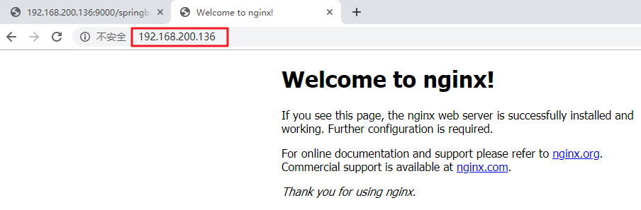


## 5.4 Redis部署

### 5.4.1 拉取Redis镜像

```
docker pull redis
```


### 5.4.2 创建Redis容器

 ```
 docker run -di --name=redis -p 6379:6379 redis
 ```


### 5.4.3 客户端测试

在你的本地电脑命令提示符下，用window版本redis测试

 ```
redis-cli -h 192.168.247.135
 ```


~~~properties
微服务部署：
https://www.ixigua.com/i6761654675738477060/#comment_area
~~~


# 第6章 备份与迁移


## 6.1 容器保存为镜像

我们可以通过以下命令将容器保存为镜像

```
docker commit nginx mynginx
```


nginx是容器名称

mynginx是新的镜像名称

此镜像的内容就是你当前容器的内容，接下来你可以用此镜像再次运行新的容器

## 6.2 镜像备份

```
docker  save -o mynginx.tar mynginx
```

-o 输出到的文件

执行后，运行ls命令即可看到打成的tar包

## 6.3 镜像恢复与迁移

首先我们先删除掉mynginx镜像

然后执行此命令进行恢复

```
docker load -i mynginx.tar
```

-i 输入的文件

执行后再次查看镜像，可以看到镜像已经恢复


# 第七章 RabbitMQ 集群搭建

安装步骤：RabbitMQ 集群，节点间都需要通信。cookie

~~~properties
1、拉取镜像
docker pull rabbitmq:management

2、创建三个容器
docker run -d --hostname rabbitmq_host1 --name rabbitmq1 -p 15672:15672 -p 5672:5672 -e RABBITMQ_ERLANG_COOKIE='rabbitmq_cookie' rabbitmq:management

docker run -d --hostname rabbitmq_host2 --name rabbitmq2 -p 5673:5672 --link rabbitmq1:rabbitmq_host1 -e RABBITMQ_ERLANG_COOKIE='rabbitmq_cookie' rabbitmq:management

docker run -d --hostname rabbitmq_host3 --name rabbitmq3 -p 5674:5672 --link rabbitmq1:rabbitmq_host1 --link rabbitmq2:rabbitmq_host2 -e RABBITMQ_ERLANG_COOKIE='rabbitmq_cookie' rabbitmq:management

PS：
--link 容器之间连接
rlang Cookie 值必须相同，也就是一个集群内 RABBITMQ_ERLANG_COOKIE 参数的值必须相同。Erlang Cookie 相当于不同节点之间通讯的密钥，Erlang节点通过交换 Erlang Cookie 获得认证

3、将节点加入到集群
3.1、设置node1
docker exec -it rabbitmq1 bash
rabbitmqctl stop_app           # 关闭应用
rabbitmqctl reset			  # 重置，移除所有数据
rabbitmqctl start_app          # 启动应用
exit

3.2、设置node2
docker exec -it rabbitmq2 bash
rabbitmqctl stop_app
rabbitmqctl reset
rabbitmqctl join_cluster --ram rabbit@rabbitmq_host1
rabbitmqctl start_app
exit

3.3、设置node3
docker exec -it rabbitmq3 bash
rabbitmqctl stop_app
rabbitmqctl reset
rabbitmqctl join_cluster --ram rabbit@rabbitmq_host1
rabbitmqctl start_app
exit

--ram 表示设置为内存节点,该配置启动了3个节点，1个磁盘节点和2个内存节点。


4、镜像集群
使用RabbitMQ镜像功能，需要基于RabbitMQ策略来实现，策略policy就是要设置哪些Exchange或者queue的数据需要复制、同步，以及如何复制同步。为了使队列成为镜像队列，需要创建一个策略来匹配队列，设置策略有两个键“ha-mode和 ha-params（可选）”。ha-params根据ha-mode设置不同的值。"^"  表示针对的队列的名称的正则表达式，此处表示匹配所有的队列名称
docker exec -it rabbitmq1 bash
rabbitmqctl set_policy ha-all "^" '{"ha-mode":"all"}'
exit
~~~

集群效果：

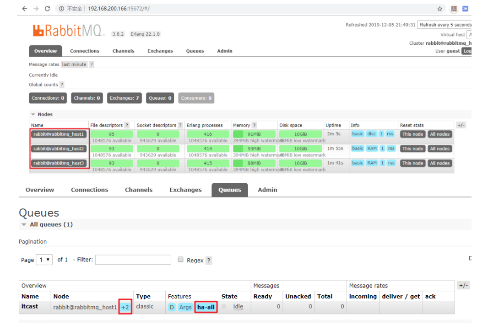