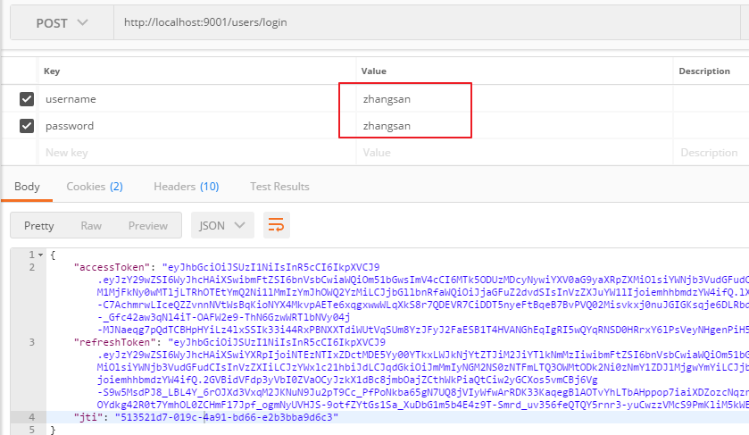
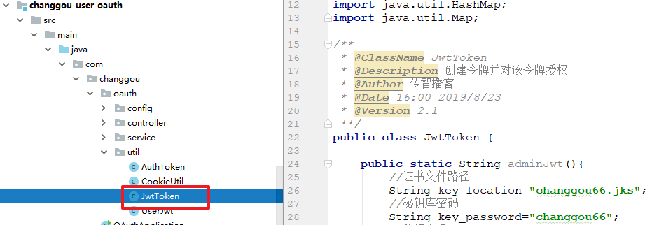
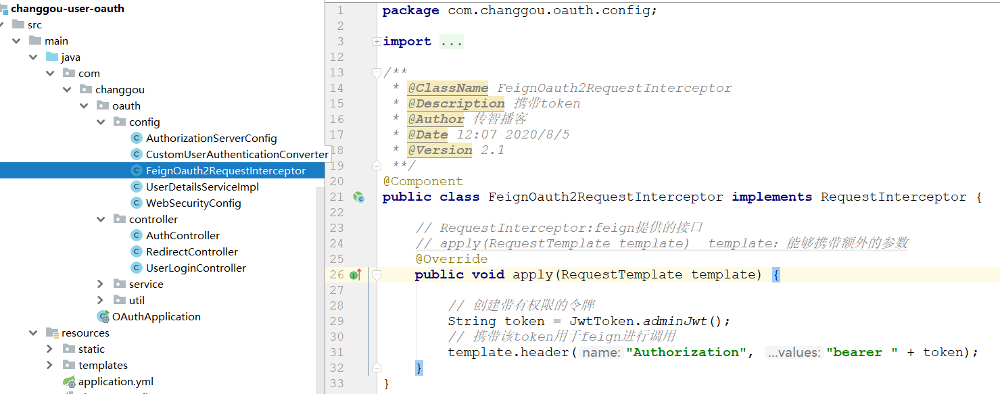
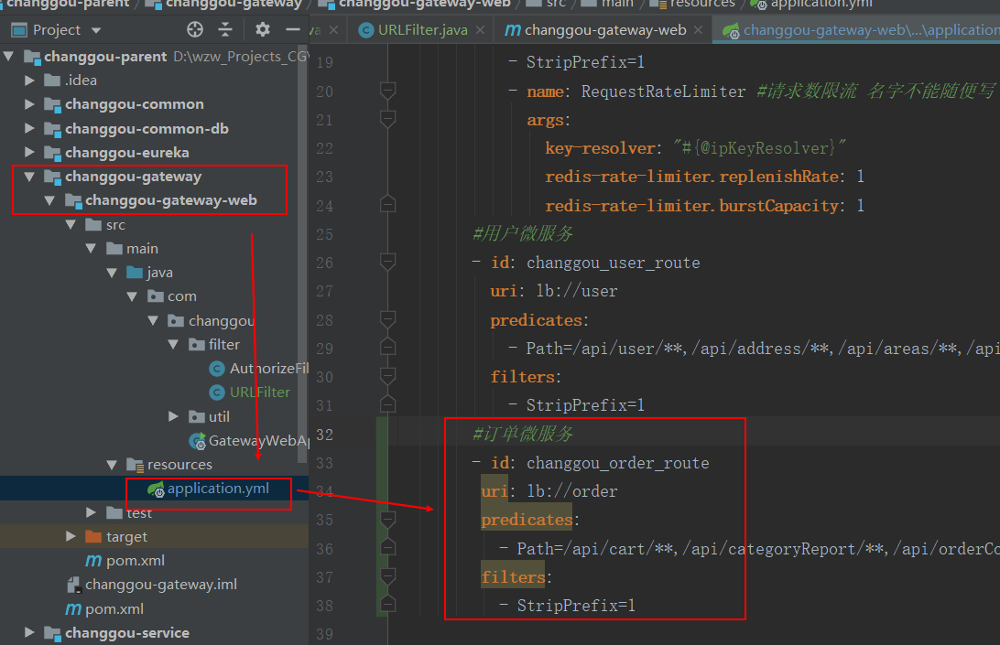
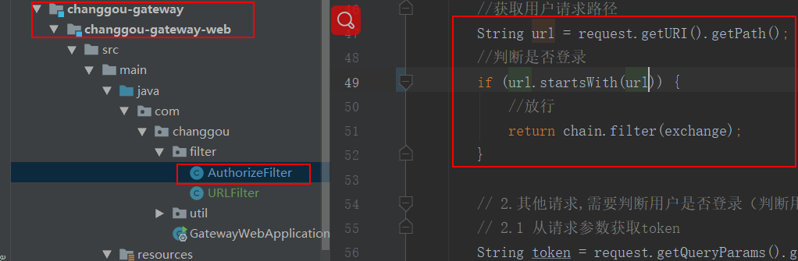
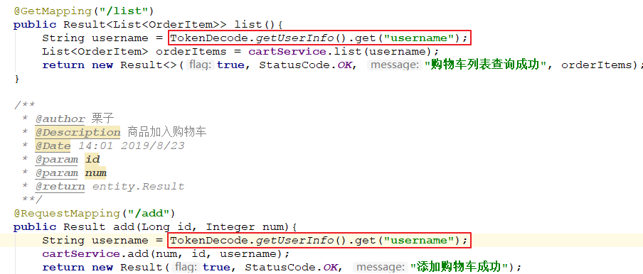

# 第10章 购物车

第8、9天反馈


1、springboot程序打包（springboot-day02）

2、代码正确  +   延时足够 +  各个服务以及相关的组件：网络问题

- 肯定有日志信息。
- 看日志：80%    +   20%：经验

3、去年

4、用户名和密码（changgou_user--->tb_user）

5、客户端：飞车、斗地主、CF

6、jd、唯品会、天猫、淘宝：   qq登录       changgou_oauth库中

hibernate：hql语句    sql一样     from  pojo


课程回顾：认证

1、认证：

- 完成单点登录操作。
- 单点登录：SSO     一次登录，到处访问。
- 实现SSO的技术方案：
  - 自研：服务器端的session同步。
    - mybatis集成第三方缓存的组件EhcacheCache
    - 直接使用Redis去实现。
  - 开源：访问服务需要携带token，并且解析token。
    - CAS：耶鲁大学    SpringSecurity+CAS整合
    - Oauth2.0：SpringSecurity+Oauth2.0整合
      - Oauth2.0：认证
      - SpringSecurity：授权（鉴权）

2、Oauth2.0授权方式：登录并且生成token

- 授权码授权
  - 客户端（jd）获取到授权码 
  - 客户端进行登录       /oauth/token
  - 解析令牌： /oauth/check_token
- 密码授权
  - 客户端进行登录       /oauth/token
  - 解析令牌： /oauth/check_token

3、RSA非对称加密       http      https(ssl)    s：有免费   收费

- 公钥和私钥
- 生成证书文件：xxx.jks
- 数字签名：hash函数--->hash碰撞--->生日碰撞。

4、用户的登录：调用的是oauth提供的接口：/oauth/token


学习目标

- 资源服务器（changgou-service-user）授权配置(回顾)

- 掌握OAuth2.0认证微服务动态加载数据

  - 授权码模式数据加载
  - 密码模式数据加载

- 掌握购物车流程

- 发放管理员令牌（临时令牌）

- 微服务与微服务之间的认证

  

  

# 1 用户资源服务器授权配置-回顾

模板代码：

1、添加公钥

2、添加oauth的依赖

3、添加配置类


## 1.1 资源服务授权配置


基本上所有微服务都是资源服务，这里我们在课程管理服务上配置授权控制，当配置了授权控制后如要访问课程信 息则必须提供令牌。 

~~~properties
每个微服务认证，需要完成如下三个步骤：
1、添加oauth依赖
2、添加公钥
3、添加解析公钥的配置类
~~~


## 1.2 用户微服务资源授权

**1、添加公钥**


**2、引入依赖**

在changgou-service-user微服务工程pom.xml中引入oauth依赖

```xml
<!--oauth依赖-->
<dependency>
    <groupId>org.springframework.cloud</groupId>
    <artifactId>spring-cloud-starter-oauth2</artifactId>
</dependency>
```


**3、资源授权配置**

在changgou-service-user工程中创建com.changgou.user.config.ResourceServerConfig，代码如下：

```java
@Configuration
@EnableResourceServer
@EnableGlobalMethodSecurity(prePostEnabled = true, securedEnabled = true)//激活方法上的PreAuthorize注解
public class ResourceServerConfig extends ResourceServerConfigurerAdapter {

    //公钥
    private static final String PUBLIC_KEY = "public.key";

    /***
     * 定义JwtTokenStore
     * @param jwtAccessTokenConverter
     * @return
     */
    @Bean
    public TokenStore tokenStore(JwtAccessTokenConverter jwtAccessTokenConverter) {
        return new JwtTokenStore(jwtAccessTokenConverter);
    }

    /***
     * 定义JJwtAccessTokenConverter
     * @return
     */
    @Bean
    public JwtAccessTokenConverter jwtAccessTokenConverter() {
        JwtAccessTokenConverter converter = new JwtAccessTokenConverter();
        converter.setVerifierKey(getPubKey());
        return converter;
    }
    /**
     * 获取非对称加密公钥 Key
     * @return 公钥 Key
     */
    private String getPubKey() {
        Resource resource = new ClassPathResource(PUBLIC_KEY);
        try {
            InputStreamReader inputStreamReader = new InputStreamReader(resource.getInputStream());
            BufferedReader br = new BufferedReader(inputStreamReader);
            return br.lines().collect(Collectors.joining("\n"));
        } catch (IOException ioe) {
            return null;
        }
    }

    /***
     * Http安全配置，对每个到达系统的http请求链接进行校验
     * @param http
     * @throws Exception
     */
    @Override
    public void configure(HttpSecurity http) throws Exception {
        //所有请求必须认证通过
        http.authorizeRequests()
                //下边的路径放行
                .antMatchers(
                        "/user/add"). //配置地址放行
                permitAll()
                .anyRequest().
                authenticated();    //其他地址需要认证授权
    }
}
```


~~~
注解说明：
@EnableResourceServer：
@EnableResourceServer是为OAuth2资源服务器提供方便的注释，启用Spring Security 过滤器，通过传入的OAuth2令牌对请求进行身份验证。用户应添加此注释并提供一个ResourceServerConfigurer的@Bean （例如，通过 ResourceServerConfigurerAdapter），指定资源的详细信息（URL路径和资源ID）。要使用此过滤器，您必须在应用程序中的某个位置，或者与使用此批注的相同位置，或者在其他位置使用@EnableWebSecurity。

@EnableGlobalMethodSecurity：（@EnableGlobalAuthentication启用全局认证机制）
Spring Security默认是禁用注解的，要想开启注解，需要在继承WebSecurityConfigurerAdapter的类上加@EnableGlobalMethodSecurity注解，来判断用户对某个控制层的方法是否具有访问权限

@EnableWebSecurity
1、加载了WebSecurityConfiguration配置类, 配置安全认证策略。
2、加载了AuthenticationConfiguration, 配置了认证信息。
在非Springboot的Spring Web MVC应用中，该注解@EnableWebSecurity需要开发人员自己引入以启用Web安全。而在基于Springboot的Spring Web MVC应用中,开发人员没有必要再次引用该注解，Springboot的自动配置机制WebSecurityEnablerConfiguration已经引入了该注解
~~~


## 1.3 优化用户登录设置

在UserLoginController中我们返回的是一个Map，这里我们可以将数据封装到pojo中。

### 1.3.1 修改UserLoginService

#### service接口：


```java
/**
     * @author wzw
     * 用户登录认证
     * @Date 16:30 2020/12/22
     * @param username      用户名
     * @param password      密码
     * @param clientId      客户端id
     * @param clientSecret  客户端秘钥
     * @param grant_type    密码授权方式
     * @return java.util.Map<java.lang.String,java.lang.Object>
    **/
AuthToken login(String username, String password, String clientId, String clientSecret, String grant_type);
```


#### service实现类：


```java
// 5.2处理结果集
//创建pojo封装数据
AuthToken authToken = new AuthToken();
//封装令牌
authToken.setAccessToken(map.get("access_token").toString());
//封装刷新令牌
authToken.setRefreshToken(map.get("token_type").toString());
//封装唯一标识符
authToken.setJti(map.get("jti").toString());
return authToken;
```


### 1.3.2 修改UserLoginController


```java
@RequestMapping("/login")
public Result login(String username, String password, HttpServletResponse response){
    // 密码授权方式
    String grant_type = "password"; 
    
    //实现功能:返回token到pojo中
    AuthToken authToken = userLoginService.login(username, password, grant_type, clientId, clientSecret);
    
    //返回结果
    return new Result(true, StatusCode.OK, "登录成功", authToken);
}
```

访问地址：`<http://localhost:9001/user/login>`   


## 1.3 授权测试

**(1)不携带令牌测试**

访问`<http://localhost:18088/user>`  不携带令牌，结果如下：


**(2)生成令牌**

生成令牌：（通过密码授权 或者 通过令牌授权）


**(3)携带正确令牌**


# 2 OAuth对接微服务


用户每次访问微服务的时候，先去oauth2.0服务登录，登录后再访问微服务网关，微服务网关将请求转发给其他微服务处理。

```properties
1.用户登录成功后，会将令牌信息存入到cookie中(一般建议存入到头文件中)
2.用户携带Cookie中的令牌访问微服务网关
3.微服务网关先获取头文件中的令牌信息，如果Header中没有Authorization令牌信息，则取参数中找，参数中如果没有，则取Cookie中找Authorization，最后将令牌信息封装到Header中，并调用其他微服务
4.其他微服务会获取头文件中的Authorization令牌信息，然后匹配令牌数据是否能使用公钥解密，如果解密成功说明用户已登录，解密失败，说明用户未登录
```


## 1.1 携带令牌测试

`通过微服务网关去测试的时候，

`注意`：

* 现在的`令牌`这里`不再解析了`，交给对应的`微服务(功能模块)去解析`，
* 因为现在`生成的令牌方式`与之前`不一样了`，但是`需要将token放入请求头中`。


```java
//手动添加头信息(调用其他微服务,需要走网关,因此我们将token添加到头信息中)
request.mutate().header(AUTHORIZE_TOKEN, "bearer " + token);
```


### 1.1.1 添加请求参数测试

- 用户登录（密码授权即可，也可通过授权码授权）：获取token `<http://localhost:9001/oauth/token>`

  ~~~properties
  grant_type password
  username szitheima
  password szitheima
  ~~~

  

- 不添加请求参数访问 `<http://localhost:8001/api/user>`

  

- 添加请求参数访问：`<http://localhost:8001/api/user?Authorization=token值>`

  


### 1.1.2 添加Header中测试

访问`http://localhost:8001/api/user`，将生成的新令牌放到头文件中，在令牌前面添加`Bearer `，这里主要由个空格，效果如下：


### 1.1.3 添加到cookie中测试

作用：不推荐使用，存在跨域问题。

#### 1.1.3.1 将令牌添加cookie中

`在oauth工程`的UserLoginController中`添加cookie信息`。


~~~java
@RequestMapping("/login")
public Result login(String username, String password, HttpServletResponse response){
    try {
        //1.固定格式:授权方式
        String grant_type = "password";

        //2.实现功能:登录认证
        AuthToken authToken = userLoginService.login(username, password, clientId, clientSecret, grant_type);

        //2.1存储token(令牌)到Cookie中(key,value)
        Cookie cookie = new Cookie("Authorization",authToken.getAccessToken());
        //2.2设置范围
        cookie.setPath("/");
        //2.3设置地址
        cookie.setDomain("localhost");
        //2.4添加响应的到Cookie中
        response.addCookie(cookie);

        //3.返回令牌
        return new Result(true, StatusCode.OK,"登录成功",authToken);
    } catch (Exception e) {
        e.printStackTrace();
        return new Result(false, StatusCode.LOGINERROR, "登录失败");
    }
}
~~~


#### 1.1.3.2 测试

- 用户登录（**先走我们自己写的登录方法**）


- 用户访问

  
  
  配置Cookie的内容都在
  
  


## 1.2 SpringSecurity权限控制

### 介绍

SpringSecurity：认证（不需要）并且授权

- 登录成功，加载用户具有权限信息（获取到用户的权限信息）

  - 实现SpringSecurity提供的接口：

    (1)`UserDetailsService接口`。

    (2)在Oauth工程中的UserDetailsServiceImpl配置类继承了该接口,

    (3)并且实现(重写)方法：loadUserByUsername(username)

    

    

  - 返回UserDetails--->User（包含了当前用户的权限列表）

    

  - 用户登录成功后，具有的权限列表：

    

- 访问其他的功能模块：判断是否有权限

  - **在controller方法上添加相关的权限注解**


由于我们项目使用了微服务，任何用户都有可能使用任意微服务，此时我们需要控制相关权限，例如：普通用户角色不能使用用户的删除操作，只有管理员才可以使用,那么这个时候就需要使用到SpringSecurity的权限控制功能了。

### 1.2.1 角色加载

`在changgou-user-oauth服务中`，com.changgou.oauth.config.UserDetailsServiceImpl该类实现了加载用户相关信息，如下代码：


上述代码给登录用户定义了三个角色，分别为`salesman`,`accountant`,`user`，这一块我们目前使用的是硬编码方式将角色写死了，后面会从数据库加载。


### 1.2.2 角色权限控制

#### 1.2.2.1 需求

只有管理员权限才能访问某个用户信息，但是现在任何人都可以访问。

`<http://localhost:8001/api/user/{id}>`


#### 1.2.2.2 实现

在每个微服务中，需要获取用户的角色，然后根据角色识别是否允许操作指定的方法，Spring Security中定义了`四个支持权限控制的表达式注解`，

* 分别是`@PreAuthorize`、`@PostAuthorize`、`@PreFilter`和`@PostFilter`。
* 其中`前两者`可以`用来在方法调用前或者调用后进行权限检查`，
* `后两者`可以`用来对集合类型的参数或者返回值进行过滤`。
* 在需要控制权限的方法上，我们可以添加`@PreAuthorize`注解，用于方法执行前进行权限检查，校验用户当前角色是否能访问该方法。

**方法添加权限控制**

在`changgoug-service-user`微服务的`com.changgou.user.controller.UserController`类的delete()方法上添加权限控制注解`@PreAuthorize`，代码如下：


#### 1.2.2.3 测试

`我们使用Postman测试，`

* 先创建令牌，
* 然后将`令牌数存放到请求头中
* 访问微服务网关来调用user微服务的findById方法，效果如下：

地址：uri+用户username

`http://localhost:8001/api/user/13904211939`  


`失败的原因`

发现上面无法访问，因为用户登录的时候，角色不包含admin角色，而findById方法需要admin角色，所以被拦截了。

`知识点说明：`

如果希望一个方法能被多个角色访问，在方法上配置:`@PreAuthorize("hasAnyAuthority('admin','user')")`

如果希望一个类都能被多个角色访问，在类上配置:`@PreAuthorize("hasAnyAuthority('admin','user')")`


# 3 OAuth动态加载数据

前面OAuth我们用的数据都是静态的，在现实工作中，数据都是从数据库加载的，所以我们需要调整一下OAuth服务，从数据库加载相关数据。

- 客户端数据[生成令牌相关数据]
- 用户登录账号密码从数据库加载


## 3.1 客户端数据加载-授权码授权

之前，授权码授权中，客户端信息硬编码了，原因在这里：


现在：动态的从数据库中查询（客户端的表结构）


### 3.1.1 问题描述

通过授权码授权时，首先我们得获取到授权码，而获取授权码的客户端id和秘钥只能是changgou/changgou。

`http://localhost:9001/oauth/authorize?client_id=changgou&response_type=code&scop=app&redirect_uri=http://localhost`

~~~properties
grant_type authorization_code
code l8Qvj8（你自己获取的授权码）
redirect_uri http://localhost
~~~


`http://localhost:9001/oauth/authorize?client_id=szitheima&response_type=code&scop=app&redirect_uri=http://localhost`


### 3.1.2 数据介绍

#### 3.1.2.1 客户端静态数据

在`changgou-user-oauth`的com.changgou.oauth.config.AuthorizationServerConfig类中配置了客户端静态数据，主要用于配置客户端数据，代码如下：


#### 3.1.2.2 客户端表结构介绍

数据库`changgou_oauth`,表结构如下：

```sql
CREATE TABLE `oauth_client_details` (
  `client_id` varchar(48) NOT NULL COMMENT '客户端ID，主要用于标识对应的应用',
  `resource_ids` varchar(256) DEFAULT NULL,
  `client_secret` varchar(256) DEFAULT NULL COMMENT '客户端秘钥，BCryptPasswordEncoder加密算法加密',
  `scope` varchar(256) DEFAULT NULL COMMENT '对应的范围',
  `authorized_grant_types` varchar(256) DEFAULT NULL COMMENT '认证模式',
  `web_server_redirect_uri` varchar(256) DEFAULT NULL COMMENT '认证后重定向地址',
  `authorities` varchar(256) DEFAULT NULL,
  `access_token_validity` int(11) DEFAULT NULL COMMENT '令牌有效期',
  `refresh_token_validity` int(11) DEFAULT NULL COMMENT '令牌刷新周期',
  `additional_information` varchar(4096) DEFAULT NULL,
  `autoapprove` varchar(256) DEFAULT NULL,
  PRIMARY KEY (`client_id`)
) ENGINE=InnoDB DEFAULT CHARSET=utf8;
```

字段说明：

```properties
client_id：客户端id 
resource_ids：资源id（暂时不用） 
client_secret：客户端秘钥 
scope：范围 
access_token_validity：访问token的有效期（秒） 
refresh_token_validity：刷新token的有效期（秒） 
authorized_grant_type：授权类型:authorization_code,password,refresh_token,client_credentials    
```

#### 3.1.2.3 源码

**oauth中的表明以及字段是固定的，以下源码是动态的加载客户端数据**。

**1、ClientDetailsService接口**


**2、JdbcClientDetailsService实现类**


**3、selectClientDetailsSql**


**4、源码中所有的常量拼接到一起后，完整SQL语句如下**

~~~sql
private String selectClientDetailsSql = DEFAULT_SELECT_STATEMENT;

DEFAULT_SELECT_STATEMENT = BASE_FIND_STATEMENT + " where client_id = ?"

BASE_FIND_STATEMENT = "select client_id, " + CLIENT_FIELDS + " from oauth_client_details"
			
CLIENT_FIELDS = "client_secret, " + CLIENT_FIELDS_FOR_UPDATE

CLIENT_FIELDS_FOR_UPDATE = "resource_ids, scope, "
			+ "authorized_grant_types, web_server_redirect_uri, authorities, access_token_validity, "
			+ "refresh_token_validity, additional_information, autoapprove"

======源码中所有的常量拼接到一起后，完整SQL语句如下：==============
SELECT 
  client_id,
  client_secret,
  resource_ids,
  scope,
  authorized_grant_types,
  web_server_redirect_uri,
  authorities,
  access_token_validity,
  refresh_token_validity,
  additional_information,
  autoapprove 
FROM
  oauth_client_details 
where client_id = ?
~~~


### 3.1.3 加载数据改造[功能实现]

#### 将静态获取客户端信息改为动态获取

* `修改changgou-user-oauth工程`的`com.changgou.oauth.config.AuthorizationServerConfig类`的`configure方法`，

* `将之前静态的客户端数据变成从数据库加载`，

修改如下：

#### 1、AuthorizationServerConfig中的configure方法：


```java
/***
     * 客户端信息配置
     * @param clients
     * @throws Exception
     */
    @Override
    public void configure(ClientDetailsServiceConfigurer clients) throws Exception {
//        clients.inMemory()
//                .withClient("changgou")          //客户端id
//                .secret("changgou")                      //秘钥
//                .redirectUris("http://localhost")       //重定向地址
//                .accessTokenValiditySeconds(60)          //访问令牌有效期
//                .refreshTokenValiditySeconds(60)         //刷新令牌有效期
//                .authorizedGrantTypes(
//                        "authorization_code",          //根据授权码生成令牌
//                        "client_credentials",          //客户端认证
//                        "refresh_token",                //刷新令牌
//                        "password")                     //密码方式认证
//                .scopes("app");                         //客户端范围，名称自定义，必填

        //==================以下动态获取数据,以上是静态数据===================
        clients.jdbc(dataSource)        //加载数据源
            .clients(clientDetails());  //查询客户端数据
    }
```


#### 2、UserDetailsServiceImpl修改


````java
//数据库查找方式
return new User(username,clientSecret, AuthorityUtils.commaSeparatedStringToAuthorityList(""));
````


#### 3、测试

**授权码模式测试：我们可以指定client_id=szitheima了【要指定changgou_oauth库中存在的数据】**

访问：`http://localhost:9001/oauth/authorize?client_id=szitheima&response_type=code&scop=app&redirect_uri=http://localhost`

效果如下：


用户名对应应用id，密码对应秘钥。账号输入：`szitheima`  密码：`szitheima`，效果如下：


针对不同的客户端可以进行授权。

访问：`<http://localhost:9001/oauth/authorize?client_id=changgou&response_type=code&scop=app&redirect_uri=http://localhost>`


## 3.2 用户数据加载-密码授权


通过UserFeign调用user服务，查询该用户对应的账号信息。

步骤：

1、编写UserFeign

2、oauth服务中：

- 开启feign
- 并且进行调用

3、user服务修改

- 根据id查询的权限去掉
- 在user的配置类中：对请求进行放行


因为我们目前整套系统是对内提供登录访问，所以每次用户登录的时候oauth需要调用用户微服务查询用户信息。

我们需要在用户微服务中提供用户信息查询的方法，并在oauth中使用feign调用即可。

- 密码硬编码了


- 并没有校验用户（**不管什么账号都能访问生成令牌，不安全**）


### 3.2.1 UserFeign创建

`在changgou-service-user-api工程`中`创建com.changgou.user.feign.UserFeign类`，代码如下：

```java
/**
 * @Author: wzw
 * @Date: 2020/12/22 23:00
 * @version: 1.8
 */
@FeignClient(name = "user")//开启feign客户端
@RequestMapping("/user")//映射路径:和被调用功能模块一致
public interface UserFeign {
    /**
     * @author wzw
     * 和user模块中的方法一致:查询一条数据
     * @Date 23:02 2020/12/22
     * @param id 账号
     * @return Result<User>
    **/
    @GetMapping(value = {"/{id}"})
    Result<User> findById(@PathVariable(value = "id") String id);
}

```


### 3.2.2 去掉权限校验

`修改changgou-service-user工程`的UserController的findById方法，我们`先暂时把权限去掉`。


### 3.2.6 对资源放行

`在changgou-service-user工程`的ResourceServerConfig类中，需要对请求的资源放行


### 3.2.3 oauth认证中添加依赖

`pom.xml中`:oauth引入对user-api的依赖


```xml
<!--依赖用户api-->
<dependency>
    <groupId>com.changgou</groupId>
    <artifactId>changgou-service-user-api</artifactId>
    <version>1.0-SNAPSHOT</version>
</dependency>
```


### 3.2.4 oauth中开启feign

修改`com.changgou.OAuthApplication启动类中`开启Feign客户端功能

```java
@SpringBootApplication
@EnableDiscoveryClient
@EnableFeignClients(basePackages = {"com.changgou.user.feign"})//开启feign客户端
@MapperScan(basePackages = "com.changgou.auth.dao")
public class OAuthApplication {

    public static void main(String[] args) {
        SpringApplication.run(OAuthApplication.class,args);
    }

	
    @Bean(name = "restTemplate")
    public RestTemplate restTemplate() {
        return new RestTemplate();
    }

}
```


### 3.2.5 动态加载用户信息

修改oauth的`com.changgou.oauth.config.UserDetailsServiceImpl`的`loadUserByUsername`方法，调用UserFeign查询用户信息，代码如下：

 


### 3.2.7 测试

我们换个数据库中的账号密码登录，分别输入zhangsan，效果如下：

- 错误的账号或密码


- 正确的账号密码




# 4 购物车

需求：商品加入购物车


分析一：

- 京东：
  - 未登录：商品可以加入购物车
  - 已登录：商品可以加入购物车
- 天猫：
  - 需要登录成功后：将商品加入购物车中
- 购物车在哪？
  - 未登录：客户端----->cookie
  - 已登录：服务器端---->session--->**Redis**
- 本项目：必须要登录才能将商品加入购物车中。


分析二：购物车存储到Redis中，Redis采用哪种数据结构？   存储用户对应的购物车（商品）

- string：为什么不用它？    set  key  value        username    购物车
- **hash**：hset   key   **filed   value**     hset   username    sku_id    商品数据

分析三：购物车对象要设计？

- 购物车对象：商品id、商品图片、名称、单价、数量          小计部分：不需要设计该属性 = 单价 *  数量
- 设计购物车对象：BuyerCart   购物车对象无需重新设计，可以直接使用订单明细的pojo。
- 购物车列表展示的数据与哪里列表数据很像？
  - **订单明细**


购物车的业务：放到订单服务中。代码实现：

1、首先：搭建订单的微服务工程

2、再完成：商品加入购物车（skuId,  num）


购物车分为用户登录购物车和未登录购物车操作，国内知名电商京东用户登录和不登录都可以操作购物车，如果用户不登录，操作购物车可以将数据存储到Cookie或者WebSQL或者SessionStorage中，用户登录后购物车数据可以存储到Redis中，再将之前未登录加入的购物车合并到Redis中即可。

淘宝天猫则采用了另外一种实现方案，用户要想将商品加入购物车，必须先登录才能操作购物车。

我们今天实现的购物车是天猫解决方案，即用户必须先登录才能使用购物车功能。

购物车类型：2种

1.用户未登录和已登录都可以使用购物车【方便】

```
不登录,购物车数据存入到客户端(Cookie|WebSQL[H5])
已登录,可以存储到服务端(MySQL、Redis、MongoDB)
状态切换:用户未登录，商品加入购物车->登录（之前可以存着购物车数据）,购物车合并
```


2.用户未登录不能使用购物车，已登录才能使用购物车【数据更安全】

```
已登录,可以存储到服务端(MySQL、Redis、MongoDB)
```


## 4.1 购物车分析

### 4.1.1 需求分析

用户在商品详细页点击加入购物车，提交商品SKU编号和购买数量，添加到购物车。购物车展示页面如下：


### 4.1.2 购物车实现思路


我们实现的是用户登录后的购物车，用户将商品加入购物车的时候，直接将要加入购物车的详情存入到Redis即可。每次查看购物车的时候直接从Redis中获取。


### 4.1.3 表结构分析

用户登录后将商品加入购物车，需要存储商品详情以及购买数量，购物车详情表如下：

changgou_order数据中tb_order_item订单详细表：

```sql
CREATE TABLE `tb_order_item` (
  `id` varchar(20) COLLATE utf8_bin NOT NULL COMMENT 'ID',
  `category_id1` int(11) DEFAULT NULL COMMENT '1级分类',
  `category_id2` int(11) DEFAULT NULL COMMENT '2级分类',
  `category_id3` int(11) DEFAULT NULL COMMENT '3级分类',
  `spu_id` varchar(20) COLLATE utf8_bin DEFAULT NULL COMMENT 'SPU_ID',
  `sku_id` bigint(20) NOT NULL COMMENT 'SKU_ID',
  `order_id` bigint(20) NOT NULL COMMENT '订单ID',
  `name` varchar(200) COLLATE utf8_bin DEFAULT NULL COMMENT '商品名称',
  `price` int(20) DEFAULT NULL COMMENT '单价',
  `num` int(10) DEFAULT NULL COMMENT '数量',
  `money` int(20) DEFAULT NULL COMMENT '总金额',
  `pay_money` int(11) DEFAULT NULL COMMENT '实付金额',
  `image` varchar(200) COLLATE utf8_bin DEFAULT NULL COMMENT '图片地址',
  `weight` int(11) DEFAULT NULL COMMENT '重量',
  `post_fee` int(11) DEFAULT NULL COMMENT '运费',
  `is_return` char(1) COLLATE utf8_bin DEFAULT NULL COMMENT '是否退货',
  PRIMARY KEY (`id`),
  KEY `item_id` (`sku_id`),
  KEY `order_id` (`order_id`)
) ENGINE=InnoDB DEFAULT CHARSET=utf8 COLLATE=utf8_bin;
```


## 4.2 订单购物车微服务

我们先搭建一个订单购物车微服务工程，按照如下步骤实现即可。

### 4.2.1 创建api工程

创建changgou-service-order-api，并且将逆向工程代码（pojo）导入该工程中。


### 4.2.2 搭建service工程

1、创建工程

`创建changgou-service-order工程`，添加order-api工程依赖，并且将逆向工程生成代码（controller、service、dao）导入该工程。


```xml
<dependency>
    <groupId>com.changgou</groupId>
    <artifactId>changgou-service-order-api</artifactId>
    <version>1.0-SNAPSHOT</version>
</dependency>
```


2、application.yml配置

在changgou-service-order的resources中添加application.yml配置文件，代码如下：

```properties
server:
  port: 18089
spring:
  application:
    name: order
  datasource:
    driver-class-name: com.mysql.jdbc.Driver
    url: jdbc:mysql://192.168.211.132:3306/changgou_order?useUnicode=true&characterEncoding=UTF-8&serverTimezone=UTC
    username: root
    password: 123456
  redis:
    host: 192.168.211.132
    port: 6379
  main:
    allow-bean-definition-overriding: true

eureka:
  client:
    service-url:
      defaultZone: http://127.0.0.1:7001/eureka
  instance:
    prefer-ip-address: true
feign:
  hystrix:
    enabled: true

#超时配置
ribbon:
  ReadTimeout: 300000

hystrix:
  command:
    default:
      execution:
        isolation:
          thread:
            timeoutInMilliseconds: 10000
```


3、创建启动类

在changgou-service-order的resources中创建启动类，代码如下：

```java
@SpringBootApplication
@EnableEurekaClient
@MapperScan(basePackages = {"com.changgou.order.dao"})
public class OrderApplication {

    public static void main(String[] args) {
        SpringApplication.run(OrderApplication.class,args);
    }
}
```


## 4.3 添加购物车

### 4.3.1 思路分析


用户添加购物车

* 只需要将要加入购物车的商品`存入到Redis中即可`。
* 一个用户可以将`多件商品`加入购物车，
* 存储到Redis中的数据可以`采用Hash类型`。

选Hash类型

* 可以将用户的用户名作为namespace的一部分，
* 将指定商品加入购物车，则往对应的namespace中增加一个key和value，
* key是商品ID，value是加入购物车的商品详情，如下图：


### 4.3.2 代码实现

#### 4.3.2.1 feign创建

在com.changgou.goods.feign.SkuFeign中添加方法：

```java
/**
     * @author 栗子 
     * @Description 获取库存信息
     * @Date 13:29 2019/8/23
     * @param id
     * @return entity.Result<com.changgou.goods.pojo.Sku>
     **/
    @GetMapping("/{id}")
    Result<Sku> findById(@PathVariable(value = "id") Long id);
```


在com.changgou.goods.feign.SpuFeign添加该方法：（该方法在之前的业务编写过，已存在无需添加）

```java
/***
 * 根据SpuID查询Spu信息
 * @param id
 * @return
 */
@GetMapping("/{id}")
public Result<Spu> findById(@PathVariable(name = "id") Long id);
```


#### 4.3.2.2 开启feign

在`<changgou-service-order工程中添加依赖>`

~~~xml
<!--需要调用feign-->
<dependencies>
    <dependency>
        <groupId>com.changgou</groupId>
        <artifactId>changgou-service-goods-api</artifactId>
        <version>1.0-SNAPSHOT</version>
    </dependency>
</dependencies>
~~~


在启动类中开启feign

~~~~java
@SpringBootApplication
@EnableEurekaClient
@MapperScan(basePackages = {"com.changgou.order.dao"})
@EnableFeignClients(basePackages = {"com.changgou.goods.feign"})
public class OrderApplication {

    public static void main(String[] args) {
        SpringApplication.run(OrderApplication.class, args);
    }
}
~~~~


#### 4.3.2.3 业务层

业务层接口

在changgou-service-order微服务中创建com.changgou.order.service.CartService接口，代码如下：

```java
public interface CartService {

    /**
     * @author 栗子
     * @Description 商品加入购物车
     * @Date 13:38 2019/8/23
     * @param num 购买数量
     * @param id 库存id
     * @param username 当前用户
     * @return void
     **/
    void add(Long id, Integer num, String username);
}
```


业务层接口实现类

在changgou-service-order微服务中创建接口实现类com.changgou.order.service.impl.CartServiceImpl,代码如下：

```java
/**
 * @Author: wzw
 * @Description 商品加入购物车实现类
 * @Date: 2020/12/23 22:00
 * @version: 1.8
 */
@Service
public class CartServiceImpl implements CartService {
    //注入sku的feign
    @Autowired(required=true)
    private SkuFeign skuFeign;

    //注入spu的feign
    @Autowired(required=true)
    private SpuFeign spuFeign;

    //注入redis模板
    @Autowired
    private RedisTemplate redisTemplate;

    /**
     * @author wzw
     * 商品加入购物车
     * @Date 23:51 2020/12/23
     * @param sku_id 库存id
     * @param num 购买数量
     * @param username 当前用户
     * @return void
    **/
    @Override
    public void add(Long id, Integer num, String username) {
        //1.获取数据
        //根据id获取sku数据
        Sku sku = skuFeign.findById(id).getData();
        //根据sku中的spu的id获取spu
        Spu spu = spuFeign.findById(sku.getSpuId()).getData();

        // 2.自定义方法:将商品信息存储到购物车对象中(订单详情pojo)
        OrderItem orderItem = goods2OrderItem(sku, spu, num);
        
        // 3.自定义方法:判断在Redis数据库中是否有同样数据
        orderItem = getOrderItem(sku_id, num, username, orderItem);
        
        // 4.将购物车保存到redis中
        redisTemplate.boundHashOps("cart_"+username).put(sku_id,orderItem);
        

    }

    /**
     * @author wzw
     * 查询Redis中是否有同款商品
     * @Date 23:49 2020/12/23
     * @param id 库存的id
     * @param num 增加的数量
     * @param username 用户账号 
     * @param orderItem 判断的对象
     * @return com.changgou.order.pojo.OrderItem
    **/
    private OrderItem getOrderItem(Long id, Integer num, String username, OrderItem orderItem) {
        //查询Redis中是否有同款商品
        Boolean isExist = redisTemplate.boundHashOps("cart_" + username).hasKey(id);
        //判断是否有同款商品(有同款:合并数量)
        if (isExist) {
            //从Redis中获取数据
            orderItem = (OrderItem) redisTemplate.boundHashOps("cart_" + username).get(id);
            //修改数量(原值+增加数量)
            orderItem.setNum(orderItem.getNum() + num);

        }
        return orderItem;
    }

    /**
     * @author wzw
     * 将商品信息封装到购物车对象中
     * @Date 22:11 2020/12/23
     * @param sku 商品对象
     * @param spu 库存对象
     * @param num 数量
     * @return com.changgou.order.pojo.OrderItem
    **/
    private OrderItem goods2OrderItem(Sku sku, Spu spu, Integer num) {
        // new订单详情pojo对象
        OrderItem orderItem = new OrderItem();
        //填充购物车对象的数据(对应订单详细)
        orderItem.setCategoryId1(spu.getCategory1Id());//一级分类
        orderItem.setCategoryId2(spu.getCategory2Id());//二级分类
        orderItem.setCategoryId3(spu.getCategory3Id());//三级分类

        orderItem.setSpuId(spu.getId());			//spu_id
        orderItem.setSkuId(sku.getId());			//sku_id
        orderItem.setName(sku.getName());           // 商品名称
        orderItem.setPrice(sku.getPrice());         // 商品单价
        orderItem.setNum(num);                      // 购买数量
        orderItem.setMoney(sku.getPrice() * num);   // 总金额
        orderItem.setPayMoney(sku.getPrice() * num);// 实付金额 = 总金额 - 优惠券 - e卡等
        orderItem.setImage(sku.getImage());         // 商品图片
        orderItem.setWeight(sku.getWeight());       // 商品重量
        orderItem.setPostFee(9);                    // 商品运费 = 总金额判断是否超过 99   金牌会员
        orderItem.setIsReturn("0");                 // 商品的退货状态
        
        return orderItem;
    }
}

```


#### 4.3.2.4 控制层

在changgou-service-order微服务中创建com.changgou.order.controller.CartController，代码如下：

```java
@RestController
@RequestMapping("/cart")
@CrossOrigin
public class CartController {

    @Autowired
    private CartService cartService;

    /**
     * @author 栗子
     * @Description 商品加入购物车
     * @Date 14:01 2019/8/23
     * @param id 商品id=Sku_Id
     * @param num 数量
     * @return entity.Result
     **/
    @RequestMapping("/add")
    public Result add(Long id, Integer num){
        // Redis key=用户名,假数据
        String username = "wangwu";
        //实现功能:商品加入购物车
        cartService.add(id,num,username);
        //返回值
        return new Result(true, StatusCode.OK, "添加购物车成功");
    }
}
```


#### 4.3.2.5 测试

测试添加购物车，效果如下：

`开启如下工程`


请求地址`  http://localhost:18089/cart/add?id=1148477873175142400&num=6`


Redis缓存中的数据


## 4.4 购物车列表

### 4.4.1 思路分析


接着我们实现一次购物车列表操作。因为存的时候是根据用户名往Redis中存储用户的购物车数据的，所以我们这里可以将用户的名字作为key去Redis中查询对应的数据。


### 4.4.2 代码实现

(1)业务层

业务层接口

`修改changgou-service-order微服务`的com.changgou.order.service.CartService接口，添加购物车列表方法，代码如下：

```java
/**
     * @author 栗子
     * @Description 查询购物车列表
     * @Date 14:18 2019/8/23
     * @param username
     * @return java.util.List<com.changgou.order.pojo.OrderItem>
     **/
    List<OrderItem> list(String username);
```


业务层接口实现类

`修改changgou-service-order微服务`的com.changgou.order.service.impl.CartServiceImpl类，添加购物车列表实现方法，代码如下：

```java
/**
     * @author 栗子
     * @Description 查询购物车列表
     * @Date 14:18 2019/8/23
     * @param username
     * @return java.util.List<com.changgou.order.pojo.OrderItem>
     **/
    @Override
    public List<OrderItem> list(String username) {
        //实现功能:查询:(业务标识_用户名)
        List<OrderItem> list = redisTemplate.boundHashOps("cart_" + username).values();
        //返回结果
        return list;
    }
```


(2)控制层

`修改changgou-service-order微服务`的com.changgou.order.controller.CartController类，添加购物车列表查询方法，代码如下：

```java
/**
     * @author 栗子
     * @Description 购物车列表查询
     * @Date 14:21 2019/8/23
     * @param
     * @return entity.Result<java.util.List<com.changgou.order.pojo.OrderItem>>
     **/
    @GetMapping("/list")
    public Result<List<OrderItem>> list(){
        //查询用户名=key
        String username = "wangwu";
        //实现功能:查询数据
        List<OrderItem> orderItems = cartService.list(username);
        //返回结果集
        return new Result<>(true, StatusCode.OK, "购物车列表查询成功", orderItems);
    }
```


(3)测试

使用Postman访问 GET http://localhost:18089/cart/list ,效果如下：


### 4.4.3 问题

**数据精度丢失问题**

SkuId是Long类型，在页面输出的时候会存在精度丢失问题，我们只需要在OrderItem的SkuId上加上字符串序列化类型就可以了，代码如下：


# 5 发放管理员令牌

## 5.1 问题描述

在之前的程序中**【3.2章节中】**，我们在通过UserFeign调用用户信息时，为了能够成功加载用户信息我们当时把方法上的权限去掉了并且在配置类中对资源放行了。因此，现在我们重新加回来并且解决该问题。

- `</user/*>`资源不放行

  

- 添加权限

  

- 测试：用户无法登陆，**因为在调用方法是需要管理员权限**

  

  * 总结图
  
  
  
  

## 5.2 发放带有权限的令牌

修改认证中心程序（changgou-user-oauth工程）。

### 5.2.1 编写生成令牌工具类

`在changgou-user-oauth工程`中`添加`生成带有令牌的`工具类`：




~~~java
package com.changgou.oauth.util;

import com.alibaba.fastjson.JSON;
import org.springframework.core.io.ClassPathResource;
import org.springframework.security.jwt.Jwt;
import org.springframework.security.jwt.JwtHelper;
import org.springframework.security.jwt.crypto.sign.RsaSigner;
import org.springframework.security.oauth2.provider.token.store.KeyStoreKeyFactory;

import java.security.KeyPair;
import java.security.interfaces.RSAPrivateKey;
import java.util.HashMap;
import java.util.Map;

/**
 * @Author: wzw
 * @Description 令牌生成工具类
 * @Date: 2020/12/24 17:41
 * @version: 1.8
 */
public class JwtToken {

    public static String adminJwt(){
        // 证书文件路径
        String key_location="changgou103.jks";
        // 秘钥库密码
        String key_password="changgou103";
        // 秘钥密码
        String keypwd = "changgou103";
        // 秘钥别名
        String alias = "changgou103";
        // 访问证书路径
        ClassPathResource resource = new ClassPathResource(key_location);
        // 创建秘钥工厂
        KeyStoreKeyFactory keyStoreKeyFactory = new KeyStoreKeyFactory(resource,key_password.toCharArray());
        // 读取秘钥对(公钥、私钥)
        KeyPair keyPair = keyStoreKeyFactory.getKeyPair(alias,keypwd.toCharArray());
        // 获取私钥
        RSAPrivateKey rsaPrivate = (RSAPrivateKey) keyPair.getPrivate();
        // 定义Payload
        Map<String, Object> tokenMap = new HashMap<>();
        tokenMap.put("authorities", new String[]{"admin"}); // 给该令牌授权
        // 生成Jwt令牌
        Jwt jwt = JwtHelper.encode(JSON.toJSONString(tokenMap), new RsaSigner(rsaPrivate));
        // 取出令牌
        String encoded = jwt.getEncoded();
        return encoded;
    }
}

~~~


### 5.2.2 将令牌放入请求头中

`通过feign进行调用时`，在请求头中携带该具体权限的令牌信息。用于调用user服务（user服务中有解析令牌的，并且可知该用户权限信息）。

`在changgou-user-oauth工程中添加拦截器`。



~~~java
@Component
public class FeignOauth2RequestInterceptor implements RequestInterceptor{

    // RequestInterceptor:feign提供的接口
    // apply(RequestTemplate template)  template：能够携带额外的参数
    @Override
    public void apply(RequestTemplate template) {

        // 创建带有管理员权限的令牌
        String token = JwtToken.adminJwt();
        // 携带该token用于feign进行调用
        template.header("Authorization", "bearer " + token);
    }


}
~~~

### 5.2.3 测试

* `重启changgou-user-oauth工程`
* 访问以下内容:`<http://localhost:9001/user/login>`


# 6 微服务之间的认证


## 6.1 添加其他的头信息

在项目中，存在着很多的服务间的相互调用问题，那么这个时候我们可以将头信息都可以获取到并且存放到调用的Feign中，我们`在FeignOauth2RequestInterceptor类`添加其他头信息。

~~~java
@Component
public class FeignOauth2RequestInterceptor implements RequestInterceptor{

    @Override
    public void apply(RequestTemplate requestTemplate) {
        // 1.如果其微服务工程之间相互调用，那么也需要将令牌信息放入头中
        // 获取本次请求的所有头信息
        ServletRequestAttributes attributes = (ServletRequestAttributes) RequestContextHolder.getRequestAttributes();
        //判空
        if (attributes != null){
            //获取request
            HttpServletRequest request = attributes.getRequest();
            // 获取所有的头信息
            Enumeration<String> headerNames = request.getHeaderNames();
            //判空
            if (headerNames != null){
                //判断是否有更多的元素
                while (headerNames.hasMoreElements()){
                    // 头信息的：名称（key）
                    String name = headerNames.nextElement();
                    // 获取头对应的value
                    String value = request.getHeader(name);
                    // 将信息放入RestTemplate中(请求头中)
                    requestTemplate.header(name, value);
                }
            }
        }
       // 创建令牌
        String token = JwtToken.adminJwt();
        //实现功能: 将令牌放入请求头中(changgou-service-user工程需要)
        requestTemplate.header("Authorization", "Bearer " + token);
    }


}
~~~


## 6.2 开启熔断

微服务之间相互调用，如果使用Feign调用，`如果开启feign熔断`，默认采用的是线程，feign调用和请求的线程不属于同一个线程，无法获取请求的线程数据,`会造成空指针`异常。

`开启feign的熔断配置`

在`changgou-user-oauth`的application.yml中添加开启熔断配置：

```properties
#开启feign的熔断配置
feign:
  hystrix:
    enabled: true
```

拦截器中出现空指针问题：


我们发现这块的ServletRequestAttributes始终为空，当hystrix断路器的隔离策略为THREAD(线程隔离)时，是无法取得中的值。

`解决方案`：hystrix隔离策略换为SEMAPHORE(信号量隔离)

修改changgou-web-order的application.yml配置文件，在application.yml中添加如下代码，代码如下：

```properties
#hystrix 配置
hystrix:
  command:
    default:
      execution:
        isolation:
          thread:
            timeoutInMilliseconds: 10000
          # 信号量隔离
          strategy: SEMAPHORE
```


隔离区别：

| 比较项   | 线程池隔离               | 信号量隔离                  |
| -------- | ------------------------ | --------------------------- |
| 线程     | 与调用线程非相同线程     | 与调用线程相同（jetty线程） |
| 开销     | 排队、调度、上下文开销等 | 无线程切换，开销低          |
| 异步     | 支持                     | 不支持                      |
| 并发支持 | 支持（最大线程池大小）   | 支持（最大信号量上限）      |

再次测试，attributes就不为空了。


## 6.3 创建FeignInterceptor

`微服务之间都是通过feign进行调用`，那么在这个过程中我们都需要使用token值，因此我们可以在common工程中创建FeignInterceptor，哪个工程需要使用直接去创建该bean即可。


~~~java
public class FeignInterceptor implements RequestInterceptor {

    @Override
    public void apply(RequestTemplate requestTemplate) {
        // 如果其微服务工程之间相互调用，那么也需要将令牌信息放入头中
        ServletRequestAttributes attributes = (ServletRequestAttributes) RequestContextHolder.getRequestAttributes();
        if (attributes != null){
            HttpServletRequest request = attributes.getRequest();
            // 获取所有的头信息
            Enumeration<String> headerNames = request.getHeaderNames();
            if (headerNames != null){
                while (headerNames.hasMoreElements()){
                    // 头信息的：名称（key）
                    String name = headerNames.nextElement();
                    // 获取头对应的value
                    String value = request.getHeader(name);
                    // 将信息放入RestTemplate中
                    requestTemplate.header(name, value);
                }
            }
        }
    }
}
~~~


# 7 订单对接网关服务


给changgou-service-order工程和changgou-service-goods工程

* 添加Oauth依赖
* 添加解析配置类
* 添加公钥

## 7.1 配置网关过滤器

对接订单微服务，修改application.yml文件：



```properties
            #订单微服务
            - id: changgou_order_route
              uri: lb://order
              predicates:
              - Path=/api/cart/**,/api/categoryReport/**,/api/orderConfig/**,/api/order/**,/api/orderItem/**,/api/orderLog/**,/api/preferential/**,/api/returnCause/**,/api/returnOrder/**,/api/returnOrderItem/**
              filters:
              - StripPrefix=1
```


## 7.2 配置对资源放行

在网关服务的过滤器中配置对资源放行。

### 7.2.1 编写URLFilter


~~~java
public class URLFilter {

     // 无需拦截的url
    private static String uri = "/api/user/add,/api/user/login";  

    /**
     * @author 栗子 
     * @Description 判断是否是受保护的资源
     * @Date 19:41 2019/10/26
     * @param url
     * @return boolean
     **/
    public static boolean hasAuthorize(String url){
        //分割无序拦截的uri
        String[] uris = uri.split(",");
        //循环uri
        for (String uri : uris) {
            //判断接收的url是否是不受资源保护的
            if (url.startsWith(uri)){
                // 不受资源保护,无需登录
                return true;    
            }
        }
        //需要保护
        return false;
    }
}

~~~


### 7.2.2 修改全局过滤器





## 7.3 订单服务认证

### 7.3.1 添加依赖

在订单微服务工程中添加依赖：


~~~xml
<!--oauth依赖-->
<dependency>
    <groupId>org.springframework.cloud</groupId>
    <artifactId>spring-cloud-starter-oauth2</artifactId>
</dependency>
~~~


### 7.3.2 添加校验的配置类

在订单微服务中添加校验用户是否登录信息的配置类。


~~~java
@Configuration
@EnableResourceServer
@EnableGlobalMethodSecurity(prePostEnabled = true, securedEnabled = true)// 激活方法上的PreAuthorize注解
public class ResourceServerConfig extends ResourceServerConfigurerAdapter {

    //公钥
    private static final String PUBLIC_KEY = "public.key";

    /***
     * 定义JwtTokenStore
     * @param jwtAccessTokenConverter
     * @return
     */
    @Bean
    public TokenStore tokenStore(JwtAccessTokenConverter jwtAccessTokenConverter) {
        return new JwtTokenStore(jwtAccessTokenConverter);
    }

    /***
     * 定义JJwtAccessTokenConverter
     * @return
     */
    @Bean
    public JwtAccessTokenConverter jwtAccessTokenConverter() {
        JwtAccessTokenConverter converter = new JwtAccessTokenConverter();
        converter.setVerifierKey(getPubKey()); //秘钥的一部分
        return converter;
    }
    /**
     * 获取非对称加密公钥 Key
     * @return 公钥 Key
     */
    private String getPubKey() {
        Resource resource = new ClassPathResource(PUBLIC_KEY);
        try {
            InputStreamReader inputStreamReader = new InputStreamReader(resource.getInputStream());
            BufferedReader br = new BufferedReader(inputStreamReader);
            return br.lines().collect(Collectors.joining("\n"));
        } catch (IOException ioe) {
            return null;
        }
    }

    /***
     * SpringSecurity
     * Http安全配置，对每个到达系统的http请求链接进行校验
     * @param http
     * @throws Exception
     */
    @Override
    public void configure(HttpSecurity http) throws Exception {
        // 所有请求必须认证通过
        http.authorizeRequests()
                .anyRequest().
                authenticated();    // 其他地址需要认证授权
    }

}
~~~


### 7.3.3 添加公钥


### 7.3.4 order服务注入FeignInterceptor

订单需要调用商品服务，涉及微服务间调用，因此需要注入该对象。


~~~java
@SpringBootApplication
@EnableEurekaClient
@MapperScan(basePackages = {"com.changgou.order.dao"})
@EnableFeignClients(basePackages = {"com.changgou.goods.feign"})
public class OrderApplication {

    public static void main(String[] args) {
        SpringApplication.run(OrderApplication.class,args);
    }

    @Bean
    public FeignInterceptor feignInterceptor(){
        return new FeignInterceptor();
    }
}
~~~


### 7.3.5 开启信号量隔离


~~~
strategy: SEMAPHORE	# 设置为信号量隔离
~~~


## 7.4 商品服务认证

### 7.4.1 添加依赖

pom文件添加oauth依赖

```xml
<!--oauth依赖-->
<dependency>
    <groupId>org.springframework.cloud</groupId>
    <artifactId>spring-cloud-starter-oauth2</artifactId>
</dependency>
```

### 7.4.2 添加配置类


~~~java
@Configuration
@EnableResourceServer
@EnableGlobalMethodSecurity(prePostEnabled = true, securedEnabled = true)
public class ResourceServerConfig extends ResourceServerConfigurerAdapter {

    //公钥
    private static final String PUBLIC_KEY = "public.key";

    /***
     * 定义JwtTokenStore
     * @param jwtAccessTokenConverter
     * @return
     */
    @Bean
    public TokenStore tokenStore(JwtAccessTokenConverter jwtAccessTokenConverter) {
        return new JwtTokenStore(jwtAccessTokenConverter);
    }

    /***
     * 定义JJwtAccessTokenConverter
     * @return
     */
    @Bean
    public JwtAccessTokenConverter jwtAccessTokenConverter() {
        JwtAccessTokenConverter converter = new JwtAccessTokenConverter();
        converter.setVerifierKey(getPubKey()); //秘钥的一部分
        return converter;
    }
    /**
     * 获取非对称加密公钥 Key
     * @return 公钥 Key
     */
    private String getPubKey() {
        Resource resource = new ClassPathResource(PUBLIC_KEY);
        try {
            InputStreamReader inputStreamReader = new InputStreamReader(resource.getInputStream());
            BufferedReader br = new BufferedReader(inputStreamReader);
            return br.lines().collect(Collectors.joining("\n"));
        } catch (IOException ioe) {
            return null;
        }
    }

    /***
     * SpringSecurity
     * Http安全配置，对每个到达系统的http请求链接进行校验
     * @param http
     * @throws Exception
     */
    @Override
    public void configure(HttpSecurity http) throws Exception {
        // 所有请求必须认证通过
        http.authorizeRequests()
                .anyRequest().
                authenticated();    // 其他地址需要认证授权
    }
}
~~~

### 7.4.3 添加公钥


## 7.5 测试

商品加入购物车测试：

* 开启服务

  

- 先登录：`<http://localhost:9001/user/login>`

  

- 加入购物车,走网关方式来做(**先登录cookie中就有token了**)

  


# 8 获取用户信息

## 8.1 验证令牌包含用户信息


## 8.2 解析令牌获取用户

由于后期其他的微服务工程都需要解析令牌，因此我们可以将该工具类写到common工程中。

### 8.2.1 添加依赖


~~~xml
<!--oauth依赖-->
<dependency>
    <groupId>org.springframework.cloud</groupId>
    <artifactId>spring-cloud-starter-oauth2</artifactId>
    <scope>provided</scope>
</dependency>

~~~

### 8.2.2 编写TokenDecode工具类

解析令牌


~~~java
/**
 * @ClassName TokenDecode
 * @Description 解析令牌获取用户数据
 * @Author 传智播客
 * @Date 18:12 2019/8/23
 * @Version 2.1
 **/
public class TokenDecode {

    //公钥
    private static final String PUBLIC_KEY = "public.key";

    private static String publickey="";


    /**
     * 获取非对称加密公钥 Key
     * @return 公钥 Key
     */
    public static String getPubKey() {
        if(!StringUtils.isEmpty(publickey)){
            return publickey;
        }
        Resource resource = new ClassPathResource(PUBLIC_KEY);
        try {
            InputStreamReader inputStreamReader = new InputStreamReader(resource.getInputStream());
            BufferedReader br = new BufferedReader(inputStreamReader);
            publickey = br.lines().collect(Collectors.joining("\n"));
            return publickey;
        } catch (IOException ioe) {
            return null;
        }
    }

    /***
     * 读取令牌数据
     */
    public static Map<String,String> dcodeToken(String token){
        //校验Jwt
        Jwt jwt = JwtHelper.decodeAndVerify(token, new RsaVerifier(getPubKey()));

        //获取Jwt原始内容
        String claims = jwt.getClaims();
        return JSON.parseObject(claims,Map.class);
    }

    /***
     * 获取用户信息
     * @return
     */
    public static Map<String,String> getUserInfo(){
        //获取授权信息
        OAuth2AuthenticationDetails details = (OAuth2AuthenticationDetails) SecurityContextHolder.getContext().getAuthentication().getDetails();
        //令牌解码
        return dcodeToken(details.getTokenValue());
    }
}
~~~


## 8.3 获取用户信息

修改购物车CartController代码：




## 8.4 测试

略。

`  http://localhost:18089/cart/add?id=1148477873175142400&num=6`