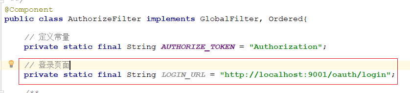
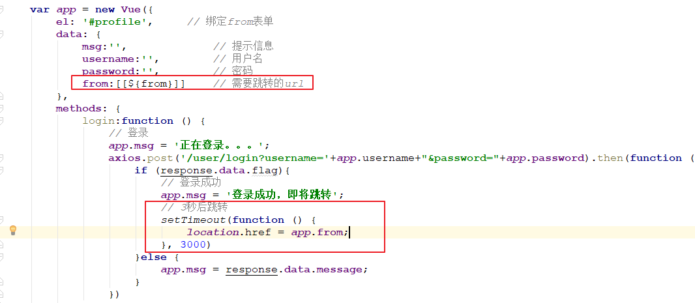
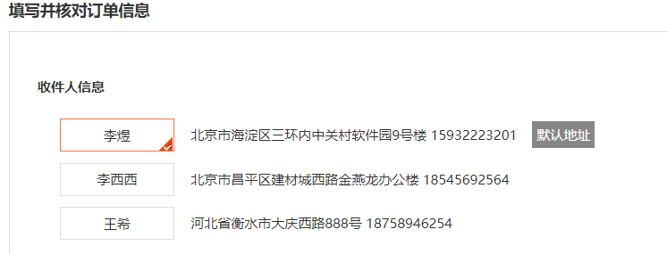

# 第11章 订单

课程回顾：day08-day10内容


冷静。


学习目标

- 登录页的配置
- 登录成功跳转实现
- 结算页查询实现
- 下单实现（提交订单）
  - 变更库存
  - 增加积分
- 支付流程介绍
- 微信扫码支付介绍


# 1 登录页面配置

前面使用的都是采用Postman实现登录，接着我们实现一次oauth自定义登录。


## 1.1 准备工作

### 1.1.1 静态资源导入

将`资料/页面/前端`登录相关的静态资源导入到changgou-user-oauth中,如下图。

将**"./"** 换成**”/“**


### 1.1.2 引入thymeleaf

修改changgou-user-oauth，引入thymeleaf模板引擎


```xml
<!--thymeleaf-->
<dependency>
    <groupId>org.springframework.boot</groupId>
    <artifactId>spring-boot-starter-thymeleaf</artifactId>
</dependency>
```


### 1.1.3 编写登录控制器

修改changgou-user-oauth,编写一个控制器`com.changgou.oauth.controller.LoginRedirect`，实现登录页跳转，代码如下：


```java
@Controller
@RequestMapping("/oauth")
public class LoginRedirect {

    /**
     * @author 栗子
     * @Description 跳转用户登录页面
     * @Date 15:22 2019/8/24
     * @param
     * @return java.lang.String
     **/
    @GetMapping("/login")
    public String login(){
        return "login";
    }
}
```


### 1.1.4 登录配置放行

针对静态资源和登录页面，我们需要实现忽略安全配置，并且要指定登录页面。修改`com.changgou.oauth.config.WebSecurityConfig`的2个`configure`方法，代码如下：

进入Web权限配置类中


第1个`configure`配置:


第2个`configure`配置：


### 1.1.5 测试

访问地址：`<http://localhost:9001/oauth/login>`


## 1.2 登录实现

点击登录按钮，访问之前的登录方法实现登录，我们需要对登录页做一下调整。

### 1.2.1 引入thymeleaf命名空间

修改login.html，引入命名空间


~~~html
<html xmlns:th="http://www.thymeleaf.org">
~~~


### 1.2.2 登录脚本

#### 1.2.2.1 引入js


```html
<script src="/js/vue.js"></script>
<script src="/js/axios.js"></script>
```


#### 1.2.2.2 登录表单修改


```html
<form class="sui-form">
    <div class="input-prepend"><span class="add-on loginname"></span>
        <input id="inputName" name="username" v-model="username" type="text" placeholder="邮箱/用户名/手机号" class="span2 input-xfat">
    </div>
    <div class="input-prepend"><span class="add-on loginpwd"></span>
        <input id="inputPassword" name="password" v-model="password" type="password" placeholder="请输入密码" class="span2 input-xfat">
    </div>
    <div class="setting">
        <label class="checkbox inline">
            <input name="m1" type="checkbox" value="2" checked="">
            自动登录
        </label>
        <span class="forget">忘记密码？</span>
    </div>
    <div class="logined">
        <div style="text-align: center;color: red">{{msg}}</div>
        <button @click="login()" type="button" class="sui-btn btn-block btn-xlarge btn-danger">登&nbsp;&nbsp;录</button>
    </div>
</form>
```


#### 1.2.2.3 编写登录脚本


~~~html
<!--登录实现-->
<script th:inline="javascript">

	var app = new Vue({
		el: '#profile',     // 绑定from表单
		data: {
		    msg:'',			// 提示信息
			username:'',	// 用户名
			password:''		// 密码
		},
		methods: {
		    login:function () {
                // 登录
                app.msg = '正在登录。。。';
                axios.post('/user/login?username='+app.username+"&password="+app.password).then(function (response) {
					if (response.data.flag){
					    // 登录成功
						app.msg = '登录成功，即将跳转';
					}else {
					    app.msg = response.data.message;
					}
                })
            }
		}
	})

</script>
~~~


#### 1.2.2.5 更新UserLoginController

由于前端需要通过判断flag来代表用户是否登录，因此我们需要修改响应的类型。


#### 1.2.2.6 测试


## 1.3 用户登录跳转

### 1.3.1 需求

用户没有登录的时候，我们直接访问购物车或者其他资源，需要跳转到登录页面。

请求地址：`<http://localhost:8001/api/user>`


### 1.3.2 跳转到登录页面

#### 1.3.2.1 修改全局过滤器

修改`网关服务`changgou-gateway-web的`全局过滤器AuthorizeFilter类`。用户如果为未登录我们可以将用户踢回到登录页面。



```java
 // 登录页面
private static final String LOGIN_URL = "http://localhost:9001/oauth/login";

```

再filter方法中修改内容


```java
// 3、如果没有token，不放行
if (StringUtils.isEmpty(token)) {
    //没取到token,不放行
    System.out.println("token is empty,please login");
    //现在:day11
    //用户没有登录,将用户踢回到登录页面
    //1.获取跳转登录页面的地址
    String path = request.getURI().toString();
    //2.拼接登录页面和跳转页面的地址
    String myUrl = LOGIN_URL + "?ReturnUrl=" + path;
    //3.设置状态值
    response.setStatusCode(HttpStatus.SEE_OTHER);
    //4.重定向转发
    response.getHeaders().add("Location",myUrl);
    //5.返回页面
    return response.setComplete();
    
    //之前直接返回401
    //设置响应状态码,401无效认证
    //response.setStatusCode(HttpStatus.UNAUTHORIZED);
    // 提交内容
    //return response.setComplete();
}
```


#### 1.3.2.2 测试

继续请求地址：`<http://localhost:8001/api/user>`


### 1.3.3 登录成功后跳转到访问前地址

用户登录成功后，要跳转到未登录前的地址。

#### 1.3.3.1 修改LoginRedirect


注意:model要这个包:import org.springframework.ui.Model;

```java
/**
     * @author wzw
     * 跳转用户登录页面
     * @Date 19:56 2020/12/31
     * @param ReturnUrl 跳转过来的页面路径(不一定会有,所以用:required = false)
     * @param model model域,返回给前端跳转
     * @return java.lang.String 登录页面路径
    **/
    @GetMapping("/login")
    public String login(@RequestParam(value = "ReturnUrl",required = false)String ReturnUrl, Model model){
        //将路径上的传过来的路径参数放到model域中:订单展示的页面路径
        model.addAttribute("ReturnUrl", ReturnUrl);
        //展示登录页面
        return "login";
    }
```

#### 1.3.3.2 修改登录页面



```html
//获取model中的路径 
from: [[${ReturnUrl}]]


 // 跳转页面
location.href = app.from;
```

#### 1.3.3.3 测试

访问地址：


登录结果：


# 2 订单结页

需求：商品加入购物车，点击【结算】按钮，跳转到提交订单的页面。


加载当前收件人的地址列表数据：根据username查询地址列表数据




加载当前用户的购物车列表数据：已完成（/cart/list）


## 2.1 收件地址分析

用户从购物车页面点击结算，跳转到订单结算页，结算页需要加载用户对应的收件地址，如下图：


表结构分析：

```sql
CREATE TABLE `tb_address` (
  `id` int(11) NOT NULL AUTO_INCREMENT,
  `username` varchar(50) DEFAULT NULL COMMENT '用户名',
  `provinceid` varchar(20) DEFAULT NULL COMMENT '省',
  `cityid` varchar(20) DEFAULT NULL COMMENT '市',
  `areaid` varchar(20) DEFAULT NULL COMMENT '县/区',
  `phone` varchar(20) DEFAULT NULL COMMENT '电话',
  `address` varchar(200) DEFAULT NULL COMMENT '详细地址',
  `contact` varchar(50) DEFAULT NULL COMMENT '联系人',
  `is_default` varchar(1) DEFAULT NULL COMMENT '是否是默认 1默认 0否',
  `alias` varchar(50) DEFAULT NULL COMMENT '别名',
  PRIMARY KEY (`id`)
) ENGINE=InnoDB AUTO_INCREMENT=66 DEFAULT CHARSET=utf8;
```

我们可以根据用户登录名去tb_address表中查询对应的数据。


## 2.2 实现用户收件地址查询

### 2.2.1 代码实现

#### 2.2.1.1 业务层

`业务层接口`

修改changgou-service-user微服务，需改com.changgou.user.service.AddressService接口，添加根据用户名字查询用户收件地址信息，代码如下：


```java
/**
     * @author 栗子
     * @Description 获取当前登录人的收货地址
     * @Date 17:43 2019/8/24
     * @param username
     * @return java.util.List<com.changgou.user.pojo.Address>
     **/
    List<Address> list(String username);
```


`业务层接口实现类`

修改changgou-service-user微服务，修改com.changgou.user.service.impl.AddressServiceImpl类，添加根据用户查询用户收件地址信息实现方法，如下代码：

```java
/**
 * @author wzw
 * 获取当前登录人的收货地址
 * @Date 21:46 2020/12/31
 * @param username 登录人账号
 * @return java.util.List<com.changgou.user.pojo.Address>
**/
@Override
public List<Address> findUserAddressList(String username) {
    //封装条件
    Address address = new Address();
    //条件1:登录人账号
    address.setUsername(username);
    //查询
    List<Address> addressList = addressMapper.select(address);
    //返回结果集
    return addressList;
}
```


#### 2.2.1.3 控制层

`修改changgou-service-user微服务`，修改com.changgou.user.controller.AddressController，添加根据用户名查询用户收件信息方法，代码如下：


```java
//注入service
@Autowired
private AddressService addressService;

/**
 * @author wzw
 * 获取当前登录人的收货地址
 * @Date 21:40 2020/12/31
 * @param
 * @return entity.Result
**/
@RequestMapping("/user/list")
public Result findUserAddUserInfo(){
    //获取token中的用户名
    String username = TokenDecode.getUserInfo().get("username");
    //实现功能:根据用户名查询收获地址详情
    List<Address> list = addressService.findUserAddressList(username);
    //返回结果集
    return new Result(true, StatusCode.OK, "查询收货地址列表成功", list);
}
```


### 2.2.2 测试

访问` <http://localhost:8001/api/address/user/list>`


## 2.2 运送清单


运送清单其实就是购物车列表，直接查询之前的购物车列表即可，这里不做说明了。


# 3 下单

需求：提交订单（保存订单以及订单明细）


## 3.1 业务分析

点击结算页的时候，会立即创建订单数据，创建订单数据会将数据存入到2张表中，分别是订单表和订单明细表，此处还需要修改商品对应的库存数量。


订单表结构如下：

```sql
CREATE TABLE `tb_order` (
  `id` varchar(50) COLLATE utf8_bin NOT NULL COMMENT '订单id',
  `total_num` int(11) DEFAULT NULL COMMENT '数量合计',
  `total_money` int(11) DEFAULT NULL COMMENT '金额合计',
  `pre_money` int(11) DEFAULT NULL COMMENT '优惠金额',
  `post_fee` int(11) DEFAULT NULL COMMENT '邮费',
  `pay_money` int(11) DEFAULT NULL COMMENT '实付金额',
  `pay_type` varchar(1) COLLATE utf8_bin DEFAULT NULL COMMENT '支付类型，1、在线支付、0 货到付款',
  `create_time` datetime DEFAULT NULL COMMENT '订单创建时间',
  `update_time` datetime DEFAULT NULL COMMENT '订单更新时间',
  `pay_time` datetime DEFAULT NULL COMMENT '付款时间',
  `consign_time` datetime DEFAULT NULL COMMENT '发货时间',
  `end_time` datetime DEFAULT NULL COMMENT '交易完成时间',
  `close_time` datetime DEFAULT NULL COMMENT '交易关闭时间',
  `shipping_name` varchar(20) COLLATE utf8_bin DEFAULT NULL COMMENT '物流名称',
  `shipping_code` varchar(20) COLLATE utf8_bin DEFAULT NULL COMMENT '物流单号',
  `username` varchar(50) COLLATE utf8_bin DEFAULT NULL COMMENT '用户名称',
  `buyer_message` varchar(1000) COLLATE utf8_bin DEFAULT NULL COMMENT '买家留言',
  `buyer_rate` char(1) COLLATE utf8_bin DEFAULT NULL COMMENT '是否评价',
  `receiver_contact` varchar(50) COLLATE utf8_bin DEFAULT NULL COMMENT '收货人',
  `receiver_mobile` varchar(12) COLLATE utf8_bin DEFAULT NULL COMMENT '收货人手机',
  `receiver_address` varchar(200) COLLATE utf8_bin DEFAULT NULL COMMENT '收货人地址',
  `source_type` char(1) COLLATE utf8_bin DEFAULT NULL COMMENT '订单来源：1:web，2：app，3：微信公众号，4：微信小程序  5 H5手机页面',
  `transaction_id` varchar(30) COLLATE utf8_bin DEFAULT NULL COMMENT '交易流水号',
  `order_status` char(1) COLLATE utf8_bin DEFAULT NULL COMMENT '订单状态,0:未完成,1:已完成，2：已退货',
  `pay_status` char(1) COLLATE utf8_bin DEFAULT NULL COMMENT '支付状态,0:未支付，1：已支付，2：支付失败',
  `consign_status` char(1) COLLATE utf8_bin DEFAULT NULL COMMENT '发货状态,0:未发货，1：已发货，2：已收货',
  `is_delete` char(1) COLLATE utf8_bin DEFAULT NULL COMMENT '是否删除',
  PRIMARY KEY (`id`),
  KEY `create_time` (`create_time`),
  KEY `status` (`order_status`),
  KEY `payment_type` (`pay_type`)
) ENGINE=InnoDB DEFAULT CHARSET=utf8 COLLATE=utf8_bin;
```

订单明细表结构如下：

```sql
CREATE TABLE `tb_order_item` (
  `id` varchar(50) COLLATE utf8_bin NOT NULL COMMENT 'ID',
  `category_id1` int(11) DEFAULT NULL COMMENT '1级分类',
  `category_id2` int(11) DEFAULT NULL COMMENT '2级分类',
  `category_id3` int(11) DEFAULT NULL COMMENT '3级分类',
  `spu_id` varchar(20) COLLATE utf8_bin DEFAULT NULL COMMENT 'SPU_ID',
  `sku_id` bigint(20) NOT NULL COMMENT 'SKU_ID',
  `order_id` bigint(20) NOT NULL COMMENT '订单ID',
  `name` varchar(200) COLLATE utf8_bin DEFAULT NULL COMMENT '商品名称',
  `price` int(20) DEFAULT NULL COMMENT '单价',
  `num` int(10) DEFAULT NULL COMMENT '数量',
  `money` int(20) DEFAULT NULL COMMENT '总金额',
  `pay_money` int(11) DEFAULT NULL COMMENT '实付金额',
  `image` varchar(200) COLLATE utf8_bin DEFAULT NULL COMMENT '图片地址',
  `weight` int(11) DEFAULT NULL COMMENT '重量',
  `post_fee` int(11) DEFAULT NULL COMMENT '运费',
  `is_return` char(1) COLLATE utf8_bin DEFAULT NULL COMMENT '是否退货,0:未退货，1：已退货',
  PRIMARY KEY (`id`),
  KEY `item_id` (`sku_id`),
  KEY `order_id` (`order_id`)
) ENGINE=InnoDB DEFAULT CHARSET=utf8 COLLATE=utf8_bin;
```


## 3.2 下单实现

* 下单的时候，先添加订单往tb_order表中增加数据，再添加订单明细，往tb_order_item表中增加数据。
* 下面的Controller修改的位置


### 3.2.1 代码实现

这里先修改changgou-service-order微服务，实现下单操作，这里会生成订单号，我们首先需要在启动类中创建一个IdWorker对象。

#### 3.2.1.1 管理IdWorker

在`com.changgou.OrderApplication`中创建IdWorker，代码如下：


```java
@Bean
public IdWorker idWorker(){
    return new IdWorker(1,1);
}
```


#### 3.2.1.2 业务层

changgou-service-order微服务，修改com.changgou.order.service.impl.OrderServiceImpl的add方法,代码如下：

```java
@Service
public class OrderServiceImpl implements OrderService {

    //订单Mapping
    @Autowired
    private OrderMapper orderMapper;

    //购物车service
    @Autowired
    private CartService cartService;

    //生成id
    @Autowired
    private IdWorker idWorker;

    //订单明细Mapping
    @Autowired
    private OrderItemMapper orderItemMapper;

    @Autowired
    private RedisTemplate redisTemplate;


    /**
     * 增加Order
     *
     * @param order
     */
    @Override
    public void add(Order order) {
        //1.获取购物车信息
        List<OrderItem> orderItems = cartService.list(order.getUsername());
        //2.保存订单
        //2.1生成订单id
        String orderId = String.valueOf(idWorker.nextId());
        //2.2设置商品总数量,总金额,实际支付金额,
        int totalNum = 0;       // 商品总数量
        int totalMoney = 0;     // 商品总金额
        int totalPayMoney = 0;  // 商品实际支付金额
        //从购物车中获取以下参数,因为是都不是固定的所以要循环累计算
        for (OrderItem orderItem : orderItems) {
            totalNum += orderItem.getNum();  //数量
            totalMoney += orderItem.getMoney(); //金额
            totalPayMoney += orderItem.getPayMoney(); //实付金额
        }
        //2.3封装参数到Order中
        //封装订单id
        order.setId(orderId);
        //封装总数量
        order.setTotalNum(totalNum);
        //封装总金额
        order.setTotalMoney(totalMoney);
        //封装实付金额
        order.setPayMoney(totalPayMoney);
        //封装计算优惠金额
        order.setPreMoney(totalMoney - totalPayMoney);
        //封装下单时间
        order.setCreateTime(new Date());
        //封装修改订单时间
        order.setUpdateTime(new Date());
        //封装是否评价:0未评价  1:已评价
        order.setSourceType("0");
        //封装订单来源
        order.setOrderStatus("0");
        //封装订单状态
        order.setOrderStatus("0");
        //封装订单支付状态
        order.setPayStatus("0");
        //封装订单是否发货
        order.setPayStatus("0");
        //3.实现功能:保存订单
        orderMapper.insertSelective(order);

        //4.保存订单明细
        for (OrderItem orderItem : orderItems) {
            //封装生成的订单明细id
            orderItem.setId(String.valueOf(idWorker.nextId()));
            //封装订单id
            orderItem.setOrderId(order.getId());
            //实现功能:添加订单明细
            orderItemMapper.insertSelective(orderItem);
        }
        
        //TODO 扣减库存
        //TODO 增加积分

        //5.删除购物车[清空购物车]
        redisTemplate.delete("cart_" + order.getUsername());
        //删除指定商品
        //redisTemplate.boundHashOps("cart_" + order.getUsername()).delete(order.getId());
    }
}
```


#### 3.2.1.3 控制层

`修改changgou-service-order微服务`，修改com.changgou.order.controller.OrderController类


代码如下：

```java
@Autowired
private TokenDecode tokenDecode;

/***
     * 新增Order数据
     * @param order
     * @return
     */
@PostMapping
public Result add(@RequestBody Order order){
    // 从token中获取当前登录的用户信息
    String username = TokenDecode.getUserInfo().get("username");
    //添加当前登录人的账号
    order.setUsername(username);
    //调用OrderService实现添加Order
    orderService.add(order);
    //返回结果
    return new Result(true,StatusCode.OK,"添加成功");
}
```


### 3.2.2 测试

开启的服务


PS：温馨提示，需要登录哦。`<http://localhost:9001/user/login>`


加入购物车`<http://localhost:8001/api/cart/add?sku_id=1148477873175142400&num=2>`


Redis购物车数据


请求地址：`<http://localhost:8001/api/order>`

~~~properties
{
	"payType":"1",
	"receiverContact":"张三",
	"receiverMobile":"18066667777",
	"receiverAddress":"中国北京",
	"sourceType":"1"
}
~~~


保存订单测试，表数据变化如下：

Redis中的购物车被清理了


tb_order表数据：


tb_order_item表数据：


# 4 库存变更


## 4.1 业务分析

上面操作只实现了下单操作，但对应的库存还没跟着一起减少，我们在下单之后，应该调用商品微服务，将下单的商品库存减少，销量增加。每次订单微服务只需要将用户名传到商品微服务，商品微服务通过用户名到Redis中查询对应的购物车数据，然后执行库存减少，库存减少需要控制当前商品库存>=销售数量。


如何控制库存数量>=销售数量呢？其实可以通过SQL语句实现，每次减少数量的时候，加个条件判断。

`where num>=#{num}`即可。

## 4.2 代码实现

### 4.2.1 修改商品微服务工程

编写递减库存方法。

添加依赖：`在changgou-service-goods工程`中添加依赖 

~~~xml
<!--订单的API-->
<dependency>
    <groupId>com.changgou</groupId>
    <artifactId>changgou-service-order-api</artifactId>
    <version>1.0-SNAPSHOT</version>
</dependency>
~~~


#### 4.2.1.1 编写SkuMapper


~~~java
public interface SkuMapper extends Mapper<Sku> {

    /**
     * @author 栗子
     * @Description 更新库存，防止超卖
     * @Date 23:04 2019/8/24
     * @param id 购买的商品id
     * @param num 购买的数量
     * @return int
     **/
    @Update("update tb_sku set num=num-#{num} where id=#{id} and num>#{num}")
    int decrCount(@Param("id") Long id, @Param("num") Integer num);
}
~~~


#### 4.2.1.2 编写SkuService

SkuService接口：

~~~java
/**
     * @author 栗子 
     * @Description 削减库存
     * @Date 23:05 2019/8/24
     * @param username 账号
     * @return void
     **/
    void decrCount(String username);
~~~


SkuServiceImpl实现类：

~~~java
//注入Redis模板
@Autowired
private RedisTemplate redisTemplate;

/**
 * @author wzw
 * 扣减库存
 * @Date 19:56 2021/1/1
 * @param username 登录人账号
 * @return void
 **/
@Override
public void decrCount(String username) {
    //获取购物车的总数量
    List<OrderItem> orderItems = redisTemplate.boundHashOps("cart_" + username).values();
    //对购物车判空
    if (orderItems != null && orderItems.size() > 0) {
        //有商品,循环取出购物车的各个商品
        for (OrderItem orderItem : orderItems) {
            //实现功能:根据购物车中商品的id和数量实现扣减库存
            int decrCount = skuMapper.decrCount(orderItem.getSkuId(), orderItem.getNum());
            //如果返回的没有小于等于0,那就是数据库修改操作没有执行成功
            // 唯一的可能就是数据库的库存不够了
            if (decrCount <= 0) {
                //直接抛一个异常
                new RuntimeException("超卖了....");
            }
        }
    }
}
~~~


#### 4.2.1.3 编写SkuController

在service-goods工程的`SkuController类`中添加方法：

~~~java
/**
     * @author 栗子 
     * @Description 减库存操作
     * @Date 1:27 2019/8/25
     * @param username
     * @return entity.Result
     **/
    @GetMapping("/decr/{username}")
    public Result decr(@PathVariable(value = "username", required = true) String username){
        //实现功能:扣减库存
        skuService.decrCount(username);
        //返回结果
        return new Result(true, StatusCode.OK, "扣库存成功");
    }
~~~


#### 4.2.1.4 编写SkuFeigncc

`在changgou-service-goods-api工程`的SkuFeign中添加方法：


~~~java
/**
     * @author 栗子
     * @Description 减库存操作
     * @Date 1:28 2019/8/25
     * @param username
     * @return entity.Result
     **/
    @GetMapping("/decr/{username}")
    Result decr(@PathVariable(value = "username", required = true) String username);
~~~


#### 4.2.1.5的application.yml文件

 `在service-goods工程`文件中需要连接redis


```yml
spring:
  redis:
    host: 192.168.211.132
    port: 6379
```


### 4.2.2 修改订单微服务工程

`修改changgou-service-order模块`中的com\changgou\order\service\impl\OrderServiceImpl实现类


`在add()方法中`添加以下内容


```java
//注入sku的Feign
@Autowired
private SkuFeign skuFeign;


//TODO 扣减库存
skuFeign.decr(order.getUsername());
        
```


## 4.3 测试

开启的服务


库存减少前，查询数据库Sku数据如下：个数98，销量0


`<http://localhost:18089/cart/add?id=1148478054150971392&num=6>`

Authorization 


使用Postman执行 http://localhost:18081/api/order


执行测试后，剩余库存97，销量1


# 5 增加积分

比如每次下单完成之后，给用户增加10个积分，支付完成后赠送优惠券，优惠券可用于支付时再次抵扣。我们先完成增加积分功能。如下表：points表示用户积分

```sql
CREATE TABLE `tb_user` (
  `username` varchar(50) NOT NULL COMMENT '用户名',
  `password` varchar(100) NOT NULL COMMENT '密码，加密存储',
  `phone` varchar(20) DEFAULT NULL COMMENT '注册手机号',
  `email` varchar(50) DEFAULT NULL COMMENT '注册邮箱',
  `created` datetime NOT NULL COMMENT '创建时间',
  `updated` datetime NOT NULL COMMENT '修改时间',
  `source_type` varchar(1) DEFAULT NULL COMMENT '会员来源：1:PC，2：H5，3：Android，4：IOS',
  `nick_name` varchar(50) DEFAULT NULL COMMENT '昵称',
  `name` varchar(50) DEFAULT NULL COMMENT '真实姓名',
  `status` varchar(1) DEFAULT NULL COMMENT '使用状态（1正常 0非正常）',
  `head_pic` varchar(150) DEFAULT NULL COMMENT '头像地址',
  `qq` varchar(20) DEFAULT NULL COMMENT 'QQ号码',
  `is_mobile_check` varchar(1) DEFAULT '0' COMMENT '手机是否验证 （0否  1是）',
  `is_email_check` varchar(1) DEFAULT '0' COMMENT '邮箱是否检测（0否  1是）',
  `sex` varchar(1) DEFAULT '1' COMMENT '性别，1男，0女',
  `user_level` int(11) DEFAULT NULL COMMENT '会员等级',
  `points` int(11) DEFAULT NULL COMMENT '积分',
  `experience_value` int(11) DEFAULT NULL COMMENT '经验值',
  `birthday` datetime DEFAULT NULL COMMENT '出生年月日',
  `last_login_time` datetime DEFAULT NULL COMMENT '最后登录时间',
  PRIMARY KEY (`username`),
  UNIQUE KEY `username` (`username`) USING BTREE
) ENGINE=InnoDB DEFAULT CHARSET=utf8 COMMENT='用户表';
```


## 5.1 修改用户微服务工程

### 5.1.1 dao层

`修改changgou-service-user微服务`的`com.changgou.user.dao.UserMapper`接口，增加用户积分方法，代码如下：

```java
	/**
     * @author 栗子 
     * @Description 给用户添加积分
     * @Date 1:44 2019/8/25
     * @param username
     * @param point
     * @return int
     **/
    @Update("update tb_user set points = points+#{point} where username = #{username}")
    int addUserPoints(@Param("username") String username, @Param("point") Integer point);
```


### 5.1.2 业务层

`修改changgou-service-user微服务`的`com.changgou.user.service.UserService`接口，代码如下：

```java
/**
 * @author wzw
 * 添加用户积分
 * @Date 23:22 2021/1/1
 * @param username 添加的账号
 * @param point 添加的积分数
 * @return void
**/
void addUserPoints(String username, Integer point);
```

修改changgou-service-user微服务的`com.changgou.user.service.impl.UserServiceImpl`，增加添加积分方法实现，代码如下：

```java
/**
 * @author wzw
 * 给用户添加积分
 * @Date 23:07 2021/1/1
 * @param username 添加的账号
 * @param point 添加的积分数
 * @return entity.Result
 **/
@Override
public void addUserPoints(String username, Integer point) {
    userMapper.addUserPoints(username,point);
}
```


### 5.1.3 控制层

`修改changgou-service-user微服务`的`com.changgou.user.controller.UserController`，添加增加用户积分方法，代码如下：

```java
/**
 * @author wzw
 * 给用户添加积分
 * @Date 23:07 2021/1/1
 * @param username 添加的账号
 * @param point 添加的积分数
 * @return entity.Result
 **/
@GetMapping("/userinfo/{username}/{points}")
public Result points(@PathVariable(value = "username") String username,
                     @PathVariable(value = "point") Integer point){

    //添加积分
    userService.addUserPoints(username, point);
    //返回结果
    return new Result(true,StatusCode.OK,"添加积分成功！");
}
```


### 5.1.4 Feign添加

`修改changgou-service-user-api工程`，

修改`com.changgou.user.feign.UserFeign`，

`添加增加用户积分方法`，代码如下：

```java
/**
 * @author wzw
 * 给用户添加积分
 * @Date 23:07 2021/1/1
 * @param username 添加的账号
 * @param point 添加的积分数
 * @return entity.Result
 **/
@GetMapping("/userinfo/{username}/{point}")
Result points(@PathVariable(value = "username")String username,@PathVariable(value = "point") Integer point);
```


## 5.2 增加积分调用

`修改changgou-service-order工程`，添加changgou-service-user-api的依赖，修改pom.xml,添加如下依赖：

```xml
<!--user api 依赖-->
<dependency>
    <groupId>com.changgou</groupId>
    <artifactId>changgou-service-user-api</artifactId>
    <version>1.0-SNAPSHOT</version>
</dependency>
```


在增加订单的时候，同时添加用户积分，`修改changgou-service-order微服务`的`com.changgou.order.service.impl.OrderServiceImpl`下单方法，增加调用添加积分方法，代码如下：


```java
//增加积分
userFeign.points(order.getUsername(), 10);
```


`修改changgou-service-order的启动类`com.changgou.OrderApplication，添加feign的包路径：


```java
//设置user和goods是feign
@EnableFeignClients(basePackages = {"com.changgou.goods.feign","com.changgou.user.feign"})
```


# 6 支付流程分析

## 6.1 订单支付分析


如上图，步骤分析如下：

```properties
1.用户下单之后，订单数据会存入到MySQL中，同时会将订单对应的支付日志存入到Redis，以队列的方式存储。
2.用户下单后，进入支付页面，支付页面调用支付系统，从微信支付获取二维码数据，并在页面生成支付二维码。
3.用户扫码支付后，微信支付服务器会通调用前预留的回调地址，并携带支付状态信息。
4.支付系统接到支付状态信息后，将支付状态信息发送给RabbitMQ
5.订单系统监听RabbitMQ中的消息获取支付状态，并根据支付状态修改订单状态
6.为了防止网络问题导致notifyurl没有接到对应数据，定时任务定时获取Redis中队列数据去微信支付接口查询状态，并定时更新对应状态。
```


## 6.2 二维码创建(了解)

条形码（一维码）：存储数据


二维码：存储数据

- 存储的数据更多（500个字符）
- 支持容错（H：30%）
- 它是一张图片：白底 + 黑点
- 扫描支付：发送一个（支付）请求---url地址

生成二维码：qrious插件（纯js实现的）。


光电扫描技术。


今天主要讲微信支付，后面为了看到效果，我们简单说下利用qrious制作二维码插件。

qrious是一款基于HTML5 Canvas的**纯JS二维码生成插件**。通过qrious.js可以快速生成各种二维码，你可以控制二维码的尺寸颜色，还可以将生成的二维码进行Base64编码。

qrious.js二维码插件的可用配置参数如下：

| 参数       | 类型   | 默认值      | 描述                               |
| ---------- | ------ | ----------- | ---------------------------------- |
| background | String | "white"     | 二维码的背景颜色。                 |
| foreground | String | "black"     | 二维码的前景颜色。                 |
| level      | String | "L"         | 二维码的误差校正级别(L, M, Q, H)。 |
| mime       | String | "image/png" | 二维码输出为图片时的MIME类型。     |
| size       | Number | 100         | 二维码的尺寸，单位像素。           |
| value      | String | ""          | 需要编码为二维码的值               |

下面的代码即可生成一张二维码

```html
<html>
<head>
<title>二维码入门小demo</title>
</head>
<body>

<script src="qrious.js"></script>
<script>
 var qr = new QRious({
	    element:document.getElementById('qrious'),
	    size:250, 	   
     	level:'H',	   
     	value:'http://www.itheima.com'
	});
</script>
</body>
</html>
```


运行效果：


大家掏出手机，扫一下看看是否会看到黑马的官网呢？


# 7 微信扫码支付简介

扫码支付：

- 做支付：必须得（政府）支付牌照（15年之前）

- 微信的支付产品：

  

- 调用第三方的支付系统（微信支付）----简单（接口调用）

  - 微信支付官方：提供接口文档。


准备：**接口文档**

- **请求方式（post）  +  请求地址**
- **请求参数**
- **响应的数据**


## 7.1微信扫码支付申请

微信扫码支付是商户系统按微信支付协议生成支付二维码，用户再用微信“扫一扫”完成支付的模式。该模式适用于PC网站支付、实体店单品或订单支付、媒体广告支付等场景。

申请步骤：（了解）

**第一步：注册公众号（类型须为：服务号）**

请根据营业执照类型选择以下主体注册：[个体工商户](http://kf.qq.com/faq/120911VrYVrA151009JB3i2Q.html)| [企业/公司](http://kf.qq.com/faq/120911VrYVrA151013MfYvYV.html)| [政府](http://kf.qq.com/faq/161220eaAJjE161220IJn6zU.html)| [媒体](http://kf.qq.com/faq/161220IFBJFv161220YnqAbQ.html)| [其他类型](http://kf.qq.com/faq/120911VrYVrA151013nYFZ7Z.html)。

**第二步：认证公众号**

公众号认证后才可申请微信支付，认证费：300元/次。

**第三步：提交资料申请微信支付**

登录公众平台，点击左侧菜单【微信支付】，开始填写资料等待审核，审核时间为1-5个工作日内。

**第四步：开户成功，登录商户平台进行验证**

资料审核通过后，请登录联系人邮箱查收商户号和密码，并登录商户平台填写财付通备付金打的小额资金数额，完成账户验证。

**第五步：在线签署协议**

本协议为线上电子协议，签署后方可进行交易及资金结算，签署完立即生效。

本课程已经提供好“传智播客”的微信支付账号，学员无需申请。


## 7.2 开发文档

微信支付接口调用的整体思路：

按API要求组装参数，以XML方式发送（POST）给微信支付接口（URL）,微信支付接口也是以XML方式给予响应。程序根据返回的结果（其中包括支付URL）生成二维码或判断订单状态。

在线微信支付开发文档：

<https://pay.weixin.qq.com/wiki/doc/api/index.html>

如果你不能联网，请查阅讲义配套资源 （资源\配套软件\微信扫码支付\开发文档）

我们在本章课程中会用到”统一下单”和”查询订单”两组API  

```properties
1. appid：微信公众账号或开放平台APP的唯一标识
2. mch_id：商户号  (配置文件中的partner)
3. partnerkey：商户密钥
4. sign:数字签名, 根据微信官方提供的密钥和一套算法生成的一个加密信息, 就是为了保证交易的安全性
```


## 7.3 微信支付模式介绍

### 7.3.1 模式一


业务流程说明：

```properties
1.商户后台系统根据微信支付规定格式生成二维码（规则见下文），展示给用户扫码。
2.用户打开微信“扫一扫”扫描二维码，微信客户端将扫码内容发送到微信支付系统。
3.微信支付系统收到客户端请求，发起对商户后台系统支付回调URL的调用。调用请求将带productid和用户的openid等参数，并要求商户系统返回交数据包,详细请见"本节3.1回调数据输入参数"
4.商户后台系统收到微信支付系统的回调请求，根据productid生成商户系统的订单。
5.商户系统调用微信支付【统一下单API】请求下单，获取交易会话标识（prepay_id）
6.微信支付系统根据商户系统的请求生成预支付交易，并返回交易会话标识（prepay_id）。
7.商户后台系统得到交易会话标识prepay_id（2小时内有效）。
8.商户后台系统将prepay_id返回给微信支付系统。返回数据见"本节3.2回调数据输出参数"
9.微信支付系统根据交易会话标识，发起用户端授权支付流程。
10.用户在微信客户端输入密码，确认支付后，微信客户端提交支付授权。
11.微信支付系统验证后扣款，完成支付交易。
12.微信支付系统完成支付交易后给微信客户端返回交易结果，并将交易结果通过短信、微信消息提示用户。微信客户端展示支付交易结果页面。
13.微信支付系统通过发送异步消息通知商户后台系统支付结果。商户后台系统需回复接收情况，通知微信后台系统不再发送该单的支付通知。
14.未收到支付通知的情况，商户后台系统调用【查询订单API】。
15.商户确认订单已支付后给用户发货。
```


### 7.3.2 模式二


业务流程说明：

```properties
1.商户后台系统根据用户选购的商品生成订单。
2.用户确认支付后调用微信支付【统一下单API】生成预支付交易；
3.微信支付系统收到请求后生成预支付交易单，并返回交易会话的二维码链接code_url。
4.商户后台系统根据返回的code_url生成二维码。
5.用户打开微信“扫一扫”扫描二维码，微信客户端将扫码内容发送到微信支付系统。
6.微信支付系统收到客户端请求，验证链接有效性后发起用户支付，要求用户授权。
7.用户在微信客户端输入密码，确认支付后，微信客户端提交授权。
8.微信支付系统根据用户授权完成支付交易。
9.微信支付系统完成支付交易后给微信客户端返回交易结果，并将交易结果通过短信、微信消息提示用户。微信客户端展示支付交易结果页面。
10.微信支付系统通过发送异步消息通知商户后台系统支付结果。商户后台系统需回复接收情况，通知微信后台系统不再发送该单的支付通知。
11.未收到支付通知的情况，商户后台系统调用【查询订单API】。
12.商户确认订单已支付后给用户发货。
```

