# 第12章 微信支付

课程回顾：

1、登录--->前端（客户端）

- 跳转到登录页面：编写controller（注解：@Controller）返回逻辑视图地址即可。
- 完成登录按钮的事件操作：通过Vue完成的点击事件。
- 对受保护的资源需要进行认证：例如，访问用户个人中心（用户列表）
  - 直接访问这些资源，踢到登录页面（特点：需要携带登录前的地址）
  - 登录成功后，再跳转到之前的地址

2、加载当前收件人的地址列表

- 根据username查询

3、提交订单

- 创建订单
  - 订单表以及订单明细表
    - 订单表：略
    - 订单明细表：id、order_id、is_return、num、【sku_id、spu_id、name、price....】
      - 快照（牌照，定格这一瞬间你的详细信息）
      - 这些字段不能通过sku_id字段代替（动态查询数据）
        - 库存数据会有变化，不能动态查询（节假日：降级活动）
        - 前台系统：不允许有关联查询。
      - 前台系统：有多张表查询，也不会进行关联查询--->hive（成本低：hql--->mysql语法接近）/hbase      大数据平台
  - 提交订单代码：略。
- 扣减库存
  - 更新库存数量
- 增加用户积分
  - 更新用户积分数量

4、引入新问题：分布式事务。


学习目标：支付。

- 能够说出微信支付开发的整体思路
- 生成支付二维码
  - value：支付链接（微信）
- 支付成功，微信会进行回调
  - 查询支付状态
- 支付成功/失败，更新订单信息信息。


# 1 开发准备

微信支付的产品：native支付（微信扫一扫）

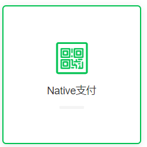

接口文档：包含内容

- **请求方式  +  请求地址**
- **请求参数**
  - eg：{“name”:"tom", "age":18}
- **返回的数据**
  - eg：{“flag”:true, "msg":"保存成功"}

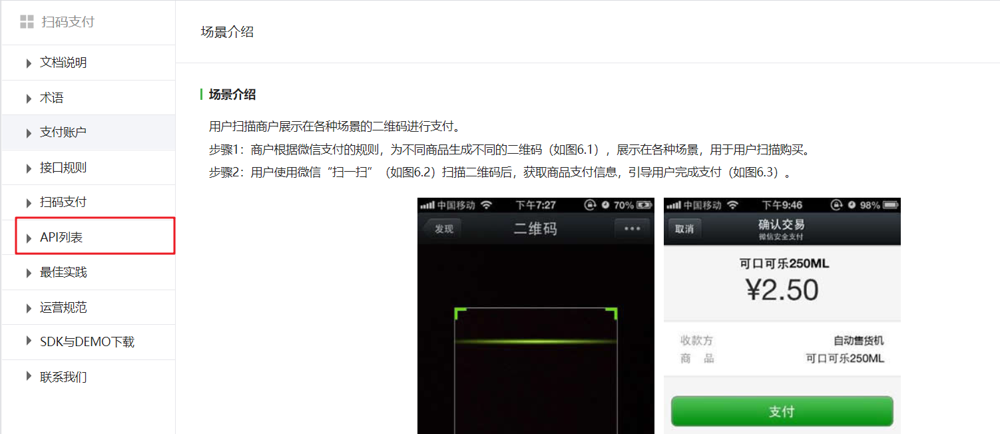


微信支付开发流程：

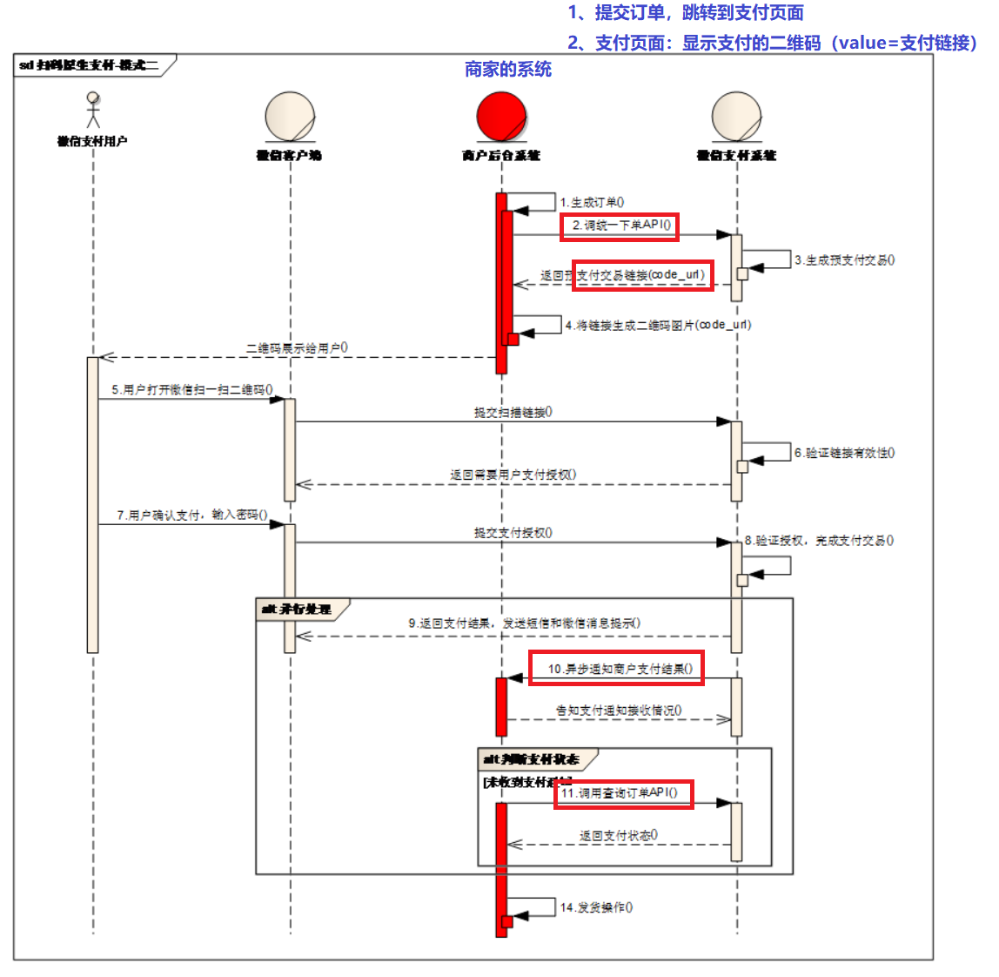

通过阅读支付流程，在我们的系统中，需要调用的api

1、统一下单api

- 目的：生成支付链接

2、查询订单api（无法接到微信通知结果前提）

- 判断是否支付成功


## 1.1 开发文档

微信支付接口调用的整体思路：

按API要求组装参数，以XML方式发送（POST）给微信支付接口（URL）,微信支付接口也是以XML方式给予响应。程序根据返回的结果（其中包括支付URL）生成二维码或判断订单状态。

在线微信支付开发文档：

<https://pay.weixin.qq.com/wiki/doc/api/index.html>

如果你不能联网，请查阅讲义配套资源 （资源\配套软件\微信扫码支付\开发文档）

我们在本章课程中会用到”统一下单”和”查询订单”两组API  

 ```properties
1. appid：微信公众账号或开放平台APP的唯一标识
2. mch_id：商户号  (配置文件中的partner)
3. partnerkey：商户密钥
4. sign:数字签名, 根据微信官方提供的密钥和一套算法生成的一个加密信息, 就是为了保证交易的安全性
 ```


## 1.2 微信支付模式回顾

**模式二**

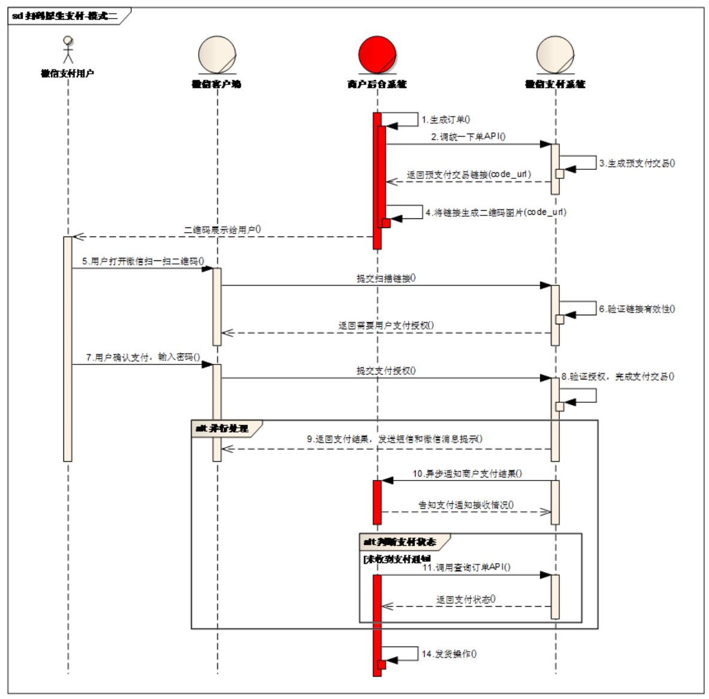

业务流程说明：

```properties
1.商户后台系统根据用户选购的商品生成订单。
2.用户确认支付后调用微信支付【统一下单API】生成预支付交易；
3.微信支付系统收到请求后生成预支付交易单，并返回交易会话的二维码链接code_url。
4.商户后台系统根据返回的code_url生成二维码。
5.用户打开微信“扫一扫”扫描二维码，微信客户端将扫码内容发送到微信支付系统。
6.微信支付系统收到客户端请求，验证链接有效性后发起用户支付，要求用户授权。
7.用户在微信客户端输入密码，确认支付后，微信客户端提交授权。
8.微信支付系统根据用户授权完成支付交易。
9.微信支付系统完成支付交易后给微信客户端返回交易结果，并将交易结果通过短信、微信消息提示用户。微信客户端展示支付交易结果页面。
10.微信支付系统通过发送异步消息通知商户后台系统支付结果。商户后台系统需回复接收情况，通知微信后台系统不再发送该单的支付通知。
11.未收到支付通知的情况，商户后台系统调用【查询订单API】。
12.商户确认订单已支付后给用户发货。
```


## 1.3 微信支付SDK

微信支付提供了SDK, 大家下载后打开源码，install到本地仓库。

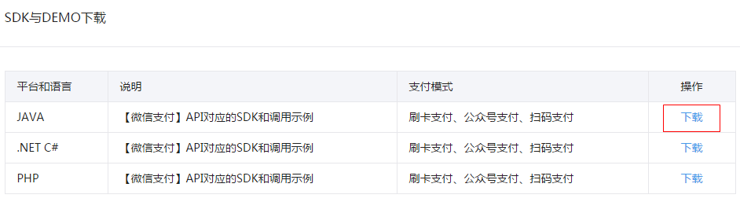


课程配套的本地仓库已经提供jar包，所以安装SDK步骤省略。

使用微信支付SDK,在maven工程中引入依赖

我们主要会用到微信支付SDK的以下功能：

获取随机字符串

```java
WXPayUtil.generateNonceStr()
```

MAP转换为XML字符串（自动添加签名）

```java
 WXPayUtil.generateSignedXml(param, partnerkey)
```

XML字符串转换为MAP

```java
WXPayUtil.xmlToMap(result)
```


为了方便微信支付开发，我们可以在`changgou-common`工程下引入依赖

```xml
<!--微信支付-->
<dependency>
    <groupId>com.github.wxpay</groupId>
    <artifactId>wxpay-sdk</artifactId>
    <version>0.0.3</version>
</dependency>
```


## 1.4 HttpClient工具类

HttpClient是Apache Jakarta Common下的子项目，用来提供高效的、最新的、功能丰富的支持HTTP协议的客户端编程工具包，并且它支持HTTP协议最新的版本和建议。HttpClient已经应用在很多的项目中，比如Apache Jakarta上很著名的另外两个开源项目Cactus和HTMLUnit都使用了HttpClient。

HttpClient通俗的讲就是模拟了浏览器的行为，如果我们需要在后端向某一地址提交数据获取结果，就可以使用HttpClient.

关于HttpClient（原生）具体的使用不属于我们本章的学习内容，我们这里这里为了简化HttpClient的使用，提供了工具类HttpClient（对原生HttpClient进行了封装）

HttpClient工具类代码：

```java
public class HttpClient {
    private String url;
    private Map<String, String> param;
    private int statusCode;
    private String content;
    private String xmlParam;
    private boolean isHttps;

    public boolean isHttps() {
        return isHttps;
    }

    public void setHttps(boolean isHttps) {
        this.isHttps = isHttps;
    }

    public String getXmlParam() {
        return xmlParam;
    }

    public void setXmlParam(String xmlParam) {
        this.xmlParam = xmlParam;
    }

    public HttpClient(String url, Map<String, String> param) {
        this.url = url;
        this.param = param;
    }

    public HttpClient(String url) {
        this.url = url;
    }

    public void setParameter(Map<String, String> map) {
        param = map;
    }

    public void addParameter(String key, String value) {
        if (param == null)
            param = new HashMap<String, String>();
        param.put(key, value);
    }

    public void post() throws ClientProtocolException, IOException {
        HttpPost http = new HttpPost(url);
        setEntity(http);
        execute(http);
    }

    public void put() throws ClientProtocolException, IOException {
        HttpPut http = new HttpPut(url);
        setEntity(http);
        execute(http);
    }

    public void get() throws ClientProtocolException, IOException {
        if (param != null) {
            StringBuilder url = new StringBuilder(this.url);
            boolean isFirst = true;
            for (String key : param.keySet()) {
                if (isFirst) {
                    url.append("?");
                }else {
                    url.append("&");
                }
                url.append(key).append("=").append(param.get(key));
            }
            this.url = url.toString();
        }
        HttpGet http = new HttpGet(url);
        execute(http);
    }

    /**
     * set http post,put param
     */
    private void setEntity(HttpEntityEnclosingRequestBase http) {
        if (param != null) {
            List<NameValuePair> nvps = new LinkedList<NameValuePair>();
            for (String key : param.keySet()) {
                nvps.add(new BasicNameValuePair(key, param.get(key))); // 参数
            }
            http.setEntity(new UrlEncodedFormEntity(nvps, Consts.UTF_8)); // 设置参数
        }
        if (xmlParam != null) {
            http.setEntity(new StringEntity(xmlParam, Consts.UTF_8));
        }
    }

    private void execute(HttpUriRequest http) throws ClientProtocolException,
            IOException {
        CloseableHttpClient httpClient = null;
        try {
            if (isHttps) {
                SSLContext sslContext = new SSLContextBuilder()
                        .loadTrustMaterial(null, new TrustStrategy() {
                            // 信任所有
                            @Override
                            public boolean isTrusted(X509Certificate[] chain,
                                                     String authType)
                                    throws CertificateException {
                                return true;
                            }
                        }).build();
                SSLConnectionSocketFactory sslsf = new SSLConnectionSocketFactory(
                        sslContext);
                httpClient = HttpClients.custom().setSSLSocketFactory(sslsf)
                        .build();
            } else {
                httpClient = HttpClients.createDefault();
            }
            CloseableHttpResponse response = httpClient.execute(http);
            try {
                if (response != null) {
                    if (response.getStatusLine() != null) {
                        statusCode = response.getStatusLine().getStatusCode();
                    }
                    HttpEntity entity = response.getEntity();
                    // 响应内容
                    content = EntityUtils.toString(entity, Consts.UTF_8);
                }
            } finally {
                response.close();
            }
        } catch (Exception e) {
            e.printStackTrace();
        } finally {
            httpClient.close();
        }
    }

    public int getStatusCode() {
        return statusCode;
    }

    public String getContent() throws ParseException, IOException {
        return content;
    }
}
```


HttpClient工具类使用的步骤

```java
HttpClient client=new HttpClient(请求的url地址);
client.setHttps(true);//是否是https协议
client.setXmlParam(xmlParam);//发送的xml数据
client.post();//执行post请求
String result = client.getContent(); //获取结果
```


将HttpClient工具包放到common工程下并引入依赖，引入依赖后就可以直接使用上述的工具包了。

```xml
<!--httpclient支持-->
<dependency>
    <groupId>org.apache.httpcomponents</groupId>
    <artifactId>httpclient</artifactId>
</dependency>
```


## 1.5 支付微服务搭建

### 1.5.1 创建changgou-service-pay工程

创建支付微服务changgou-service-pay，只要实现支付相关操作（无需创建api工程）。

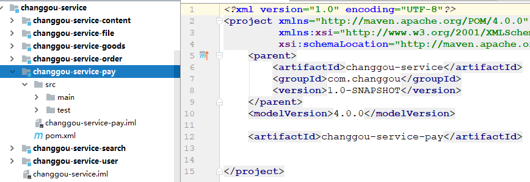

### 1.5.2 编写application.yml

创建application.yml，配置文件如下：

```properties
server:
  port: 18090
spring:
  application:
    name: pay
  main:
    allow-bean-definition-overriding: true
eureka:
  client:
    service-url:
      defaultZone: http://127.0.0.1:7001/eureka
  instance:
    prefer-ip-address: true
feign:
  hystrix:
    enabled: true
#hystrix 配置
hystrix:
  command:
    default:
      execution:
        timeout:
        #如果enabled设置为false，则请求超时交给ribbon控制
          enabled: true
        isolation:
          strategy: SEMAPHORE

#微信支付信息配置
weixin:
  #微信公众账号或开放平台APP的唯一标识
  appid: wx8397f8696b538317
  #财付通平台的商户账号
  partner: 1473426802
  #财付通平台的商户密钥
  partnerkey: T6m9iK73b0kn9g5v426MKfHQH7X8rKwb
  #回调地址
  notifyurl: http://www.itcast.cn
```

appid： 微信公众账号或开放平台APP的唯一标识

partner：财付通平台的商户账号

partnerkey：财付通平台的商户密钥

notifyurl:  回调地址


### 1.5.3 启动类创建

在`changgou-service-pay`中创建`com.changgou.WeiXinPayApplication`，代码如下：

```java
@SpringBootApplication(exclude={DataSourceAutoConfiguration.class})
@EnableEurekaClient
public class WeiXinPayApplication {

    public static void main(String[] args) {
        SpringApplication.run(WeiXinPayApplication.class,args);
    }
}
```


# 2 微信支付二维码生成

## 2.1 需求分析与实现思路

需求：生成支付二维码（支付链接）

1、提交订单，跳转到支付页面

2、通过微信扫码支付（二维码）

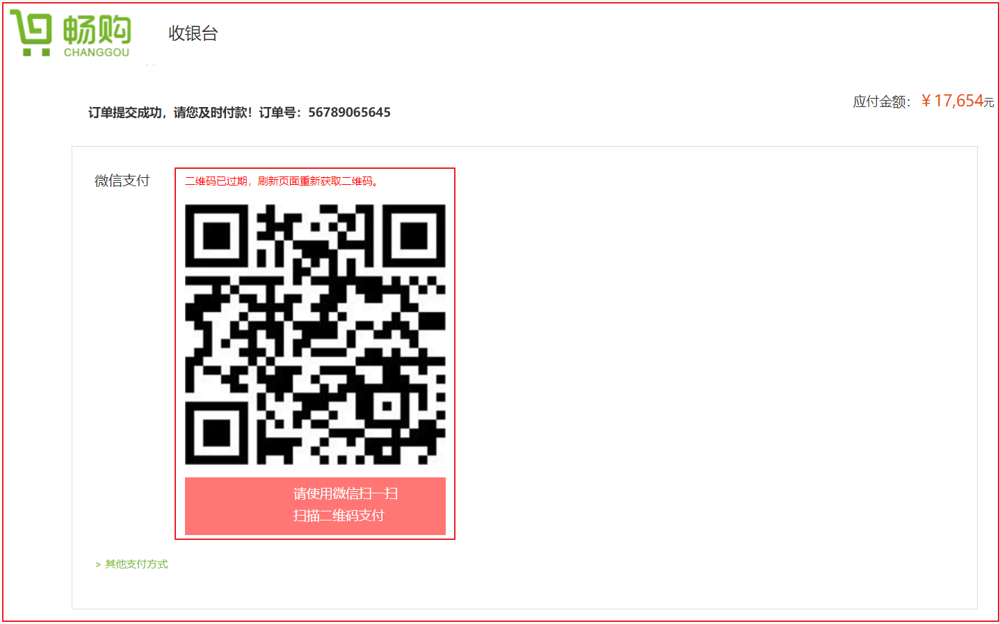


## 2.2 实现思路

我们通过HttpClient工具类实现对远程支付接口的调用。

接口链接：https://api.mch.weixin.qq.com/pay/unifiedorder

具体参数参见“统一下单”API, 构建参数发送给统一下单的url ，返回的信息中有支付url，根据url生成二维码，显示的订单号和金额也在返回的信息中。

 

## 2.3 代码实现

(1)业务层

新增`com.changgou.pay.service.WeiXinPayService`接口，代码如下：

```java
public interface WeiXinPayService {

    /**
     * @author 栗子
     * @Description 生成支付二维码
     * @Date 22:11 2019/8/25
     * @param out_trade_no 商户订单号
     * @param total_fee    支付金额
     * @return java.util.Map<java.lang.String,java.lang.String>
     **/
    Map<String, String> createNative(String out_trade_no, String total_fee);
}
```


创建`com.changgou.service.impl.WeixinPayServiceImpl`类,并发送Post请求获取预支付信息，包含二维码扫码支付地址。代码如下：

```java
@Service
public class WeiXinPayServiceImpl implements WeiXinPayService{

    @Value("${weixin.appid}")
    private String appid;           // 微信公众账号或开放平台APP的唯一标识

    @Value("${weixin.partner}")
    private String partner;         // 商户号

    @Value("${weixin.partnerkey}")
    private String partnerkey;      // 商户密钥

    @Value("${weixin.notifyurl}")
    private String notifyurl;       // 回调地址


    /**
     * @author 栗子
     * @Description 生成支付二维码
     * @Date 22:11 2019/8/25
     * @param out_trade_no 商户订单号
     * @param total_fee    支付金额
     * @return java.util.Map<java.lang.String,java.lang.String>
     **/
    @Override
    public Map<String, String> createNative(String out_trade_no, String total_fee) {

        try {
            // 统一下单地址
            String url = "https://api.mch.weixin.qq.com/pay/unifiedorder";
            // 封装支付接口需要的数据
            Map<String, String> data = new HashMap<>();
            data.put("appid", appid);                               // 微信公众账号或开放平台APP的唯一标识
            data.put("mch_id", partner);                            // 商户号
            data.put("nonce_str", WXPayUtil.generateNonceStr());    // 随机字符串
            data.put("body", "畅购商城");                            // 商品描述
            data.put("out_trade_no", out_trade_no);                 // 商户订单号
            data.put("total_fee", total_fee);                       // 商品支付金额
            data.put("spbill_create_ip", "127.0.0.1");              // 终端ip
            data.put("notify_url", notifyurl);                      // 回调地址
            data.put("trade_type", "NATIVE");                       // 支付类
            // 将数据转成xml
            String signedXml = WXPayUtil.generateSignedXml(data, partnerkey);
            // 创建HttpClient发送请求
            HttpClient httpClient = new HttpClient(url);
            httpClient.setHttps(true);
            httpClient.setXmlParam(signedXml);
            httpClient.post();
            // 处理响应数据
            String strXML = httpClient.getContent();
            Map<String, String> map = WXPayUtil.xmlToMap(strXML);   // 将xml转成map
            map.put("out_trade_no", out_trade_no);
            map.put("total_fee", total_fee);
            return map;
        } catch (Exception e) {
            e.printStackTrace();
        }
        return null;
    }
}
```


(2) 控制层

创建`com.changgou.pay.controller.WeixinPayController`,主要调用WeixinPayService的方法获取创建二维码的信息，代码如下：

```java
@RestController
@RequestMapping("/weixin/pay")
@CrossOrigin
public class WeiXinPayController {

    @Autowired
    private WeiXinPayService weiXinPayService;

    /**
     * @author 栗子
     * @Description 生成订单支付二维码
     * @Date 22:33 2019/8/25
     * @param outtradeno
     * @param money
     * @return entity.Result
     **/
    @RequestMapping("/create/native")
    public Result createNative(String outtradeno, String money){
        Map<String, String> map = weiXinPayService.createNative(outtradeno, money);
        return new Result(true, StatusCode.OK, "创建支付二维码成功", map);
    }

}
```

这里我们订单号通过随机数生成，金额暂时写死，后续开发我们再对接业务系统得到订单号和金额


## 2.4 测试

Postman测试`http://localhost:18090/weixin/pay/create/native?outtradeno=TMAC000000001&money=1`

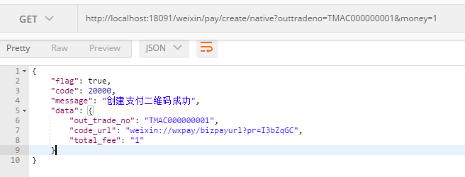


打开支付页面/pay.html，修改value路径，然后打开，会出现二维码，可以扫码试试


测试如下：

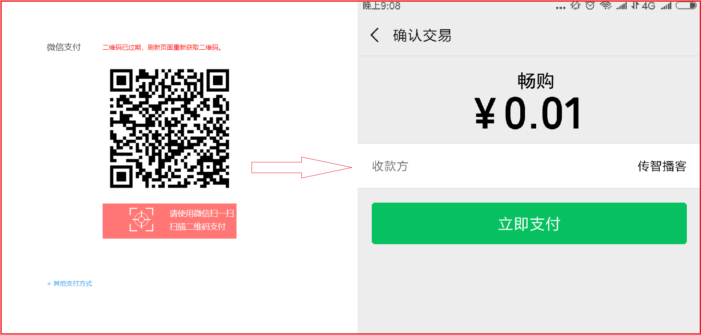


# 3 检测支付状态

## 3.1 需求分析

当用户支付成功后跳转到成功页面


当返回异常时跳转到错误页面


## 3.2 实现思路

我们通过HttpClient工具类实现对远程支付接口的调用。

接口链接：https://api.mch.weixin.qq.com/pay/orderquery

具体参数参见“查询订单”API, 我们在controller方法中轮询调用查询订单（间隔3秒），当返回状态为success时，我们会在controller方法返回结果。前端代码收到结果后跳转到成功页面。


## 3.3 代码实现

(1)业务层

修改`com.changgou.pay.service.WeiXinPayService`，新增方法定义

```java
/**
     * @author 栗子
     * @Description 查询支付状态
     * @Date 22:57 2019/8/25
     * @param out_trade_no
     * @return java.util.Map
     **/
    Map<String, String> queryPayStatus(String out_trade_no);
```


在com.changgou.pay.service.impl.WeixinPayServiceImpl中增加实现方法

```java
/**
     * @author 栗子
     * @Description 查询支付状态
     * @Date 22:57 2019/8/25
     * @param out_trade_no
     * @return java.util.Map
     **/
    @Override
    public Map<String, String> queryPayStatus(String out_trade_no) {
        try {
            // 查询订单地址
            String url = "https://api.mch.weixin.qq.com/pay/orderquery";

            // 封装支付接口需要的数据
            Map<String, String> data = new HashMap<>();
            data.put("appid", appid);                               // 微信公众账号或开放平台APP的唯一标识
            data.put("mch_id", partner);                            // 商户号
            data.put("nonce_str", WXPayUtil.generateNonceStr());    // 随机字符串
            data.put("out_trade_no", out_trade_no);                 // 商户订单号

            // 将数据转成xml
            String signedXml = WXPayUtil.generateSignedXml(data, partnerkey);
            // 创建HttpClient发送请求
            HttpClient httpClient = new HttpClient(url);
            httpClient.setHttps(true);
            httpClient.setXmlParam(signedXml);
            httpClient.post();
            // 处理响应数据
            String strXML = httpClient.getContent();
            Map<String, String> map = WXPayUtil.xmlToMap(strXML);
            return map;
        } catch (Exception e) {
            e.printStackTrace();
        }
        // 处理响应数据
        return null;
    }
```


(2)控制层

在`com.changgou.controller.WeixinPayController`新增方法，用于查询支付状态，代码如下：

上图代码如下：

```java
/**
     * @author 栗子 
     * @Description 支付状态查询
     * @Date 23:05 2019/8/25
     * @param outtradeno
     * @return entity.Result
     **/
    @RequestMapping(value = "/status/query")
    public Result queryStatus(String outtradeno){
        Map<String,String> map = weiXinPayService.queryPayStatus(outtradeno);
        return new Result(true,StatusCode.OK,"查询状态成功！", map);
    }
```


## 3.4 测试

访问地址：`<http://localhost:18090/weixin/pay/status/query?outtradeno=TMAC000000002>`

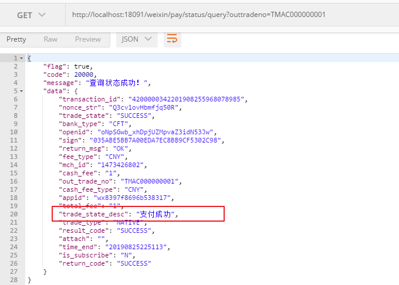


# 4 订单状态操作准备工作

## 4.1 需求分析

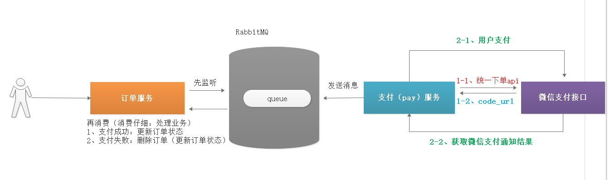

我们现在系统还有个问题需要解决：支付后订单状态没有改变


流程回顾：

```properties
1.用户下单之后，订单数据会存入到MySQL中，同时会将订单对应的支付日志存入到Redis，以List+Hash的方式存储。
2.用户下单后，进入支付页面，支付页面调用支付系统，从微信支付获取二维码数据，并在页面生成支付二维码。
3.用户扫码支付后，微信支付服务器会通调用前预留的回调地址，并携带支付状态信息。
4.支付系统接到支付状态信息后，将支付状态信息发送给RabbitMQ
5.订单系统监听RabbitMQ中的消息获取支付状态，并根据支付状态修改订单状态
6.为了防止网络问题导致notifyurl没有接到对应数据，定时任务定时获取Redis中队列数据去微信支付接口查询状态，并定时更新对应状态。
```

需要做的工作：

```properties
1.创建订单时，同时将订单信息放到Redis中，以List和Hash各存一份
2.实现回调地址接收支付状态信息
3.将订单支付状态信息发送给RabbitMQ
4.订单系统中监听支付状态信息，如果是支付成功，修改订单状态，如果是支付失败，删除订单(或者改成支付失败)
5.防止网络异常无法接收到回调地址的支付信息，定时任务从Redis List中读取数据判断是否支付，如果支付了，修改订单状态，如果未支付，将支付信息放入队列，下次再检测，如果支付失败删除订单(或者改成支付失败)。
```


## 4.2 Redis存储订单信息

每次添加订单后，会根据订单检查用户是否是否支付成功，我们不建议每次都操作数据库，每次操作数据库会增加数据库的负载，我们可以选择将用户的订单信息存入一份到Redis中，提升读取速度。

修改`changgou-service-order`微服务的`com.changgou.order.service.impl.OrderServiceImpl`类中的`add`方法，如果是线上支付，将用户订单数据存入到Redis中,由于每次创建二维码，需要用到订单编号 ，所以也需要将添加的订单信息返回。

### 4.2.1 修改OrderServiceImpl


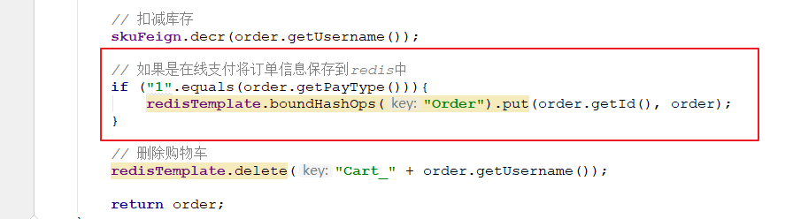

上图代码如下：

```java
/**
 * 增加Order
 * 金额校验:后台校验
 * @param order
 */
@Override
public Order add(Order order){
    //...略

    //修改库存
    skuFeign.decrCount(order.getUsername());

    //添加用户积分
    userFeign.addPoints(2);

    //线上支付，记录订单
    if(order.getPayType().equalsIgnoreCase("1")){
        //将支付记录存入到Reids namespace  key  value
        redisTemplate.boundHashOps("Order").put(order.getId(),order);
    }

    //删除购物车信息
    //redisTemplate.delete("Cart_" + order.getUsername());

    return order;
}
```


### 4.2.2 修改OrderController

修改`com.changgou.order.controller.OrderController`的add方法，将订单对象返回，因为页面需要获取订单的金额和订单号用于创建二维码，代码如下：

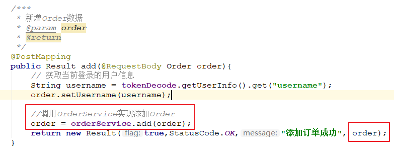


## 4.3 修改订单状态-支付成功

订单支付成功后，需要修改订单状态并持久化到数据库，修改订单的同时，需要将Redis中的订单删除，所以修改订单状态需要将订单日志也传过来，实现代码如下：

修改com.changgou.order.service.OrderService，添加修改订单状态方法，代码如下：

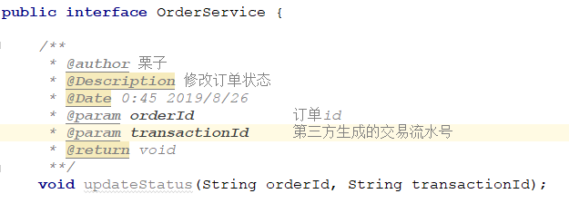

```java
/**
     * @author 栗子
     * @Description 修改订单状态
     * @Date 0:45 2019/8/26
     * @param orderId           订单id
     * @param transactionId     第三方生成的交易流水号
     * @return void
     **/
    void updateStatus(String orderId, String transactionId);
```


修改com.changgou.order.service.impl.OrderServiceImpl，添加修改订单状态实现方法，代码如下：

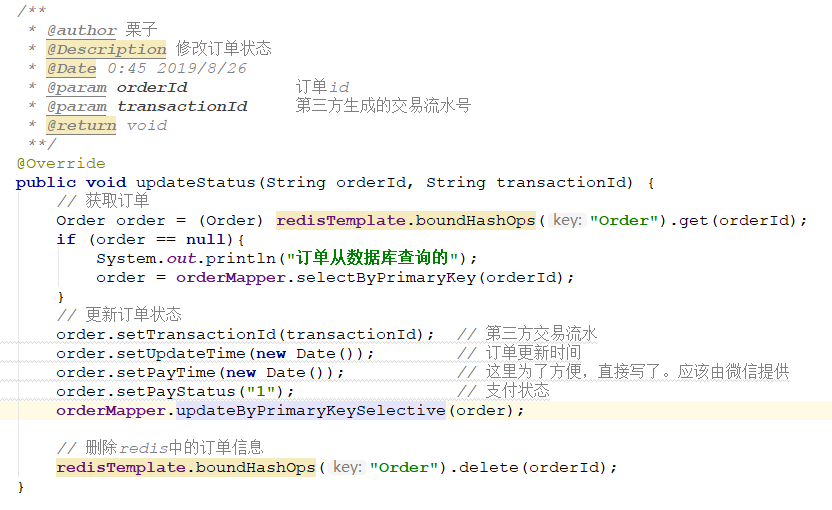

```java
/**
     * @author 栗子
     * @Description 修改订单状态
     * @Date 0:45 2019/8/26
     * @param orderId           订单id
     * @param transactionId     第三方生成的交易流水号
     * @return void
     **/
    @Override
    public void updateStatus(String orderId, String transactionId) {
        // 获取订单
        Order order = (Order) redisTemplate.boundHashOps("Order").get(orderId);
        if (order == null){
            System.out.println("订单从数据库查询的");
            order = orderMapper.selectByPrimaryKey(orderId);
        }
        // 更新订单状态
        order.setTransactionId(transactionId);  // 第三方交易流水
        order.setUpdateTime(new Date());        // 订单更新时间
        order.setPayTime(new Date());           // 这里为了方便，直接写了。应该由微信提供
        order.setPayStatus("1");                // 支付状态
        orderMapper.updateByPrimaryKeySelective(order);

        // 删除redis中的订单信息
        redisTemplate.boundHashOps("Order").delete(orderId);
    }
```


## 4.4 删除订单-支付失败

如果用户订单支付失败了，或者支付超时了，我们需要删除用户订单，删除订单的同时需要回滚库存，这里回滚库存我们就不实现了，作为同学们的作业。实现如下：

修改`changgou-service-order`的com.changgou.order.service.OrderService，添加删除订单方法，我们只需要将订单id传入进来即可实现，代码如下：

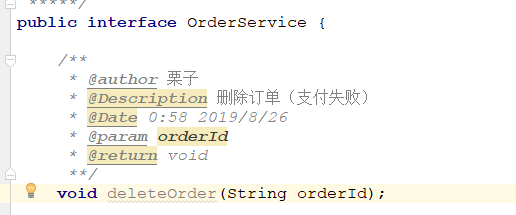

```java
/**
     * @author 栗子 
     * @Description 删除订单（支付失败）
     * @Date 0:58 2019/8/26
     * @param orderId
     * @return void
     **/
    void deleteOrder(String orderId);
```


修改`changgou-service-order`的com.changgou.order.service.impl.OrderServiceImpl，添加删除订单实现方法，代码如下：

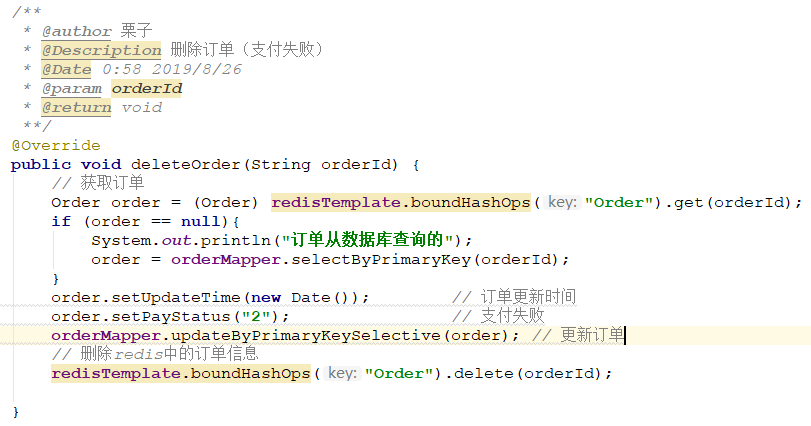

```java
/**
     * @author 栗子
     * @Description 删除订单（支付失败）
     * @Date 0:58 2019/8/26
     * @param orderId
     * @return void
     **/
    @Override
    public void deleteOrder(String orderId) {
        // 获取订单
        Order order = (Order) redisTemplate.boundHashOps("Order").get(orderId);
        if (order == null){
            System.out.println("订单从数据库查询的");
            order = orderMapper.selectByPrimaryKey(orderId);
        }
        order.setUpdateTime(new Date());        // 订单更新时间
        order.setPayStatus("2");                // 支付失败
        orderMapper.updateByPrimaryKeySelective(order); // 更新订单
        // 删除redis中的订单信息
        redisTemplate.boundHashOps("Order").delete(orderId);

    }
```


# 5 支付信息回调

## 5.1 接口分析

每次实现支付之后，微信支付都会将用户支付结果返回到指定路径，而指定路径是指创建二维码的时候填写的`notifyurl`参数,响应的数据以及相关文档参考一下地址：`https://pay.weixin.qq.com/wiki/doc/api/native.php?chapter=9_7&index=8`

### 5.1.1 返回参数分析

通知参数如下：

| 字段名     | 变量名      | 必填 | 类型        | 示例值  | 描述    |
| :--------- | :---------- | :--- | :---------- | :------ | :------ |
| 返回状态码 | return_code | 是   | String(16)  | SUCCESS | SUCCESS |
| 返回信息   | return_msg  | 是   | String(128) | OK      | OK      |

以下字段在return_code为SUCCESS的时候有返回

| 字段名         | 变量名         | 必填 | 类型       | 示例值                       | 描述                                            |
| :------------- | :------------- | :--- | :--------- | :--------------------------- | :---------------------------------------------- |
| 公众账号ID     | appid          | 是   | String(32) | wx8888888888888888           | 微信分配的公众账号ID（企业号corpid即为此appId） |
| 业务结果       | result_code    | 是   | String(16) | SUCCESS                      | SUCCESS/FAIL                                    |
| 商户订单号     | out_trade_no   | 是   | String(32) | 1212321211201407033568112322 | 商户系统内部订单号                              |
| 微信支付订单号 | transaction_id | 是   | String(32) | 1217752501201407033233368018 | 微信支付订单号                                  |


### 5.1.2 响应分析

回调地址接收到数据后，需要响应信息给微信服务器，告知已经收到数据，不然微信服务器会再次发送4次请求推送支付信息。

| 字段名     | 变量名      | 必填 | 类型        | 示例值  | 描述           |
| :--------- | :---------- | :--- | :---------- | :------ | :------------- |
| 返回状态码 | return_code | 是   | String(16)  | SUCCESS | 请按示例值填写 |
| 返回信息   | return_msg  | 是   | String(128) | OK      | 请按示例值填写 |

举例如下：

```xml
<xml>
  <return_code><![CDATA[SUCCESS]]></return_code>
  <return_msg><![CDATA[OK]]></return_msg>
</xml>
```


## 5.2 回调接收数据实现

### 5.2.1 utools工具配置

打开工具--->搜索：内网穿透（**第一次，需要安装该内网穿透插件**）


### 5.2.2 编写回调方法

修改`changgou-service-pay`微服务的com.changgou.pay.controller.WeixinPayController,添加回调方法，代码如下：

```java
/**
     * @author 栗子
     * @Description 获取微信回调数据
     * @Date 1:33 2019/8/26
     * @param request
     * @return java.lang.String
     **/
    @RequestMapping(value = "/notify/url")
    public String notifyUrl(HttpServletRequest request) throws Exception {
        // 获取微信回调信息
        ServletInputStream inputStream = request.getInputStream();
        // 网络传输的字节流操作（内存操作）
        ByteArrayOutputStream byteArrayOutputStream = new ByteArrayOutputStream();
        // 定义缓冲去
        byte[] buffer = new byte[1024];
        int len = 0;
        while ((len=inputStream.read(buffer))!=-1){
            byteArrayOutputStream.write(buffer, 0, len);
        }
        byteArrayOutputStream.flush();
        byteArrayOutputStream.close();
        inputStream.close();
        // 获取数据
        String strXML = new String(byteArrayOutputStream.toByteArray(), "UTF-8");
        Map<String, String> map = WXPayUtil.xmlToMap(strXML);

      
        return "success";
    }
```


# 6 MQ处理支付回调状态

## 6.1 业务分析

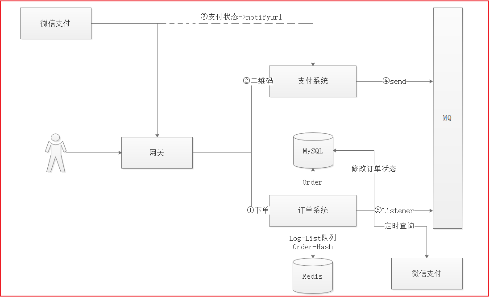

支付系统是独立于其他系统的服务，不做相关业务逻辑操作，只做支付处理，所以回调地址接收微信服务返回的支付状态后，立即将消息发送给RabbitMQ，订单系统再监听支付状态数据，根据状态数据做出修改订单状态或者删除订单操作。


## 6.2 发送支付状态-生产者

### 6.2.1 创建队列

(1)集成RabbitMQ

修改支付微服务changgou-service-pay，集成RabbitMQ，添加如下依赖：

```xml
<dependencies>
    <!--加入ampq-->
    <dependency>
        <groupId>org.springframework.boot</groupId>
        <artifactId>spring-boot-starter-amqp</artifactId>
    </dependency>
</dependencies>
```


这里我们建议在后台手动创建队列，并绑定队列。如果使用程序创建队列，可以按照如下方式实现。

修改application.yml，配置支付队列和交换机信息，代码如下：

```properties
#配置连接mq
spring:
  rabbitmq:
    host: 192.168.211.132
    port: 5672
#配置支付交换机和队列
mq:
  pay:
    exchange:
      order: exchange.order
    queue:
      order: queue.order
    routing:
      key: queue.order
```


创建队列以及交换机并让队列和交换机绑定，修改com.changgou.WeixinPayApplication,添加如下代码：

```java
@Autowired
private Environment env;

// 创建队列
@Bean
public Queue orderQueue(){
    return new Queue(env.getProperty("mq.pay.queue.order"), true);
}

// 创建交换机
@Bean
public Exchange orderExchange(){
    return new DirectExchange(env.getProperty("mq.pay.exchange.order"),true, false);
}

// 队列绑定到交换机
@Bean
public Binding bindQueueToExchange(Queue orderQueue, Exchange orderExchange){
    return BindingBuilder.bind(orderQueue).to(orderExchange).with(env.getProperty("mq.pay.routing.key")).noargs();
}
```


### 6.2.2 发送MQ消息

修改回调方法，在接到支付信息后，立即将支付信息发送给RabbitMQ，代码如下：

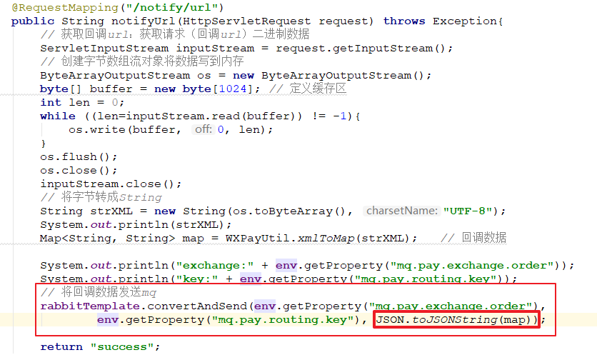

上图代码如下：

```java
/**
     * @author 栗子
     * @Description 回调
     * @Date 21:35 2019/8/26
     * @param
     * @return java.lang.String
     **/
@RequestMapping("/notify/url")
public String notifyUrl(HttpServletRequest request) throws Exception{
    // 获取回调url：获取请求（回调url）二进制数据
    ServletInputStream inputStream = request.getInputStream();
    // 创建字节数组流对象将数据写到内存
    ByteArrayOutputStream os = new ByteArrayOutputStream();
    byte[] buffer = new byte[1024]; // 定义缓存区
    int len = 0;
    while ((len=inputStream.read(buffer)) != -1){
        os.write(buffer, 0, len);
    }
    os.flush();
    os.close();
    inputStream.close();
    // 将字节转成String
    String strXML = new String(os.toByteArray(), "UTF-8");
    System.out.println(strXML);
    Map<String, String> map = WXPayUtil.xmlToMap(strXML);   // 回调数据

    System.out.println("exchange:" + env.getProperty("mq.pay.exchange.order"));
    System.out.println("key:" + env.getProperty("mq.pay.routing.key"));
    // 将回调数据发送mq
    rabbitTemplate.convertAndSend(env.getProperty("mq.pay.exchange.order"), env.getProperty("mq.pay.routing.key"), JSON.toJSONString(map));

    return "success";
}
```


## 6.3 监听MQ消息处理订单-消费者

在订单微服务中，我们需要监听MQ支付状态消息，并实现订单数据操作。

### 6.3.1 集成RabbitMQ

在订单微服务changgou-service-order中，先集成RabbitMQ，再监听队列消息。

在pom.xml中引入如下依赖：

```xml
<!--加入ampq-->
<dependency>
    <groupId>org.springframework.boot</groupId>
    <artifactId>spring-boot-starter-amqp</artifactId>
</dependency>
```


在application.yml中配置rabbitmq配置，代码如下：

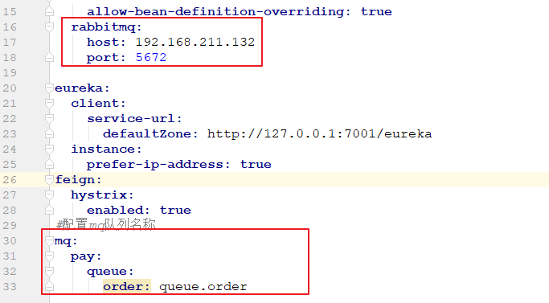

在application.yml中配置队列名字，代码如下：

```properties
#配置连接mq
spring:
  rabbitmq:
    host: 192.168.211.132
    port: 5672
#配置mq队列名称
mq:
  pay:
    queue:
      order: queue.order
```


### 6.3.2 监听消息修改订单

在订单微服务于中创建com.changgou.order.consumer.OrderPayMessageListener，并在该类中consumeMessage方法，用于监听消息，并根据支付状态处理订单，代码如下：

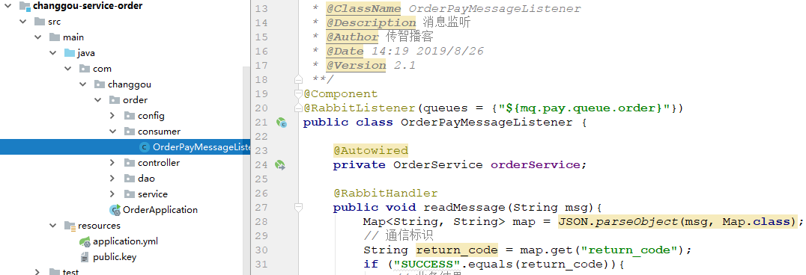

```java
@Component
@RabbitListener(queues = {"${mq.pay.queue.order}"})
public class OrderPayMessageListener {

    @Autowired
    private OrderService orderService;

    @RabbitHandler
    public void readMessage(String msg){
        Map<String, String> map = JSON.parseObject(msg, Map.class);
        // 通信标识
        String return_code = map.get("return_code");
        if ("SUCCESS".equals(return_code)){
            // 业务结果
            String result_code = map.get("result_code");
            String out_trade_no = map.get("out_trade_no"); // 商户订单号
            if ("SUCCESS".equals(result_code)){
                // 更新订单
                if (out_trade_no != null){
                    orderService.updateStatus(out_trade_no, map.get("transaction_id"));
                }
            }else {
                // 删除订单
                if (out_trade_no != null){
                    orderService.deleteOrder(out_trade_no);
                }
            }
        }
    }
}
```


## 6.4 测试

- 用户登录：`<http://localhost:9001/user/login>`

- 商品加入购物车：`<http://localhost:18089/cart/add?id=1148477873175142400&num=6>`

- 用户下单：`<http://localhost:8001/api/order>`

  ~~~properties
  {
  	"payType":"1",
  	"receiverContact":"张三",
  	"receiverMobile":"18066667777",
  	"receiverAddress":"中国北京",
  	"sourceType":"1"
  }
  ~~~

- 生成支付链接

- 完成支付

- 查看数据库：订单状态是否发生改变。