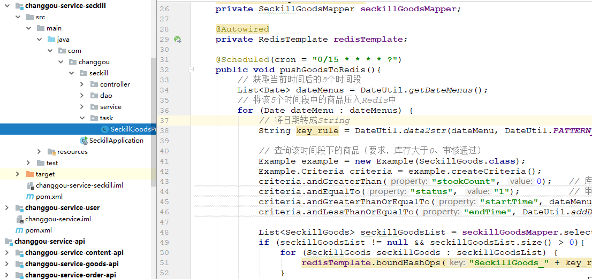
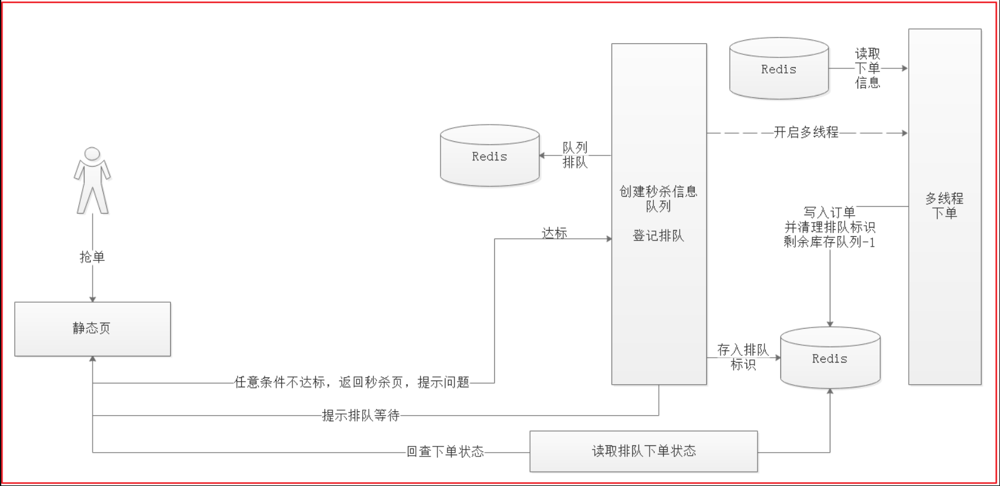

# 	第13章 秒杀

课程回顾：支付+订单的更新

1、能够做支付的公司（支付牌照）    微信支付---->财付通

2、微信支付官方接口文档（非常详细）

- 基本的接口文档：
  - 请求方式  +   请求地址
  - 请求参数
  - 返回数据
- 微信支付的产品：展示支付的二维码用户--->微信扫一扫（native支付）
- 微信支付的流程（时序图：用户     微信客户端      **自己开发的系统**        微信支付系统）
  - 二维码：包含的数据（value=链接），支付链接
    - **统一下单api接口**，生成一个支付链接。
  - 支付完成后，微信支付会通知支付结果信息（回调我们的方法--->支付成功，微信给我们系统发消息【数据】）
    - 如果无法通知，我们可以调用：**查询订单的api接口**

3、生成了支付二维码：略

4、查询支付状态：略

5、支付完成后，希望微信支付系统能够回调我们的系统

- 为了完成微信支付结果的通知：使用了外部工具，内网穿透。
- 接收到微信的通知信息：微信支付系统能够给我们发送请求（request--->请求数据【流】）

6、能够回调：获取支付的结果信息--->异步更新订单的状态

- 解决该问题方案：RabbitMQ
- pay服务：将微信支付结果发送到mq中
- order服务：监听mq，获取消息并且消费消息（处理业务）


小问题：

1、微信不回调

- 确保：配置文件中的回调地址没有配置错误
- 如果不回调：查询订单支付状态

2、队列中肯定有垃圾数据（不存在的订单）

- 解决1：删除队列（重新创建）
- 解决2：在OrderServiceImpl中，在做一个order的非空判断。


学习目标： 13  +  14：秒杀业务

- 秒杀商品压入Redis缓存【缓存预热】
- Spring定时任务了解-定时将秒杀商品存入到Redis中
- 秒杀商品频道页实现-秒杀商品列表页
- 秒杀商品详情页实现
- 下单实现(普通下单)
- 多线程异步抢单实现


# 1 秒杀业务分析

## 1.1 需求分析

所谓“秒杀”，就是网络卖家发布一些超低价格的商品，所有买家在同一时间网上抢购的一种销售方式。通俗一点讲就是网络商家为促销等目的组织的网上限时抢购活动。由于商品价格低廉，往往一上架就被抢购一空，有时只用一秒钟。

秒杀商品通常有两种限制：库存限制、时间限制。

需求：

```properties
（1）录入秒杀商品数据，主要包括：商品标题、原价、秒杀价、商品图片、介绍、秒杀时段等信息
（2）秒杀频道首页列出秒杀商品（进行中的）点击秒杀商品图片跳转到秒杀商品详细页。
（3）商品详细页显示秒杀商品信息，点击立即抢购实现秒杀下单，下单时扣减库存。当库存为0或不在活动期范围内时无法秒杀。
（4）秒杀下单成功，直接跳转到支付页面（微信扫码），支付成功，跳转到成功页，填写收货地址、电话、收件人等信息，完成订单。
（5）当用户秒杀下单5分钟内未支付，取消预订单，调用微信支付的关闭订单接口，恢复库存。
```


## 1.2 表结构说明

**秒杀商品信息表**

```sql
CREATE TABLE `tb_seckill_goods` (
  `id` bigint(20) NOT NULL AUTO_INCREMENT,
  `sup_id` bigint(20) DEFAULT NULL COMMENT 'spu ID',
  `sku_id` bigint(20) DEFAULT NULL COMMENT 'sku ID',
  `name` varchar(100) DEFAULT NULL COMMENT '标题',
  `small_pic` varchar(150) DEFAULT NULL COMMENT '商品图片',
  `price` decimal(10,2) DEFAULT NULL COMMENT '原价格',
  `cost_price` decimal(10,2) DEFAULT NULL COMMENT '秒杀价格',
  `create_time` datetime DEFAULT NULL COMMENT '添加日期',
  `check_time` datetime DEFAULT NULL COMMENT '审核日期',
  `status` char(1) DEFAULT NULL COMMENT '审核状态，0未审核，1审核通过，2审核不通过',
  `start_time` datetime DEFAULT NULL COMMENT '开始时间',
  `end_time` datetime DEFAULT NULL COMMENT '结束时间',
  `num` int(11) DEFAULT NULL COMMENT '秒杀商品数',
  `stock_count` int(11) DEFAULT NULL COMMENT '剩余库存数',
  `introduction` varchar(2000) DEFAULT NULL COMMENT '描述',
  PRIMARY KEY (`id`)
) ENGINE=InnoDB AUTO_INCREMENT=4 DEFAULT CHARSET=utf8;
```

**秒杀订单表**

```sql
CREATE TABLE `tb_seckill_order` (
  `id` bigint(20) NOT NULL COMMENT '主键',
  `seckill_id` bigint(20) DEFAULT NULL COMMENT '秒杀商品ID',
  `money` decimal(10,2) DEFAULT NULL COMMENT '支付金额',
  `user_id` varchar(50) DEFAULT NULL COMMENT '用户',
  `create_time` datetime DEFAULT NULL COMMENT '创建时间',
  `pay_time` datetime DEFAULT NULL COMMENT '支付时间',
  `status` char(1) DEFAULT NULL COMMENT '状态，0未支付，1已支付',
  `receiver_address` varchar(200) DEFAULT NULL COMMENT '收货人地址',
  `receiver_mobile` varchar(20) DEFAULT NULL COMMENT '收货人电话',
  `receiver` varchar(20) DEFAULT NULL COMMENT '收货人',
  `transaction_id` varchar(30) DEFAULT NULL COMMENT '交易流水',
  PRIMARY KEY (`id`)
) ENGINE=InnoDB DEFAULT CHARSET=utf8;
```


## 1.3 秒杀需求分析

秒杀技术实现核心思想是运用缓存减少数据库瞬间的访问压力！读取商品详细信息时运用缓存，当用户点击抢购时减少缓存中的库存数量，当库存数为0时或活动期结束时，同步到数据库。 产生的秒杀预订单也不会立刻写到数据库中，而是先写到缓存，当用户付款成功后再写入数据库。

当然，上面实现的思路只是一种最简单的方式，并未考虑其中一些问题，例如并发状况容易产生的问题。我们看看下面这张思路更严谨的图：


# 2 秒杀商品压入缓存


我们这里秒杀商品列表和秒杀商品详情都是从Redis中取出来的，所以我们首先要将符合参与秒杀的商品定时查询出来，并将数据存入到Redis缓存中。

数据存储类型我们可以选择Hash类型。

秒杀分页列表这里可以通过获取redisTemplate.boundHashOps(key).values()获取结果数据。

秒杀商品详情，可以通过redisTemplate.boundHashOps(key).get(key)获取详情。


## 2.1 秒杀服务工程搭建

我们将商品数据压入到Reids缓存，可以在秒杀工程的服务工程中完成，可以按照如下步骤实现：

```properties
1.查询活动没结束的所有秒杀商品
	1)状态必须为审核通过 status=1
	2)商品库存个数>0
	3)活动没有结束  endTime>=now()
	4)在Redis中没有该商品的缓存
	5)执行查询获取对应的结果集
2.将活动没有结束的秒杀商品入库
```

我们首先搭建一个秒杀服务工程，然后按照上面步骤实现。

### 2.1.1 创建seckill-api工程

创建changgou-service-seckill-api工程，并且将逆向工程生成的相关代码复制到该工程中。


### 2.1.2 创建service-seckill工程

创建changgou-service-seckill，作为秒杀工程的服务提供工程，将逆向工程生成的代码复制到该工程中并且将api工程依赖到该工程中。


(1)pom.xml依赖

pom.xml

```xml
<?xml version="1.0" encoding="UTF-8"?>
<project xmlns="http://maven.apache.org/POM/4.0.0"
         xmlns:xsi="http://www.w3.org/2001/XMLSchema-instance"
         xsi:schemaLocation="http://maven.apache.org/POM/4.0.0 http://maven.apache.org/xsd/maven-4.0.0.xsd">
    <parent>
        <artifactId>changgou-service</artifactId>
        <groupId>com.changgou</groupId>
        <version>1.0-SNAPSHOT</version>
    </parent>
    <modelVersion>4.0.0</modelVersion>
    <description>秒杀微服务</description>
    <artifactId>changgou-service-seckill</artifactId>

    <dependencies>
        <dependency>
            <groupId>com.changgou</groupId>
            <artifactId>changgou-service-seckill-api</artifactId>
            <version>1.0-SNAPSHOT</version>
        </dependency>
    </dependencies>
</project>
```


(2) application.yml配置

```properties
server:
  port: 18091
spring:
  application:
    name: seckill
  datasource:
    driver-class-name: com.mysql.jdbc.Driver
    url: jdbc:mysql://192.168.211.132:3306/changgou_seckill?useUnicode=true&characterEncoding=UTF-8&serverTimezone=UTC
    username: root
    password: 123456
  rabbitmq:
    host: 192.168.211.132 #mq的服务器地址
    username: guest #账号
    password: guest
    port: 5672 #端口
  main:
    allow-bean-definition-overriding: true
  redis:
    host: 192.168.211.132
    port: 6379
eureka:
  client:
    service-url:
      defaultZone: http://127.0.0.1:7001/eureka
  instance:
    prefer-ip-address: true
feign:
  hystrix:
    enabled: true
#hystrix 配置
hystrix:
  command:
    default:
      execution:
        timeout:
        #如果enabled设置为false，则请求超时交给ribbon控制
          enabled: true
        isolation:
          thread:
            timeoutInMilliseconds: 10000
          strategy: SEMAPHORE
```


(3) 启动类配置

```java
/**
 * @ClassName SeckillApplication
 * @Description
 * @Author 传智播客
 * @Date 15:15 2019/8/27
 * @Version 2.1
 **/
@SpringBootApplication
@EnableEurekaClient
@MapperScan(basePackages = {"com.changgou.seckill.dao"})
@EnableScheduling   // 开启定时任务
public class SeckillApplication {

    public static void main(String[] args) {
        SpringApplication.run(SeckillApplication.class, args);
    }
}
```


## 2.2 定时任务

一会儿我们采用Spring的定时任务定时将符合参与秒杀的商品查询出来再存入到Redis缓存，所以这里需要使用到定时任务。

这里我们了解下定时任务相关的配置,配置步骤如下：

```properties
1)在定时任务类的指定方法上加上@Scheduled开启定时任务
2)定时任务表达式：使用cron属性来配置定时任务执行时间
```


### 2.2.1 定时任务方法配置

创建com.changgou.seckill.timer.SeckillGoodsPushTask类，并在类中加上定时任务执行方法，代码如下：

```java
@Component
public class SecKillGoodsPushRedis {

    /**
     * @author 栗子 
     * @Description cron：时间表达式，该例子：每5s执行一次
     * @Date 15:30 2019/8/27
     * @param 
     * @return void
     **/
    @Scheduled(cron = "0/5 * * * * ?")
    public void pushGoodsToRedis() throws ParseException {
        System.out.println("每5秒执行一次。。。");
    }
}
```


### 2.2.2 定时任务常用时间表达式

CronTrigger配置完整格式为： [秒][分] [小时][日] [月][周] [年]

| 序号 | 说明 | 是否必填 | 允许填写的值      | 允许的通配符  |
| ---- | ---- | -------- | ----------------- | ------------- |
| 1    | 秒   | 是       | 0-59              | , - * /       |
| 2    | 分   | 是       | 0-59              | , - * /       |
| 3    | 小时 | 是       | 0-23              | , - * /       |
| 4    | 日   | 是       | 1-31              | , - * ? / L W |
| 5    | 月   | 是       | 1-12或JAN-DEC     | , - * /       |
| 6    | 周   | 是       | 1-7或SUN-SAT      | , - * ? / L W |
| 7    | 年   | 否       | empty 或1970-2099 | , - * /       |

使用说明：

```properties
通配符说明:
* 表示所有值. 例如:在分的字段上设置 "*",表示每一分钟都会触发。

? 表示不指定值。使用的场景为不需要关心当前设置这个字段的值。

例如:要在每月的10号触发一个操作，但不关心是周几，所以需要周位置的那个字段设置为"?" 具体设置为 0 0 0 10 * ?

- 表示区间。例如 在小时上设置 "10-12",表示 10,11,12点都会触发。

, 表示指定多个值，例如在周字段上设置 "MON,WED,FRI" 表示周一，周三和周五触发  12,14,19

/ 用于递增触发。如在秒上面设置"5/15" 表示从5秒开始，每增15秒触发(5,20,35,50)。 在月字段上设置'1/3'所示每月1号开始，每隔三天触发一次。

L 表示最后的意思。在日字段设置上，表示当月的最后一天(依据当前月份，如果是二月还会依据是否是润年[leap]), 在周字段上表示星期六，相当于"7"或"SAT"。如果在"L"前加上数字，则表示该数据的最后一个。例如在周字段上设置"6L"这样的格式,则表示“本月最后一个星期五"

W 表示离指定日期的最近那个工作日(周一至周五). 例如在日字段上设置"15W"，表示离每月15号最近的那个工作日触发。如果15号正好是周六，则找最近的周五(14号)触发, 如果15号是周未，则找最近的下周一(16号)触发.如果15号正好在工作日(周一至周五)，则就在该天触发。如果指定格式为 "1W",它则表示每月1号往后最近的工作日触发。如果1号正是周六，则将在3号下周一触发。(注，"W"前只能设置具体的数字,不允许区间"-").

# 序号(表示每月的第几个周几)，例如在周字段上设置"6#3"表示在每月的第三个周六.注意如果指定"#5",正好第五周没有周六，则不会触发该配置(用在母亲节和父亲节再合适不过了) ；
```

常用表达式

```properties
0 0 10,14,16 * * ? 每天上午10点，下午2点，4点 
0 0/30 9-17 * * ? 朝九晚五工作时间内每半小时 
0 0 12 ? * WED 表示每个星期三中午12点 
"0 0 12 * * ?" 每天中午12点触发 
"0 15 10 ? * *" 每天上午10:15触发 
"0 15 10 * * ?" 每天上午10:15触发 
"0 15 10 * * ? *" 每天上午10:15触发 
"0 15 10 * * ? 2005" 2005年的每天上午10:15触发 
"0 * 14 * * ?" 在每天下午2点到下午2:59期间的每1分钟触发 
"0 0/5 14 * * ?" 在每天下午2点到下午2:55期间的每5分钟触发 
"0 0/5 14,18 * * ?" 在每天下午2点到2:55期间和下午6点到6:55期间的每5分钟触发 
"0 0-5 14 * * ?" 在每天下午2点到下午2:05期间的每1分钟触发 
"0 10,44 14 ? 3 WED" 每年三月的星期三的下午2:10和2:44触发 
"0 15 10 ? * MON-FRI" 周一至周五的上午10:15触发 
"0 15 10 15 * ?" 每月15日上午10:15触发 
"0 15 10 L * ?" 每月最后一日的上午10:15触发 
"0 15 10 ? * 6L" 每月的最后一个星期五上午10:15触发 
"0 15 10 ? * 6L 2002-2005" 2002年至2005年的每月的最后一个星期五上午10:15触发 
"0 15 10 ? * 6#3" 每月的第三个星期五上午10:15触发
```


## 2.3 秒杀商品压入缓存实现

### 2.3.1 数据检索条件分析

按照2.1中的几个步骤实现将秒杀商品从数据库中查询出来，并存入到Redis缓存

```properties
1.查询活动没结束的所有秒杀商品
	1)计算秒杀时间段
	2)状态必须为审核通过 status=1
	3)商品库存个数>0
	4)活动没有结束  endTime>=now()
	5)在Redis中没有该商品的缓存
	6)执行查询获取对应的结果集
2.将活动没有结束的秒杀商品入库
```

上面这里会涉及到时间操作，所以这里提前准备了一个时间工具包DateUtil。


### 2.3.2 时间菜单分析


我们将商品数据从数据库中查询出来，并存入Redis缓存，但页面每次显示的时候，只显示当前正在秒杀以及往后延时2个小时、4个小时、6个小时、8个小时的秒杀商品数据。我们要做的第一个事是计算出秒杀时间菜单，这个菜单是从后台获取的。

这个时间菜单的计算我们来分析下，可以先求出当前时间的凌晨，然后每2个小时后作为下一个抢购的开始时间，这样可以分出12个抢购时间段,如下：

```properties
00:00-02:00
02:00-04:00
04:00-06:00
06:00-08:00
08:00-10:00
10:00-12:00
12:00-14:00
14:00-16:00
16:00-18:00
18:00-20:00
20:00-22:00
22:00-00:00
```

而现实的菜单只需要计算出当前时间在哪个时间段范围，该时间段范围就属于正在秒杀的时间段，而后面即将开始的秒杀时间段的计算也就出来了，可以在当前时间段基础之上+2小时、+4小时、+6小时、+8小时。

关于时间菜单的运算，在给出的DateUtil包里已经实现，代码如下：

```java
public class DateUtil {

    //时间格式
    public static final String PATTERN_YYYYMMDDHH = "yyyyMMddHH";
    public static final String PATTERN_YYYY_MM_DDHHMM = "yyyy-MM-dd HH:mm";

    /***
     * 从yyyy-MM-dd HH:mm格式转成yyyyMMddHH格式
     * @param dateStr
     * @return
     */
    public static String formatStr(String dateStr,String opattern,String npattern){
        SimpleDateFormat simpleDateFormat = new SimpleDateFormat(opattern);
        try {
            Date date = simpleDateFormat.parse(dateStr);
            simpleDateFormat = new SimpleDateFormat(npattern);
            return simpleDateFormat.format(date);
        } catch (ParseException e) {
            e.printStackTrace();
        }
        return null;
    }

    /***
     * 获取指定日期的凌晨
     * @return
     */
    public static Date toDayStartHour(Date date){
        Calendar calendar = Calendar.getInstance();
        calendar.setTime(date);
        calendar.set(Calendar.HOUR_OF_DAY, 0);
        calendar.set(Calendar.MINUTE, 0);
        calendar.set(Calendar.SECOND, 0);
        calendar.set(Calendar.MILLISECOND, 0);
        Date start = calendar.getTime();
        return start;
    }


    /***
     * 时间增加N分钟
     * @param date
     * @param minutes
     * @return
     */
    public static Date addDateMinutes(Date date,int minutes){
        Calendar calendar = Calendar.getInstance();
        calendar.setTime(date);
        calendar.add(Calendar.MINUTE, minutes);// 24小时制
        date = calendar.getTime();
        return date;
    }

    /***
     * 时间递增N小时
     * @param hour
     * @return
     */
    public static Date addDateHour(Date date,int hour){
        Calendar calendar = Calendar.getInstance();
        calendar.setTime(date);
        calendar.add(Calendar.HOUR, hour);// 24小时制
        date = calendar.getTime();
        return date;
    }

    /***
     * 获取时间菜单
     * @return
     */
    public static List<Date> getDateMenus(){
        //定义一个List<Date>集合，存储所有时间段
        List<Date> dates = getDates(12);
        //判断当前时间属于哪个时间范围
        Date now = new Date();
        for (Date cdate : dates) {
            //开始时间<=当前时间<开始时间+2小时
            if(cdate.getTime()<=now.getTime() && now.getTime()<addDateHour(cdate,2).getTime()){
                now = cdate;
                break;
            }
        }

        //当前需要显示的时间菜单
        List<Date> dateMenus = new ArrayList<Date>();
        for (int i = 0; i <5 ; i++) {
            dateMenus.add(addDateHour(now,i*2));
        }
        return dateMenus;
    }

    /***
     * 指定时间往后N个时间间隔
     * @param hours
     * @return
     */
    public static List<Date> getDates(int hours) {
        List<Date> dates = new ArrayList<Date>();
        //循环12次
        Date date = toDayStartHour(new Date()); //凌晨
        for (int i = 0; i <hours ; i++) {
            //每次递增2小时,将每次递增的时间存入到List<Date>集合中
            dates.add(addDateHour(date,i*2));
        }
        return dates;
    }

    /***
     * 时间转成yyyyMMddHH
     * @param date
     * @param pattern
     * @return
     */
    public static String data2str(Date date, String pattern){
        SimpleDateFormat simpleDateFormat = new SimpleDateFormat(pattern);
        return simpleDateFormat.format(date);
    }
    
    
}
```


### 2.3.3 查询秒杀商品导入Reids

我们可以写个定时任务，查询从当前时间开始，往后延续4个时间菜单间隔，也就是一共只查询5个时间段抢购商品数据，并压入缓存，实现代码如下：



修改SeckillGoodsPushTask的loadGoodsPushRedis方法，代码如下：

```java
@Component
public class SeckillGoodsPushRedis {

    @Autowired(required = false)
    private SeckillGoodsMapper seckillGoodsMapper;

    @Autowired
    private RedisTemplate redisTemplate;

    @Scheduled(cron = "0/15 * * * * ?")
    public void pushGoodsToRedis(){
        // 获取当前时间后的5个时间段
        List<Date> dateMenus = DateUtil.getDateMenus();
        // 将该5个时间段中的商品压入Redis中
        for (Date dateMenu : dateMenus) {
            // 将日期转成String
            String key_rule = DateUtil.data2str(dateMenu, DateUtil.PATTERN_YYYYMMDDHH);

            // 查询该时间段下的商品（要求，库存大于0、审核通过）
            Example example = new Example(SeckillGoods.class);
            Example.Criteria criteria = example.createCriteria();
            criteria.andGreaterThan("stockCount", 0);   // 库存大于0
            criteria.andEqualTo("status", "1");         // 审核通过后的商品
            criteria.andGreaterThanOrEqualTo("startTime", dateMenu); // 其始时间
            criteria.andLessThanOrEqualTo("endTime", DateUtil.addDateHour(dateMenu, 2));    // 结束时间

            List<SeckillGoods> seckillGoodsList = seckillGoodsMapper.selectByExample(example);
            if (seckillGoodsList != null && seckillGoodsList.size() > 0){
                for (SeckillGoods seckillGoods : seckillGoodsList) {
                    redisTemplate.boundHashOps("SeckillGoods_" + key_rule).put(seckillGoods.getId(), seckillGoods);
                }
            }

        }
    }


}
```

Redis数据如下：


## 2.4 优化

### 2.4.1 去掉重复商品

- 定时任务在指定时间表达式中去重复执行
- 第一次将符合条件的描述商品压入Redis后，再下一次执行定时任务时又将相同的数据写入Redis（会覆盖）
- 因此，写入到redis中的数据没必要重复写入


~~~java
// 排除商品的商品
Set ids = redisTemplate.boundHashOps("SeckillGoods_" + key_rule).keys();
if (ids != null && ids.size() > 0){
    criteria.andNotIn("id", ids);
}
~~~


### 2.4.2 精度丢失

123091237623423200083232      12309123762342320008320000 

- 将MySQL中数据导入Redis的过程中，会出现精度丢失现象
- 需要在SeckillGoods的id属性上添加注解。


~~~java
// 防止精度丢失，将id序列化成string
@JsonSerialize(using = ToStringSerializer.class)
private Long id;
~~~


## 2.5 MySQL数据

~~~properties
1、同学们把changgou_seckill库中的tb_seckill_goods表删除（因为提供虚拟机中的表数据是2019年数据）
2、执行资料中提供的sql脚本即可（changgou_seckill.sql）
~~~


# 3 秒杀频道页


秒杀频道首页，显示正在秒杀的和未开始秒杀的商品（已经开始或者还没开始，未结束的秒杀商品） 


## 3.1 秒杀时间菜单


如上图，时间菜单需要根据当前时间动态加载，时间菜单的计算上面功能中已经实现，在DateUtil工具包中。我们只需要将时间菜单获取，然后响应到页面，页面根据对应的数据显示即可。

创建com.changgou.seckill.controller.SeckillGoodsController，并添加菜单获取方法，代码如下：

```java
@RestController
@CrossOrigin
@RequestMapping(value = "/seckill/goods")
public class SeckillGoodsController {

    /*****
     * 获取时间菜单
     * URLL:/seckill/goods/menus
     */
    @RequestMapping(value = "/menus")
    public List<Date> dateMenus(){
        // 获取时间菜单
        List<Date> dateMenus = DateUtil.getDateMenus();
        List<String> list = new ArrayList<>();
        for (Date dateMenu : dateMenus) {
            String str = DateUtil.data2str(dateMenu, DateUtil.PATTERN_YYYY_MM_DDHHMM);
            list.add(str);
        }
        return new Result(true, StatusCode.OK, "获取时间菜单成功", list);
    }
}
```


使用Postman测试，效果如下：

http://localhost:18084/seckill/goods/menus


## 3.2 秒杀频道商品列表


秒杀频道页是指将对应时区的秒杀商品从Reids缓存中查询出来，并到页面显示。对应时区秒杀商品存储的时候以Hash类型进行了存储，key=SeckillGoods_2019010112，value=每个商品详情。

每次用户在前端点击对应时间菜单的时候，可以将时间菜单的开始时间以yyyyMMddHH格式提交到后台，后台根据时间格式查询出对应时区秒杀商品信息。


### 3.2.1 业务层

创建com.changgou.seckill.service.SeckillGoodsService,添加根据时区查询秒杀商品的方法，代码如下：

```java
public interface SeckillGoodsService {

   /**
     * @author 栗子
     * @Description 获取该时间段下的商品列表数据
     * @Date 18:23 2019/8/27
     * @param time
     * @return java.util.List<com.changgou.seckill.pojo.SeckillGoods>
     **/
    List<SeckillGoods> list(String time);
}
```


创建com.changgou.seckill.service.impl.SeckillGoodsServiceImpl，实现根据时区查询秒杀商品的方法，代码如下：

```java
@Service
public class SeckillGoodsServiceImpl implements SeckillGoodsService {

	@Autowired
    private RedisTemplate redisTemplate;


    /**
     * @author 栗子
     * @Description 获取该时间段下的商品列表数据
     * @Date 18:23 2019/8/27
     * @param key
     * @return java.util.List<com.changgou.seckill.pojo.SeckillGoods>
     **/
    @Override
    public List<SeckillGoods> list(String key) {
        List<SeckillGoods> list = redisTemplate.boundHashOps("SeckillGoods_" + key).values();
        return list;

    }
}
```


### 3.2.2 控制层

修改com.changgou.seckill.controller.SeckillGoodsController，并添加秒杀商品查询方法，代码如下：

```java
/**
     * @author 栗子
     * @Description 查询该时间段下的商品列表
     * @Date 18:26 2019/8/27
     * @param key
     * @return entity.Result
     **/
@RequestMapping("/list")
public Result list(String key){
    List<SeckillGoods> list = seckillGoodsService.list(key);
    System.out.println("list size:" + list.size());
    return new Result(true, StatusCode.OK, "该时间段下的商品列表查询成功", list);
}
```


使用Postman测试，效果如下：

`<http://localhost:18091/seckillGoods/list?key=2019082716>`


# 4 秒杀详情页

通过秒杀频道页点击请购按钮，会跳转到商品秒杀详情页，秒杀详情页需要根据商品ID查询商品详情，我们可以在频道页点击秒杀抢购的时候将ID一起传到后台，然后根据ID去Redis中查询详情信息。


## 4.1 业务层

修改com.changgou.seckill.service.SeckillGoodsService，添加如下方法实现查询秒杀商品详情,代码如下：

```java
/**
     * @author 栗子
     * @Description 获取商品详情
     * @Date 18:32 2019/8/27
     * @param time
     * @param id
     * @return com.changgou.seckill.pojo.SeckillGoods
     **/
SeckillGoods one(String time, Long id);
```

修改com.changgou.seckill.service.impl.SeckillGoodsServiceImpl，添加查询秒杀商品详情，代码如下：

```java
/**
     * @author 栗子
     * @Description 获取商品详情
     * @Date 18:32 2019/8/27
     * @param time
     * @param id
     * @return com.changgou.seckill.pojo.SeckillGoods
     **/
@Override
public SeckillGoods one(String time, Long id) {
    SeckillGoods seckillGoods = (SeckillGoods) redisTemplate.boundHashOps("SeckillGoods_" + time).get(id);
    return seckillGoods;
}
```


## 4.2 控制层

修改com.changgou.seckill.controller.SeckillGoodsController，添加如下方法实现查询秒杀商品详情，代码如下：

```java
/**
     * @author 栗子
     * @Description 秒杀商品详情
     * @Date 18:35 2019/8/27
     * @param time
     * @param id
     * @return entity.Result
     **/
@RequestMapping("/one")
public Result one(String time, Long id){
    SeckillGoods seckillGoods = seckillGoodsService.one(time, id);
    return new Result(true, StatusCode.OK, "秒杀商品详情查询成功", seckillGoods);
}
```


使用Postman测试，效果如下：

`<http://localhost:18091/seckillGoods/one?time=2019082720&id=1131815338263056384>`


## 4.3 问题处理

在保存到redis的过程中，可能出现精度丢失的现象，因此我们需要对id进行处理。

~~~java
@JsonSerialize(using = ToStringSerializer.class)
private Long id;
~~~


# 5 下单实现

需求：完成秒杀商品下单实现。

- 提交订单：时间段 +  id， username
- 保存订单（默认：购买该商品一件）
  - 将秒杀的订单保存到Redis中
  - 扣减库存
    - 库存<=0：刚刚售完    商品下架（从Redis中移除该商品   +  更新该商品【库存量】）
    - 库存量>0：可以下单


## 5.1 业务层

创建com.changgou.seckill.service.SeckillOrderService，并在接口中增加下单方法，代码如下：

```java
public interface SeckillOrderService {

    /**
     * @author 栗子
     * @Description 下单操作
     * @Date 21:24 2019/8/27
     * @param tiem          秒杀商品redis中的key
     * @param seckillId     秒杀商品的id
     * @param userId        用户名
     * @return Boolean      是否下单成功
     **/
    Boolean add(String tiem, Long seckillId, String userId);
}
```


创建com.changgou.seckill.service.impl.SeckillOrderServiceImpl实现类，并在类中添加下单实现方法，代码如下：

```java
@Autowired(required = false)
private SeckillOrderMapper seckillOrderMapper;

@Autowired(required = false)
private SeckillGoodsMapper seckillGoodsMapper;

@Autowired
private RedisTemplate redisTemplate;

@Autowired
private IdWorker idWorker;


/**
     * @author 栗子
     * @Description 下单操作
     * @Date 21:24 2019/8/27
     * @param time          秒杀商品redis中的key
     * @param seckillId     秒杀商品的id
     * @param userId        用户名
     * @return Boolean      是否下单成功
     **/
@Override
public Boolean add(String time, Long seckillId, String userId) {
    // 从redis中获取被秒杀的商品信息
    SeckillGoods seckillGoods = (SeckillGoods) redisTemplate.boundHashOps("SeckillGoods_" + time).get(seckillId.toString());
    // 有可能该商品被抢完了，因此需要判断
    if (seckillGoods == null || seckillGoods.getStockCount() <= 0){
        throw new RuntimeException("对不起，该商品已售罄");
    }
    // 如果没有被抢购完，可以进行下单操作
    SeckillOrder seckillOrder = new SeckillOrder();
    seckillOrder.setId(idWorker.nextId());  // 主键
    seckillOrder.setSeckillId(seckillId);   // 秒杀商品id
    seckillOrder.setMoney(seckillGoods.getCostPrice()); // 支付金额
    seckillOrder.setUserId(userId);         // 当前用户
    seckillOrder.setCreateTime(new Date()); // 下单时间
    seckillOrder.setStatus("0");            // 支付状态：未支付
    // 将秒杀订单信息存储到redis中
    redisTemplate.boundHashOps("SeckillOrder").put(userId, seckillOrder);

    // 扣减秒杀商品的库
    seckillGoods.setStockCount(seckillGoods.getStockCount() - 1);   // 只能秒杀一件商品
    if (seckillGoods.getStockCount() < 0){
        // 并且将数据同步到MySQL中（定时器就不会将该商品在写入内存，因为做了判断）
        seckillGoodsMapper.updateByPrimaryKeySelective(seckillGoods);
        // 如果库存量小于0，表示该商品已售罄，将redis中的数据删除
        redisTemplate.boundHashOps("SeckillGoods_" + time).delete(seckillId);
    }else {
        // 如果有库存，则更新redis
        redisTemplate.boundHashOps("SeckillGoods_" + time).put(seckillId, seckillGoods);
    }
    return true;
}
```


## 5.2 控制层

创建com.changgou.seckill.controller.SeckillOrderController，添加下单方法，代码如下：

```java
/**
     * @author 栗子
     * @Description 抢单
     * @Date 21:53 2019/8/27
     * @param time
     * @param id
     * @return entity.Result
     **/
    @RequestMapping("/add")
    public Result add(String time, Long id){
        try {
            String username = "zhangsan";   // 备注：登录后，可以通过TokenDecode中获取
            Boolean addBool = seckillOrderService.add(time, id, username);
            if (addBool){
                return new Result(true, StatusCode.OK, "抢单成功");
            }
        } catch (Exception e) {
            e.printStackTrace();
        }
        return new Result(false, StatusCode.NOTFOUNDERROR, "商品售罄");
    }
```


## 5.3 测试

1、下单前：被商品商品


2、抢购商品：`<http://localhost:18091/seckillOrder/add?time=2019082722&id=1131815338686681088>`


3、查看抢购后商品库存：


 

问题分析:

上述功能完成了秒杀抢单操作，但没有解决并发相关的问题，例如并发、超卖现象，这块甚至有可能产生雪崩问题。


# 6 多线程抢单

## 6.1  实现思路分析


在审视秒杀中，操作一般都是比较复杂的，而且并发量特别高，比如，检查当前账号操作是否已经秒杀过该商品，检查该账号是否存在存在刷单行为，记录用户操作日志等。

下订单这里，我们一般采用多线程下单，但多线程中我们又需要保证用户抢单的公平性，也就是先抢先下单。我们可以这样实现，用户进入秒杀抢单，如果用户复合抢单资格，只需要记录用户抢单数据，存入队列，多线程从队列中进行消费即可，存入队列采用左压，多线程下单采用右取的方式。


## 6.2 异步实现

要想使用Spring的异步操作，需要先开启异步操作，用`@EnableAsync`注解开启，


然后在对应的异步方法上添加注解`@Async`即可。创建com.changgou.seckill.task.MultiThreadingCreateOrder类，在类中创建一个createOrder方法，并在方法上添加`@Async`,代码如下：

```java
@Component
public class MultiThreadingCreateOrder {

    /**
     * @author 栗子 
     * @Description 异步执行
     * @Date 22:49 2019/8/27
     * @param 
     * @return void
     **/
    @Async
    public void createOrder(){
        try {
            System.out.println("准备执行。。。");
            Thread.sleep(20000);
            System.out.println("开始执行。。。");
        } catch (InterruptedException e) {
            e.printStackTrace();
        }
    }
}
```

上面createOrder方法进行了休眠阻塞操作，我们在下单的方法调用createOrder方法，如果下单的方法没有阻塞，继续执行，说明属于异步操作，如果阻塞了，说明没有执行异步操作。


修改秒杀抢单SeckillOrderServiceImpl代码，注入MultiThreadingCreateOrder,并调用createOrder方法，代码如下：


测试如下：`<http://localhost:18091/seckillOrder/add?time=2019082722&id=1131815338686681088>`


## 6.3 多线程抢单



用户每次下单的时候，我们都让他们先进行排队，然后采用多线程的方式创建订单，排队我们可以采用Redis的队列实现，多线程下单我们可以采用Spring的异步实现。 


### 6.3.1 多线程下单

将之前下单的代码全部挪到多线程的方法中，com.changgou.seckill.service.impl.SeckillOrderServiceImpl类的方法值负责调用即可，代码如下：


多线程下单代码如下图：


上图代码如下：

```java
@Component
public class MultiThreadingCreateOrder {
    
    @Autowired(required = false)
    private SeckillGoodsMapper seckillGoodsMapper;

    @Autowired
    private RedisTemplate redisTemplate;

    @Autowired
    private IdWorker idWorker;

    /**
     * @author 栗子
     * @Description 异步执行
     * @Date 22:49 2019/8/27
     * @param
     * @return void
     **/
    @Async
    public void createOrder(){
        try {

            String time = "2019082722";
            Long seckillId = 1131815338686681088L;
            String userId = "zhangsan";

            // 从redis中获取被秒杀的商品信息
            SeckillGoods seckillGoods = (SeckillGoods) redisTemplate.boundHashOps("SeckillGoods_" + time).get(seckillId.toString());
            // 有可能该商品被抢完了，因此需要判断
            if (seckillGoods == null || seckillGoods.getStockCount() <= 0){
                throw new RuntimeException("对不起，该商品已售罄");
            }
            // 如果没有被抢购完，可以进行下单操作
            SeckillOrder seckillOrder = new SeckillOrder();
            seckillOrder.setId(idWorker.nextId());  // 主键
            seckillOrder.setSeckillId(seckillId);   // 秒杀商品id
            seckillOrder.setMoney(seckillGoods.getCostPrice()); // 支付金额
            seckillOrder.setUserId(userId);         // 当前用户
            seckillOrder.setCreateTime(new Date()); // 下单时间
            seckillOrder.setStatus("0");            // 支付状态：未支付
            // 将秒杀订单信息存储到redis中
            redisTemplate.boundHashOps("SeckillOrder").put(userId, seckillOrder);

            // 扣减秒杀商品的库
            seckillGoods.setStockCount(seckillGoods.getStockCount() - 1);   // 只能秒杀一件商品
            if (seckillGoods.getStockCount() < 0){
                // 并且将数据同步到MySQL中（定时器就不会将该商品在写入内存，因为做了判断）
                seckillGoodsMapper.updateByPrimaryKeySelective(seckillGoods);
                // 如果库存量小于0，表示该商品已售罄，将redis中的数据删除
                redisTemplate.boundHashOps("SeckillGoods_" + time).delete(seckillId.toString());
            }else {
                // 如果有库存，则更新redis
                redisTemplate.boundHashOps("SeckillGoods_" + time).put(seckillId.toString(), seckillGoods);
            }

        } catch (Exception e) {
            e.printStackTrace();
        }
    }
}
```

此时测试，是可以正常下单的，但是用户名和订单都写死了，此处需要继续优化。


### 6.3.2 排队下单

#### 6.3.2.1 排队信息封装

用户每次下单的时候，我们可以创建一个队列进行排队，然后采用多线程的方式创建订单，排队我们可以采用Redis的队列实现。 排队信息中需要有用户抢单的商品信息，主要包含商品ID，商品抢购时间段，用户登录名。我们可以设计个javabean，如下：


```java
public class SeckillStatus implements Serializable {

    //秒杀用户名
    private String username;
    //创建时间
    private Date createTime;
    //秒杀状态  1:排队中，2:秒杀等待支付,3:支付超时，4:秒杀失败,5:支付完成
    private Integer status;
    //秒杀的商品ID
    @JsonSerialize(using = ToStringSerializer.class)
    private Long goodsId;

    //应付金额
    private Float money;

    //订单号
    @JsonSerialize(using = ToStringSerializer.class)
    private Long orderId;
    //时间段
    private String time;

    public SeckillStatus() {
    }

    public SeckillStatus(String username, Date createTime, Integer status, Long goodsId, String time) {
        this.username = username;
        this.createTime = createTime;
        this.status = status;
        this.goodsId = goodsId;
        this.time = time;
    }
    
    //getters/setters...略
}
```


#### 6.3.2.2 排队实现

我们可以将秒杀抢单信息存入到Redis中,这里采用List方式存储,List本身是一个队列，用户点击抢购的时候，就将用户抢购信息存入到Redis中，代码如下：


```java
@Service
public class SeckillOrderServiceImpl implements SeckillOrderService {

    @Autowired
    private MultiThreadingCreateOrder multiThreadingCreateOrder;

    @Autowired
    private RedisTemplate redisTemplate;

    /**
     * @author 栗子
     * @Description 下单操作
     * @Date 21:24 2019/8/27
     * @param time          秒杀商品redis中的key
     * @param seckillId     秒杀商品的id
     * @param userId        用户名
     * @return Boolean      是否下单成功
     **/
    @Override
    public Boolean add(String time, Long seckillId, String userId) {
        // 将用户下单信息封装队列中
        SeckillStatus seckillStatus = new SeckillStatus(userId, new Date(), 1, seckillId, time);
        redisTemplate.boundListOps("SeckillOrderQueue").leftPush(seckillStatus);
        // 多线程下单
        multiThreadingCreateOrder.createOrder();
        return true;
    }
}
```

多线程每次从队列中获取数据，分别获取用户名和订单商品编号以及商品秒杀时间段，进行下单操作，代码如下：


上图代码如下：

```java
@Async
    public void createOrder(){

        // 获取排队的用户信息
        SeckillStatus seckillStatus = (SeckillStatus) redisTemplate.boundListOps("SeckillOrderQueue").rightPop();

        try {
            if (seckillStatus != null){

                String time = seckillStatus.getTime();
                Long seckillId = seckillStatus.getGoodsId();
                String userId = seckillStatus.getUsername();

                // 从redis中获取被秒杀的商品信息
                SeckillGoods seckillGoods = (SeckillGoods) redisTemplate.boundHashOps("SeckillGoods_" + time).get(seckillId.toString());
                // 有可能该商品被抢完了，因此需要判断
                if (seckillGoods == null || seckillGoods.getStockCount() <= 0){
                    throw new RuntimeException("对不起，该商品已售罄");
                }
                // 如果没有被抢购完，可以进行下单操作
                SeckillOrder seckillOrder = new SeckillOrder();
                seckillOrder.setId(idWorker.nextId());  // 主键
                seckillOrder.setSeckillId(seckillId);   // 秒杀商品id
                seckillOrder.setMoney(seckillGoods.getCostPrice()); // 支付金额
                seckillOrder.setUserId(userId);         // 当前用户
                seckillOrder.setCreateTime(new Date()); // 下单时间
                seckillOrder.setStatus("0");            // 支付状态：未支付
                // 将秒杀订单信息存储到redis中
                redisTemplate.boundHashOps("SeckillOrder").put(userId, seckillOrder);

                // 扣减秒杀商品的库
                seckillGoods.setStockCount(seckillGoods.getStockCount() - 1);   // 只能秒杀一件商品
                if (seckillGoods.getStockCount() < 0){
                    // 并且将数据同步到MySQL中（定时器就不会将该商品在写入内存，因为做了判断）
                    seckillGoodsMapper.updateByPrimaryKeySelective(seckillGoods);
                    // 如果库存量小于0，表示该商品已售罄，将redis中的数据删除
                    redisTemplate.boundHashOps("SeckillGoods_" + time).delete(seckillId.toString());
                }else {
                    // 如果有库存，则更新redis
                    redisTemplate.boundHashOps("SeckillGoods_" + time).put(seckillId.toString(), seckillGoods);
                }
            }
        } catch (Exception e) {
            e.printStackTrace();
        }
    }
```


### 6.3.3 下单状态查询

按照上面的流程，虽然可以实现用户下单异步操作，但是并不能确定下单是否成功，所以我们需要做一个页面判断，每过1秒钟查询一次下单状态,多线程下单的时候，需要修改抢单状态，支付的时候，清理抢单状态。

#### 6.3.3.1 下单更新抢单状态

用户每次点击抢购的时候，如果排队成功，则将用户抢购状态存储到Redis中，多线程抢单的时候，如果抢单成功，则更新抢单状态。

修改SeckillOrderServiceImpl的add方法，记录状态，代码如下：


上图代码如下：

```java
// 将抢单状态存储到redis中
redisTemplate.boundHashOps("UserQueueStatus").put(userId, seckillStatus);
```


多线程抢单更新状态，修改MultiThreadingCreateOrder的createOrder方法，代码如下：


上图代码如下：

```java
// 抢单成功，更新用户的抢单状态
seckillStatus.setStatus(2); // 排队--->待支付
seckillStatus.setOrderId(seckillOrder.getId()); // 订单id
seckillStatus.setMoney(Float.valueOf(seckillOrder.getMoney())); // 订单金额
redisTemplate.boundHashOps("UserQueueStatus").put(userId, seckillStatus);
```


#### 6.3.3.2 后台查询抢单状态

后台提供抢单状态查询方法，修改SeckillOrderService，添加如下查询方法：

```java
/**
     * @author 栗子 
     * @Description 查询抢购的订单状态
     * @Date 23:34 2019/8/27
     * @param username
     * @return com.changgou.seckill.pojo.SeckillStatus
     **/
SeckillStatus queryStatus(String username);
```

修改SeckillOrderServiceImpl,添加如下实现方法：

```java
/***
 * 抢单状态查询
 * @param username
 * @return
 */
@Override
public SeckillStatus queryStatus(String username) {
    return (SeckillStatus) redisTemplate.boundHashOps("UserQueueStatus").get(username);
}
```


修改SeckillOrderController,添加如下查询方法：


上图代码如下：

```java
/**
     * @author 栗子
     * @Description 查询用户抢购信息
     * @Date 23:39 2019/8/27
     * @param
     * @return entity.Result
     **/
@RequestMapping("/query")
public Result query(){
    String username = "zhangsan";
    SeckillStatus seckillStatus = seckillOrderService.queryStatus(username);
    if (seckillStatus != null){
        return new Result(true, seckillStatus.getStatus(), "用户抢购订单状态", seckillStatus);
    }
    return new Result(false, StatusCode.NOTFOUNDERROR, "无用户抢购信息");
}
```


#### 6.3.3.3 测试

使用Postman测试查询状态

`<http://localhost:18091/seckillOrder/query>`


