# 第14章 秒杀

课程回顾：秒杀一

1、将数据库的数据写入Redis

- 通过定时任务去完成的。
- 保存到Redis：hash的数据结构     hset   key   field  value

2、查询各个时间段下的商品列表：略

3、查询该商品详情：略

4、提交秒杀订单操作

- 保存订单：Redis
- 扣减库存
  - stockCount > 0：更新Redis中商品的库存量
  - stockCount <=0：
    - 移除Redis中的商品
    - 将数据更新到MySQL中

5、异步（多线程）订单提交

- ```
  启动类：@EnableAsync      @Async：作用方法
  ```

- 提交订单的参数：为了保证数据的安全性，将数据封装并且保存到Redis队列中。


学习目标

- 防止秒杀重复下单

- 并发超卖问题解决

- 异步请求异常处理

- 秒杀订单支付

- 延时队列案例：略

  

# 1 防止秒杀重复排队

用户每次抢单的时候，一旦排队，我们设置一个自增值，让该值的初始值为1，每次进入抢单的时候，对它进行递增，如果值>1，则表明已经排队,不允许重复排队,如果重复排队，则对外抛出异常，并抛出异常信息100表示已经正在排队。

查询秒杀商品列表：`<http://localhost:18091/seckillGoods/list?time=2019082816>`

查询秒杀商品详情：`<http://localhost:18091/seckillGoods/one?time=2019082816&id=1131815342532857856>`

下单：`<http://localhost:18091/seckillOrder/add?time=2019082816&id=1131815342532857856>`

在之前的程序中，我们可以多次下单，因此我们需要防止用户多次下单。

## 1.1 后台排队记录

修改SeckillOrderServiceImpl的add方法，新增递增值判断是否排队中，代码如下：

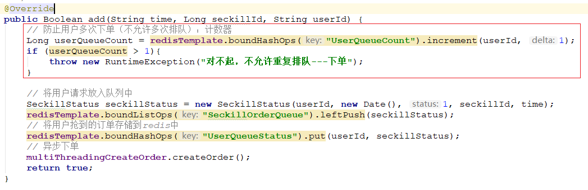

上图代码如下：

```java
// 防止用户多次下单（不允许多次排队）：计数器
Long userQueueCount = redisTemplate.boundHashOps("UserQueueCount_" + userId).increment(seckillId, 1);
        if (userQueueCount > 1){
            throw new RuntimeException("请勿重复下单...");
        }
```


## 1.2 更新SeckillOrderController

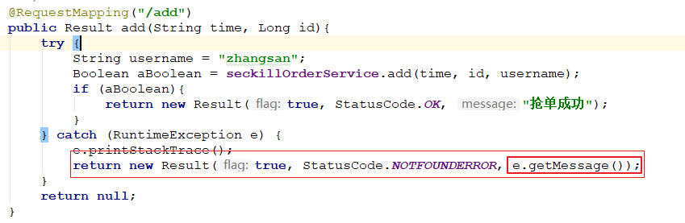

~~~java
@RequestMapping("/add")
public Result add(String time, Long id){
    try {
        String username = "zhangsan";
        Boolean aBoolean = seckillOrderService.add(time, id, username);
        if (aBoolean){
            return new Result(true, StatusCode.OK, "抢单成功");
        }
    } catch (RuntimeException e) {
        e.printStackTrace();
        return new Result(true, StatusCode.NOTFOUNDERROR, e.getMessage());
    }
    return null;
}
~~~


## 1.3 测试

测试：`<http://localhost:18091/seckillOrder/add?time=2019082810&id=1131815341014519808>`

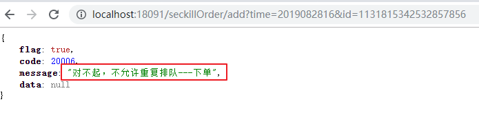

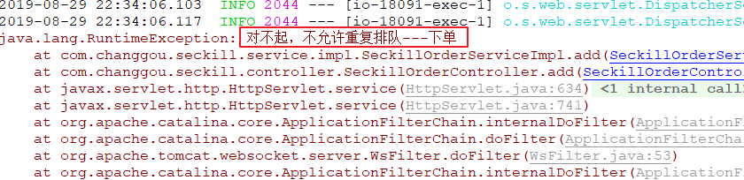


# 2 并发超卖问题解决

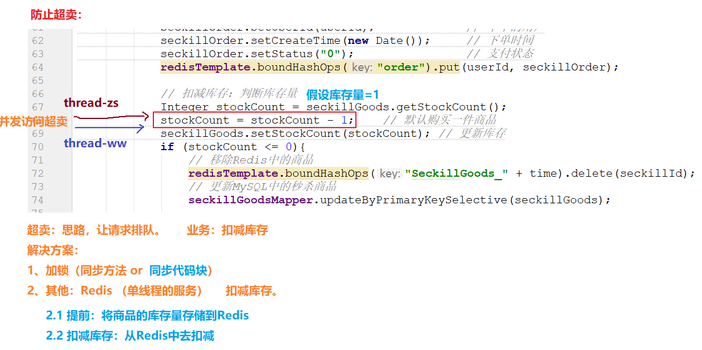


## 2.1 场景描述

异步下单的代码中：如果有多个请求并发执行该指定位置，那么就可能会造成超卖现象。

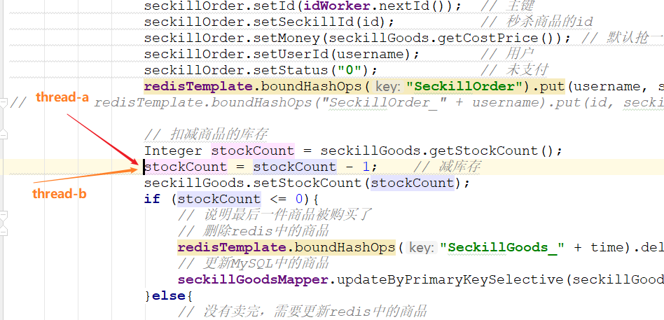

超卖问题，这里是指多人抢购同一商品的时候，多人同时判断是否有库存，如果只剩一个，则都会判断有库存，此时会导致超卖现象产生，也就是一个商品下了多个订单的现象。

## 2.2 思路分析


解决超卖问题，可以利用Redis队列实现，给每件商品创建一个独立的商品个数队列，例如：A商品有2个，A商品的ID为1001，则可以创建一个队列,key=SeckillGoodsCountList_1001,往该队列中塞2次该商品ID。

每次给用户下单的时候，先从队列中取数据，如果能取到数据，则表明有库存，如果取不到，则表明没有库存，这样就可以防止超卖问题产生了。

在我们队Redis进行操作的时候，很多时候，都是先将数据查询出来，在内存中修改，然后存入到Redis，在并发场景，会出现数据错乱问题，为了控制数量准确，我们单独将商品数量整一个自增键，自增键是线程安全的，所以不担心并发场景的问题。


## 2.3 代码实现

将商品的库存量放入Redis中。**修改定时任务代码**。

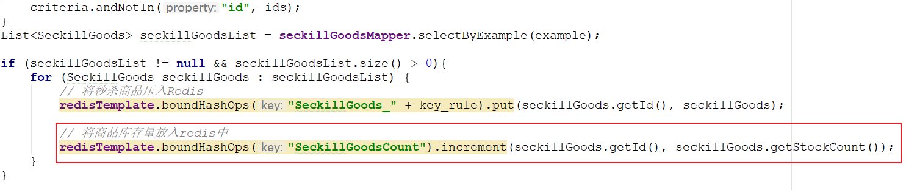

```java
List<SeckillGoods> seckillGoodsList = seckillGoodsMapper.selectByExample(example);
if (seckillGoodsList != null && seckillGoodsList.size() > 0){
    for (SeckillGoods seckillGoods : seckillGoodsList) {
        // 将秒杀商品压入Redis
        redisTemplate.boundHashOps("SeckillGoods_" + key_rule).put(seckillGoods.getId(), seckillGoods);

        // 将商品库存量放入redis中
        redisTemplate.boundHashOps("SeckillGoodsCount").increment(seckillGoods.getId(), seckillGoods.getStockCount());
    }
}
```


## 2.4 超卖控制-利用redis单线程特性

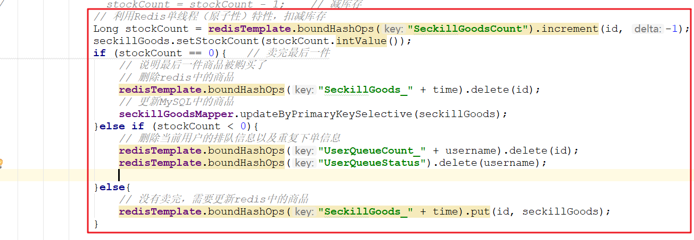

修改多线程下单方法，扣减商品库存量：

上图代码如下：

```java
@Component
public class MultiThreadingCreateOrder {

    @Autowired(required = false)
    private SeckillGoodsMapper seckillGoodsMapper;

    @Autowired
    private RedisTemplate redisTemplate;

    @Autowired
    private IdWorker idWorker;


    @Async
    public void submitOrder(){
        try {
            // 取出用户下单的排队信息
            SeckillStatus seckillStatus = (SeckillStatus) redisTemplate.boundListOps("SeckillOrderQueue").rightPop();
            if (seckillStatus != null){
                String username = seckillStatus.getUsername();
                Long id = seckillStatus.getGoodsId();
                String time = seckillStatus.getTime();

                // 从redis中取出商品
                SeckillGoods seckillGoods = (SeckillGoods) redisTemplate.boundHashOps("SeckillGoods_" + time).get(id);
                if (seckillGoods == null){
                    throw new RuntimeException("该商品已售罄");
                }

                // 保存订单到redis中
                SeckillOrder seckillOrder = new SeckillOrder();
                seckillOrder.setId(idWorker.nextId());  // 主键
                seckillOrder.setSeckillId(id);          // 秒杀商品的id
                seckillOrder.setMoney(seckillGoods.getCostPrice()); // 默认抢一件
                seckillOrder.setUserId(username);       // 用户
                seckillOrder.setStatus("0");            // 未支付
                redisTemplate.boundHashOps("SeckillOrder").put(username, seckillOrder);
//        redisTemplate.boundHashOps("SeckillOrder_" + username).put(id, seckillOrder);

                // 扣减商品的库存
//                Integer stockCount = seckillGoods.getStockCount();
//                stockCount = stockCount - 1;    // 减库存
                // 利用Redis单线程（原子性）特性，扣减库存
                Long stockCount = redisTemplate.boundHashOps("SeckillGoodsCount").increment(id, -1);
                seckillGoods.setStockCount(stockCount.intValue());
                if (stockCount == 0){   // 卖完最后一件
                    // 说明最后一件商品被购买了
                    // 删除redis中的商品
                    redisTemplate.boundHashOps("SeckillGoods_" + time).delete(id);
                    // 更新MySQL中的商品
                    seckillGoodsMapper.updateByPrimaryKeySelective(seckillGoods);
                }else if (stockCount < 0){
                    // 删除当前用户的排队信息以及重复下单信息
                    redisTemplate.boundHashOps("UserQueueCount_" + username).delete(id);
                    redisTemplate.boundHashOps("UserQueueStatus").delete(username);
                    
                }else{
                    // 没有卖完，需要更新redis中的商品
                    redisTemplate.boundHashOps("SeckillGoods_" + time).put(id, seckillGoods);
                }

                // 下单完成
                seckillStatus.setMoney(Float.valueOf(seckillOrder.getMoney()));   // 订单支付金额
                seckillStatus.setOrderId(seckillOrder.getId());                   // 订单id
                seckillStatus.setStatus(2);                                       // 待支付
                redisTemplate.boundHashOps("UserQueueStatus").put(username, seckillStatus);
            }
        } catch (Exception e) {
            e.printStackTrace();
        }
    }
    
}
```


# 3 异步请求异常处理

## 3.1 存在的问题

service层：

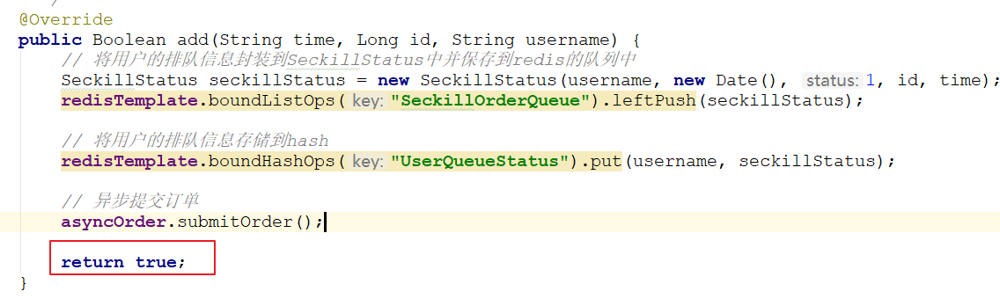


Controller层：

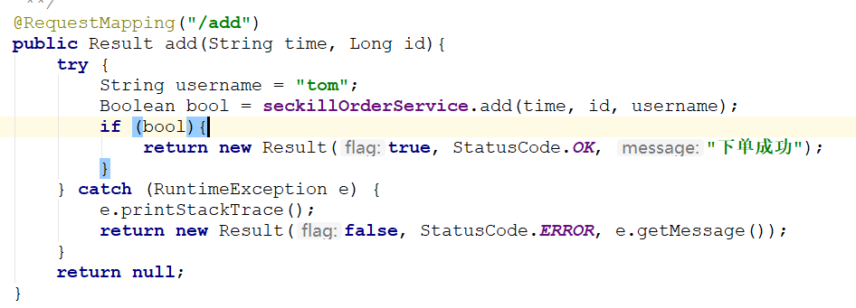

在之前的代码中，我们的service层不管我们下单成功还是失败，我们永远返回的都是**true**，所有Controller层的代码都是响应我们的下单成功，那么这个肯定是不合适的。因此需要解决该问题。


## 3.2 解决方案

在JDK中提供了Future接口来处理我们异步执行的异常。

~~~properties
public interface Future<V>
Future 表示异步计算的结果。它提供了检查计算是否完成的方法，以等待计算的完成，并获取计算的结果。计算完成后只能使用 get 方法来获取结果，如有必要，计算完成前可以阻塞此方法。取消则由 cancel 方法来执行。还提供了其他方法，以确定任务是正常完成还是被取消了。一旦计算完成，就不能再取消计算。如果为了可取消性而使用 Future 但又不提供可用的结果，则可以声明 Future<?> 形式类型、并返回 null 作为底层任务的结果。
~~~


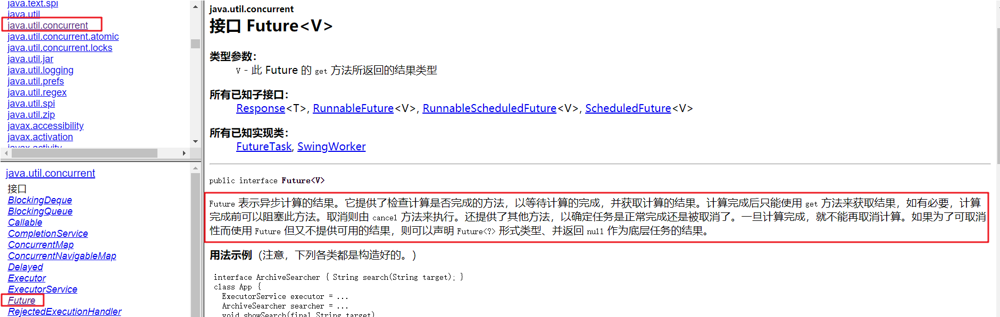

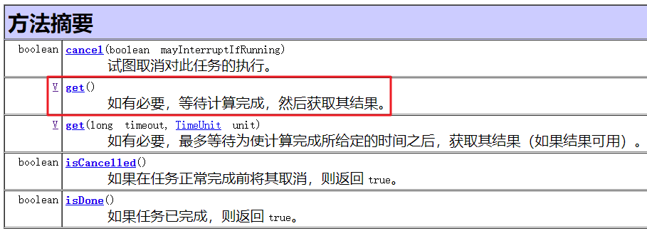


## 3.3 代码实现

### 3.3.1 修改异步下单代码

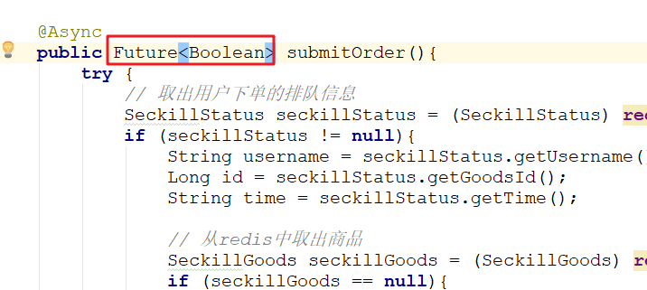


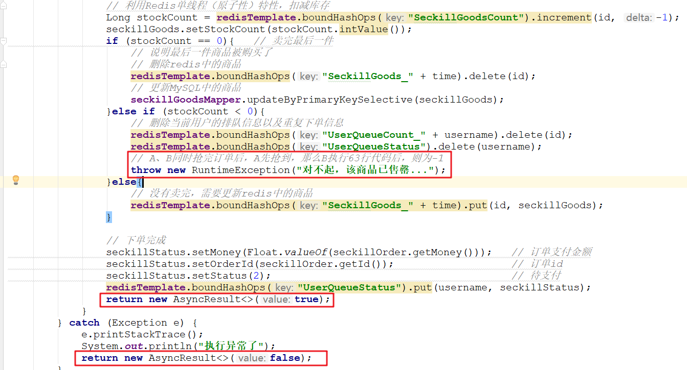

完整代码如下：

~~~java
@Async
public Future<Boolean> submitOrder(){
    try {
        // 取出用户下单的排队信息
        SeckillStatus seckillStatus = (SeckillStatus) redisTemplate.boundListOps("SeckillOrderQueue").rightPop();
        if (seckillStatus != null){
            String username = seckillStatus.getUsername();
            Long id = seckillStatus.getGoodsId();
            String time = seckillStatus.getTime();

            // 从redis中取出商品
            SeckillGoods seckillGoods = (SeckillGoods) redisTemplate.boundHashOps("SeckillGoods_" + time).get(id);
            if (seckillGoods == null){
                throw new RuntimeException("该商品已售罄");
            }

            // 保存订单到redis中
            SeckillOrder seckillOrder = new SeckillOrder();
            seckillOrder.setId(idWorker.nextId());  // 主键
            seckillOrder.setSeckillId(id);          // 秒杀商品的id
            seckillOrder.setMoney(seckillGoods.getCostPrice()); // 默认抢一件
            seckillOrder.setUserId(username);       // 用户
            seckillOrder.setStatus("0");            // 未支付
            redisTemplate.boundHashOps("SeckillOrder").put(username, seckillOrder);
            //        redisTemplate.boundHashOps("SeckillOrder_" + username).put(id, seckillOrder);

            // 扣减商品的库存
            //                Integer stockCount = seckillGoods.getStockCount();
            //                stockCount = stockCount - 1;    // 减库存
            // 利用Redis单线程（原子性）特性，扣减库存
            Long stockCount = redisTemplate.boundHashOps("SeckillGoodsCount").increment(id, -1);
            seckillGoods.setStockCount(stockCount.intValue());
            if (stockCount == 0){   // 卖完最后一件
                // 说明最后一件商品被购买了
                // 删除redis中的商品
                redisTemplate.boundHashOps("SeckillGoods_" + time).delete(id);
                // 更新MySQL中的商品
                seckillGoodsMapper.updateByPrimaryKeySelective(seckillGoods);
            }else if (stockCount < 0){
                // 删除当前用户的排队信息以及重复下单信息
                redisTemplate.boundHashOps("UserQueueCount_" + username).delete(id);
                redisTemplate.boundHashOps("UserQueueStatus").delete(username);
                // A、B同时抢完订单后，A先抢到，那么B执行63行代码后，则为-1
                throw new RuntimeException("对不起，该商品已售罄...");
            }else{
                // 没有卖完，需要更新redis中的商品
                redisTemplate.boundHashOps("SeckillGoods_" + time).put(id, seckillGoods);
            }

            // 下单完成
            seckillStatus.setMoney(Float.valueOf(seckillOrder.getMoney()));   // 订单支付金额
            seckillStatus.setOrderId(seckillOrder.getId());                   // 订单id
            seckillStatus.setStatus(2);                                       // 待支付
            redisTemplate.boundHashOps("UserQueueStatus").put(username, seckillStatus);
            return new AsyncResult<>(true);
        }
    } catch (Exception e) {
        e.printStackTrace();
        System.out.println("执行异常了");
        return new AsyncResult<>(false);
    }
    return null;
}
~~~


### 3.3.2 修改service层代码

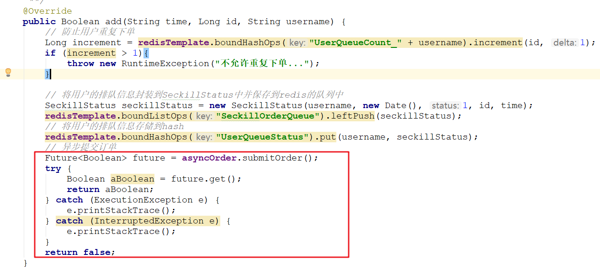

### 3.3.3 修改Controller层代码


# 3 秒杀订单支付

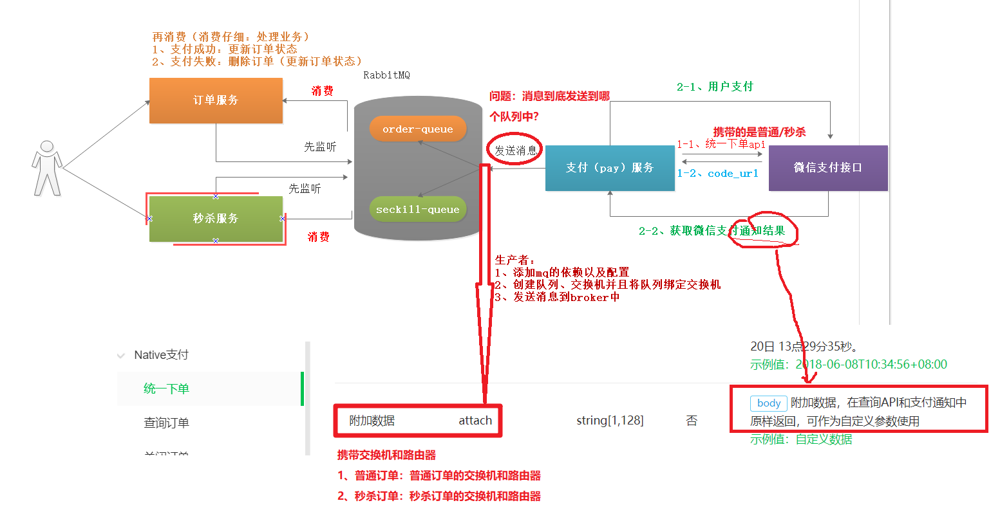


通过附加数据：将消息发送对应的队列中（普通队列/秒杀队列）


## 3.2 创建支付二维码

下单成功后，会跳转到支付选择页面，在支付选择页面要显示订单编号和订单金额，所以我们需要在下单的时候，将订单金额以及订单编号信息存储到用户查询对象中。

选择微信支付后，会跳转到微信支付页面，微信支付页面会根据用户名查看用户秒杀订单，并根据用户秒杀订单的ID创建预支付信息并获取二维码信息，展示给用户看,此时页面每3秒查询一次支付状态，如果支付成功，需要修改订单状态信息。


### 3.2.1 回显订单信息

下单后，进入支付选择页面，需要显示订单号和订单金额，所以需要在用户下单后将该数据传入到pay.html页面，所以查询订单状态的时候，需要将订单号和金额封装到查询的信息中，修改查询订单装的方法加入他们即可。

修改SeckillOrderController的queryStatus方法，代码如下：

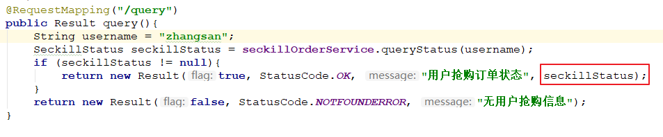

上图代码如下：

```java
return new Result(true,seckillStatus.getStatus(),"抢购状态",seckillStatus);
```


使用Postman测试，效果如下：

`<http://localhost:18091/seckillOrder/query>`


### 3.2.2 创建二维码

用户创建二维码，可以先查询用户的秒杀订单抢单信息，然后再发送请求到支付微服务中创建二维码，将订单编号以及订单对应的金额传递到支付微服务:`/weixin/pay/create/native`。

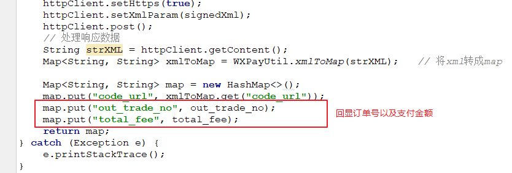

使用Postman测试效果如下：

`<http://localhost:18090/weixin/pay/create/native?outtradeno=1132510782836314112&money=1>`


## 3.3 支付流程分析


如上图，步骤分析如下：

```properties
1.用户抢单，经过秒杀系统实现抢单，下单后会将向MQ发送一个延时队列消息，包含抢单信息，延时半小时后才能监听到
2.秒杀系统同时启用延时消息监听，一旦监听到订单抢单信息，判断Redis缓存中是否存在订单信息，如果存在，则回滚
3.秒杀系统还启动支付回调信息监听，如果支付完成，则将订单吃句话到MySQL，如果没完成，清理排队信息回滚库存
4.每次秒杀下单后调用支付系统，创建二维码，如果用户支付成功了，微信系统会将支付信息发送给支付系统指定的回调地址，支付系统收到信息后，将信息发送给MQ，第3个步骤就可以监听到消息了。
```


## 3.4 支付回调更新

支付回调这一块代码已经实现了，但之前实现的是订单信息的回调数据发送给MQ，指定了对应的队列，不过现在需要实现的是秒杀信息发送给指定队列，所以之前的代码那块需要动态指定队列。

### 3.4.1 修改pay服务

关于指定队列如下：

```properties
1.创建支付二维码需要指定队列
2.回调地址回调的时候，获取支付二维码指定的队列，将支付信息发送到指定队列中
```

在微信支付统一下单API中，有一个附加参数,如下：

```properties
attach:附加数据,String(127)，在查询API和支付通知中原样返回，可作为自定义参数使用。
```

我们可以在创建二维码的时候，指定该参数，该参数用于指定回调支付信息的对应队列，每次回调的时候，会获取该参数，然后将回调信息发送到该参数对应的队列去。


#### 3.4.1.1 改造创建生成二维码方法

1、修改支付微服务的WeixinPayController的createNative方法，代码如下：

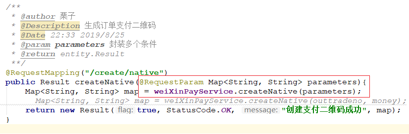


2、修改支付微服务的WeixinPayService的createNative方法，代码如下：

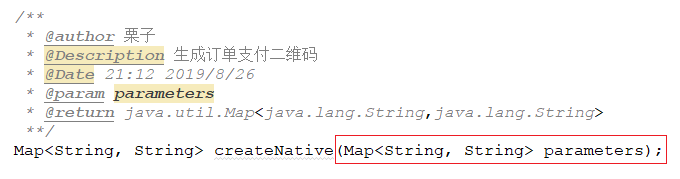


3、修改支付微服务的WeixinPayServiceImpl的createNative方法，代码如下：

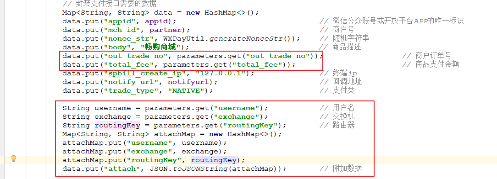

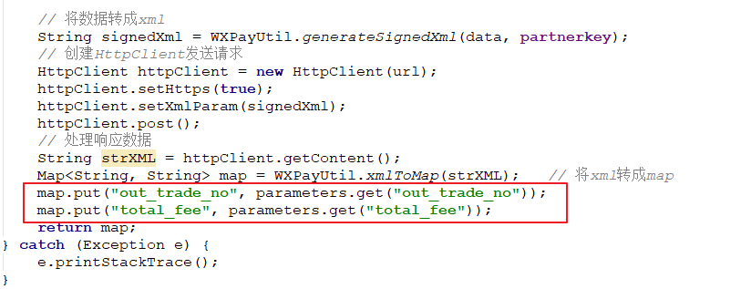


#### 3.4.1.2 创建新的队列

修改application.yml文件：

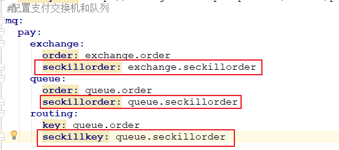

```properties
#配置支付交换机和队列
mq:
  pay:
    exchange:
      order: exchange.order
      seckillorder: exchange.seckillorder
    queue:
      order: queue.order
      seckillorder: queue.seckillorder
    routing:
      key: queue.order
      seckillkey: queue.seckillorder
```


修改WeixinPayApplication，添加对应队列以及对应交换机绑定，代码如下：

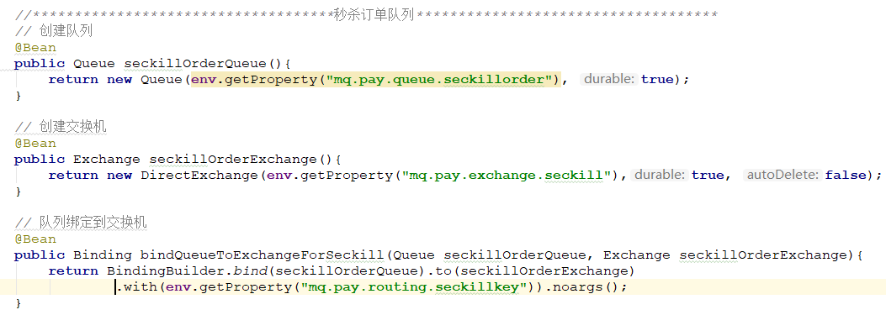

```java
@SpringBootApplication(exclude={DataSourceAutoConfiguration.class})
@EnableEurekaClient
public class WeiXinPayApplication {

    public static void main(String[] args) {
        SpringApplication.run(WeiXinPayApplication.class, args);
    }

    @Autowired
    private Environment env;

    // 创建队列
    @Bean
    public Queue orderQueue(){
        return new Queue(env.getProperty("mq.pay.queue.order"), true);
    }

    // 创建交换机
    @Bean
    public Exchange orderExchange(){
        return new DirectExchange(env.getProperty("mq.pay.exchange.order"),true, false);
    }

    // 队列绑定到交换机
    @Bean
    public Binding bindQueueToExchange(Queue orderQueue, Exchange orderExchange){
        return BindingBuilder.bind(orderQueue).to(orderExchange).with(env.getProperty("mq.pay.routing.key")).noargs();
    }

    //************************************秒杀订单队列************************************
    // 创建队列
    @Bean
    public Queue seckillOrderQueue(){
        return new Queue(env.getProperty("mq.pay.queue.seckillorder"), true);
    }

    // 创建交换机
    @Bean
    public Exchange seckillOrderExchange(){
        return new DirectExchange(env.getProperty("mq.pay.exchange.seckill"),true, false);
    }

    // 队列绑定到交换机
    @Bean
    public Binding bindQueueToExchangeForSeckill(Queue seckillOrderQueue, Exchange seckillOrderExchange){
        return BindingBuilder.bind(seckillOrderQueue).to(seckillOrderExchange)
                .with(env.getProperty("mq.pay.routing.seckillkey")).noargs();
    }
}
```


#### 3.4.1.3 改造支付回调方法

修改com.changgou.pay.controller.WeixinPayController的notifyUrl方法，获取自定义参数，并转成Map，获取queue地址，并将支付信息发送到绑定的queue中，代码如下：

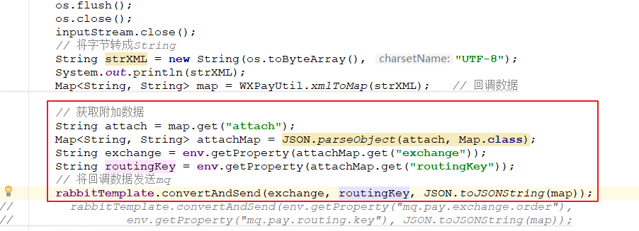


#### 3.4.1.4 测试

PS：我们创建二维码的时候，需要将下面几个参数传递过去

```properties
username:用户名,可以根据用户名查询用户排队信息
outtradeno：商户订单号，下单必须
money：支付金额，支付必须
交换机：队列需要绑定到该交换机
路由器：路由到指定消费方
```

`<http://localhost:18091/weixin/pay/create/native?out_trade_no=sz001&total_fee=1&username=tom&exchange=mq.pay.exchange.seckillorder&routingKey=mq.pay.routing.seckillkey>`

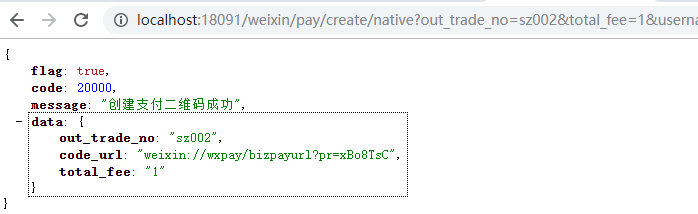


支付成功后，回调地址：

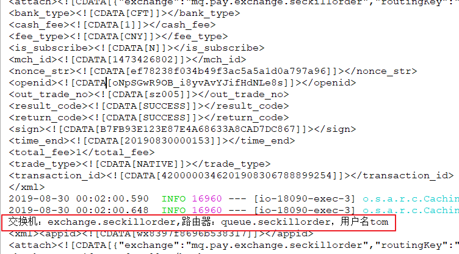


MQ中的数据：

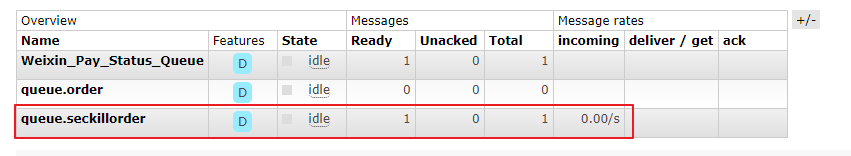


### 3.4.2 支付状态监听

支付状态通过回调地址发送给MQ之后，我们需要在秒杀系统中监听支付信息，如果用户已支付，则修改用户订单状态，如果支付失败，则直接删除订单，回滚库存。

在秒杀工程中创建com.changgou.seckill.consumer.SeckillOrderPayMessageListener,实现监听消息，代码如下:

```java
/**
 * @ClassName SeckillOrderMessageListener
 * @Description 秒杀订单监听器
 * @Author 传智播客
 * @Date 0:34 2019/8/30
 * @Version 2.1
 **/
@Component
@RabbitListener(queues = "${mq.pay.queue.seckillorder}")
public class SeckillOrderMessageListener {

    @Autowired
    private SeckillOrderService seckillOrderService;

    @Autowired
    private RedisTemplate redisTemplate;

    /**
     * @author 栗子
     * @Description 监听mq
     * @Date 0:38 2019/8/30
     * @param text
     * @return void
     **/
    @RabbitHandler
    public void readSeckillOrderMessage(String text) throws ParseException {
        Map<String, String> map = JSON.parseObject(text, Map.class);
        // 获取交易标识
        String return_code = map.get("return_code");
        if ("SUCCESS".equals(return_code)){
            // 获取用户名
            String attach = map.get("attach");
            Map<String, String> attachMap = JSON.parseObject(attach, Map.class);
            String username = attachMap.get("username");
            // 获取交易标识
            String result_code = map.get("result_code");
            if ("SUCCESS".equals(result_code)){
                // 更新订单
                String out_trade_no = map.get("out_trade_no");
                String transaction_id = map.get("transaction_id");
                String time_end = map.get("time_end");
                seckillOrderService.updateStatus(out_trade_no, transaction_id, username, time_end);
            }else {
                // 删除订单
                seckillOrderService.deleteOrder(username);
            }
        }
    }
}
```


修改application.yml文件，添加如下配置：

```properties
#配置mq队列名称
mq:
  pay:
    queue:
      seckillorder: queue.seckillorder
```


添加依赖：

~~~xml
<!--加入ampq-->
<dependency>
    <groupId>org.springframework.boot</groupId>
    <artifactId>spring-boot-starter-amqp</artifactId>
</dependency>
~~~


### 3.4.3 修改秒杀订单状态

监听到支付信息后，根据支付信息判断，如果用户支付成功，则修改订单信息，并将订单入库，删除用户排队信息，如果用户支付失败，则删除订单信息，回滚库存，删除用户排队信息。

#### 3.4.3.1 业务层

修改SeckillOrderService，添加修改订单方法，代码如下

```java
/**
     * @author 栗子 
     * @Description 更新秒杀订单
     * @Date 0:06 2019/8/30
     * @param out_trade_no      订单号
     * @param transaction_id    交易流水号
     * @param username          用户名
     * @param timeEnd           交易时间
     * @return void
     **/
void updateStatus(String out_trade_no, String transaction_id, String username, String timeEnd);
```


修改SeckillOrderServiceImpl，添加修改订单方法实现，代码如下：

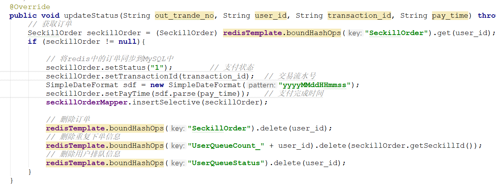

```java
/**
     * @author 栗子
     * @Description 更新秒杀订单
     * @Date 0:06 2019/8/30
     * @param out_trade_no      订单号
     * @param transaction_id    交易流水号
     * @param username          用户名
     * @param timeEnd           交易时间
     * @return void
     **/
@Override
public void updateStatus(String out_trande_no, String user_id, String transaction_id, String pay_time) throws ParseException {
    // 获取订单
    SeckillOrder seckillOrder = (SeckillOrder) redisTemplate.boundHashOps("SeckillOrder").get(user_id);
    if (seckillOrder != null){

        // 将redis中的订单同步到MySQL中
        seckillOrder.setStatus("1");        // 支付状态
        seckillOrder.setTransactionId(transaction_id);  // 交易流水号
        SimpleDateFormat sdf = new SimpleDateFormat("yyyyMMddHHmmss");
        seckillOrder.setPayTime(sdf.parse(pay_time));   // 支付完成时间
        seckillOrderMapper.insertSelective(seckillOrder);

        // 删除订单
        redisTemplate.boundHashOps("SeckillOrder").delete(user_id);
        // 删除重复下单信息
        redisTemplate.boundHashOps("UserQueueCount_" + user_id).delete(seckillOrder.getSeckillId());
        // 删除用户排队信息
        redisTemplate.boundHashOps("UserQueueStatus").delete(user_id);
    }
}
```


#### 3.4.3.2 修改订单对接

修改微信支付状态监听的代码，当用户支付成功后，修改订单状态，也就是调用上面的方法，代码如下：

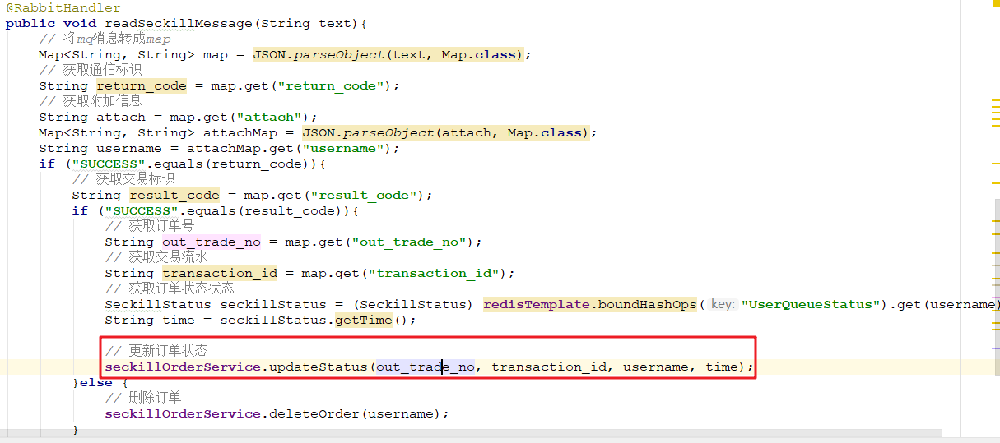


### 3.4.4 删除秒杀订单回滚库存

如果用户支付失败，我们需要删除用户订单数据，并回滚库存。

#### 3.4.4.1 业务层实现

修改SeckillOrderService，创建一个关闭订单方法，代码如下：

```java
/**
     * @author 栗子
     * @Description 删除秒杀订单（更新状态）
     * @Date 0:13 2019/8/30
     * @param username
     * @return void
     **/
void deleteOrder(String username);
```


修改SeckillOrderServiceImpl，创建一个关闭订单实现方法，代码如下：

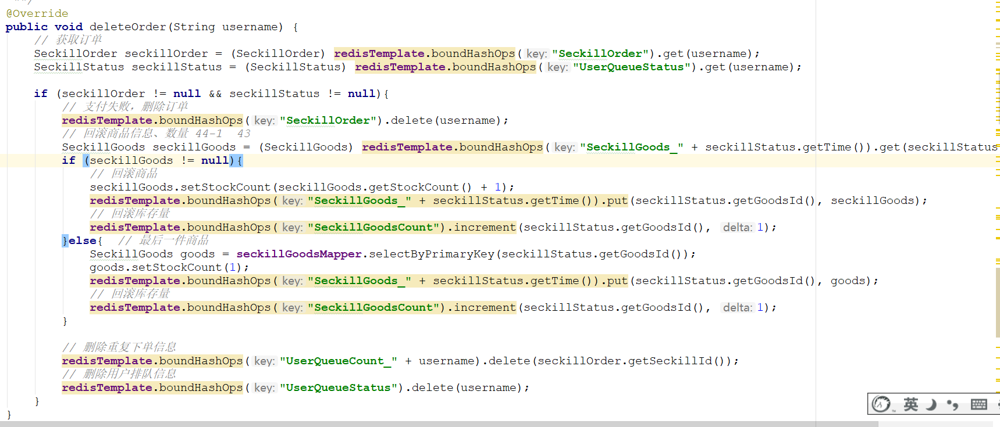

```java
/**
     * @author 栗子
     * @Description 删除秒杀订单（更新状态）
     * @Date 0:13 2019/8/30
     * @param username
     * @return void
     **/
@Override
public void deleteOrder(String username) {
    // 获取订单
    SeckillOrder seckillOrder = (SeckillOrder) redisTemplate.boundHashOps("SeckillOrder").get(username);
    SeckillStatus seckillStatus = (SeckillStatus) redisTemplate.boundHashOps("UserQueueStatus").get(username);

    if (seckillOrder != null && seckillStatus != null){
        // 支付失败，删除订单
        redisTemplate.boundHashOps("SeckillOrder").delete(username);
        // 回滚商品信息、数量 44-1  43
        SeckillGoods seckillGoods = (SeckillGoods) redisTemplate.boundHashOps("SeckillGoods_" + seckillStatus.getTime()).get(seckillStatus.getGoodsId());
        if (seckillGoods != null){
            // 回滚商品
            seckillGoods.setStockCount(seckillGoods.getStockCount() + 1);
            redisTemplate.boundHashOps("SeckillGoods_" + seckillStatus.getTime()).put(seckillStatus.getGoodsId(), seckillGoods);
            // 回滚库存量
            redisTemplate.boundHashOps("SeckillGoodsCount").increment(seckillStatus.getGoodsId(), 1);
        }else{  // 最后一件商品
            SeckillGoods goods = seckillGoodsMapper.selectByPrimaryKey(seckillStatus.getGoodsId());
            goods.setStockCount(1);
            redisTemplate.boundHashOps("SeckillGoods_" + seckillStatus.getTime()).put(seckillStatus.getGoodsId(), goods);
            // 回滚库存量
            redisTemplate.boundHashOps("SeckillGoodsCount").increment(seckillStatus.getGoodsId(), 1);
        }

        // 删除重复下单信息
        redisTemplate.boundHashOps("UserQueueCount_" + username).delete(seckillOrder.getSeckillId());
        // 删除用户排队信息
        redisTemplate.boundHashOps("UserQueueStatus").delete(username);
    }
}
```


#### 3.4.4.2 调用删除订单

修改SeckillOrderPayMessageListener，在用户支付失败后调用关闭订单方法，代码如下：


```java
// 删除订单
seckillOrderService.deleteOrder(username);
```


### 3.4.5 测试

- 下单：`<http://localhost:18091/seckillOrder/add?time=2019110216&id=1131815688269336576>`
- 创建支付二维码：`<http://localhost:18090/pay/create/native?out_trade_no=1131815688269336576&total_fee=1&username=zhangsan&exchange=mq.pay.exchange.seckillorder&routingKey=mq.pay.routing.seckillkey>`
- 扫码支付：略


使用Postman完整请求创建二维码下单测试一次。

商品ID：1131814854034853888

数量：49


下单：


支付微服务回调方法控制台：

```json
{
	nonce_str=Mnv06RIaIwxzg3bA, 
    code_url=weixin://wxpay/bizpayurl?pr=iTidd5h, 
    appid=wx8397f8696b538317, 
    sign=1436E43FBA8A171D79A9B78B61F0A7AB, 
    trade_type=NATIVE, 
    return_msg=OK, 
    result_code=SUCCESS, 
    mch_id=1473426802, 
    return_code=SUCCESS, 
    prepay_id=wx2614182102123859e3869a853739004200
}
{money=1, queue=queue.seckillorder, username=szitheima, outtradeno=1132530879663575040}
```


订单微服务控制台输出

```json
{
    transaction_id=4200000289201905268232990890,
    nonce_str=a1aefe00a9bc4e8bb66a892dba38eb42,
    bank_type=CMB_CREDIT,
    openid=oNpSGwUp-194-Svy3JnVlAxtdLkc,
    sign=56679BC02CC82204635434817C1FCA46,
    fee_type=CNY,
    mch_id=1473426802,
    cash_fee=1,
    out_trade_no=1132530879663575040,
    appid=wx8397f8696b538317,
    total_fee=1,
    trade_type=NATIVE,
    result_code=SUCCESS,
    attach={
    "username": "szitheima",
    "outtradeno": "1132530879663575040",
    "money": "1",
    "queue": "queue.seckillorder"
  }, time_end=20190526141849, is_subscribe=N, return_code=SUCCESS
}
```


# 4 RabbitMQ延时消息队列-略

RabbitMQ中：

- 本身并没有提供延时队列，但是我们可以通过RabbitMQ的死信队列  + 消息/队列过期时间来实现延时队列
- 延时队列：设置消息/队列的过期时间，（在该过期时间内不消费消息， 消息会通过交换机和路由器转发到其他的队列中）
- 使用场景：
  - 订单支付：将消息发送到延时队列（30分钟）
  - 智能家电：通过手机的功能（指定电饭煲30后煮饭）
  - 更新邮箱：每隔一段时间推送一次

  

## 4.1 延时队列介绍

”延时消息”是指当消息被发送以后，并不想让消费者立即拿到消息，而是等待指定时间后，消费者才拿到这个消息进行消费。 

那么，为什么需要延迟消费呢？我们来看以下的场景：

场景一：在订单系统中，一个用户下单之后通常有30分钟的时间进行支付，如果30分钟之内没有支付成功，那么这个订单将进行异常处理（取消订单）。这是就可以使用延时队列将订单信息发送到延时队列。

场景二：用户希望通过手机远程遥控家里的智能设备在指定的时间进行工作。这时候就可以将用户指令发送到延时队列，当指令设定的时间到了再将指令推送到只能设备。

场景三：30min定时推送一次邮件信息。 


## 4.2 TTL DLX实现延时队列

### 4.2.1 TTL + DLX介绍

~~~properties
在AMQP协议中，或者RabbitMQ本身没有直接支持延迟队列的功能，但是可以通过配置死信队列和设置消息或队列的过期时间来模拟出延迟队列的功能。

TTL：Time To Live，设置消息TTL的两种方式：（毫秒）
1、创建队列时指定x-message-ttl，此时队列中所有的消息具有统一过期时间
2、发送消息为每个消息设置 expiration，此时消息之间过期时间不同
如果同时使用，则消息的过期时间以两者之间TTL较小的那个数值为准。消息在队列的生存时间一旦超过设置的TTL值，就成为dead letter

DLX：Dead Letter Exchanges
队列可以配置x-dead-letter-exchange 和x-dead-letter-routing-key（可选）两个参数，当消息达到过期时间未被消费则会由该x-dead-letter-exchange按照配置的x-dead-letter-routing-key转发到指定队列，最后被消费者消费，如果未配置x-dead-letter-routing-key则会按照原队列的key进行转发。

综合上述两个特性，设置了TTL规则之后当消息在一个队列中变成死信时，利用DLX特性它能被重新转发到另一Exchange或者Routing Key，这时候消息就可以重新被消费了。

~~~


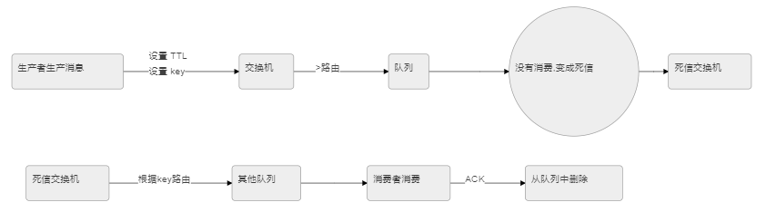


### 4.2.3 DLX延时队列实现

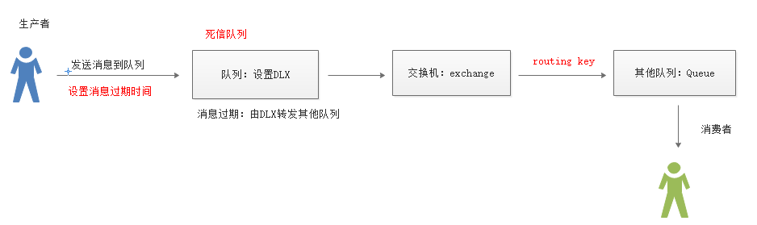

#### 4.2.3.1 创建工程

单独创建springboot-rabbitmq-delay工程，并引入相关依赖

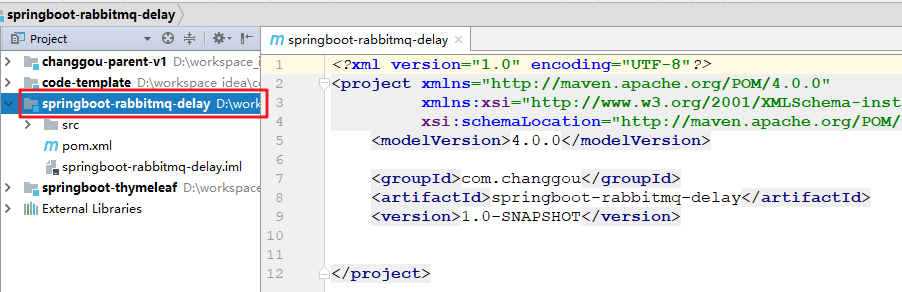

```xml
<?xml version="1.0" encoding="UTF-8"?>
<project xmlns="http://maven.apache.org/POM/4.0.0"
         xmlns:xsi="http://www.w3.org/2001/XMLSchema-instance"
         xsi:schemaLocation="http://maven.apache.org/POM/4.0.0 http://maven.apache.org/xsd/maven-4.0.0.xsd">
    <modelVersion>4.0.0</modelVersion>
    
    <groupId>com.changgou</groupId>
    <artifactId>springboot-rabbitmq-delay</artifactId>
    <version>1.0-SNAPSHOT</version>

    <!--起步依赖-->
    <parent>
        <groupId>org.springframework.boot</groupId>
        <artifactId>spring-boot-starter-parent</artifactId>
        <version>2.1.4.RELEASE</version>
    </parent>
    
    <dependencies>
        <!--starter-web-->
        <dependency>
            <groupId>org.springframework.boot</groupId>
            <artifactId>spring-boot-starter-web</artifactId>
        </dependency>

        <!--加入ampq-->
        <dependency>
            <groupId>org.springframework.boot</groupId>
            <artifactId>spring-boot-starter-amqp</artifactId>
        </dependency>

        <!--测试-->
        <dependency>
            <groupId>org.springframework.boot</groupId>
            <artifactId>spring-boot-starter-test</artifactId>
        </dependency>
    </dependencies>
</project>
```


application.yml配置

```properties
spring:
  application:
    name: springboot-rabbitmq-delay
  rabbitmq:
    host: 192.168.211.132
    port: 5672
    password: guest
    username: guest
```


#### 4.2.3.2 队列创建（可以直接在启动类中创建）

创建2个队列，用于接收消息的叫延时队列queue.message.delay，用于转发消息的队列叫queue.message，同时创建一个交换机，代码如下：

```java
@Configuration
public class QueueConfig {

    /** 短信发送队列 */
    public static final String QUEUE_MESSAGE = "queue.message";

    /** 交换机 */
    public static final String DLX_EXCHANGE = "dlx.exchange";

    /** 短信发送队列 延迟缓冲（按消息） */
    public static final String QUEUE_MESSAGE_DELAY = "queue.message.delay";

    /**
     * 短信发送队列
     * @return
     */
    @Bean
    public Queue messageQueue() {
        return new Queue(QUEUE_MESSAGE, true);
    }

    /**
     * 短信发送队列
     * @return
     */
    @Bean
    public Queue delayMessageQueue() {
        return QueueBuilder.durable(QUEUE_MESSAGE_DELAY)
                .withArgument("x-dead-letter-exchange", DLX_EXCHANGE)        // 消息超时进入死信队列，绑定死信队列交换机
                .withArgument("x-dead-letter-routing-key", QUEUE_MESSAGE)   // 绑定指定的routing-key
                .build();
    }

    /***
     * 创建交换机
     * @return
     */
    @Bean
    public DirectExchange directExchange(){
        return new DirectExchange(DLX_EXCHANGE);
    }


    /***
     * 交换机与队列绑定
     * @param messageQueue
     * @param directExchange
     * @return
     */
    @Bean
    public Binding basicBinding(Queue messageQueue, DirectExchange directExchange) {
        return BindingBuilder.bind(messageQueue)
                .to(directExchange)
                .with(QUEUE_MESSAGE);
    }
}
```


#### 4.2.3.3 消息监听

创建MessageListener用于监听消息，代码如下：

```java
/**
 * @ClassName MessageListener
 * @Description
 * @Author 传智播客
 * @Date 1:29 2019/8/30
 * @Version 2.1
 **/
@Component
@RabbitListener(queues = "message.queue")
public class MessageListener {

    @RabbitHandler
    public void readMessage(String msg){
        SimpleDateFormat dateFormat = new SimpleDateFormat("yyyy-MM-dd HH:mm:ss");
        System.out.println("当前时间:"+dateFormat.format(new Date()));
        System.out.println("消费的消息：" + msg);
    }
}
```


#### 4.2.3.4 创建启动类

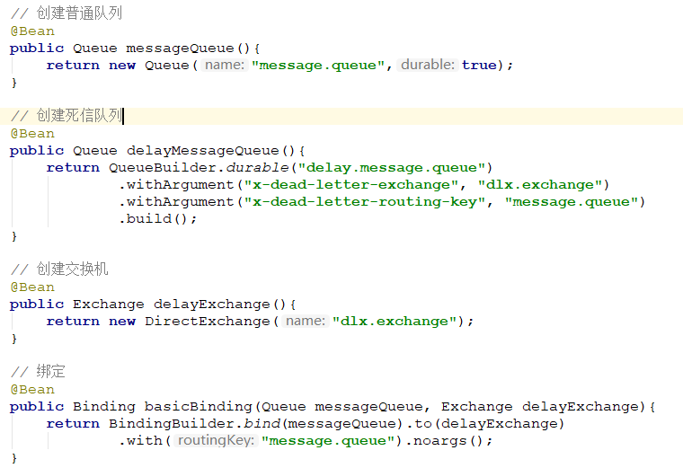

```java
@SpringBootApplication
public class DelayApplication {

    public static void main(String[] args) {
        SpringApplication.run(DelayApplication.class, args);
    }

    // 创建普通队列
    @Bean
    public Queue messageQueue(){
        return new Queue("message.queue",true);
    }

    // 创建死信队列
    @Bean
    public Queue delayMessageQueue(){
        return QueueBuilder.durable("delay.message.queue")
                .withArgument("x-dead-letter-exchange", "dlx.exchange")
                .withArgument("x-dead-letter-routing-key", "message.queue")
                .build();
    }

    // 创建交换机
    @Bean
    public Exchange delayExchange(){
        return new DirectExchange("dlx.exchange");
    }

    // 绑定
    @Bean
    public Binding basicBinding(Queue messageQueue, Exchange delayExchange){
        return BindingBuilder.bind(messageQueue).to(delayExchange)
                .with("message.queue").noargs();
    }
}
```


#### 4.2.3.5 测试

```java
@SpringBootTest
@RunWith(SpringRunner.class)
public class MqTest {

    @Autowired(required = false)
    private RabbitTemplate rabbitTemplate;

    @Test
    public void contextLoad() throws IOException {
        rabbitTemplate.convertAndSend("delay.message.queue", (Object) "欢迎来到黑马程序员", new MessagePostProcessor() {
            @Override
            public Message postProcessMessage(Message message) throws AmqpException {
                message.getMessageProperties().setExpiration("10000");
                return message;
            }
        });
        SimpleDateFormat dateFormat = new SimpleDateFormat("yyyy-MM-dd HH:mm:ss");
        System.out.println("发送当前时间:"+dateFormat.format(new Date()));
        System.in.read();
    }
}
```

其中message.getMessageProperties().setExpiration("10000");设置消息超时时间,超时后，会将消息转入到另外一个队列。

测试效果如下：

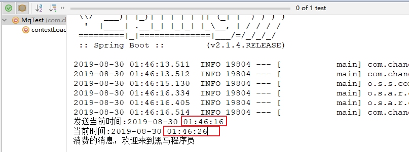


