# 第16章 集群高可用


- 不难      高工：>=15k         66期：18k （前端）  
- 90%：拉取的项目中都写好配置        最多：之前没有使用redis，现在要使用    yml，配置连接redis  
- 工作：只负责其中的一小部分的业务（代码）     需求不懂  一定要去问。
  - 业务分析
  - bug：第一次**思考**             入职的前期：多加班


分布式事务

1、事务的概念：略

2、事务分类：

- 本地事务：一个数据源
  - 解决方案：spring    @Transactional
- 分布式事务：
  - 单服务多数据源
  - 多服务多数据源

3、解决分布式的事务

- 基于XA协议的2PC（两段提交）：产品，mycat
- 补偿型事务：TCC（Try-Confirm-Cancel）   产品：阿里TCC框架
- MQ：
  - 生产者将消息发送到队列中，由相关的消费者监听并消费
  - 保证
    - 消息发送成功
    - 消息消费成功
- seata

4、分布式事务的最新的解决方案：seata

- 介绍：
  - 19.1开源的fescar，后期更名为seata
  - seata和使用本地事务的一样简单，对业务无侵入式：@GlobalTransactional
  - 相比其他的分布式产品，更高效
- 架构：图（略）     全局事务  ---->  分支事务
- 使用场景：略   多服务多数据源
- 入门案例：
  - 业务库业务表   +  额外**undo_log**日志表
  - 启动seata服务（软件）：Linux/Windows
  - 程序：@GlobalTransactional
- 将seata加入项目中：略。


学习目标

- 理解集群流程
- 理解分布式概念
- 能实现==Eureka集群==[集群配置]
- 能实现==Redis集群[Redis集群配置、哨兵策略(案例)、Redis击穿问题]==
- RabbitMQ集群【略】
- 项目中添加日志
- 项目的架构图


# 1 集群概述

## 1.1 什么是集群

### 1.1.1 集群概念

集群是一种计算机系统， 它通过一组松散集成的计算机软件和/或硬件连接起来高度紧密地协作完成计算工作。在某种意义上，他们可以被看作是一台计算机。集群系统中的单个计算机通常称为节点，通常通过局域网连接，但也有其它的可能连接方式。集群计算机通常用来改进单个计算机的计算速度和/或可靠性。一般情况下集群计算机比单个计算机，比如工作站或超级计算机性能价格比要高得多。


### 1.1.2 集群的特点

集群拥有以下两个特点：

1. 可扩展性：集群的性能不限制于单一的服务实体，新的服务实体可以动态的添加到集群，从而增强集群的性能。
2. 高可用性：集群当其中一个节点发生故障时，这台节点上面所运行的应用程序将在另一台节点被自动接管，消除单点故障对于增强数据可用性、可达性和可靠性是非常重要的。


### 1.1.3 集群的两大能力

故障移除

恢复添加


集群必须拥有以下两大能力：

1. 负载均衡：负载均衡把任务比较均匀的分布到集群环境下的计算和网络资源，以提高数据吞吐量。
2. 错误恢复：如果集群中的某一台服务器由于故障或者维护需要无法使用，资源和应用程序将转移到可用的集群节点上。这种由于某个节点的资源不能工作，另一个可用节点中的资源能够透明的接管并继续完成任务的过程，叫做错误恢复。

负载均衡和错误恢复要求各服务实体中有执行同一任务的资源存在，而且对于同一任务的各个资源来说，执行任务所需的信息视图必须是相同的。


## 1.2 集群与分布式的区别

说到集群，可能大家会立刻联想到另一个和它很相近的一个词----“分布式”。那么集群和分布式是一回事吗？有什么联系和区别呢?

相同点：

分布式和集群都是需要有很多节点服务器通过网络协同工作完成整体的任务目标。

不同点：

分布式是指将业务系统进行拆分，即分布式的每一个节点都是实现不同的功能。而集群每个节点做的是同一件事情。

如下图，每个人都有不同的分工，一起协作干一件事，叫做“分布式”


再看下图：每个划桨人干的都是一样的活，叫做集群。


分布式的每一个节点也可以做成集群。其实这个赛龙舟的图，总整体来看属于分布式,包括打鼓和划桨两个分布式节点，而划桨的节点又是集群的形态。


# 2 Eureka集群

## 2.1 Eureka简介

### 2.1.1 什么是Eureka

​	Eureka是一种基于REST（Representational State Transfer）的服务，主要用于AWS，用于定位服务，以实现中间层服务器的负载平衡和故障转移。我们将此服务称为Eureka Server。Eureka还附带了一个基于Java的客户端组件Eureka Client，它使与服务的交互变得更加容易。客户端还有一个内置的负载均衡器，可以进行基本的循环负载均衡。在Netflix，一个更复杂的负载均衡器包装Eureka，根据流量，资源使用，错误条件等多种因素提供加权负载平衡，以提供卓越的弹性。

理解：Eureka是一个服务注册与发现的注册中心。类似于dubbo中的zookeeper.

官网地址： https://github.com/Netflix/eureka/wiki/Eureka-at-a-glance

### 2.1.2 Eureka的架构


- application Service :相当于服务提供者
- application Client :相当于服务消费者
- make remote call :服务调用过程
- us-east-1c/d/e 都是region:us-east-1 的可用区域。

 

简单可以理解为：每一个erurak都是一个节点，默认启动时就是以集群的方式。

区别：

```
erurak:集群，各个节点的数据一致，各个节点都属于同等级别的注册中心，不存在leader的概念。
zookeeper：Zookeeper集群存在Leader节点，并且会进行Leader选举，Leader具有最高权限。
```


## 2.2 搭建Eureka集群

在一台机器运行多个实例，伪集群


配置host文件`C:\Windows\System32\drivers\etc\hosts`文件，添加映射

```
127.0.0.1 eureka-server1
127.0.0.1 eureka-server2
127.0.0.1 eureka-server3
```

### 2.2.1 创建工程

1、创建一个独立的父工程eureka-cluster-parent工程并添加依赖：

~~~xml
<!--起步依赖-->
<parent>
    <groupId>org.springframework.boot</groupId>
    <artifactId>spring-boot-starter-parent</artifactId>
    <version>2.1.4.RELEASE</version>
</parent>

<!--eureka服务-->
<dependencies>
    <dependency>
        <groupId>org.springframework.cloud</groupId>
        <artifactId>spring-cloud-starter-netflix-eureka-server</artifactId>
        <version>2.1.1.RELEASE</version>
    </dependency>
</dependencies>
~~~


2、在该工程下分别创建三个子工程，分别为：eureka-server1、eureka-server2、eureka-server3

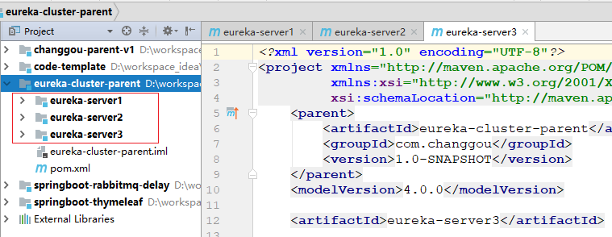


### 2.2.2 application.yml配置

- 每个工程创建启动类：略。

~~~java
@SpringBootApplication
@EnableEurekaServer
public class EurekaServer1Application {

    public static void main(String[] args) {
        SpringApplication.run(EurekaServer1Application.class, args);
    }
}

@SpringBootApplication
@EnableEurekaServer
public class EurekaServer2Application {

    public static void main(String[] args) {
        SpringApplication.run(EurekaServer2Application.class, args);
    }
}

@SpringBootApplication
@EnableEurekaServer
public class EurekaServer3Application {

    public static void main(String[] args) {
        SpringApplication.run(EurekaServer3Application.class, args);
    }
}
~~~


- 每个工程编写配置文件

第1台application.yml:

```properties
server:
  port: 8761
eureka:
  instance:
    hostname: eureka-server1
  client:
    register-with-eureka: false
    fetch-registry: false
    service-url:
      defaultZone: http://eureka-server2:8762/eureka/,http://eureka-server3:8763/eureka/
```

第2台application.yml

```properties
server:
  port: 8762
eureka:
  instance:
    hostname: eureka-server2
  client:
    register-with-eureka: false
    fetch-registry: false
    service-url:
      defaultZone: http://eureka-server1:8761/eureka/,http://eureka-server3:8763/eureka/
```

第3台application.yml配置：

```properties
server:
  port: 8763
eureka:
  instance:
    hostname: eureka-server3
  client:
    register-with-eureka: false
    fetch-registry: false
    service-url:
      defaultZone: http://eureka-server1:8761/eureka/,http://eureka-server2:8762/eureka/
```


### 2.2.3 效果

<http://localhost:8761/>

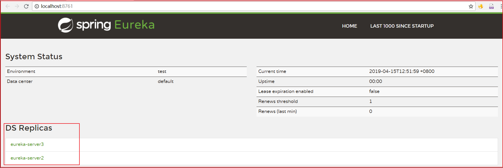

<http://localhost:8762/>


<http://localhost:8763/>

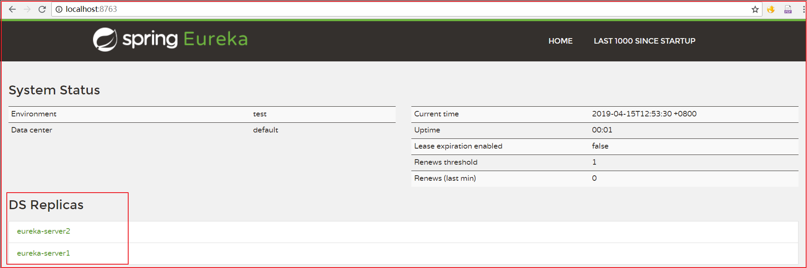


项目中使用的时候，将多个写到一起，隔开即可，代码如下：

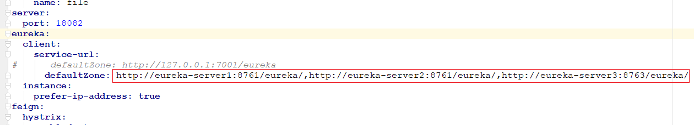

上图代码如下：

```properties
eureka:
  client:
    service-url:
      defaultZone: http://eureka-server1:8761/eureka/,http://eureka-server2:8762/eureka/,http://eureka-server3:8763/eureka/
```

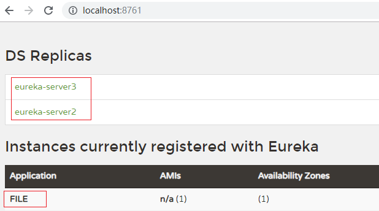

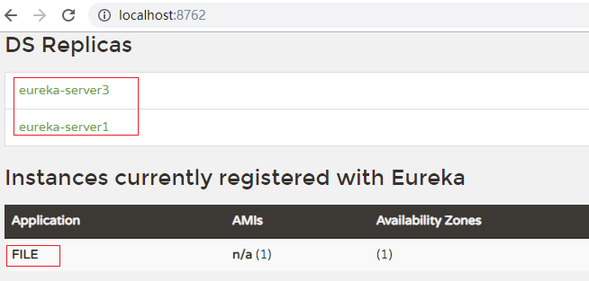

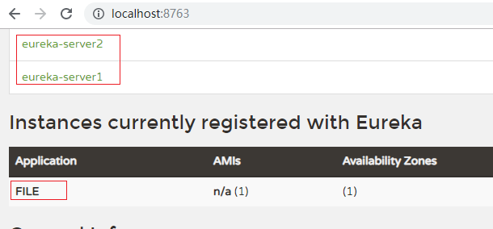

PS：需要注意配置host文件

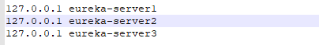


# 3 Redis Cluster

## 3.1 Redis-Cluster简介

### 3.1.1 什么是Redis-Cluster

为何要搭建Redis集群。Redis是在内存中保存数据的，而我们的电脑一般内存都不大，这也就意味着Redis不适合存储大数据，适合存储大数据的是Hadoop生态系统的Hbase或者是MogoDB。Redis更适合处理高并发，一台设备的存储能力是很有限的，但是多台设备协同合作，就可以让内存增大很多倍，这就需要用到集群。

Redis集群搭建的方式有多种，例如使用客户端分片、Twemproxy、Codis等，但从redis 3.0之后版本支持redis-cluster集群，它是Redis官方提出的解决方案，Redis-Cluster采用无中心结构，每个节点保存数据和整个集群状态,每个节点都和其他所有节点连接。其redis-cluster架构图如下：

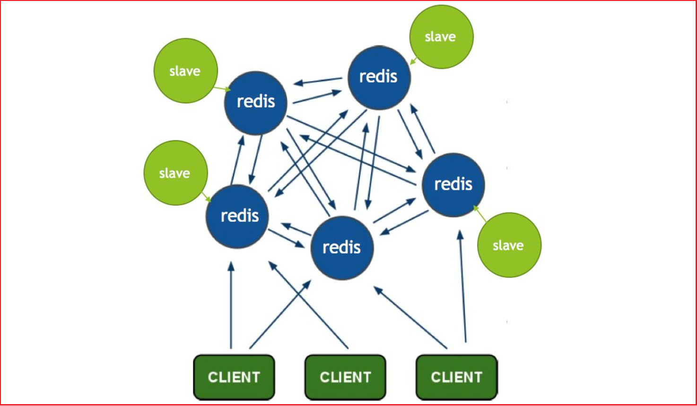


客户端与 redis 节点直连,不需要中间 proxy 层.客户端不需要连接集群所有节点连接集群中任何一个可用节点即可。

所有的 redis 节点彼此互联(PING-PONG 机制),内部使用二进制协议优化传输速度和带宽.


### 3.1.2 分布存储机制-槽

（1）redis-cluster 把所有的物理节点映射到[0-16383]slot 上,cluster 负责维护

node<->slot<->value

（2）Redis 集群中内置了 16384 个哈希槽，当需要在 Redis 集群中放置一个 key-value 时，redis 先对 key 使用 crc16 算法算出一个结果，然后把结果对 16384 求余数，这样每个key 都会对应一个编号在 0-16383 之间的哈希槽，redis 会根据节点数量大致均等的将哈希槽映射到不同的节点。

​    例如三个节点：槽分布的值如下：

SERVER1:  0-5460

SERVER2:  5461-10922

SERVER3:  10923-16383

 

### 3.1.3 容错机制-投票

（1）选举过程是集群中所有master参与,如果半数以上master节点与故障节点通信超过(cluster-node-timeout),认为该节点故障，自动触发故障转移操作.  故障节点对应的从节点自动升级为主节点

（2）什么时候整个集群不可用(cluster_state:fail)? 

如果集群任意master挂掉,且当前master没有slave.集群进入fail状态,也可以理解成集群的slot映射[0-16383]不完成时进入fail状态. 

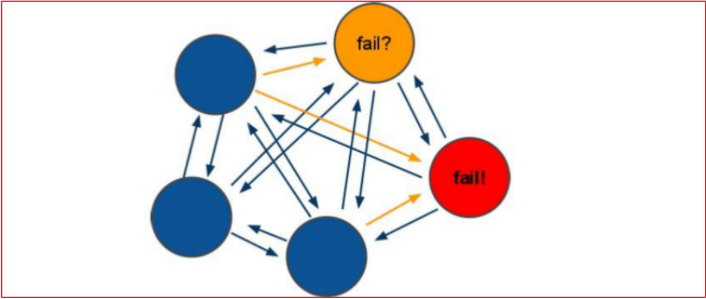


## 3.2 搭建Redis-Cluster

### 3.2.1 搭建要求

需要 6 台 redis 服务器。搭建伪集群。

需要 6 个 redis 实例。

需要运行在不同的端口 7001-7006


### 3.2.2 准备工作

（1）安装gcc 【此步省略】

Redis 是 c 语言开发的。安装 redis 需要 c 语言的编译环境。如果没有 gcc 需要在线安装。

```
yum install gcc-c++
```


（2）使用yum命令安装 ruby  （我们需要使用ruby脚本来实现集群搭建）【此步省略】

```
yum install ruby
yum install rubygems
```

```
----- 知识点小贴士 -----
Ruby，一种简单快捷的面向对象（面向对象程序设计）脚本语言，在20世纪90年代由日本人松本行弘(Yukihiro Matsumoto)开发，遵守GPL协议和Ruby License。它的灵感与特性来自于 Perl、Smalltalk、Eiffel、Ada以及 Lisp 语言。由 Ruby 语言本身还发展出了JRuby（Java平台）、IronRuby（.NET平台）等其他平台的 Ruby 语言替代品。Ruby的作者于1993年2月24日开始编写Ruby，直至1995年12月才正式公开发布于fj（新闻组）。因为Perl发音与6月诞生石pearl（珍珠）相同，因此Ruby以7月诞生石ruby（红宝石）命名
RubyGems简称gems，是一个用于对 Ruby组件进行打包的 Ruby 打包系统
```

（3）将redis源码包上传到 linux 系统  ，解压redis源码包

（4）编译redis源码  ，进入redis源码文件夹

```
make
```

看到以下输出结果，表示编译成功


（5）创建目录/usr/local/redis-cluster目录，  安装6个redis实例，分别安装在以下目录

```properties
/usr/local/redis-cluster/redis-1
/usr/local/redis-cluster/redis-2
/usr/local/redis-cluster/redis-3
/usr/local/redis-cluster/redis-4
/usr/local/redis-cluster/redis-5
/usr/local/redis-cluster/redis-6
```

以第一个redis实例为例，命令如下

```
make install PREFIX=/usr/local/redis-cluster/redis-1
```


出现此提示表示成功，按此方法安装其余5个redis实例

（6）复制配置文件  将 /redis-3.0.0/redis.conf 复制到redis下的bin目录下

```properties
[root@localhost redis-3.0.0]# cp redis.conf /usr/local/redis-cluster/redis-1/bin
[root@localhost redis-3.0.0]# cp redis.conf /usr/local/redis-cluster/redis-2/bin
[root@localhost redis-3.0.0]# cp redis.conf /usr/local/redis-cluster/redis-3/bin
[root@localhost redis-3.0.0]# cp redis.conf /usr/local/redis-cluster/redis-4/bin
[root@localhost redis-3.0.0]# cp redis.conf /usr/local/redis-cluster/redis-5/bin
[root@localhost redis-3.0.0]# cp redis.conf /usr/local/redis-cluster/redis-6/bin
```


### 3.2.3 配置集群

~~~shell
准备：安装需要的环境：
yum install gcc-c++
yum install ruby
yum install rubygems

第一步：在/usr/local/src目录下创建一个redis-cluster目录：mkdir redis-cluster

第二步：先搭建一个单机的redis服务
1、软件上传：略

2、软件解压：tar -zxvf redis-3.0.7.tar.gz

3、进入到解压目录的下：cd redis-3.0.7

4、执行编译并安装命令：
make PREFIX=/usr/local/src/redis-cluster/redis01 install

5、将redis解压目录下的配置文件复制到安装目录的bin下：
cp redis.conf /usr/local/src/redis-cluster/redis01/bin/

6、编辑redis.conf文件：设置为后台启动、修改端口号、开启集群功能
daemonize yes # 后台启动
port 7001 # 端口
cluster-enabled yes # 开启集群功能

第三步：
1、复制5份已安装好的redis01分别为redis02、redis03、redis04、redis05、redis06
cp -r redis01/ redis02
cp -r redis01/ redis03
cp -r redis01/ redis04
cp -r redis01/ redis05
cp -r redis01/ redis06

2、分别修改redis02/3/4/5/6中redis.conf的配置文件中的端口分别为：7002、7003、7004、7005、7006

3、编写同时启动该6份redis服务的脚本（当前目录即可）
touch start-all.sh #创建shell脚本

start-all.sh脚本内容如下：
cd redis01/bin/
./redis-server redis.conf
cd ../..
cd redis02/bin/
./redis-server redis.conf
cd ../..
cd redis03/bin/
./redis-server redis.conf
cd ../..
cd redis04/bin/
./redis-server redis.conf
cd ../..
cd redis05/bin/
./redis-server redis.conf
cd ../..
cd redis06/bin/
./redis-server redis.conf
cd ../..

4、设置该脚本具有可执行权限：chmod u+x start-all.sh

5、启动redis：  ./start-all.sh

6、查看redis服务：ps -ef | grep redis


第四步：将redis加入集群环境
1、安装ruby脚本执行需要运行的环境：gem install redis-3.0.0.gem
2、将redis解压目录/src/下的ruby脚本文件复制到redis-cluster目录下：
cp redis-trib.rb /usr/local/src/redis-cluster/
3、将redis加入集群环境：
./redis-trib.rb create --replicas 1 192.168.200.128:7001 192.168.200.128:7002 192.168.200.128:7003 192.168.200.128:7004 192.168.200.128:7005 192.168.200.128:7006

第五步：连接集群版redis
进入任意一个redis的bin目录下，执行如下命令：./redis-cli -p 7002 –c
~~~


（1）修改每个redis节点的配置文件redis.conf

​	  修改运行端口为7001 （7002 7003 .....）

​	  将cluster-enabled yes 前的注释去掉(632行)

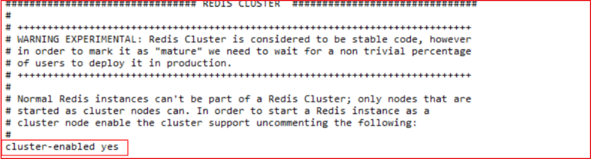


集群：

```
6个节点
3主
3从

1)创建6个节点  7001-7006
2)开启集群
3)串联集群[将集群链接到一起]
```


（2）启动每个redis实例

​	以第一个实例为例，命令如下

```properties
cd /usr/local/redis-cluster/redis-1/bin/
./redis-server redis.conf
```

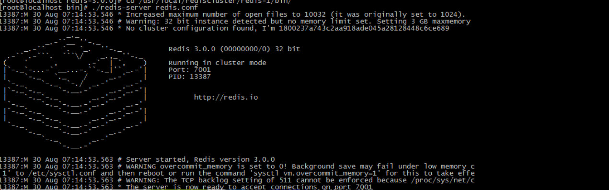


把其余的5个也启动起来，然后查看一下是不是都启动起来了

```properties
[root@localhost ~]# ps -ef | grep redis
root     15776 15775  0 08:19 pts/1    00:00:00 ./redis-server *:7001 [cluster]
root     15810 15784  0 08:22 pts/2    00:00:00 ./redis-server *:7002 [cluster]
root     15831 15813  0 08:23 pts/3    00:00:00 ./redis-server *:7003 [cluster]
root     15852 15834  0 08:23 pts/4    00:00:00 ./redis-server *:7004 [cluster]
root     15872 15856  0 08:24 pts/5    00:00:00 ./redis-server *:7005 [cluster]
root     15891 15875  0 08:24 pts/6    00:00:00 ./redis-server *:7006 [cluster]
root     15926 15895  0 08:24 pts/7    00:00:00 grep redis
```


（3）上传redis-3.0.0.gem ，安装 ruby用于搭建redis集群的脚本。

```properties
[root@localhost ~]# gem install redis-3.0.0.gem
Successfully installed redis-3.0.0
1 gem installed
Installing ri documentation for redis-3.0.0...
Installing RDoc documentation for redis-3.0.0...
```


（4）使用 ruby 脚本搭建集群。

进入redis源码目录中的src目录  执行下面的命令  `redis-trib.rb` ruby工具,可以实现Redis集群,`create`创建集群，`--replicas`创建主从关系 1：是否随机创建（是）。

```properties
./redis-trib.rb create --replicas 1 192.168.25.140:7001 192.168.25.140:7002 192.168.25.140:7003
192.168.25.140:7004 192.168.25.140:7005 192.168.25.140:7006
```


出现下列提示信息

```properties
>>> Creating cluster
Connecting to node 192.168.25.140:7001: OK
Connecting to node 192.168.25.140:7002: OK
Connecting to node 192.168.25.140:7003: OK
Connecting to node 192.168.25.140:7004: OK
Connecting to node 192.168.25.140:7005: OK
Connecting to node 192.168.25.140:7006: OK
>>> Performing hash slots allocation on 6 nodes...
Using 3 masters:
192.168.25.140:7001
192.168.25.140:7002
192.168.25.140:7003
Adding replica 192.168.25.140:7004 to 192.168.25.140:7001
Adding replica 192.168.25.140:7005 to 192.168.25.140:7002
Adding replica 192.168.25.140:7006 to 192.168.25.140:7003
M: 1800237a743c2aa918ade045a28128448c6ce689 192.168.25.140:7001
   slots:0-5460 (5461 slots) master
M: 7cb3f7d5c60bfbd3ab28800f8fd3bf6de005bf0d 192.168.25.140:7002
   slots:5461-10922 (5462 slots) master
M: 436e88ec323a2f8bb08bf09f7df07cc7909fcf81 192.168.25.140:7003
   slots:10923-16383 (5461 slots) master
S: c2a39a94b5f41532cd83bf6643e98fc277c2f441 192.168.25.140:7004
   replicates 1800237a743c2aa918ade045a28128448c6ce689
S: b0e38d80273515c84b1a01820d8ecee04547d776 192.168.25.140:7005
   replicates 7cb3f7d5c60bfbd3ab28800f8fd3bf6de005bf0d
S: 03bf6bd7e3e6eece5a02043224497c2c8e185132 192.168.25.140:7006
   replicates 436e88ec323a2f8bb08bf09f7df07cc7909fcf81
Can I set the above configuration? (type 'yes' to accept): yes
>>> Nodes configuration updated
>>> Assign a different config epoch to each node
>>> Sending CLUSTER MEET messages to join the cluster
Waiting for the cluster to join....
>>> Performing Cluster Check (using node 192.168.25.140:7001)
M: 1800237a743c2aa918ade045a28128448c6ce689 192.168.25.140:7001
   slots:0-5460 (5461 slots) master
M: 7cb3f7d5c60bfbd3ab28800f8fd3bf6de005bf0d 192.168.25.140:7002
   slots:5461-10922 (5462 slots) master
M: 436e88ec323a2f8bb08bf09f7df07cc7909fcf81 192.168.25.140:7003
   slots:10923-16383 (5461 slots) master
M: c2a39a94b5f41532cd83bf6643e98fc277c2f441 192.168.25.140:7004
   slots: (0 slots) master
   replicates 1800237a743c2aa918ade045a28128448c6ce689
M: b0e38d80273515c84b1a01820d8ecee04547d776 192.168.25.140:7005
   slots: (0 slots) master
   replicates 7cb3f7d5c60bfbd3ab28800f8fd3bf6de005bf0d
M: 03bf6bd7e3e6eece5a02043224497c2c8e185132 192.168.25.140:7006
   slots: (0 slots) master
   replicates 436e88ec323a2f8bb08bf09f7df07cc7909fcf81
[OK] All nodes agree about slots configuration.
>>> Check for open slots...
>>> Check slots coverage...
[OK] All 16384 slots covered.
```


## 3.3 连接Redis-Cluster

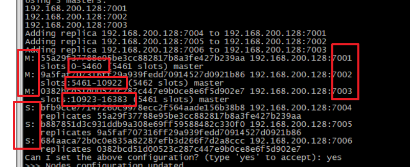

### 3.3.1 客户端工具连接

Redis-cli 连接集群：

```
redis-cli -p ip地址 -p 端口 -c
```


-c：代表连接的是 redis 集群

测试值的存取:

（1）从本地连接到集群redis  使用7001端口 加 -c 参数

（2）存入name值为abc ，系统提示此值被存入到了7002端口所在的redis （槽是5798）

（3）提取name的值，可以提取。

（4）退出（quit）

（5）再次以7001端口进入 ，不带-c

（6）查询name值，无法获取，因为值在7002端口的redis上

（7）我们以7002端口进入，获取name值发现是可以获取的,而以其它端口进入均不能获取

 

### 3.3.2 springboot连接redis集群

（1）创建工程 ，打包方式jar包，命名为：changgou-redis-demo


（2）添加redis起步依赖

```xml
<?xml version="1.0" encoding="UTF-8"?>
<project xmlns="http://maven.apache.org/POM/4.0.0" xmlns:xsi="http://www.w3.org/2001/XMLSchema-instance"
   xsi:schemaLocation="http://maven.apache.org/POM/4.0.0 http://maven.apache.org/xsd/maven-4.0.0.xsd">
   <modelVersion>4.0.0</modelVersion>
   <parent>
      <groupId>org.springframework.boot</groupId>
      <artifactId>spring-boot-starter-parent</artifactId>
      <version>2.1.4.RELEASE</version>
      <relativePath/> <!-- lookup parent from repository -->
   </parent>
   <groupId>com.itheima</groupId>
   <artifactId>changgou-redis-demo</artifactId>
   <version>0.0.1-SNAPSHOT</version>
   <name>changgou-redis-demo</name>
   <description>redis</description>

   <properties>
      <java.version>1.8</java.version>
   </properties>

   <dependencies>
      <dependency>
         <groupId>org.springframework.boot</groupId>
         <artifactId>spring-boot-starter-data-redis</artifactId>
      </dependency>
      <dependency>
         <groupId>org.springframework.boot</groupId>
         <artifactId>spring-boot-starter-web</artifactId>
      </dependency>
      <dependency>
         <groupId>org.mybatis.spring.boot</groupId>
         <artifactId>mybatis-spring-boot-starter</artifactId>
         <version>2.0.1</version>
      </dependency>

      <dependency>
         <groupId>mysql</groupId>
         <artifactId>mysql-connector-java</artifactId>
         <scope>runtime</scope>
      </dependency>
      <dependency>
         <groupId>org.springframework.boot</groupId>
         <artifactId>spring-boot-starter-test</artifactId>
         <scope>test</scope>
      </dependency>


   </dependencies>

   <build>
      <plugins>
         <plugin>
            <groupId>org.springframework.boot</groupId>
            <artifactId>spring-boot-maven-plugin</artifactId>
         </plugin>
      </plugins>
   </build>

</project>
```

（3）配置application.yml

```yaml
spring:
  datasource:
    driver-class-name: com.mysql.jdbc.Driver
    url: jdbc:mysql://127.0.0.1:3306/changgou_user?useUnicode=true&characterEncoding=UTF-8&serverTimezone=UTC
    username: root
    password: itcast
  application:
    name: redis-demo
    #redis配置

#  rabbitmq:
#    addresses: 192.168.25.130:5672,192.168.25.134:5672
#    username: guest
#    password: guest
  redis:
    cluster:
      nodes:
      - 192.168.25.153:7001
      - 192.168.25.153:7002
      - 192.168.25.153:7003
      - 192.168.25.153:7004
      - 192.168.25.153:7005
      - 192.168.25.153:7006
server:
  ssl:
    enabled: false
  port: 9008
mybatis:
  configuration:
    map-underscore-to-camel-case: true
```


（4）创建测试类进行测试：

```java
package com.itheima.changgouredisdemo;

import org.junit.Test;
import org.junit.runner.RunWith;
import org.springframework.beans.factory.annotation.Autowired;
import org.springframework.boot.test.context.SpringBootTest;
import org.springframework.data.redis.core.RedisTemplate;
import org.springframework.test.context.junit4.SpringRunner;

@RunWith(SpringRunner.class)
@SpringBootTest
public class ChanggouRedisDemoApplicationTests {

	@Autowired
	private RedisTemplate redisTemplate;
	@Test
	public void contextLoads() {
		redisTemplate.boundValueOps("key111").set("123");
		System.out.println(redisTemplate.boundValueOps("key111").get());

	}

}

```


## 3.4 Redis的持久化

### 3.4.1 redis的持久化介绍

​	Redis的数据都放在内存中。如果机器挂掉，内存的数据就不存在，数据不能恢复，严重影响使用。那么redis本身给我们提供了持久化机制。即时出现这样的问题，也能恢复数据。接下来我们来看下redis的两种持久化方

### 3.4.2 开启RDB 

RDB:  快照形式  （定期数据保存磁盘中）会产生一个dump.rdb文件,redis默认开启了RDB的持久化方式。

特点：会存在数据丢失，性能较好，用于数据备份。

如图：有一个文件产生

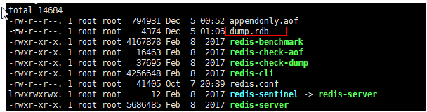


如图：redis.conf中 的默认的RDB的配置：

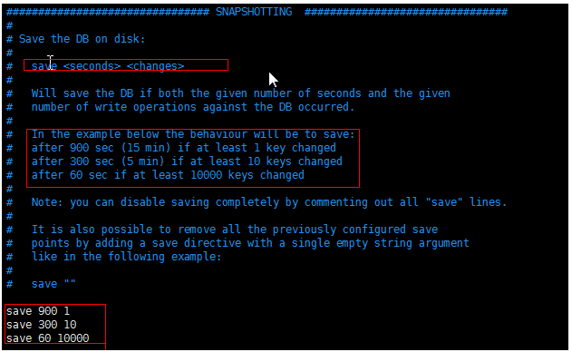

解释：

```properties
# 在 900 秒内最少有 1 个 key 被改动，或者 300 秒内最少有 10 个 key 被改动，又或者 60 秒内最少有 1000 个 key 被改动，以上三个条件随便满足一个，就触发一次保存操作。

#    if(在60秒之内有10000个keys发生变化时){
#      进行镜像备份
#    }else if(在300秒之内有10个keys发生了变化){
#      进行镜像备份
#    }else if(在900秒之内有1个keys发生了变化){
#      进行镜像备份
#    }
```


### 3.4.3 开启AOF

AOF : append only file . 所有对redis的操作命令记录在.aof文件中,如果想恢复数据，重新加载文件，执行文件中的命令即可。默认的情况下 redis没有开启，要想开启，必须配置。

特点：每秒保存，数据完整性比较好，耗费性能。

开启AOF: 如图 去掉注释

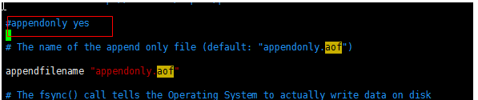

配置 AOF的执行策略:

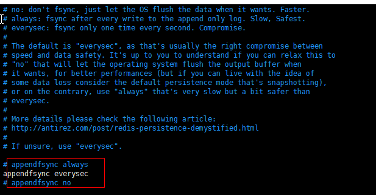

always:总是执行

everysec:每秒钟执行(默认)

no:不执行。

如果随着时间的推移，AOF文件中的数据越来越大，所以需要进行重写也就是压缩。


如图所示：自动压缩的比例为：

100：上一次AOF文件达到100%的时候进行压缩

64mb ：压缩时最小的文件大小。


### 3.4.4 模式的抉择应用场景介绍

AOF 和RDB对比：

| 命令       | RDB    | AOF          |
| ---------- | ------ | ------------ |
| 启动优先级 | 低     | 高           |
| 体积       | 小     | 大           |
| 恢复速度   | 快     | 慢           |
| 数据安全性 | 丢数据 | 根据策略决定 |

RDB的最佳策略：

+ 关闭 
+ 集中管理（用于备份数据）
+ 主从模式，从开。

AOF的最佳策略：

+ 建议 开  每秒刷盘->aof日志文件中
+ AOF重写集中管理

最佳的策略：

+ 小分片（max_memery 4G左右）
+ 监控机器的负载


## 3.5 Redis哨兵模式

~~~properties
Sentinel(哨兵)是用于监控redis集群中Master状态的工具，是Redis 的高可用性解决方案，sentinel哨兵模式已经被集成在redis2.4之后的版本中。sentinel是redis高可用的解决方案，sentinel系统可以监视一个或者多个redis master服务，以及这些master服务的所有从服务；当某个master服务下线时，自动将该master下的某个从服务升级为master服务替代已下线的master服务继续处理请求。

版本说明：建议使用redis2.8后之后版本（Sentinel 2），Redis2.6版本（sentinel 1）坑太多，已被官方放弃使用。

sentinel可以让redis实现主从复制，当一个集群中的master失效之后，sentinel可以选举出一个新的master用于自动接替master的工作，集群中的其他redis服务器自动指向新的master同步数据。一般建议sentinel采取奇数台，防止某一台sentinel无法连接到master导致误切换。其结构如下
~~~


Redis在使用过程中服务器毫无征兆的宕机，是一个麻烦的事情，如何保证备份的机器是原始服务器的完整备份呢？这时候就需要哨兵和复制。

Sentinel（哨兵）可以管理多个Redis服务器，它提供了监控，提醒以及自动的故障转移的功能，

Replication（复制）则是负责让一个Redis服务器可以配备多个备份的服务器。

Redis也是利用这两个功能来保证Redis的高可用的


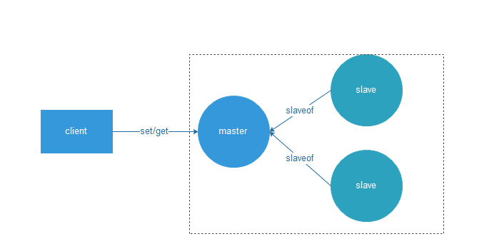

如图，通过主从架构，一个主节点，两个从节点。

通过手动监控的方式，监控master的宕机，以及出现故障将故障转移的方式可以做到高可用。

比如：如果主节点宕机，我们手动监控到主节点的宕机，并将某一个Slave变成主节点。 但是这样话，如何手动监控也是很麻烦的事情。所以使用sentinel机制就可以解决了这个问题，Sentinel（哨兵）是Redis 的高可用性解决方案。

+ 它能自动进行故障转移。
+ 客户端连接sentinel，不需要关系具体的master。
+ 当master地址改变时由sentinel更新到客户端。

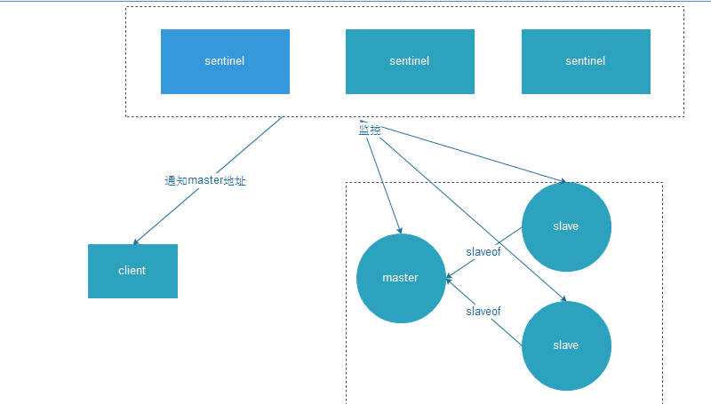

架构原理如图：

1.多个sentinel 发现并确认master有问题。

2.sentinel内部选举领导

3.选举出slave作为新的master

4.通知其余的slave成为新master的slave

5.通知客户端 主从变化

6.如果老的master重新复活，那么成为新的master的slave


要实现上边的功能的主要细节主要有以下三个定时任务：

1. 每10秒，哨兵会向master和slave发送INFO命令(目的就是监控每一个节点信息)
2. 每2秒，哨兵会向master库和slave的频道(__sentinel__:hello)发送自己的信息 （sentinel节点通过__sentinel__:hello频道进行信息交换，比如加入哨兵集群，分享自己节点数据）
3. 每1秒，哨兵会向master和slave以及其他哨兵节点发送PING命令（目的就是 redis节点的状态监控，还有领导选举，主备切换选择等）


策略总结：

​	1.尽量为 每一个节点部署一个哨兵

​	2.哨兵也要搭建集群（防止哨兵单点故障）

​	3.每一个节点都同时设置quorum的值超过半数（N/2）+1


面试常问的问题：

​	主从复制，以及哨兵 和集群之间区别。

主从复制 是redis实现高可用的一个策略。将会有主节点 和从节点，从节点的数据完整的从主节点中复制一份。

哨兵：当系统节点异常宕机的时候，开发者可以手动进行故障转移恢复，但是手动比较麻烦，所以通过哨兵机制自动进行监控和恢复。为了解决哨兵也会单点故障的问题，可以建立哨兵集群。

集群：即使使用哨兵，redis每个实例也是全量存储，每个redis存储的内容都是完整的数据，浪费内存且有木桶效应。为了最大化利用内存，可以采用集群，就是分布式存储。这个时候可以使用redis集群。将不同的数据分配到不同的节点中，这样就可以横向扩展，扩容。


## 3.6 redis缓存击穿问题解决

### 3.6.1  什么是缓存击穿

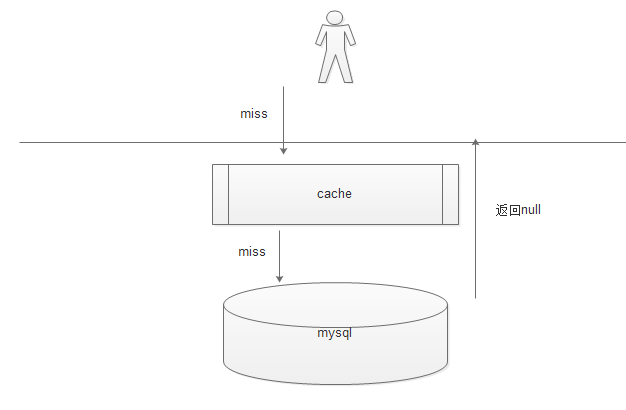

如图：

 	1. 当用户根据key 查询数据时，先查询缓存，如果缓存有命中，返回，
		2. 但是如果缓存没有命中直接穿过缓存层，访问数据层 如果有，则存储指缓存，
		3. 但是同样如果没有命中，（也就是数据库中也没有数据）直接返回用户，但是不缓存

这就是缓存的穿透。如果某一个key 请求量很大，但是存储层也没有数据，大量的请求都会达到存储层就会造成数据库压力巨大，有可能宕机的情况。


### 3.6.2 缓存击穿的解决方案

如图：

1.当缓存中没有命中的时候，从数据库中获取

2.当数据库中也没有数据的时候，我们直接将null 作为值设置redis中的key上边。

3.此时如果没有数据，一般情况下都需要设置一个过期时间，例如：5分钟失效。（为了避免过多的KEY 存储在redis中）

4.返回给用户，

5.用户再次访问时，已经有KEY了。此时KEY的值是null而已，这样就可以在缓存中命中，解决了缓存穿透的问题。

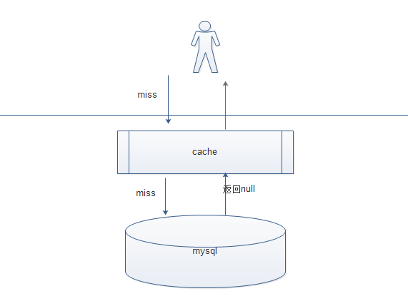

（2）例如：代码如下：


注意：缓存空对象会有两个问题：

第一，空值做了缓存，意味着缓存层中存了更多的键，需要更多的内存空间 ( 如果是攻击，问题更严重 )，比较有效的方法是针对这类数据设置一个较短的过期时间，让其自动剔除。

 第二，缓存层和存储层的数据会有一段时间窗口的不一致，可能会对业务有一定影响。例如过期时间设置为 5分钟，如果此时存储层添加了这个数据，那此段时间就会出现缓存层和存储层数据的不一致，此时可以利用消息系统或者其他方式清除掉缓存层中的空对象。


## 3.7 Redis缓存雪崩问题解决（作业）

### 3.7.1 什么是缓存雪崩

  如果缓存集中在一段时间内失效，发生大量的缓存穿透，所有的查询都落在数据库上，造成了缓存雪崩。

### 3.7.2 如何解决

这个没有完美解决办法，但可以分析用户行为，尽量让失效时间点均匀分布。

+ 限流 加锁排队

在缓存失效后，通过对某一个key加锁或者是队列 来控制key的线程访问的数量。例如：某一个key 只允许一个线程进行 操作。

+ 限流

在缓存失效后，某一个key 做count统计限流，达到一定的阈值，直接丢弃，不再查询数据库。例如：令牌桶算法。等等。

+ 数据预热

在缓存失效应当尽量避免某一段时间，可以先进行数据预热，比如某些热门的商品。提前在上线之前，或者开放给用户使用之前，先进行loading 缓存中，这样用户使用的时候，直接从缓存中获取。要注意的是，要更加业务来进行过期时间的设置 ，尽量均匀。

+ 做缓存降级（二级缓存策略）

当分布式缓存失效的时候，可以采用本地缓存，本地缓存没有再查询数据库。这种方式，可以避免很多数据分布式缓存没有，就直接打到数据库的情况。


### 3.7.3 二级缓存解决雪崩的案例

分析：

​	基本的思路：通过redis缓存+mybatis的二级缓存整合ehcache来实现。

​	EhCache 是一个纯Java的进程内缓存框架，具有快速、精干等特点，是Hibernate中默认的CacheProvider。


（1）在原来的工程中加入依赖

```xml
<dependency>
    <groupId>org.mybatis.caches</groupId>
    <artifactId>mybatis-ehcache</artifactId>
    <version>1.1.0</version>
</dependency>
```

（2）创建dao的接口 使用XML的方式

```java
@Mapper
public interface TbUserMapper {


    /**
     * 根据用户名查询用户的信息
     * @param username
     * @return
     */
    public TbUser findOne(String username);
}
```

（3）创建TbUserMapper.xml，如图加入echache的配置 开启二级缓存

```xml
<?xml version="1.0" encoding="UTF-8"?>
<!DOCTYPE mapper
        PUBLIC "-//mybatis.org//DTD Mapper 3.0//EN"
        "http://mybatis.org/dtd/mybatis-3-mapper.dtd">
<mapper namespace="com.itheima.changgouredisdemo.dao.TbUserMapper">
    <!--加入使用缓存-->
    <cache type="org.mybatis.caches.ehcache.EhcacheCache">
        <!--缓存自创建日期起至失效时的间隔时间一个小时-->
        <property name="timeToIdleSeconds" value="3600"/>
        <!--缓存创建以后，最后一次访问缓存的日期至失效之时的时间间隔一个小时-->
        <property name="timeToLiveSeconds" value="3600"/>
        <!--设置在缓存中保存的对象的最大的个数，这个按照业务进行配置-->
        <property name="maxEntriesLocalHeap" value="1000"/>

        <!--设置在磁盘中最大实体对象的个数-->
        <property name="maxEntriesLocalDisk" value="10000000"/>
        <!--缓存淘汰算法-->
        <property name="memoryStoreEvictionPolicy" value="LRU"/>
    </cache>

    <select id="findOne" resultType="com.itheima.changgouredisdemo.pojo.TbUser" parameterType="string">
          SELECT * from tb_user where username = #{username}
    </select>

</mapper>


```


（4）配置application.yml

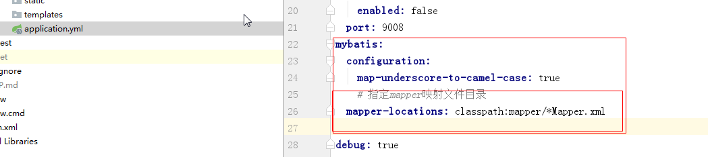


```yaml
mybatis:
  configuration:
    map-underscore-to-camel-case: true
    # 指定mapper映射文件目录
  mapper-locations: classpath:mapper/*Mapper.xml
```


（5）创建controller service 来进行测试：

```java
package com.itheima.changgouredisdemo.controller;

import com.itheima.changgouredisdemo.pojo.TbUser;
import com.itheima.changgouredisdemo.service.UserService;

import org.springframework.beans.factory.annotation.Autowired;
import org.springframework.web.bind.annotation.PathVariable;
import org.springframework.web.bind.annotation.RequestMapping;
import org.springframework.web.bind.annotation.RestController;

/**
 * 描述
 *
 * @author 
 * @version 1.0
 * @package com.itheima.changgouredisdemo.controller *
 * @since 1.0
 */
@RestController
@RequestMapping("/user")
public class UserController {
    @Autowired
    private UserService userService;

    @RequestMapping("/findOne/{username}")
    public TbUser findOne(@PathVariable String username) {
        return userService.findOne(username);
    }

}
```


```
package com.itheima.changgouredisdemo.service.impl;

import com.itheima.changgouredisdemo.dao.TbUserMapper;
import com.itheima.changgouredisdemo.pojo.TbUser;
import com.itheima.changgouredisdemo.service.UserService;
import org.springframework.beans.factory.annotation.Autowired;
import org.springframework.data.redis.core.RedisTemplate;
import org.springframework.stereotype.Service;

import java.util.concurrent.TimeUnit;

/**
 * 描述
 *
 * @author
 * @version 1.0
 * @package com.itheima.changgouredisdemo.service.impl *
 * @since 1.0
 */
@Service
public class UserServiceImpl implements UserService {
    @Autowired
    private TbUserMapper userMapper;
    @Autowired
    private RedisTemplate redisTemplate;

    @Override
    public TbUser findOne(String username) {
        TbUser user = (TbUser) redisTemplate.boundValueOps(username).get();
        if (redisTemplate.hasKey(username)) {
            return user;
        } else {
            //没有key 数据库中查询
            TbUser one = userMapper.findOne(username);
            System.out.println("第一次查询数据库");
            redisTemplate.boundValueOps(username).set(one);
            if (one == null) {
                redisTemplate.expire(username, 30, TimeUnit.SECONDS);
            }
            return one;
        }
    }
}
```

(6)测试：

已知： 数据库中有zhangsan


准备好redis


浏览器输入

```
http://localhost:9008/user/findOne/zhangsan
```

效果：

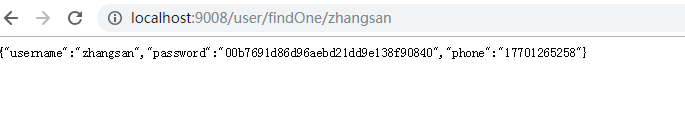

redis中:	也有数据


此时：修改数据库的数据zhangsan为zhangsan5,并清空redis缓存。


再次输入浏览器地址：

```
http://localhost:9008/user/findOne/zhangsan
```

此时数据库总已经没有zhangsan,但是效果却是

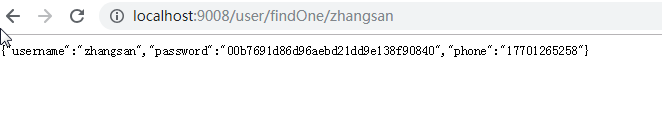

说明数据从二级缓存中也就是本地缓存中获取到了，测试成功。


# 4 RabbitMQ集群-了解

`<https://www.cnblogs.com/kevingrace/p/8012792.html>`

在使用RabbitMQ的过程中，如果只有一个节点，但是一旦单机版宕机，服务不可用，影响比较严重，所以这里我们演示下如何搭建rabbitmq的集群，集群就能避免单点故障的问题。

 RabbitMQ 集群分为两种 普通集群 和 镜像集群

## 4.1 普通集群

以两个节点（rabbit01、rabbit02）为例来进行说明。

rabbit01和rabbit02两个节点仅有相同的元数据，即队列的结构，但消息实体只存在于其中一个节点rabbit01（或者rabbit02）中。
​	当消息进入rabbit01节点的Queue后，consumer从rabbit02节点消费时，RabbitMQ会临时在rabbit01、rabbit02间进行消息传输，把A中的消息实体取出并经过B发送给consumer。

所以consumer应尽量连接每一个节点，从中取消息，即对于同一个逻辑队列，要在多个节点建立物理Queue；否则无论consumer连rabbit01或rabbit02，出口总在rabbit01，会产生瓶颈。

​	当rabbit01节点故障后，rabbit02节点无法取到rabbit01节点中还未消费的消息实体。如果做了消息持久化，那么得等rabbit01节点恢复，然后才可被消费；如果没有持久化的话，就会产生消息丢失的现象。

## 4.2 镜像集群

​	在普通集群的基础上，把需要的队列做成镜像队列，消息实体会主动在镜像节点间同步，而不是在客户端取数据时临时拉取，也就是说多少节点消息就会备份多少份。该模式带来的副作用也很明显，除了降低系统性能外，如果镜像队列数量过多，加之大量的消息进入，集群内部的网络带宽将会被这种同步通讯大大消耗掉。所以在对可靠性要求较高的场合中适用

由于镜像队列之间消息自动同步，且内部有选举master机制，即使master节点宕机也不会影响整个集群的使用，达到去中心化的目的，从而有效的防止消息丢失及服务不可用等问题。


## 4.3 集群搭建

准备两台虚拟机，虚拟机的地址分别为192.168.200.159, 192.168.200.160

设置192.168.200.159的别名为A：修改如下文件 名称改为A

```
vim /etc/hostname
```


设置192.168.200.160的别名为B,修改如下文件 名称改为B

```
vim /etc/hostname
```


修改每一个虚拟机的hosts

```
vim /etc/hosts
```

加入如下代码：

```
192.168.200.159 A
192.168.200.161 C
```

如下图所示：

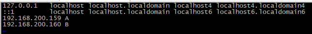

重启系统。

### 4.3.1 安装erlang  

192.168.200.159/160上安装如下：

输入命令，下载erlang：

```shell
wget http://www.rabbitmq.com/releases/erlang/erlang-18.1-1.el6.x86_64.rpm

【温馨提示：如果下载不了，可以在该命令后添加选项： --no-check-certificate 】
```

安装erlang，root用户使用rpm安装：

```shell
rpm -ihv erlang-18.1-1.el6.x86_64.rpm
```


### 4.3.2 下载和安装RabbitMQ

192.168.200.159/160上安装如下：

- 下载RabbitMQ:

```shell
wget https://github.com/rabbitmq/rabbitmq-server/releases/download/rabbitmq_v3_6_12/rabbitmq-server-3.6.12-1.el6.noarch.rpm
```

安装RabbitMQ,

+ 先安装socat   【socat是一个多功能的网络工具，名字来由是” Socket CAT” 】

```
yum install -y socat
```

+ root用户使用rpm安装 安装rabbitmq

```
rpm -ihv rabbitmq-server-3.6.12-1.el6.noarch.rpm
```


验证是否安装成功：

输入命令：

```shell
[root@A ~]# rabbitmq-server
```

出现如下界面，说明OK

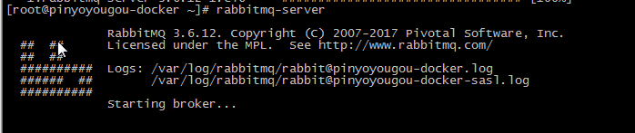

守护进程启动方式：

```
rabbitmq-server -detached
```

其他相关指令：

```
启动服务：rabbitmq-server -detached
查看状态：rabbitmqctl status
关闭服务：rabbitmqctl stop
列出角色：rabbitmqctl list_users
改密码: rabbimqctlchange_password {username} {newpassword}
删除用户: rabbitmqctl delete_user xx
```


### 4.3.3 配置RabbitMQ

（1）创建rabbitmq的账号

```shell
[root@A ~]# rabbitmqctl add_user admin admin
```

（2）将admin账号赋予管理员权限

```shell
[root@A ~]# rabbitmqctl set_user_tags admin administrator
```

（3）设置权限

```shell
[root@A ~]# rabbitmqctl  set_permissions  -p  '/'  admin '.*' '.*' '.*'
```


安装可视化界面

```
rabbitmq-plugins enable rabbitmq_management
```


## 4.4 配置rabbitmq集群

### 4.4.1 安装rabbitmq

安装方法如上边的方法进行在 192.168.200.159上进行


### 4.4.2 保证相同的erlang cookie

erlang.cookie是erlang分布式的token文件，集群内所有的设备要持有相同的.erlang.cookie文件才允许彼此通信。

```
scp /var/lib/rabbitmq/.erlang.cookie root@B:/var/lib/rabbitmq
```

```shell
[root@A rabbitmq]#  scp /var/lib/rabbitmq/.erlang.cookie root@A:/var/lib/rabbitmq 
The authenticity of host 'a (192.168.25.134)' can't be established.
ECDSA key fingerprint is cd:17:22:d1:10:81:d6:98:be:ad:cc:13:e0:0c:c3:03.
Are you sure you want to continue connecting (yes/no)? yes
Warning: Permanently added 'a,192.168.25.134' (ECDSA) to the list of known hosts.
root@a's password: 
.erlang.cookie                                                                                                                       100%   20     0.0KB/s   00:00    
[root@A rabbitmq]# 
```


### 4.4.3 运行各个rabbitmq节点

先停止每一个服务器的服务 

输入命令停止0

```shell
[root@A rabbitmq]# rabbitmqctl stop
```

再输入命令启动：

```shell
[root@A rabbitmq]# rabbitmq-server -detached 
```


### 4.4.4 查看状态

```shell
[root@A rabbitmq]# rabbitmqctl cluster_status
```


### 4.4.5 将节点连接成集群

每一个服务器都关闭防火墙：

```
[root@B ~]#  systemctl stop firewalld
```


B加入到集群A中，在B中执行如下命令：

```
[root@B ~]# rabbitmqctl stop_app
[root@B ~]# rabbitmqctl join_cluster rabbit@A
[root@B ~]# rabbitmqctl start_app
```

A不需要加入到自己


查看集群状态：在任意服务器上执行：

```
rabbitmqctl cluster_status
```

添加集群之前：

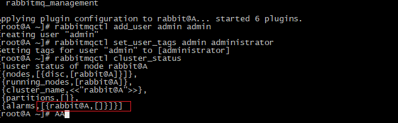

添加集群之后：


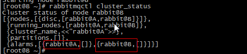


### 4.4.6 配置单web插件查看集群

在A服务器执行命令：

```shell
rabbitmq-plugins enable rabbitmq_management
```

在B服务器执行命令：

```shell
rabbitmq-plugins enable rabbitmq_management
```

在浏览器中输入A服务器的rabbitmq服务器地址：

```
http://192.168.25.130:15672
```

输入用户名和密码登录，如果登录失败，采取如下措施：

+ 执行命令 设置guest为管理员

```
rabbitmqctl set_user_tags guest administrator
```

+ 执行命令 设置权限

```
rabbitmqctl set_permissions -p / guest '.*' '.*' '.*'
```

+ 在rabbitmq的配置文件目录下创建一个rabbitmq.config文件

```
cd /etc/rabbitmq
vi rabbitmq.config
```

输入如下文本，并保存：

```
 [{rabbit, [{loopback_users, []}]}]. 
```

重新启动服务：

```
service rabbitmq-server restart
```


再次输入地址 出现界面，说明集群搭建成功。

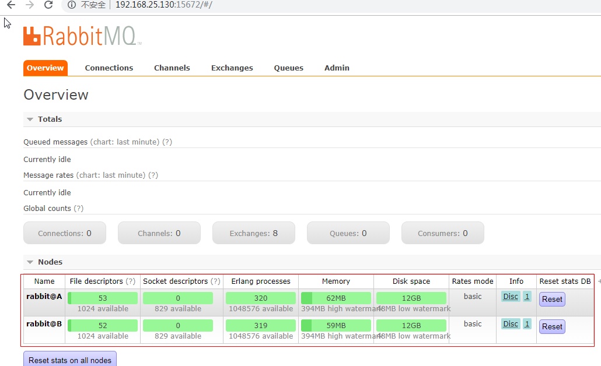

如有需要，同理 对服务B的配置如上边一样配置一遍即可。


## 4.5 配置镜像队列

如上，我们已经搭建好了集群，但是并不能做到高可用，所以需要配置升级为镜像队列。


在任意的节点（A或者B）中执行如下命令：

```
rabbitmqctl set_policy ha-all "^" '{"ha-mode":"all"}'
```

```
解释
rabbitmqctl set_policy 
	用于设置策略
ha-all 
	表示设置为镜像队列并策略为所有节点可用 ，意味着 队列会被（同步）到所有的节点，当一个节点被加入到集群中时，也会同步到新的节点中，此策略比较保守，性能相对低，对接使用半数原则方式设置（N/2+1），例如：有3个结点 此时可以设置为：ha-two 表示同步到2个结点即可。
"^"  表示针对的队列的名称的正则表达式，此处表示匹配所有的队列名称
'{"ha-mode":"all"}' 设置一组key/value的JSON 设置为高可用模式 匹配所有exchange
```


此时查看web管理界面：添加一个队列itcast111,如下图已经可以出现结果为有一个结点，并且是ha-all模式（镜像队列模式）

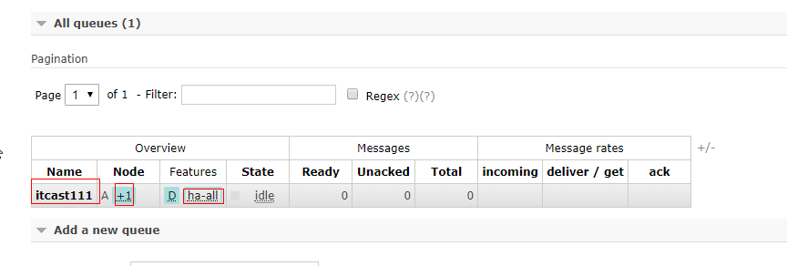

## 4.6 springboot整合rabbitmq集群使用(作业)

修改原来redis测试的项目，

(1)加入pom.xml依赖

```xml
<dependency>
   <groupId>org.springframework.boot</groupId>
   <artifactId>spring-boot-starter-amqp</artifactId>
   <version>2.1.4.RELEASE</version>
</dependency>
```

（2）配置application.yml

```yaml
spring:
  rabbitmq:
    addresses: 192.168.25.130:5672,192.168.25.134:5672
    username: guest
    password: guest
```


(3)创建controller 

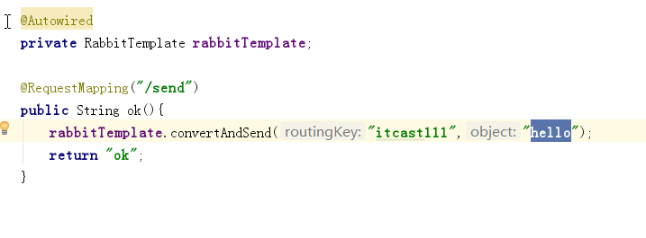

```java
package com.itheima.changgouredisdemo.controller;

import com.itheima.changgouredisdemo.pojo.TbUser;
import com.itheima.changgouredisdemo.service.UserService;
import org.springframework.amqp.rabbit.core.RabbitTemplate;
import org.springframework.beans.factory.annotation.Autowired;
import org.springframework.web.bind.annotation.PathVariable;
import org.springframework.web.bind.annotation.RequestMapping;
import org.springframework.web.bind.annotation.RestController;

/**
 * 描述
 *
 * @author 
 * @version 1.0
 * @package com.itheima.changgouredisdemo.controller *
 * @since 1.0
 */
@RestController
@RequestMapping("/user")
public class UserController {
    @Autowired
    private UserService userService;

    @RequestMapping("/findOne/{username}")
    public TbUser findOne(@PathVariable String username) {
        return userService.findOne(username);
    }

    @Autowired
    private RabbitTemplate rabbitTemplate;

    @RequestMapping("/send")
    public String ok(){
        rabbitTemplate.convertAndSend("itcast111","hello");
        return "ok";
    }

}

```


(4)设置监听：

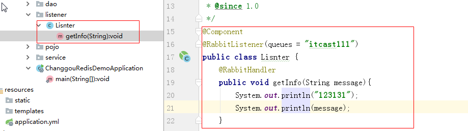

代码：

```java
package com.itheima.changgouredisdemo.listener;

import org.springframework.amqp.rabbit.annotation.RabbitHandler;
import org.springframework.amqp.rabbit.annotation.RabbitListener;
import org.springframework.stereotype.Component;

/**
 * 描述
 *
 * @author 
 * @version 1.0
 * @package com.itheima.changgouredisdemo.listener *
 * @since 1.0
 */
@Component
@RabbitListener(queues = "itcast111")
public class Lisnter {
    @RabbitHandler
    public void getInfo(String message){
        System.out.println("123131");
        System.out.println(message);
    }


}
```


测试，在浏览器中输入：

```
http://localhost:9008/user/send
```

测试当宕机一台rabbitmq也能发送成功。

如下效果。


# 5 日志记录

## 5.1 常用的日志框架

~~~
java.util.logging：是JDK在1.4版本中引入的Java原生日志框架

Log4j：Apache的一个开源项目，可以控制日志信息输送的目的地是控制台、文件、GUI组件等，可以控制每一条日志的输出格式，这些可以通过一个配置文件来灵活地进行配置，而不需要修改应用的代码。虽然已经停止维护了，但目前绝大部分企业都是用的log4j。

LogBack：是Log4j的一个改良版本

Log4j2：Log4j2已经不仅仅是Log4j的一个升级版本了，它从头到尾都被重写了
~~~


## 5.2 采用Log4j2

~~~
相比与其他的日志系统，log4j2丢数据这种情况少；
在多线程环境下，性能高于logback等10倍以上；
利用jdk1.5并发的特性，减少了死锁的发生；
~~~

性能测试：

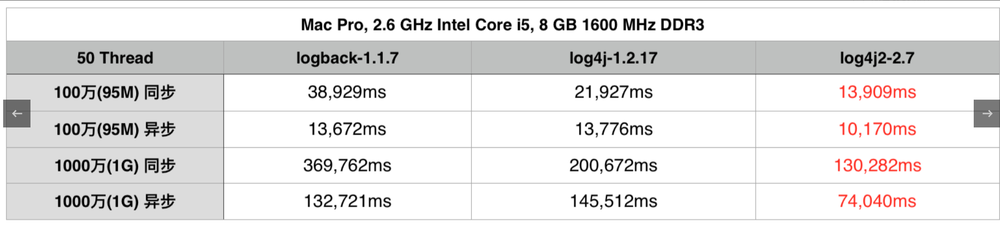

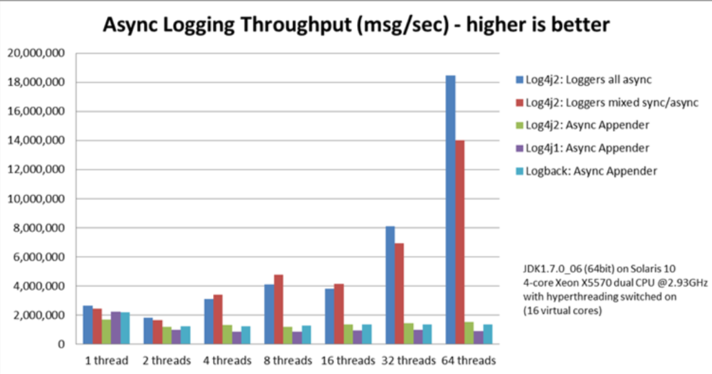

## 5.3 SpringBoot整合Log4j2

本次给大家演示在changgou-service-goods服务中添加日志信息，其他服务如需添加，操作步骤一样。

### 5.3.1 添加依赖

在changgou-service-goods服务的pom.xml文件中添加如下依赖：

~~~xml
<!-- 排除 Spring-boot-starter 默认的logging日志配置 -->
<dependency>
    <groupId>org.springframework.boot</groupId>
    <artifactId>spring-boot-starter</artifactId>
    <exclusions>
        <exclusion>
            <groupId>org.springframework.boot</groupId>
            <artifactId>spring-boot-starter-logging</artifactId>
        </exclusion>
    </exclusions>
</dependency>
<!-- 引入log4j2依赖 -->
<dependency>
    <groupId>org.springframework.boot</groupId>
    <artifactId>spring-boot-starter-log4j2</artifactId>
</dependency>
~~~


### 5.3.2 添加log4j2配置文件

在changgou-service-goods工程的resources目录下添加log4j2配置文件。**log4j是通过一个.properties的文件作为主配置文件的，而现在的log4j2则已经弃用了这种方式，采用的是.xml，.json或者.jsn这种方式** 

~~~
项目的resource目录下，添加一个配置文件，文件名为 log4j2.xml 或者 log4j2-spring.xml
log4j2.xml：需要在application.yml指定
log4j2-spring.xml：无需在application.yml指定
~~~

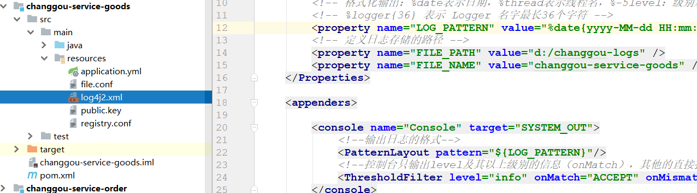

~~~xml
<?xml version="1.0" encoding="UTF-8"?>
<!--Configuration后面的status，这个用于设置log4j2自身内部的信息输出，可以不设置，
当设置成trace时，你会看到log4j2内部各种详细输出-->
<!--monitorInterval：Log4j能够自动检测修改配置 文件和重新配置本身，设置间隔秒数-->
<configuration monitorInterval="5">
    <!--日志级别以及优先级排序: OFF > FATAL > ERROR > WARN > INFO > DEBUG > TRACE > ALL -->

    <!--变量配置-->
    <Properties>
        <!-- 格式化输出：%date表示日期，%thread表示线程名，%-5level：级别从左显示5个字符宽度 %msg：日志消息，%n是换行符-->
        <!-- %logger{36} 表示 Logger 名字最长36个字符 -->
        <property name="LOG_PATTERN" value="%date{yyyy-MM-dd HH:mm:ss.SSS} [%thread] %-5level %logger{36} - %msg%n" />
        <!-- 定义日志存储的路径 -->
        <!--指定绝对路径-->
        <property name="FILE_PATH" value="d:/changgou-logs" />
        <!--也指定相对路径-->
        <!--<property name="FILE_PATH" value="./logs/goods" />-->
        <property name="FILE_NAME" value="changgou-service-goods" />
    </Properties>

    <appenders>

        <console name="Console" target="SYSTEM_OUT">
            <!--输出日志的格式-->
            <PatternLayout pattern="${LOG_PATTERN}"/>
            <!--控制台只输出level及其以上级别的信息（onMatch），其他的直接拒绝（onMismatch）-->
            <ThresholdFilter level="info" onMatch="ACCEPT" onMismatch="DENY"/>
        </console>

        <!--文件会打印出所有信息，这个log每次运行程序会自动清空，由append属性决定，适合临时测试用-->
        <File name="Filelog" fileName="${FILE_PATH}/test.log" append="false">
            <PatternLayout pattern="${LOG_PATTERN}"/>
        </File>

        <!-- 这个会打印出所有的info及以下级别的信息，每次大小超过size，则这size大小的日志会自动存入按年份-月份建立的文件夹下面并进行压缩，作为存档-->
        <RollingFile name="RollingFileInfo" fileName="${FILE_PATH}/info.log" filePattern="${FILE_PATH}/${FILE_NAME}-INFO-%d{yyyy-MM-dd}_%i.log.gz">
            <!--控制台只输出level及以上级别的信息（onMatch），其他的直接拒绝（onMismatch）-->
            <ThresholdFilter level="info" onMatch="ACCEPT" onMismatch="DENY"/>
            <PatternLayout pattern="${LOG_PATTERN}"/>
            <Policies>
                <!--interval属性用来指定多久滚动一次，默认是1 hour-->
                <TimeBasedTriggeringPolicy interval="1"/>
                <SizeBasedTriggeringPolicy size="10MB"/>
            </Policies>
            <!-- DefaultRolloverStrategy属性如不设置，则默认为最多同一文件夹下7个文件开始覆盖-->
            <DefaultRolloverStrategy max="15"/>
        </RollingFile>

        <!-- 这个会打印出所有的warn及以下级别的信息，每次大小超过size，则这size大小的日志会自动存入按年份-月份建立的文件夹下面并进行压缩，作为存档-->
        <RollingFile name="RollingFileWarn" fileName="${FILE_PATH}/warn.log" filePattern="${FILE_PATH}/${FILE_NAME}-WARN-%d{yyyy-MM-dd}_%i.log.gz">
            <!--控制台只输出level及以上级别的信息（onMatch），其他的直接拒绝（onMismatch）-->
            <ThresholdFilter level="warn" onMatch="ACCEPT" onMismatch="DENY"/>
            <PatternLayout pattern="${LOG_PATTERN}"/>
            <Policies>
                <!--interval属性用来指定多久滚动一次，默认是1 hour-->
                <TimeBasedTriggeringPolicy interval="1"/>
                <SizeBasedTriggeringPolicy size="10MB"/>
            </Policies>
            <!-- DefaultRolloverStrategy属性如不设置，则默认为最多同一文件夹下7个文件开始覆盖-->
            <DefaultRolloverStrategy max="15"/>
        </RollingFile>
        <!-- 这个会打印出所有的error及以下级别的信息，每次大小超过size，则这size大小的日志会自动存入按年份-月份建立的文件夹下面并进行压缩，作为存档-->
        <RollingFile name="RollingFileError" fileName="${FILE_PATH}/error.log" filePattern="${FILE_PATH}/${FILE_NAME}-ERROR-%d{yyyy-MM-dd}_%i.log.gz">
            <!--控制台只输出level及以上级别的信息（onMatch），其他的直接拒绝（onMismatch）-->
            <ThresholdFilter level="error" onMatch="ACCEPT" onMismatch="DENY"/>
            <PatternLayout pattern="${LOG_PATTERN}"/>
            <Policies>
                <!--interval属性用来指定多久滚动一次，默认是1 hour-->
                <TimeBasedTriggeringPolicy interval="1"/>
                <SizeBasedTriggeringPolicy size="10MB"/>
            </Policies>
            <!-- DefaultRolloverStrategy属性如不设置，则默认为最多同一文件夹下7个文件开始覆盖-->
            <DefaultRolloverStrategy max="15"/>
        </RollingFile>

    </appenders>

    <!--Logger节点用来单独指定日志的形式，比如要为指定包下的class指定不同的日志级别等。-->
    <!--然后定义loggers，只有定义了logger并引入的appender，appender才会生效-->
    <loggers>

        <!--过滤掉spring和mybatis的一些无用的DEBUG信息-->
        <!--<logger name="org.mybatis" level="info" additivity="false">-->
            <!--<AppenderRef ref="Console"/>-->
        <!--</logger>-->
        <!--监控系统信息-->
        <!--若是additivity设为false，则 子Logger 只会在自己的appender里输出，而不会在 父Logger 的appender里输出。-->
        <!--<Logger name="org.springframework" level="info" additivity="false">-->
            <!--<AppenderRef ref="Console"/>-->
        <!--</Logger>-->

        <root level="all">
            <appender-ref ref="Console"/>
            <appender-ref ref="Filelog"/>
            <appender-ref ref="RollingFileInfo"/>
            <appender-ref ref="RollingFileWarn"/>
            <appender-ref ref="RollingFileError"/>
        </root>
    </loggers>

</configuration>
~~~


配置说明：

~~~
日志级别：
trace：追踪，就是程序推进一下，可以写个trace输出
debug：调试，一般作为最低级别，trace基本不用。
info： 输出重要的信息，使用较多
warn： 警告，有些信息不是错误信息，但也要给程序员一些提示。
error：错误信息。用的也很多。
fatal：致命错误。

输出源
CONSOLE（输出到控制台）
FILE   （输出到文件）
~~~


### 5.3.3 编写配置文件

由于我们的日志文件名称为log4j2.xml，因此我们需要在application.yml中指定文件位置

~~~yaml
#日志配置
logging:
  config:
    classpath: log4j2.xml
~~~


## 5.4 测试

### 5.4.1 在brand模块中添加日志

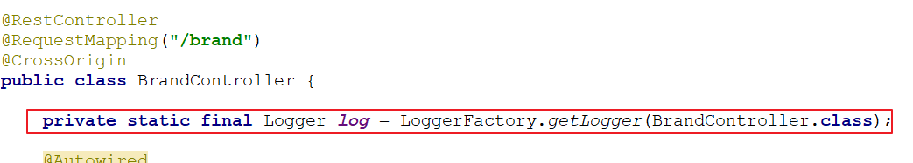

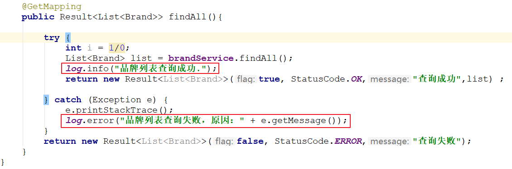

~~~java
private static final Logger log = LoggerFactory.getLogger(BrandController.class);

@GetMapping
public Result<List<Brand>> findAll(){

    try {
        int i = 1/0;	// 模拟异常
        List<Brand> list = brandService.findAll();
        log.info("品牌列表查询成功.");
        return new Result<List<Brand>>(true, StatusCode.OK,"查询成功",list) ;

    } catch (Exception e) {
        e.printStackTrace();
        log.error("品牌列表查询失败，原因：" + e.getMessage());
    }
    return new Result<List<Brand>>(false, StatusCode.ERROR,"查询失败");
}
~~~


### 5.4.2 启动服务

1、当我们启动服务后，可以查看指定生成的日志文件的目录，结果如下：

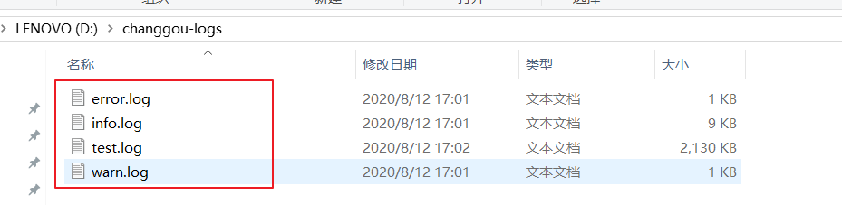

2、当我们访问该地址：`<http://localhost:18081/brand>`，则将错误日志记录到error.log文件中。

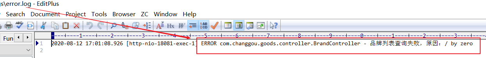


3、在生产环境下，我们可以根据具体的异常信息进行分析并处理。


