# 第3章 商品发布

课程回顾：

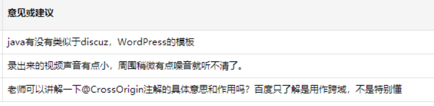

1、WordPress：微博/博客的模板（PHP）       docker镜像参库：提供WordPress镜像。

2、已调

3、@CrossOrigin注解：解决跨域的问题

3、CORS：跨域      

- 概念：跨域：不同的域（协议不同、ip不同、端口不同） 
- 场景：ajax的异步请求非同源策略的服务器。

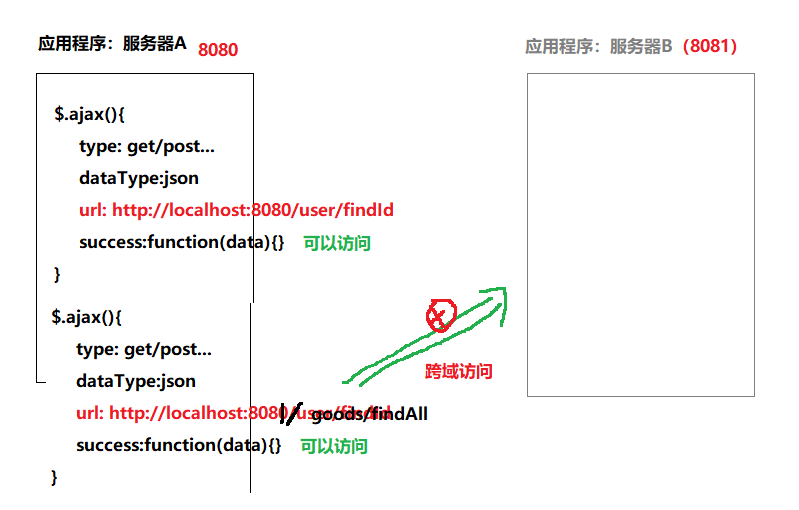

- 解决方案：
  - 前端：
    - 之前：dataType：json
    - 跨域：dataType：**jsonp**
  - 服务器端：@CrossOrigin

4、CSRF（跨站）   跨站的请求伪造（恶意攻击）

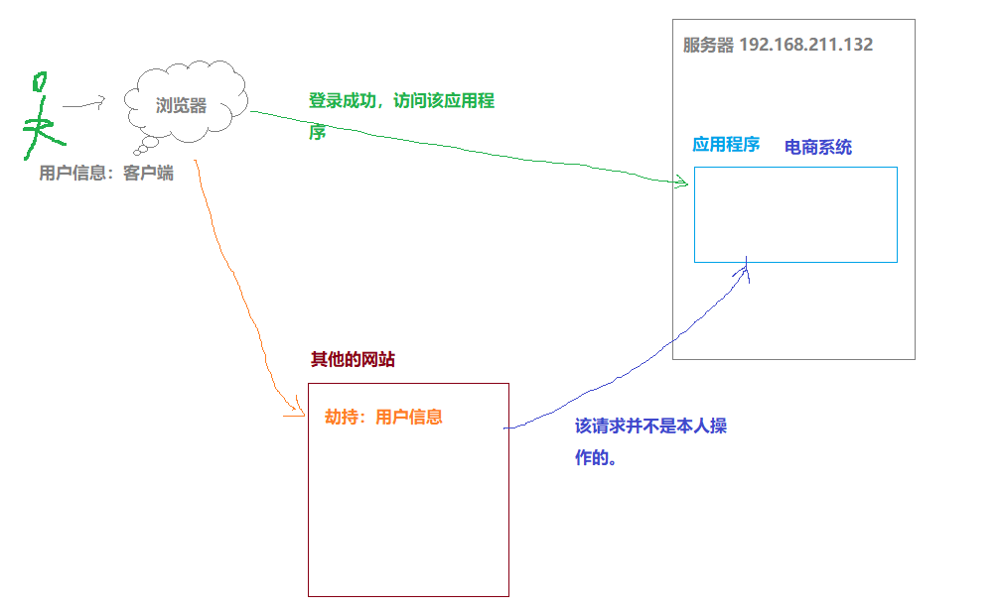

课程回顾：FastDFS，分布式文件系统

1、FastDFS，分布式文件系统

- 概念：FastDFS它是一个分布式的、开源的、轻量级的分布式文件系统。适合存储附件资源（文档、图片、视频。。。）     其他文件系统：GFS、TFS、TFS
- 术语：
  - Client：客户端，操作FastDFS的api
  - tracker server：跟踪服务器（集成Nginx），负载均衡的作用
  - storage  server：存储服务器，存储附件资源
  - meat  data：元数据  （备注信息）
- 架构：
  - client不能直接操作存储服务器，而是通过跟踪服务器确定存储服务器的。
  - 跟踪服务器如何确定存储服务器？ 进行两次轮询
    - 第一次轮询：确定组
    - 第二次卢新：确定该组下的存储服务器
  - 存储服务器：
    - 对存储服务器进行分组（卷宗）：目的，对资源分类（更好管理）
    - 每个组下存储服务器间：数据同步（H-A）
- 场景：电商（商品---图片）

2、附件的操作：api调用

- 文件上传、下载、删除
- 获取附件信息、获取存储服务器信息


学习目标：商品保存。

1、SPU与SKU概念理解

2、**新增商品**、修改商品

3、商品审核、上架、下架

4、删除商品（逻辑删除）、找回商品


# 1 SPU与SKU

## 1.1 SPU与SKU概念

* **SPU = Standard Product Unit  （标准产品单位）**

  * 概念 : SPU 是商品信息聚合的`最小单位`，是一组`可复用、易检索`的标准化信息的集合，该集合描述了一个`产品的特性`。
  
  * 通俗点讲，属性值、特性相同的货品就可以称为一个 SPU
  
    ==同款商品的公共属性抽取==
  
    
  
    例如：**华为P30 就是一个 SPU**
  
  **SKU=stock keeping unit( 库存量单位)**
  
  * SKU 即库存`进出`计量的单位， 可以是以件、盒、托盘等为单位。
  
  * SKU 是`物理上不可分割的最小存货单元`。在使用时要根据不同业态，不同管理模式来处理。
  
  * 在服装、鞋类商品中使用最多最普遍。
  
    例如：**华为P30 红色 64G 就是一个 SKU**
  
    ==某个库存单位的商品独有属性(某个商品的独有属性)==
  
  #### 注意
  
  `一个 SPU可以有多个SKU`


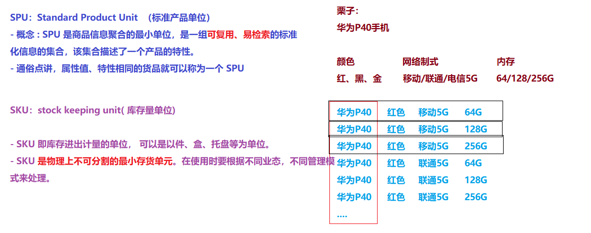


## 1.2 表结构分析

tb_spu  表 （SPU表）

| 字段名称           | 字段含义   | 字段类型    | 字段长度 | 备注   |
| -------------- | ------ | ------- | ---- | ---- |
| id             | 主键     | BIGINT  |      |      |
| sn             | 货号     | VARCHAR |      |      |
| name           | SPU名   | VARCHAR |      |      |
| caption        | 副标题    | VARCHAR |      |      |
| brand_id       | 品牌ID   | INT     |      |      |
| category1_id   | 一级分类   | INT     |      |      |
| category2_id   | 二级分类   | INT     |      |      |
| category3_id   | 三级分类   | INT     |      |      |
| template_id    | 模板ID   | INT     |      |      |
| freight_id     | 运费模板id | INT     |      |      |
| image          | 图片     | VARCHAR |      |      |
| images         | 图片列表   | VARCHAR |      |      |
| sale_service   | 售后服务   | VARCHAR |      |      |
| introduction   | 介绍     | TEXT    |      |      |
| spec_items     | 规格列表   | VARCHAR |      |      |
| para_items     | 参数列表   | VARCHAR |      |      |
| sale_num       | 销量     | INT     |      |      |
| comment_num    | 评论数    | INT     |      |      |
| is_marketable  | 是否上架   | CHAR    |      |      |
| is_enable_spec | 是否启用规格 | CHAR    |      |      |
| is_delete      | 是否删除   | CHAR    |      |      |
| status         | 审核状态   | CHAR    |      |      |

tb_sku  表（SKU商品表）

| 字段名称          | 字段含义                | 字段类型     | 字段长度 | 备注   |
| ------------- | ------------------- | -------- | ---- | ---- |
| id            | 商品id                | BIGINT   |      |      |
| sn            | 商品条码                | VARCHAR  |      |      |
| name          | SKU名称               | VARCHAR  |      |      |
| price         | 价格（分）               | INT      |      |      |
| num           | 库存数量                | INT      |      |      |
| alert_num     | 库存预警数量              | INT      |      |      |
| image         | 商品图片                | VARCHAR  |      |      |
| images        | 商品图片列表              | VARCHAR  |      |      |
| weight        | 重量（克）               | INT      |      |      |
| create_time   | 创建时间                | DATETIME |      |      |
| update_time   | 更新时间                | DATETIME |      |      |
| spu_id        | SPUID               | BIGINT   |      |      |
| category_id   | 类目ID                | INT      |      |      |
| category_name | 类目名称                | VARCHAR  |      |      |
| brand_name    | 品牌名称                | VARCHAR  |      |      |
| spec          | 规格                  | VARCHAR  |      |      |
| sale_num      | 销量                  | INT      |      |      |
| comment_num   | 评论数                 | INT      |      |      |
| status        | 商品状态 1-正常，2-下架，3-删除 | CHAR     |      |      |


逆向工程（代码生成器）：

- 作用：生成代码的。生成哪些代码，取决于我们提供的模板（freemarker）
  - 包括：**controller  +  service  + dao  + pojo**  + feign（不要，后期我们自己去开发）
- 逆向工程：当做工具。
  - 工作中：基本不用（生成的代码不易维护）。 代码：单表的CRUD
- 可能：外包公司会提供的。  主从表
- 使用的目的：仅仅只是节省时间。


如何使用代码生成器：

- 将代码生成器工程，复制到当前parent工程的同级目录下。
- 导入该工程：在idea中--->maven project--->选择pom文件
- 运行该代码生成器：
  - 修改配置文件（连接数据库的、指定生成代码所在的包结构即可）
  - 运行main方法即可。
  - 将生成的代码：复制到对应的工程中


需求：完成商品保存操作

需求分析：参考图。


# 2 新增和修改商品 

## 2.1 需求分析 

实现商品的新增与修改功能。

(1)第1个步骤，先选择添加的商品所属分类


这块在第2天的代码中已经有一个根据父节点ID查询分类信息的方法，参考第2天的4.3.4的findByPrantId方法，首先查询顶级分类，也就是pid=0，然后根据用户选择的分类，将选择的分类作为pid查询子分类。


（2)第2个步骤，填写SPU的信息


(3)第3个步骤，填写SKU信息


先进入选择商品分类 再填写商品的信息 填写商品的属性添加商品。


## 2.2 实现思路 

~~~
1、初始化页面需要的数据（即：查询页面需要的数据）
   1.1 加载商品分类列表
   1.2 加载商品品牌列表
   1.3 加载商品模板
   1.4 加载商品规格列表
   1.5 加载商品参数列表
   
2、保存商品
   2.1 保存商品数据（Spu）
   2.2 保存商品对应的库存数据（Sku）
~~~


## 2.3 代码生成器使用

### 2.3.1 介绍

准备工作：为了更快的实现代码编写，我们可以采用《黑马代码生成器》来批量生成代码，这些代码就已经实现了我们之前的增删改查功能。

《黑马代码生成器》一款由传智播客教育集团JavaEE教研团队开发的基于Freemarker模板引擎的“代码生成神器”。即便是一个工程几百个表，也可以瞬间完成基础代码的构建！用户只需建立数据库表结构，运行main方法就可快速生成可以运行的一整套代码，可以极大地缩短开发周期，降低人力成本。《黑马代码生成器》的诞生主要用于迅速构建生成微服务工程的Pojo、Dao、Service、Controller各层、并且可以生成swagger API模板等。 用户通过自己开发模板也可以实现生成php、python、C# 、c++、数据库存储过程等其它编程语言的代码。

《黑马代码生成器》目前已经开源  地址：https://github.com/shenkunlin/code-template.git

后期会继续更新。


### 2.3.2 导入代码生成器工程

- step1：将资料中的code-template代码复制到与**changgou-parent父工程同级**目录下

  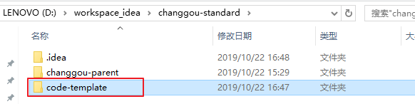

- step2：添加pom文件：

  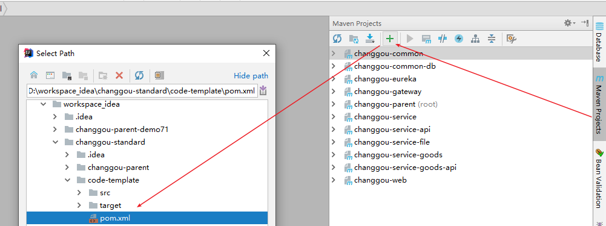

- step3：效果如下：

  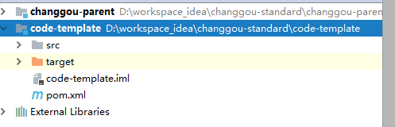

### 2.3.3 使用

step1：修改配置文件

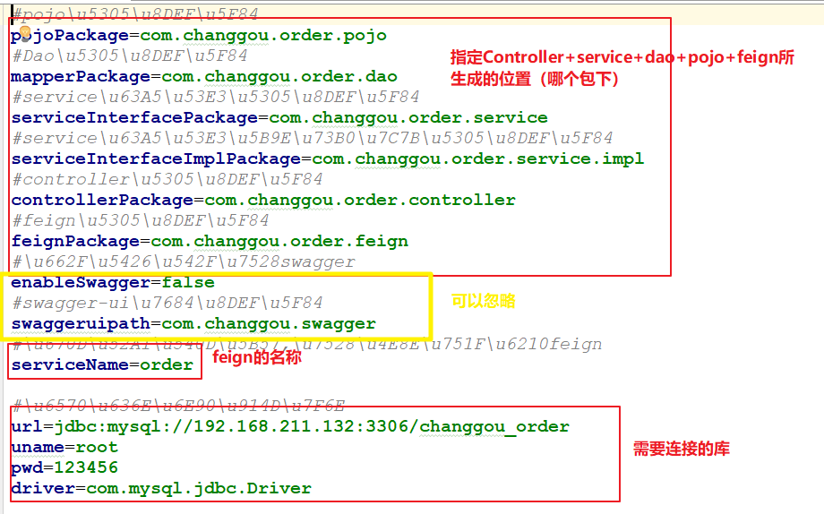


step2：运行main方法

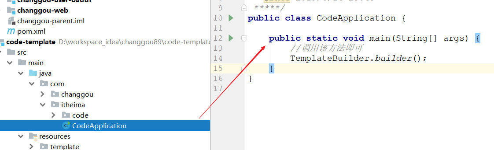


step3：复制代码到对应的工程中，略。

~~~
PS：这里我们只复制Controller+Service+Dao+Pojo到对应的工程中，Feign在后期我们开发的过程中需要我们自己去编写。
~~~


## 2.4 代码实现 

### 2.4.1 查询分类

#### 2.4.1.1 分析

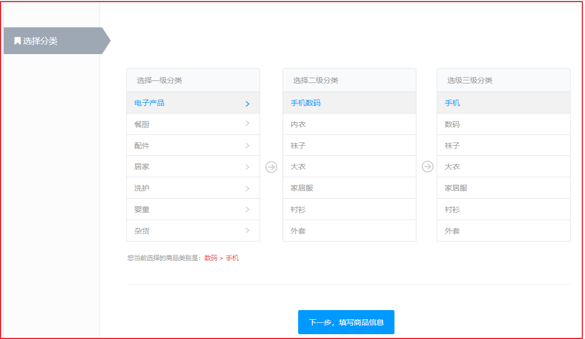

在实现商品增加之前，需要先选择对应的分类，选择分类的时候，首选选择一级分类，然后根据选中的分类，将选中的分类作为查询的父ID，再查询对应的子分类集合，因此我们可以在后台编写一个方法，根据父类ID查询对应的分类集合即可。


#### 2.4.1.2 代码实现

(1)Service层

修改`com.changgou.goods.service.CategoryService`添加根据父类ID查询所有子节点，代码如下：

```java
/***
 * 根据分类的父ID查询子分类节点集合
 */
List<Category> findByParentId(Integer pid);
```

修改`com.changgou.goods.service.impl.CategoryServiceImpl`添加上面的实现，代码如下：

```java
/***
 * 根据分类的父节点ID查询所有子节点
 * @param pid
 * @return
 */
@Override
public List<Category> findByParentId(Integer pid) {
    //SELECT * FROM tb_category WHERE parent_id=?
    Category category = new Category();
    category.setParentId(pid);
    return categoryMapper.select(category);
}
```


(2)Controller层

修改`com.changgou.goods.controller.CategoryController`添加根据父ID查询所有子类集合，代码如下：

```java
/****
 * 根据节点ID查询所有子节点分类集合
 */
@GetMapping(value = "/list/{pid}")
public Result<List<Category>> findByParentId(@PathVariable(value = "pid")Integer pid){
    //调用Service实现查询
    List<Category> categories = categoryService.findByParentId(pid);
    return new Result<List<Category>>(true,StatusCode.OK,"查询成功！",categories);
}
```


### 2.4.3 查询品牌列表数据

#### 2.4.3.1 分析


用户每次选择了分类之后，可以根据用户选择的分类到`tb_category_brand`表中查询指定的品牌集合ID,然后根据品牌集合ID查询对应的品牌集合数据，再将品牌集合数据拿到这里来展示即可实现上述功能。


#### 2.4.3.2 代码实现

(1)Dao实现

修改`com.changgou.goods.dao.BrandMapper`添加根据分类ID查询对应的品牌数据，代码如下：

```java
public interface BrandMapper extends Mapper<Brand> {

    /***
     * 查询分类对应的品牌集合
     */
    @Select("SELECT tb.* FROM tb_category_brand tcb,tb_brand tb WHERE tcb.category_id=#{categoryid} AND tb.id=tcb.brand_id")
    List<Brand> findByCategory(Integer categoryid);
}
```


(2)Service层

修改`com.changgou.goods.service.BrandService`，添加根据分类ID查询指定的品牌集合方法，代码如下：

```java
/***
 * 根据分类ID查询品牌集合
 * @param categoryid:分类ID
 */
List<Brand> findByCategory(Integer categoryid);
```

修改`com.changgou.goods.service.impl.BrandServiceImpl`添加上面方法的实现，代码如下：

```java
/***
 * 根据分类ID查询品牌集合
 * @param categoryid:分类ID
 * @return
 */
@Override
public List<Brand> findByCategory(Integer categoryid) {
    //1.查询当前分类所对应的所有品牌信息
    return brandMapper.findByCategory(categoryid);
}
```


(3)Controller层

修改,添加根据分类ID查询对应的品牌数据代码如下：

```java
/***
 * 根据分类实现品牌列表查询
 * /brand/category/{id}  分类ID
 */
@GetMapping(value = "/category/{id}")
public Result<List<Brand>> findBrandByCategory(@PathVariable(value = "id")Integer categoryId){
    //调用Service查询品牌数据
    List<Brand> categoryList = brandService.findByCategory(categoryId);
    return new Result<List<Brand>>(true,StatusCode.OK,"查询成功！",categoryList);
}
```


### 2.4.2 模板查询

同学作业

#### 2.4.2.1 分析


如上图，当用户选中了分类后，需要根据分类的ID查询出对应的模板数据，并将模板的名字显示在这里，模板表结构如下：

```sql
CREATE TABLE `tb_template` (
  `id` int(11) NOT NULL AUTO_INCREMENT COMMENT 'ID',
  `name` varchar(50) DEFAULT NULL COMMENT '模板名称',
  `spec_num` int(11) DEFAULT '0' COMMENT '规格数量',
  `para_num` int(11) DEFAULT '0' COMMENT '参数数量',
  PRIMARY KEY (`id`)
) ENGINE=InnoDB AUTO_INCREMENT=44 DEFAULT CHARSET=utf8;
```


#### 2.4.2.2 代码实现

(1)Service层

修改`com.changgou.goods.service.TemplateService`接口，添加如下方法根据分类ID查询模板：

```java
/**
 * 根据分类ID查询模板信息
 * @param id
 * @return
 */
Template findByCategoryId(Integer id);
```


修改`com.changgou.goods.service.impl.TemplateServiceImpl`添加上面方法的实现：

```java
@Autowired
private CategoryMapper categoryMapper;

/***
 * 根据分类ID查询模板信息
 * @param id
 * @return
 */
@Override
public Template findByCategoryId(Integer id) {
    //查询分类信息
    Category category = categoryMapper.selectByPrimaryKey(id);

    //根据模板Id查询模板信息
    return templateMapper.selectByPrimaryKey(category.getTemplateId());
}
```


(2)Controller层

修改`com.changgou.goods.controller.TemplateController`，添加根据分类ID查询模板数据：

```java
/***
 * 根据分类查询模板数据
 * @param id:分类ID
 */
@GetMapping(value = "/category/{id}")
public Result<Template> findByCategoryId(@PathVariable(value = "id")Integer id){
    //调用Service查询
    Template template = templateService.findByCategoryId(id);
    return new Result<Template>(true, StatusCode.OK,"查询成功",template);
}
```


### 2.4.4 规格查询

#### 2.4.4.1 分析

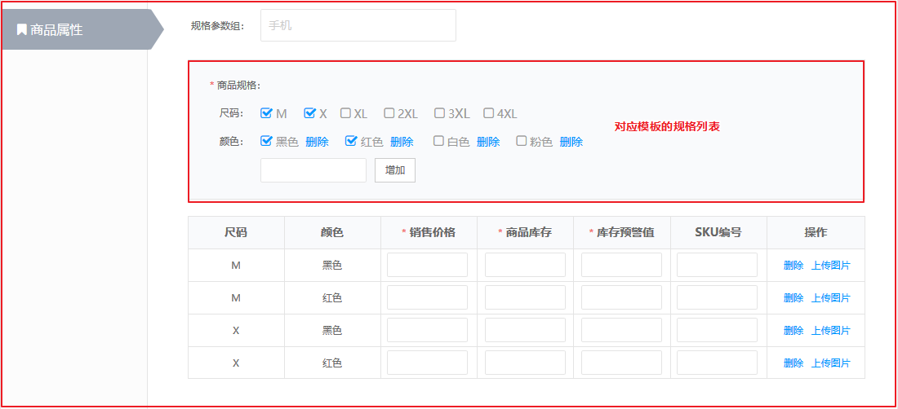

用户选择分类后，需要根据所选分类对应的模板ID查询对应的规格，规格表结构如下：

```sql
CREATE TABLE `tb_spec` (
  `id` int(11) NOT NULL AUTO_INCREMENT COMMENT 'ID',
  `name` varchar(50) DEFAULT NULL COMMENT '名称',
  `options` varchar(2000) DEFAULT NULL COMMENT '规格选项',
  `seq` int(11) DEFAULT NULL COMMENT '排序',
  `template_id` int(11) DEFAULT NULL COMMENT '模板ID',
  PRIMARY KEY (`id`)
) ENGINE=InnoDB AUTO_INCREMENT=40 DEFAULT CHARSET=utf8;
```


#### 2.4.4.2 代码实现

(1)Service层

修改`com.changgou.goods.service.SpecService`添加根据分类ID查询规格列表，代码如下：

```java
/***
 * 根据分类ID查询规格列表
 * @param categoryid
 * @return
 */
List<Spec> findByCategoryId(Integer categoryid);
```

修改`com.changgou.goods.service.impl.SpecServiceImpl`添加上面方法的实现，代码如下：

```java
@Autowired
private CategoryMapper categoryMapper;

/**
 * @author wzw
 * 根据分类ID查询规格列表
 * @Date 22:39 2020/12/10
 * @param categoryid
 * @return java.util.List<com.changgou.goods.pojo.Spec>
**/
@Override
public List<Spec> findByCategoryId(Integer categoryid) {
    //根据id查询category对象
    Category category = categoryMapper.selectByPrimaryKey(categoryid);
    // 创建对象
    Spec spec = new Spec();
    // 设置模板id
    spec.setTemplateId(category.getTemplateId());
    //封装条件
    Example example = createExample(spec);
    //返回  实现功能:根据模板id查询spec对象
    return specMapper.selectByExample(example);
}
```


(2)Controller层

修改`com.changgou.goods.controller.SpecController`添加根据分类ID查询规格数据，代码如下：

```java
/***
 * 根据分类ID查询对应的规格列表
 */
@GetMapping(value = "/category/{id}")
public Result<List<Spec>> findByCategoryId(@PathVariable(value = "id")Integer categoryid){
    //调用Service查询
    List<Spec> specs = specService.findByCategoryId(categoryid);
    return new Result<List<Spec>>(true, StatusCode.OK,"查询成功",specs);
}
```


### 2.4.5 参数列表查询

#### 2.4.5.1 分析


当用户选中分类后，需要根据分类的模板ID查询对应的参数列表，参数表结构如下：

```sql
CREATE TABLE `tb_para` (
  `id` int(11) NOT NULL AUTO_INCREMENT COMMENT 'id',
  `name` varchar(50) DEFAULT NULL COMMENT '名称',
  `options` varchar(2000) DEFAULT NULL COMMENT '选项',
  `seq` int(11) DEFAULT NULL COMMENT '排序',
  `template_id` int(11) DEFAULT NULL COMMENT '模板ID',
  PRIMARY KEY (`id`)
) ENGINE=InnoDB AUTO_INCREMENT=3 DEFAULT CHARSET=utf8;
```


#### 2.4.5.2 代码实现

(1)Service层

修改`com.changgou.goods.service.ParaService`添加根据分类ID查询参数列表，代码如下：

```java
/***
 * 根据分类ID查询参数列表
 * @param id
 * @return
 */
List<Para> findByCategoryId(Integer id);
```

修改`com.changgou.goods.service.impl.ParaServiceImpl`添加上面方法的实现，代码如下：

```java
@Autowired
private CategoryMapper categoryMapper;

/***
 * 根据分类ID查询参数列表
 * @param id
 * @return
 */
@Override
public List<Para> findByCategoryId(Integer id) {
    //查询分类信息
    Category category = categoryMapper.selectByPrimaryKey(id);
    //根据分类的模板ID查询参数列表
    Para para = new Para();
    para.setTemplateId(category.getTemplateId());
    return paraMapper.select(para);
}
```


(2)Controller层

修改`com.changgou.goods.controller.ParaController`，添加根据分类ID查询参数列表，代码如下：

```java
/**
 * 根据分类ID查询参数列表
 * @param id
 * @return
 */
@GetMapping(value = "/category/{id}")
public Result<List<Para>> getByCategoryId(@PathVariable(value = "id")Integer id){
    //根据分类ID查询对应的参数信息
    List<Para> paras = paraService.findByCategoryId(id);
    Result<List<Para>> result = new Result<List<Para>>(true,StatusCode.OK,"查询分类对应的品牌成功！",paras);
    return result;
}
```


### 2.4.6 商品保存 

#### 2.4.6.1 分析

保存商品数据的时候，需要保存Spu和Sku，一个Spu对应多个Sku，我们可以先构建一个Goods对象，将`Spu`和`List<Sku>`组合到一起,前端将2者数据提交过来，再实现添加操作。


#### 2.4.6.2 代码实现

在`GoodsApplication启动类`中，实例化IdWorker对象（分布式自增长ID，Twitter的 Snowflake算法JAVA实现方案）。`是为了注入bean`

~~~java
@Bean
public IdWorker idWorker(){
    return new IdWorker(1, 1);
}
~~~


1、Pojo改造

在changgou-service-goods-api工程创建包装类型的pojo，创建com.changgou.goods.pojo.Goods,代码如下：

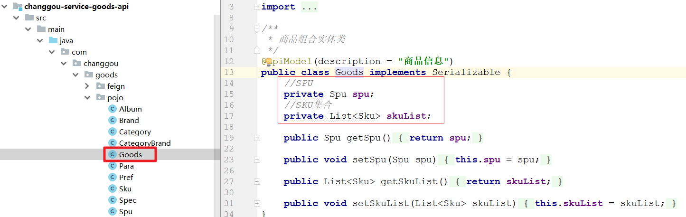

```java
public class Goods implements Serializable {
    private Spu spu;		  // SPU
    private List<Sku> skuList; // SKU集合
    
    // TODO getters/setters
}
```


2、业务层

修改com.changgou.goods.service.SpuService接口，添加保存Goods方法，代码如下：

```java
public interface SpuService {

    /**
     * @author 栗子
     * @Description 商品保存
     * @Date 11:15 2020/7/26
     * @param goods
     * @return void
     **/
    void saveOrUpdate(Goods goods);
}
```


修改com.changgou.goods.service.impl.SpuServiceImpl类，添加保存Goods的方法实现，代码如下：

```java
@Autowired(required = false)
private SpuMapper spuMapper;

@Autowired(required = false)
private SkuMapper skuMapper;

@Autowired(required = false)
private CategoryMapper categoryMapper;

@Autowired(required = false)
private BrandMapper brandMapper;

@Autowired
private IdWorker idWorker;

/**
 * @author wzw
 * 实现保存
 * @Date 16:21 2020/12/11
 * @param goods
 * @return void
**/
@Override
public void saveOrUpdate(Goods goods) {
    //一.设置SPU的状态
    //获取SPU对象
    Spu spu = goods.getSpu();
    //获取自定义id
    long spuId = idWorker.nextId();
    //设置id
    spu.setId(spuId);
    //设置上架状态:未上架
    spu.setIsMarketable("0");
    //设置删除状态:未删除
    spu.setIsDelete("0");
    //设置审核状态:待审核
    spu.setStatus("0");
    //实现功能:添加SPU对象
    spuMapper.insertSelective(spu);
    
    //二.保存商品对应的库存信息
    //获取对象
    List<Sku> skuList = goods.getSkuList();
    //判断是否有对象
    if (skuList != null && skuList.size() > 0) {
        //循环sku对象
        for (Sku sku : skuList) {
            //1.设置主键
            //获取自定义id
            long id = idWorker.nextId();
            //设置主键
            sku.setId(id);
            //2.设置商品库存的名称
            //注意:商品库存的名称 = spu名称 + spu副标题  + 规格的value
            //spu名称+副标题
            String name = spu.getName() + " " + spu.getCaption();
            //规格:{"手机屏幕尺寸":"5寸","网络":"移动4G","颜色":"红","机身内存":"16G","存储":"64G","像素":"800万像素"}
            String spec = sku.getSpec();
            //将规格的json格式转为map格式
            Map<String,String> specMap = JSON.parseObject(spec, Map.class);
            //判断是否为空
            if (specMap != null) {
                //不为空,将map装为Set集合
                Set<Map.Entry<String, String>> entries = specMap.entrySet();
                //遍历Set集合
                for (Map.Entry<String, String> entry : entries) {
                    //将set中的
                    String value = entry.getValue();
                    //加入到name(商品库存的名称)中
                    name += "" + value;
                }
            }
            //设置商品库存的名称
            sku.setName(name);
            //3.设置录入时间
            sku.setCreateTime(new Date());
            //4.设置更新时间
            sku.setUpdateTime(new Date());
            //5.设置商品id
            sku.setSpuId(spu.getId());
            //6.设置三级分类id(还有一二级)
            sku.setCategoryId(spu.getCategory3Id());
            //7.设置分类名称
            //实现查询功能,获取名称
            String categoryName = categoryMapper.selectByPrimaryKey(spu.getCategory3Id()).getName();
            //添加名称
            sku.setCategoryName(categoryName);
            //8.设置品牌名称(实现功能:查询品牌对象,获取名称)
            sku.setBrandName(brandMapper.selectByPrimaryKey(spu.getBrandId()).getName());
            //9.设置商品状态 1-正常，2-下架，3-删除
            sku.setStatus("1");
            //实现功能:添加商品到数据库中
            skuMapper.insertSelective(sku);
            
            //测试用的id,因为表中数据太多,很难找
            System.out.println(sku.getId());
        }
    }
}
```


3、控制层

修改com.changgou.goods.controller.SpuController，增加保存Goods方法，代码如下：

```java
/**
 * @author wzw
 * 添加Goods
 * @Date 16:59 2020/12/11
 * @return
**/
@PostMapping("/save")
public Result save(@RequestBody(required = false) Goods goods){
    //实现功能
    spuService.saveOrUpdate(goods);
    //返回结果
    return new Result(true,StatusCode.OK,"添加Goods成功");
}
```


4、测试

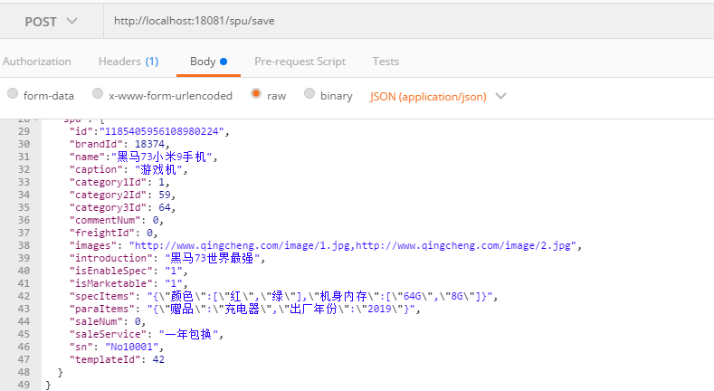

~~~properties
{
  "skuList": [
    {
      "alertNum": 10,
      "commentNum": 0,
      "image": "http://www.baidu.com",
      "images": "",
      "num": 5,
      "price": 1000,
      "saleNum": 0,
      "sn": "No1001",
      "spec": "{\"颜色\":\"红色\",\"网络\":\"移动4G\"}",
      "weight": 0
    },
    {
      "alertNum": 100,
      "commentNum": 0,
      "image": "http://www.baidu.com",
      "images": "",
      "num": 5,
      "price": 2000,
      "saleNum": 0,
      "sn": "No1001",
      "spec": "{\"颜色\":\"黑色\",\"网络\":\"联通4G\"}",
      "weight": 0
    }
  ],
  "spu": {
    "brandId": 8557,
    "name":"华为mate30",
    "caption": "专业拍照",
    "category1Id": 1,
    "category2Id": 59,
    "category3Id": 64,
    "commentNum": 0,
    "freightId": 0,
    "images": "http://www.qingcheng.com/image/1.jpg,http://www.qingcheng.com/image/2.jpg",
    "introduction": "华为产品世界最强",
    "isEnableSpec": "1",
    "isMarketable": "1",
    "specItems": "{\"颜色\":[\"红\",\"绿\"],\"机身内存\":[\"64G\",\"8G\"]}",
    "paraItems": "{\"赠品\":\"充电器\",\"出厂年份\":\"2019\"}",
    "saleNum": 0,
    "saleService": "一年包换",
    "sn": "No10001",
    "templateId": 42
  }
}
~~~


### 2.4.7 根据ID查询商品 

#### 2.4.7.1 需求分析

根据id查询商品信息，用于用户重新编辑商品信息。(回显)

#### 2.4.7.2 代码实现

(1)业务层

修改changgou-service-goods工程,

`修改com.changgou.goods.service.SpuService接口`,

`添加`根据ID查找方法findGoodsById代码如下：

```java
/***
 * 根据SPU的ID查找SPU以及对应的SKU集合
 * @param spuId
 */
Goods findGoodsById(Long spuId);
```


修改qingcheng-service-goods工程，修改com.changgou.goods.service.impl.SpuServiceImpl类，添加根据ID查找findGoodsById方法，代码如下：

```java
/**
 * @author wzw
 *  根据SPU的ID查找SPU以及对应的SKU集合
 * @Date 17:46 2020/12/11
 * @param spuId
 * @return com.changgou.goods.pojo.Goods
**/
@Override
public Goods findGoodsById(Long spuId) {
    //1.查询Spu
    Spu spu = spuMapper.selectByPrimaryKey(spuId);
    //2.查询List<SKu>
    //创建对象
    Sku sku = new Sku();
    //设置查询条件
    sku.setSpuId(spuId);
    //实现功能:查询sku
    List<Sku> skuList = skuMapper.select(sku);
    //3.封装到Goods中
    //创建对象
    Goods goods = new Goods();
    //设置spu
    goods.setSpu(spu);
    //设置skuList
    goods.setSkuList(skuList);
    //返回对象
    return goods;
}
```


(2)控制层

修改com.changgou.goods.controller.SpuController，修改findById方法，代码如下：

```java
/**
 * @author wzw
 *  根据SpuID查询goods信息
 * @Date 17:59 2020/12/11
 * @param spuId
 * @return entity.Result
**/
@GetMapping("/goods/{spuId}")
public Result findGoodsById(@PathVariable(value = "spuId")long spuId){
    // 根据SpuID查询goods信息
    Goods goodsById = spuService.findGoodsById(spuId);
    //返回结果集
    return new Result(true, StatusCode.OK, " 根据SpuID查询goods信息成功", goodsById);
}
```

测试：`http://localhost:18081/spu/goods/1148477874278244352`


### 2.4.8 保存修改 

修改changgou-service-goods的SpuServiceImpl的saveGoods方法，修改添加SPU部分代码：

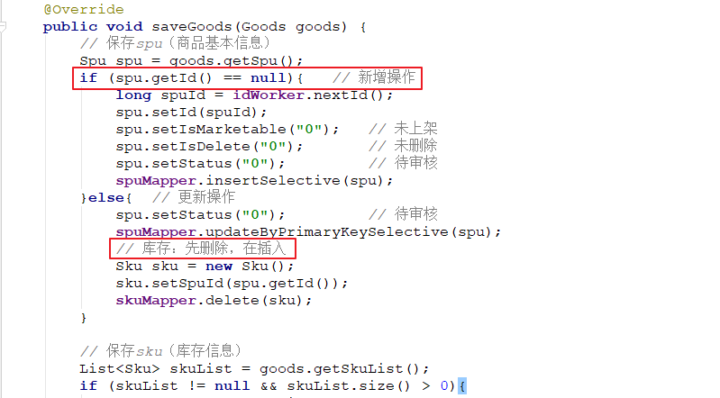

上图代码如下：

```java
@Override
public void saveOrUpdate(Goods goods) {
    // 保存商品信息
    Spu spu = goods.getSpu();
    if (spu.getId() == null){   // 保存操作
        long spuId = idWorker.nextId();
        spu.setId(spuId);   // 主键
        spu.setIsMarketable("0");   // 未上架
        spu.setIsDelete("0");       // 未删除
        spu.setStatus("0");         // 未审核
        
        //实现功能:添加SPU对象
       	spuMapper.insertSelective(spu);
    }else{  
        //3.否则是:修改(更新操作)
        //因为修改了数据:所以要重新审核:未审核
        spu.setStatus("0");
        //实现功能:修改
        spuMapper.updateByPrimaryKeySelective(spu);

        //4.删除原有的库存列表数据
        //创建对象
        Sku sku = new Sku();
        //封装数据
        sku.setSpuId(spu.getId());
        //实现功能:删除
        skuMapper.delete(sku);
    }


    // 保存商品对应的库存信息
    List<Sku> skuList = goods.getSkuList();
    if (skuList != null && skuList.size() > 0){
        for (Sku sku : skuList) {
            long id = idWorker.nextId();
            sku.setId(id);      // 主键
            // 商品库存的名称 = spu名称 + spu副标题  + 规格
            String name = spu.getName() + " " + spu.getCaption();
            // {"手机屏幕尺寸":"5寸","网络":"移动4G","颜色":"红","机身内存":"16G","存储":"64G","像素":"800万像素"}
            String spec = sku.getSpec();
            Map<String, String> specMap = JSON.parseObject(spec, Map.class);
            if (specMap != null){
                Set<Map.Entry<String, String>> entries = specMap.entrySet();
                for (Map.Entry<String, String> entry : entries) {
                    String value = entry.getValue();
                    name += " " + value;
                }
            }
            sku.setName(name);
            sku.setCreateTime(new Date());  // 录入时间
            sku.setUpdateTime(new Date());  // 更新时间
            sku.setSpuId(spu.getId());            // 商品id
            sku.setCategoryId(spu.getCategory3Id());    // 分类id
            String categoryName = categoryMapper.selectByPrimaryKey(spu.getCategory3Id()).getName();
            sku.setCategoryName(categoryName);  // 分类名称
            sku.setBrandName(brandMapper.selectByPrimaryKey(spu.getBrandId()).getName());   // 品牌名称
            sku.setStatus("1"); // 库存状态
            //实现功能:添加SKU对象
            skuMapper.insertSelective(sku);
        }
    }
}
```


### 2.4.9 修改单个SKU库存

（学员实现）


1、保存页面需要初始化的数据

2、完成了保存操作

3、更新操作 

书：实战类型的书籍         Xxx    in   Action


# 3 商品审核与上下架

1、需求：商品的审核（更新审核状态）

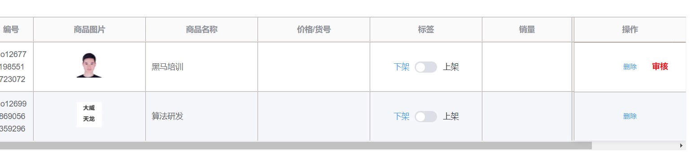

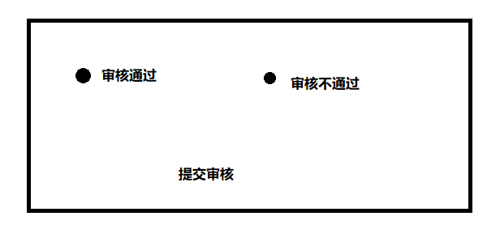

- 提交的数据：  商品id    审核的状态值

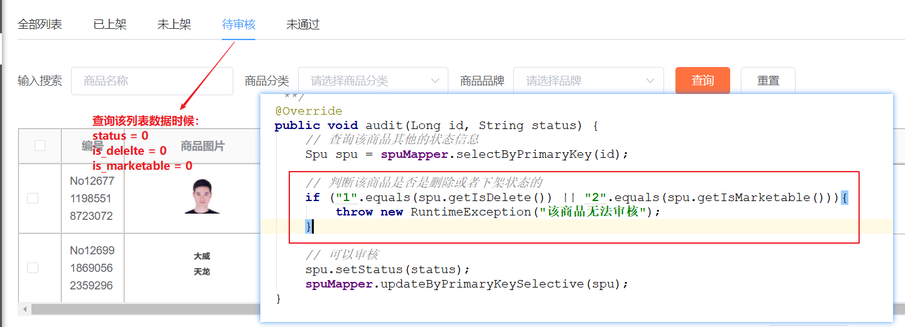


## 3.1 需求分析

商品新增后，审核状态为0（未审核），默认为下架状态。

审核商品，需要校验是否是被删除的商品，如果未删除则修改审核状态为1，并自动上架

下架商品，需要校验是否是被删除的商品，如果未删除则修改上架状态为0

上架商品，需要审核通过的商品

下架为 0   上架为 1


## 3.2 实现思路

（1）按照ID查询SPU信息

（2）判断修改审核、上架和下架状态

（3）保存SPU


## 3.3 代码实现

### 3.3.1 商品审核

实现审核通过，自动上架。

* 改审核状态
* 改显示状态


1、业务层

修改修改changgou-service-goods工程的`com.changgou.goods.service.SpuService接口`，添加审核方法，代码如下：

```java
/**
     * @author 栗子 
     * @Description 商品审核
     * @Date 17:29 2019/10/22
     * @param id
     * @param status
     * @return void
     **/
void audit(Long id, String status);
```


修改changgou-service-goods工程的com.changgou.goods.service.impl.SpuServiceImpl类，`添加audit方法`，代码如下：

```java
/**
 * @author wzw
 * 商品审核
 * @Date 20:41 2020/12/11
 * @param id SPU的id
 * @param status 审核的状态:
 * @return void
**/
@Override
public void audit(Long id, String status) {
    //根据id查询对应的SPU对象
    Spu spu = spuMapper.selectByPrimaryKey(id);
    //判断删除状态是否为:1 已删除
    if ("1".equals(spu.getIsDelete())) {
        //如果已删除就抛出异常
        throw new RuntimeException("删除后的商品不能审核");
    }
    //不然就改SPU对象的审核状态:已审核
    spu.setStatus(status);
    //实现功能:修改SPU对象(id上面查询对象的时候已经给有了)
  spuMapper.updateByPrimaryKeySelective(spu);
}
```


(2)控制层

修改com.changgou.goods.controller.SpuController，新增audit方法，代码如下：

```java
/**
     * @author 栗子 
     * @Description 商品审核
     * @Date 0:37 2019/8/13
     * @param id
     * @param status
     * @return entity.Result
     **/
@GetMapping("/audit/{id}/{status}")
public Result audit(@PathVariable(value = "id") Long id, @PathVariable(value = "status") String status){
    spuService.audit(id, status);
    
    return new Result(true,StatusCode.OK,"审核成功");
}
```


### 3.3.2 上/下架商品

1、业务层

修改com.changgou.goods.service.SpuService接口，添加pull方法，用于商品下架，代码如下：

```java
/**
     * @author 栗子
     * @Description 上架或下架
     * @Date 0:40 2019/8/13
     * @param id
     * @param isMarketable
     * @return void
     **/
    void isShow(Long id, String isMarketable);
```


修改com.changgou.goods.service.impl.SpuServiceImpl，添加如下方法：

```java
/**
 * @author wzw
 * 上架或下架
 * @Date 20:57 2020/12/11
 * @param spuId
 * @param isMarketable 上下架状态
 * @return void
 **/
@Override
public void isShow(Long spuId, String isMarketable) {
    //实现功能:根据id查询spu对象
    Spu spu = spuMapper.selectByPrimaryKey(spuId);
    //设置上下架状态
    spu.setIsMarketable(isMarketable);
    //修改spu对象
    spuMapper.updateByPrimaryKeySelective(spu);
    
    //上架或者下架是否仅仅只是更新状态
    if ("1".equals(isMarketable)){//上架
        //2.TODO 将商品保存到es中
        //3.TODO 生成商品详情的静态页面
    }else {//下架
        //2.TODO 将商品从es中删除
        //3.TODO 删除该商品详情静态页面
    }
}
```


2、控制层

修改com.changgou.goods.controller.SpuController，添加pull方法，代码如下：

```java
/**
 * @author wzw
 * 上架或下架
 * @Date 20:57 2020/12/11
 * @param spuId
 * @param isMarketable 上下架状态: 下架为 0   上架为 1
 * @return void
 **/
@GetMapping("/isShow/{spuId}/{isMarketable}")
public Result isShow(@PathVariable(value = "spuId")Long spuId,@PathVariable(value = "isMarketable")String isMarketable){
    //实现功能:
    spuService.isShow(spuId,isMarketable);
    //返回结果
    return new Result(true,StatusCode.OK,"操作成功");
}
```


### 3.3.3 批量上架 

前端传递一组商品ID，后端进行批量上下架处理

1、业务层

修改com.changgou.goods.service.SpuService接口，代码如下：

```java
/**
 * @author wzw
 *  批量上架
 * @Date 21:37 2020/12/11
 * @param ids 上架id
 * @return void
 **/
int putMany(Long[] ids);
```


修改com.changgou.goods.service.impl.SpuServiceImpl，添加批量上架方法实现，代码如下：

```java
/**
 * @author wzw
 *  批量上架
 * @Date 21:37 2020/12/11
 * @param ids 需要上架的商品ID集合
 * @return void
 **/
@Override
public int putMany(Long[] ids) {
    //1.创建对象
    Spu spu = new Spu();
    //上架
    spu.setIsMarketable("1");
    //批量修改
    //新建条件模板
    Example example = new Example(Spu.class);
    //创建模板
    Example.Criteria criteria = example.createCriteria();
    //测试
    System.out.println("测试"+Arrays.asList(ids));
    //1.添加值id,遍历将数组改为集合
    criteria.andIn("id", Arrays.asList(ids));
    //2.下架条件(只有下架的商品才会上架)
    criteria.andEqualTo("isMarketable","0");
    //3.审核通过的
    criteria.andEqualTo("status","1");
    //4.非删除的
    criteria.andEqualTo("isDelete", "0");
    //返回结果集:实现功能(修改为上架,条件)
    return spuMapper.updateByExampleSelective(spu, example);
}
```


2、控制层

修改com.changgou.goods.controller.SpuController，天啊及批量上架方法，代码如下：

```java
/**
 *  批量上架
 * @param ids
 * @return
 */
@PutMapping("/put/many")
public Result putMany(@RequestBody Long[] ids){
    //Spu的id集合
    int count = spuService.putMany(ids);
    //返回结果
    return new Result(true,StatusCode.OK,"上架"+count+"个商品");
}
```


使用Postman测试：


### 3.3.4 批量下架

学员实现


# 4 删除与还原商品 

## 4.1 需求分析 

请看管理后台的静态原型

商品列表中的删除商品功能，并非真正的删除，而是将删除标记的字段设置为1，

在回收站中有恢复商品的功能，将删除标记的字段设置为0

在回收站中有删除商品的功能，是真正的物理删除。


## 4.2 实现思路 

逻辑删除商品，修改spu表is_delete字段为1

商品回收站显示spu表is_delete字段为1的记录

回收商品，修改spu表is_delete字段为0


## 4.3 代码实现 

### 4.3.1 逻辑删除商品 

(1)业务层

修改com.changgou.goods.service.SpuService接口，增加logicDelete方法，代码如下：

```java
/***
 * 逻辑删除
 * @param spuId
 */
void logicDelete(Long spuId);
```


修改com.changgou.goods.service.impl.SpuServiceImpl，添加logicDelete方法实现，代码如下：

```java
/***
 * 逻辑删除
 * @param spuId
 */
@Override
public void logicDelete(Long spuId) {
    //查询SPU对象
    Spu spu = spuMapper.selectByPrimaryKey(spuId);
    //检查是否下架的商品
    if (!"0".equals(spu.getIsMarketable())){
        //给异常
        throw new RuntimeException("必须先下架再删除");
    }
    
    //设置删除状态:逻辑删除
    spu.setIsDelete("1");
    //设置审核状态:未审核
    spu.setStatus("0");
    //实现功能:修改
    spuMapper.updateByPrimaryKeySelective(spu);
}
```


(2)控制层

修改com.changgou.goods.controller.SpuController，添加logicDelete方法，如下：

```java
/**
 * 逻辑删除
 * @param id
 * @return
 */
@DeleteMapping("/logic/delete/{id}")
public Result logicDelete(@PathVariable Long id){
    //实现功能
    spuService.logicDelete(id);
    //返回结果
    return new Result(true,StatusCode.OK,"逻辑删除成功！");
}
```


### 4.3.2 还原被删除的商品 

(1)业务层

修改com.changgou.goods.service.SpuService接口，添加restore方法代码如下：

```java
/***
 * 还原被删除商品
 * @param spuId
 */
void restore(Long spuId);
```

修改com.changgou.goods.service.impl.SpuServiceImpl类，添加restore方法，代码如下：

```java
/**
 * @author wzw
 * 恢复数据
 * @Date 23:30 2020/12/11
 * @param spuId
 * @return void
**/
@Override
public void restore(Long spuId) {
    //获取恢复的对象
    Spu spu = spuMapper.selectByPrimaryKey(spuId);
    //检查是否删除的商品
    if (!"1".equals(spu.getIsDelete())){
        //抛异常
        throw new RuntimeException("此商品未删除！");
    }
    //设置删除状态:未删除
    spu.setIsDelete("0");
    //设置审核状态:未审核
    spu.setStatus("0");
    //实现功能:修改
    spuMapper.updateByPrimaryKeySelective(spu);
}
```


(2)控制层

修改com.changgou.goods.controller.SpuController，添加restore方法，代码如下：

```java
/**
 * 恢复数据
 * @param id
 * @return
 */
@PutMapping("/restore/{id}")
public Result restore(@PathVariable Long id){
    //实现功能
    spuService.restore(id);
    //返回结果
    return new Result(true,StatusCode.OK,"数据恢复成功！");
}
```


### 4.3.3 物理删除商品  

修改com.changgou.goods.service.impl.SpuServiceImpl的delete方法,代码如下：

```java
/**
 * 删除
 * @param id
 */
@Override
public void delete(Long id){
    Spu spu = spuMapper.selectByPrimaryKey(id);
    //检查是否被逻辑删除  ,必须先逻辑删除后才能物理删除
    if(!spu.getIsDelete().equals("1")){
        //抛异常
        throw new RuntimeException("此商品不能删除！");
    }
    //物理删除
    spuMapper.deleteByPrimaryKey(id);
}
```


# 5 商品列表

## 5.1 需求分析

如图所示 展示商品的列表。并实现分页。


思路：

```properties
根据查询的条件 分页查询 并返回分页结果即可。
分页查询 采用 pagehelper ，条件查询  通过map进行封装传递给后台即可。
```


## 5.2 代码实现

在代码生成器生成的代码中已经包含了该实现，这里就省略了。

控制层（SpuController）:

```java
/***
 * Spu分页条件搜索实现
 * @param spu
 * @param page
 * @param size
 * @return
 */
@PostMapping(value = "/search/{page}/{size}" )
public Result<PageInfo> findPage(@RequestBody(required = false) Spu spu, @PathVariable  int page, @PathVariable  int size){
    //执行搜索
    PageInfo<Spu> pageInfo = spuService.findPage(spu, page, size);
    return new Result(true,StatusCode.OK,"查询成功",pageInfo);
}
```

其他每层代码，代码生成器已经生成，这里就不再列出来了。


