# 第5章 商品搜索

课程回顾：


1、看今天资料

2、好  加油

3、好             积极点            **完成**。

4、行

5、声音小


1、lua脚本

- 介绍
  - lua是一个脚本语言（执行效率非常高）
  - lua它适合作为一个程序独立开发语言（没有与java一样，提供强大、丰富的库）
  - lua它可以在已有的程序中添砖加瓦（扩展功能【插件】）

2、lua的基本语法的入门

- 注释
- 定义变量：   local关键字（private），局部变量
- 流程控制：if...else
- 循环：while、for  var=expr1, expr2，expr3、repeat
- 函数（方法）：function  ....      end
- 模块/表：java中的类（对象），  module_name={}
- 引用其他模块：require

3、前台系统广告加载

- 广告数据在后台系统进行维护---->广告的基础数据维护在MySQL中---->读----->I/O操作（磁盘）---->增加MySQL的吞吐量---->DB的性能降低---->应用程序性能降低
- 解决问题：我不想进行I/O操作
  - 数据在内存中：Redis（服务器端的   客户端与服务器端进行交互，性能消耗。）
  - 应用程序更好：本地缓存   OpenRestry
- OpenRestry：通过lua扩展了Nginx

4、OpenRestry

- 广告模块：
  - 广告位（广告分类表）：tb_content_category
  - 广告表：每个广告位下有多个广告表    tb_content（category_id）
- 广告数据的加载逻辑：通过lua脚本去实现的。
- 脚本：
  - update_content.lua
  - read_content.lua：逻辑    （本地缓存数据：过期时间。）

5、Nginx的限流

- 限制访问速率    rate     brush    nodelay
  - 限制单个客户端每秒的请求的次数（别刷太快）
- 控制连接数
  - 控制单个客户端
  - 控制总连接数

6、canal的介绍以及使用

- 介绍：
  - canal是监控数据库变化的组件，由阿里提供
    - 需要MySQL开启Binlog日志
- canal入门程序：略
  - 启动类：@EnableCanalClient
  - 编写监听器：@CanalEventListener       方法上：@Insert/Update/DeleteListener
- 通过监控，完成缓存数据的更新


学习目标：服务器端的检索操作

- Elasticsearch安装介绍

- IK分词器配置

- Kibana的使用：DSL语句

- ES导入商品搜索数据

- 根据关键字检索

- 统计商品分类列表【可选】


# 1 Elasticsearch安装-了解 

~~~
PS：虚拟机已提供相关环境

es的访问地址：http://192.168.211.132:9200
kibana访问地址：http://192.168.211.132:5601
head插件访问地址：http://192.168.211.132:9100
~~~


我们之前已经使用过elasticsearch了，这里不再对它进行介绍了，直接下载安装，本章节将采用Docker安装，不过在市面上还有很多采用linxu安装，关于linux安装，已经提供了安装手册，这里就不讲了。

(1)docker镜像下载

```properties
docker pull elasticsearch:5.6.8
```

注意：由于镜像有570MB，所以提供的虚拟机里已经下载好了该镜像，如下图：


(2)安装es容器

```properties
docker run -di --name=changgou_elasticsearch -p 9200:9200 -p 9300:9300 elasticsearch:5.6.8
```

 9200端口(Web管理平台端口)  9300(服务默认端口)

浏览器输入地址访问：`http://192.168.211.132:9200/`


(3)开启远程连接

上面完成安装后，es并不能正常使用，elasticsearch从5版本以后默认不开启远程连接，程序直接连接会报如下错误：

```java
failed to load elasticsearch nodes : org.elasticsearch.client.transport.NoNodeAvailableException: None of the configured nodes are available: [{#transport#-1}{5ttLpMhkRjKLkvoY7ltUWg}{192.168.211.132}{192.168.211.132:9300}]
```

我们需要修改es配置开启远程连接，代码如下：

登录容器

```properties
docker exec -it changgou_elasticsearch /bin/bash
```

查看目录结构 输入: dir

```properties
root@07f22eb41bb5:/usr/share/elasticsearch# dir
NOTICE.txt  README.textile  bin  config  data  lib  logs  modules  plugins
```

进入config目录

```properties
cd config
```

查看文件

```properties
root@07f22eb41bb5:/usr/share/elasticsearch/config# ls
elasticsearch.yml  log4j2.properties  scripts
```

修改elasticsearch.yml文件

```properties
root@07f22eb41bb5:/usr/share/elasticsearch/config# vi elasticsearch.yml
bash: vi: command not found
```

vi命令无法识别，因为docker容器里面没有该命令，我们可以安装该编辑器。

安装vim编辑器

```properties
apt-get update
apt-get install vim
```

安装好了后，修改elasticsearch.yml配置，如下图：

```properties
vi elasticsearch.yml
```

修改如下图：


同时添加下面一行代码：

```properties
cluster.name: my-application
```

重启docker

```properties
docker restart changgou_elasticsearch
```

(4)系统参数配置

重启后发现重启启动失败了，这时什么原因呢？这与我们刚才修改的配置有关，因为elasticsearch在启动的时候会进行一些检查，比如最多打开的文件的个数以及虚拟内存区域数量等等，如果你放开了此配置，意味着需要打开更多的文件以及虚拟内存，所以我们还需要系统调优 

修改vi /etc/security/limits.conf ，追加内容 (nofile是单个进程允许打开的最大文件个数 soft nofile 是软限制 hard nofile是硬限制 )

```properties
* soft nofile 65536
* hard nofile 65536
```

修改vi /etc/sysctl.conf，追加内容 (限制一个进程可以拥有的VMA(虚拟内存区域)的数量 )

```properties
vm.max_map_count=655360
```

执行下面命令 修改内核参数马上生效

```properties
sysctl -p
```

重新启动虚拟机，再次启动容器，发现已经可以启动并远程访问 

```properties
reboot
```


(5)跨域配置

修改elasticsearch/config下的配置文件：elasticsearch.yml，增加以下三句命令，并重启:

```properties
http.cors.enabled: true
http.cors.allow-origin: "*"
network.host: 192.168.211.132
```

其中：
http.cors.enabled: true：此步为允许elasticsearch跨域访问，默认是false。
http.cors.allow-origin: "*"：表示跨域访问允许的域名地址（*表示任意）。

重启

```properties
 docker restart changgou_elasticsearch
```


小提示：如果想让容器开启重启，可以执行下面命令

```properties
docker update --restart=always 容器名称或者容器id
```


# 2 IK分词器安装-了解 

~~~
PS：虚拟机已提供相关环境
~~~


(1)安装ik分词器

IK分词器下载地址https://github.com/medcl/elasticsearch-analysis-ik/releases

将ik分词器上传到服务器上，然后解压，并改名字为ik

```properties
unzip elasticsearch-analysis-ik-5.6.8.zip
mv elasticsearch ik
```

将ik目录拷贝到docker容器的plugins目录下

```properties
docker cp ./ik changgou_elasticsearch:/usr/share/elasticsearch/plugins
```


(2)IK分词器测试

访问：`http://192.168.211.132:9200/_analyze?analyzer=ik_smart&pretty=true&text=我是程序员`


访问：`http://192.168.211.132:9200/_analyze?analyzer=ik_max_word&pretty=true&text=我是程序员`


# 3 Kibana使用

kibana：

1、它是es的客户端的管理工具，类似与MySQL中的sqlyog/Navicat 

2、head插件也是es的客户端管理工具，但是它相比kibana来说，head的功能简单

3、kibana

- 对数据生成报表展示信息，便于用户进行分析
- 编写DSL（类似MySQL中的sql语句）语法时，kibana中提供了格式以及自动提示功能

4、安装kibana-虚拟机已安装完成

~~~shell
访问：http://192.168.211.132:5601

如果访问不了的同学，重新再安装一次。
1、停止kibana容器：docker stop kibana
2、删除kibana容器：docker rm kibana
3、重新创建kibana容器：docker run -it -d -e ELASTICSEARCH_URL=http://192.168.211.132:9200 --name kibana --restart=always -p 5601:5601 kibana:5.6.8
~~~

5、kibana5.6.8版本中：对中文的支持不是很友好。


我们上面使用的是elasticsearch-head插件实现数据查找的，但是elasticsearch-head的功能比较单一，我们这里需要一个更专业的工具实现对日志的实时分析，也就是我们接下来要讲的kibana。

Kibana 是一款开源的数据分析和可视化平台，它是 Elastic Stack 成员之一，设计用于和 Elasticsearch 协作。您可以使用 Kibana 对 Elasticsearch 索引中的数据进行搜索、查看、交互操作。您可以很方便的利用图表、表格及地图对数据进行多元化的分析和呈现。

Kibana 可以使大数据通俗易懂。它很简单，基于浏览器的界面便于您快速创建和分享动态数据仪表板来追踪 Elasticsearch 的实时数据变化。

搭建 Kibana 非常简单。您可以分分钟完成 Kibana 的安装并开始探索 Elasticsearch 的索引数据 — 没有代码、不需要额外的基础设施。


## 3.1  Kibana下载安装-了解

~~~
PS：虚拟机已提供相关环境
访问地址：http://192.168.211.132:5601
~~~


我们项目中不再使用linux，直接使用Docker，所有这里就不演示在windows的下载安装了。

(1)镜像下载

```properties
docker pull docker.io/kibana:5.6.8
```

为了节省时间，虚拟机中已经存在该版本的镜像了.

(2)安装kibana容器

执行如下命令，开始安装kibana容器

```properties
docker run -it -d -e ELASTICSEARCH_URL=http://192.168.211.132:9200 --name kibana --restart=always -p 5601:5601 kibana:5.6.8
```

ELASTICSEARCH_URL=http://192.168.211.132:9200：是指链接的ES地址

restart=always:每次服务都会重启，也就是开启启动

5601:5601:端口号


(3)访问测试

访问`http://192.168.211.132:5601`如下：


## 3.2 Kibana使用

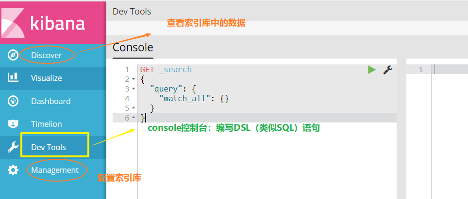


### 3.2.1 配置索引

要使用Kibana，您必须至少配置一个索引。索引用于标识Elasticsearch索引以运行搜索和分析。它们还用于配置字段。 


我们修改索引名称的匹配方式即可，下面2个选项不用勾选。点击create，会展示出当前配置的索引的域信息，如下图：

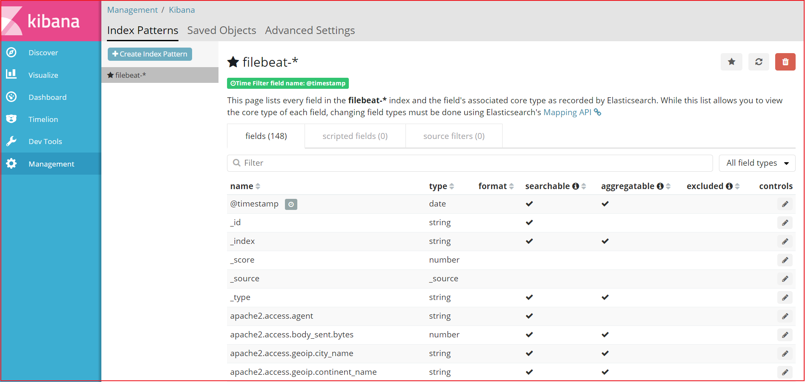

域的每个标题选项分别代表如下意思：


### 3.2.2 数据搜索

Discover为数据搜索部分，可以对日志信息进行搜索操作。

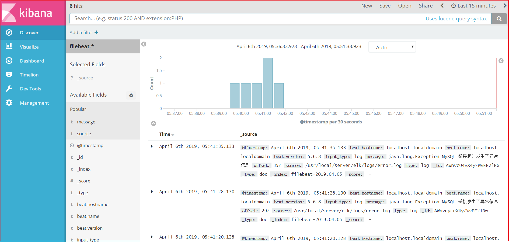

可以使用Discover实现数据搜索过滤和搜索条件显示以及关键词搜索，如下图：


# 4 DSL语句使用

## 4.1 Query DSL结构化查询介绍

Query DSL是一个Java开源框架用于构建类型安全的SQL查询语句。采用API代替传统的拼接字符串来构造查询语句。目前Querydsl支持的平台包括JPA,JDO，SQL，Java Collections，RDF，Lucene，Hibernate Search。elasticsearch提供了一整套基于JSON的查询DSL语言来定义查询。
Query DSL当作是一系列的抽象的查询表达式树(AST)特定查询能够包含其它的查询，(如 bool ), 有些查询能够包含过滤器(如 constant_score), 还有的可以同时包含查询和过滤器 (如 filtered). 都能够从ES支持查询集合里面选择任意一个查询或者是从过滤器集合里面挑选出任意一个过滤器, 这样的话，我们就可以构造出任意复杂（maybe 非常有趣）的查询了。


ES：它是一个全文检索服务器，是基于lucene实现的。并对外提供了RESTful web接口。

- 接口地址：提供好的。


## 4.2 索引操作

### 4.2.1 查询所有索引

```properties
# find all indices
GET /_cat/indices
# find all indices   ?v：显示列名
GET /_cat/indices?v	
```

结果如下：

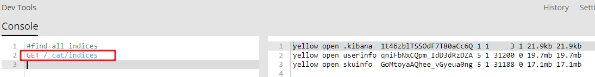

**?v：显示列名**

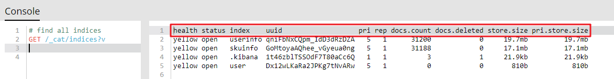

### 4.2.2 创建索引

```properties
# create index
PUT /user
```

效果如下：


### 4.2.3 创建映射（参考已有例子编写）

#### 注意

* name字段名
  * type:类型
  * store:是否存入
  * analyzer:分词方式
  * search_analyzer

```properties
# create mapping(/库/表/映射)
PUT /user/userinfo/_mapping
{
  "properties": {
    "name":{
      "type": "text",
      "store": false,
      "analyzer": "ik_smart",
      "search_analyzer": "ik_smart"
    },
    "age":{
      "type": "long",
      "store": false
    },
    "city":{
      "type": "text",
      "store": false,
      "analyzer": "ik_smart",
      "search_analyzer": "ik_smart"
    },
    "description":{
      "type": "text",
      "store": false,
      "analyzer": "ik_smart",
      "search_analyzer": "ik_smart"
    }
  }
}
```

效果如下：


### 4.2.4 删除某个索引

```properties
# delete index
DELETE /skuinfo
```

效果如下：

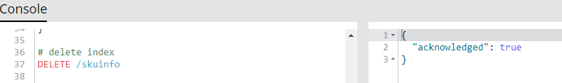


## 4.3 文档操作

### 4.3.1 创建文档

```properties
# add doc(/库/表/_id)
PUT /user/userinfo/1
{
  "name":"李四",
  "age":20,
  "city":"深圳",
  "description":"李四来自湖北武汉"
}
```

效果如下：


我们再增加6条记录：

```properties
#新增文档数据 id=2
PUT /user/userinfo/2
{
  "name":"王五",
  "age":35,
  "city":"深圳",
  "description":"王五家住在深圳！"
}

#新增文档数据 id=3
PUT /user/userinfo/3
{
  "name":"张三",
  "age":19,
  "city":"深圳",
  "description":"在深圳打工，来自湖北武汉"
}

#新增文档数据 id=4
PUT /user/userinfo/4
{
  "name":"张三丰",
  "age":66,
  "city":"武汉",
  "description":"在武汉读书，家在武汉！"
}

#新增文档数据 id=5
PUT /user/userinfo/5
{
  "name":"赵子龙",
  "age":77,
  "city":"广州",
  "description":"赵子龙来自深圳宝安，但是在广州工作！",
  "address":"广东省茂名市"
}

#新增文档数据 id=6
PUT /user/userinfo/6
{
  "name":"赵毅",
  "age":55,
  "city":"广州",
  "description":"赵毅来自广州白云区，从事电子商务8年！"
}

#新增文档数据 id=7
PUT /user/userinfo/7
{
  "name":"赵哈哈",
  "age":57,
  "city":"武汉",
  "description":"武汉赵哈哈，在深圳打工已有半年了，月薪7500！"
}
```


### 4.3.2 更新文档

#### 4.3.2.1 PUT更新

更新数据可以使用之前的增加操作,这种操作会将整个数据替换掉，代码如下：

```properties
# update doc 没有非空判断（替换整个数据，没有指定字段值的则为null）
PUT /user/userinfo/7
{
  "name":"赵哈哈-更新",
  "age":60
}
```

效果如下：


#### 4.3.2.2 POST更新

我们先使用下面命令恢复数据：

```properties
#恢复文档数据 id=4
PUT /user/userinfo/7
{
  "name":"赵哈哈",
  "age":57,
  "city":"武汉",
  "description":"武汉赵哈哈，在深圳打工已有半年了，月薪7500！"
}
```

使用POST更新某个列的数据

```properties
# update doc 有非空判断(更新某些字段的值)
POST /user/userinfo/7/_update
{
  "doc": {
    "name":"赵哈哈-更新",
    "age":60
  }
}
```

效果如下：

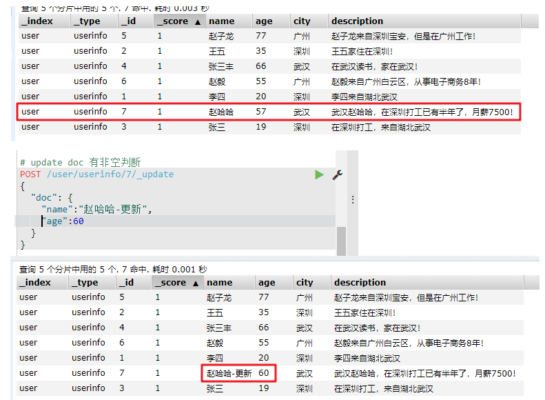

#### 比较


### 4.3.3 删除文档

```properties
#删除数据
DELETE user/userinfo/7
```

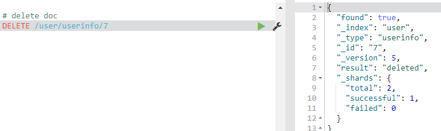

### 4.3.4 查询文档数据

#### 4.3.4.1 查询所有数据

```properties
#查询所有
GET /user/_search
```

效果如下：

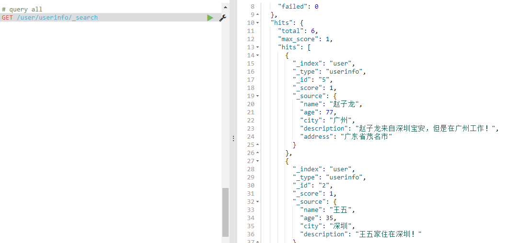


#### 4.3.4.2 根据ID查询

```properties
#根据ID查询
GET /user/userinfo/1
```

效果如下：

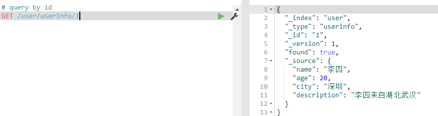


#### 4.3.4.3 Sort排序

`按照年龄排序`(升序)

```properties
# query by sort
GET /user/_search
{
  "sort": [
    {
      "age": {
        "order": "asc"
      }
    }
  ]
}
```

效果如下：

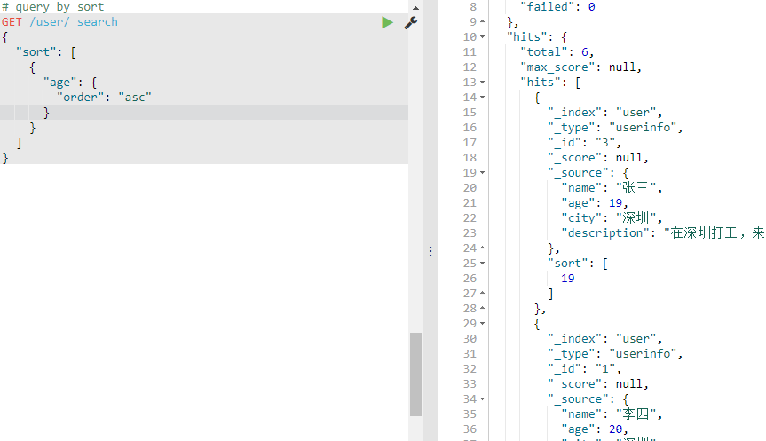


#### 4.3.4.4 分页

##### 注意

* sort:排序
* order:asc=升序   h...=降序

* from:页码  (当前页码  - 1) * size

* size:每页数量

```properties
# query by page
GET user/_search
{
  "sort": [
    {
      "age": {
        "order": "asc"
      }
    }
  ]
  , "from": 0
  , "size": 3
}
```

解释：

**from:起始行 = （当前页码-1）* 每页显示的条数**

**size:每页显示条数**

效果如下：

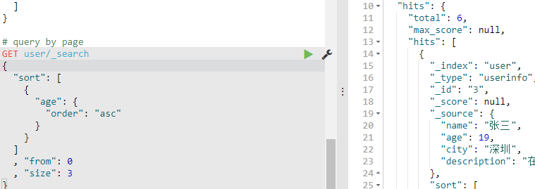


### 4.3.5 过滤查询

#### 4.3.5.1 term过滤

* query  查询
* term主要用于`分词`精确匹配，如字符串、数值、日期等（不适合情况：1.列中除英文字符外有其它值 2.字符串值中有冒号或中文 3.系统自带属性如_version）
* city:查询的位置
* value:条件

如下案例：

~~~properties
# query by term
GET /user/_search
{
  "query": {
    "term": {
      "city": {
        "value": "深圳"
      }
    }
  }
}
~~~


```json
#过滤查询-term
GET _search
{
  "query":{
    "term":{
      "city":"武汉"
    }
  }
}效果如下：
```

效果如下：


#### 4.3.5.2 terms 过滤

terms 跟 term 有点类似，但 terms 允许`指定多个匹配条件`。 如果某个字段指定了多个值，那么文档需要一起去做匹配 。

案例如下：

~~~properties
# query by terms
GET /user/_search
{
  "query": {
    "terms": {
      "city": [
        "深圳",
        "武汉"
      ]
    }
  }
}
~~~


```json
#过滤查询-terms 允许多个Term
GET _search
{
  "query":{
    "terms":{
      "city":
        [
          "武汉",
          "广州"
        ]
    }
  }
}
```

效果如下：


#### 4.3.5.3 range 过滤

range过滤允许我们按照指定范围查找一批数据。例如我们查询年龄范围

案例如下：

~~~properties
# query by range
GET /user/_search
{
  "query": {
    "range": {
      "age": {
        "gte": 10,
        "lte": 20
      }
    }
  }
}

~~~


```json
#过滤-range 范围过滤
#gt表示> gte表示=>
#lt表示< lte表示<=
GET _search
{
  "query":{
    "range": {
      "age": {
        "gte": 30,
        "lte": 57
      }
    }
  }
}
```

上图效果如下：

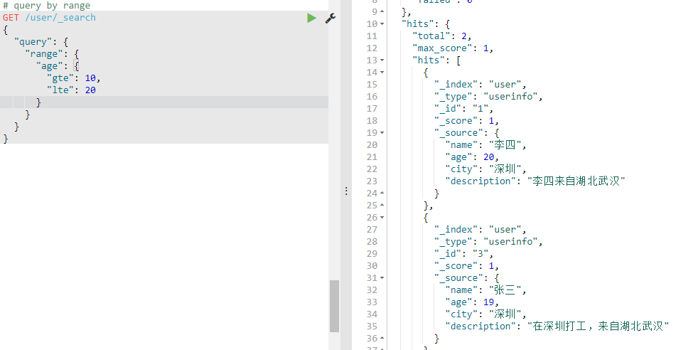


#### 4.3.5.4 exists过滤-了解

exists 过滤可以用于查找拥有某个域的数据 

案例如下：

```json
#过滤搜索 exists：是指包含某个域的数据检索
GET _search
{
  "query": {
    "exists":{
      "field":"address"
    }
  }
}
```

效果如下：

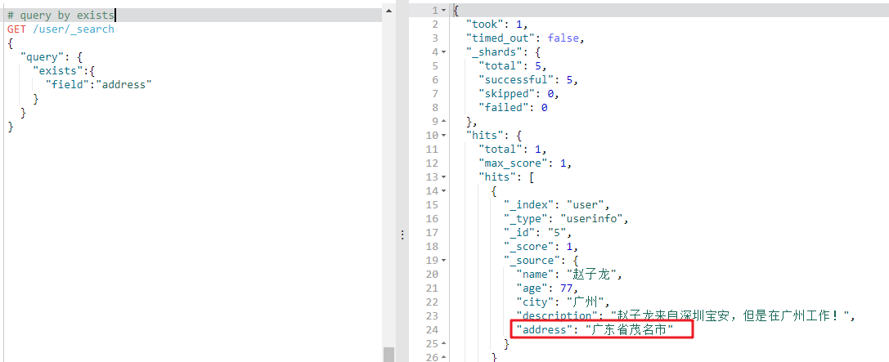


#### 4.3.5.5 bool 过滤

bool 过滤可以用来合并多个过滤条件查询结果的布尔逻辑，它包含一下操作符：

- must : 多个查询条件的完全匹配,相当于 and。
- must_not : 多个查询条件的相反匹配，相当于 not。
- should : 至少有一个查询条件匹配, 相当于 or。

这些参数可以分别继承一个过滤条件或者一个过滤条件的数组：

案例如下：

~~~properties
# query by boolean
GET /user/_search
{
  "query": {
    "bool": {
      "must": [
        {
          "term": {
            "city": {
              "value": "深圳"
            }
          }
        }
      ], 
      "must_not": [
        {
          "range": {
            "age": {
              "gte": 10,
              "lte": 20
            }
          }
        }
      ]
    }
  }
}
~~~

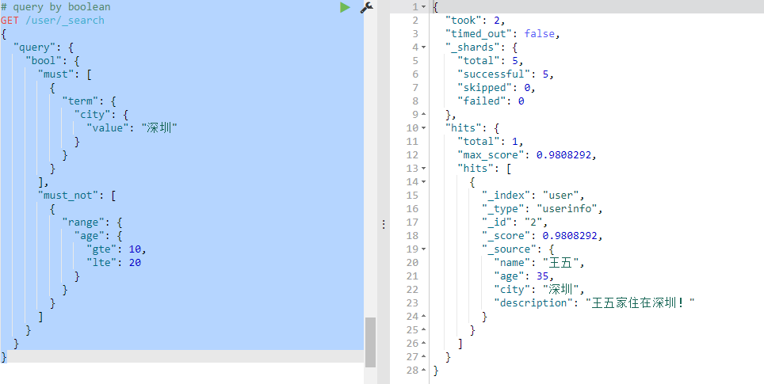


```json
#过滤搜索 bool 
#must : 多个查询条件的完全匹配,相当于 and。
#must_not : 多个查询条件的相反匹配，相当于 not。
#should : 至少有一个查询条件匹配, 相当于 or。
GET _search
{
  "query": {
    "bool": {
      "must": [
        {
          "term": {
            "city": {
              "value": "深圳"
            }
          }
        },
        {
          "range":{
            "age":{
              "gte":20,
              "lte":99
            }
          }
        }
      ]
    }
  }
}
```

效果如下：

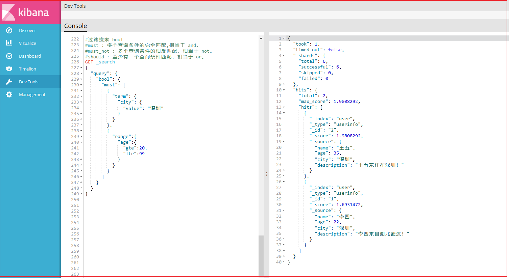


#### 4.3.5.6 match_all 查询

可以查询到所有文档，是没有查询条件下的默认语句。 

案例如下：

~~~properties
# query all
GET /user/_search
{
  "query": {
    "match_all": {}
  }
}
~~~

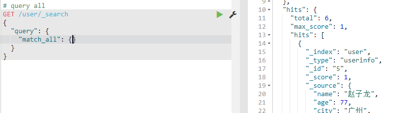

```json
#查询所有 match_all
GET _search
{
  "query": {
    "match_all": {}
  }
}
```

#### 4.3.5.7 match 查询

match查询是一个标准查询

- 不管你需要全文本查询      对检索内容进行分词（切词）
- 精确查询                             根据词条查询


match查询是一个标准查询，不管你需要全文本查询还是精确查询基本上都要用到它。

如果你使用 match 查询一个全文本字段，它会在真正查询之前用分析器先分析match一下查询字符：

案例如下：

~~~properties
# query by match
GET /user/_search
{
  "query": {
    "match": {
      "description": "武汉"
    }
  }
}
~~~


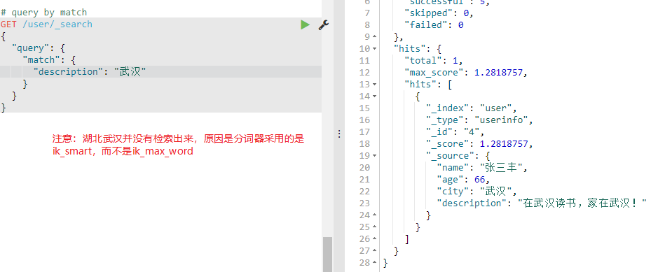

```json
#字符串匹配
GET _search
{
  "query": {
    "match": {
      "description": "武汉"
    }
  }
}
```

效果如下：

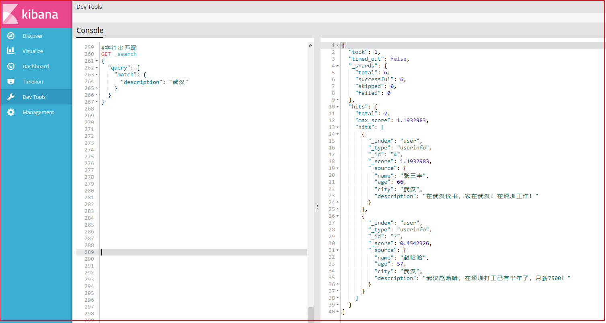


#### 4.3.5.8 prefix 查询

以什么字符开头的，可以更简单地用 prefix ,例如查询所有以张开始的用户描述

案例如下：

```properties
#前缀匹配 prefix
GET _search
{
  "query": {
    "prefix": {
      "name": {
        "value": "赵"
      }
    }
  }
}
```

效果如下：


#### 4.3.5.9 multi_match 查询

multi_match查询允许你做match查询的基础上同时搜索多个字段，在多个字段中同时查一个 

案例如下：

```json
#多个域匹配搜索
GET _search
{
  "query": {
    "multi_match": {
      "query": "深圳",
      "fields": [
        "city",
        "description"
      ]
    }
  }
}
```

效果如下：

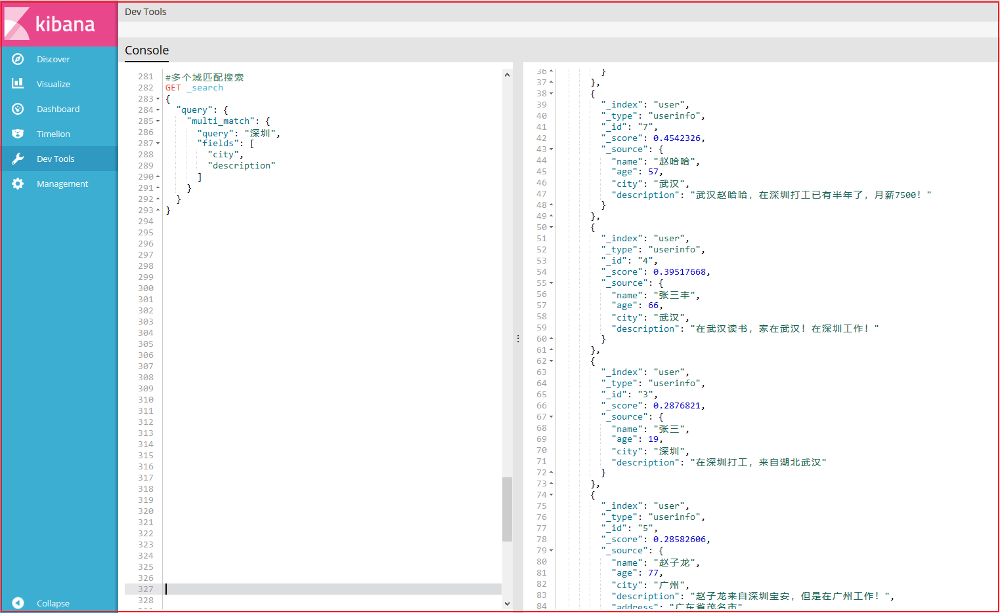


#### 4.2.6.10 完整DSL语句代码

```properties
# find all index
GET _cat/indices
GET _cat/indices?v

# delete index
DELETE /user

# create index
PUT /user

# create mapping
PUT /user/userinfo/_mapping
{
  "properties": {
    "name":{
      "type": "text",
      "store": false,
      "analyzer": "ik_smart",
      "search_analyzer": "ik_smart"
    },
    "age":{
      "type": "long",
      "store": false
    },
    "city":{
      "type": "text",
      "store": false,
      "analyzer": "ik_smart",
      "search_analyzer": "ik_smart"
    },
    "description":{
      "type": "text",
      "store": false,
      "analyzer": "ik_smart",
      "search_analyzer": "ik_smart"
    }
  }
}

# add doc
PUT /user/userinfo/1
{
  "name":"李四",
  "age":20,
  "city":"深圳",
  "description":"李四来自湖北武汉"
}

#新增文档数据 id=2
PUT /user/userinfo/2
{
  "name":"王五",
  "age":35,
  "city":"深圳",
  "description":"王五家住在深圳！"
}

#新增文档数据 id=3
PUT /user/userinfo/3
{
  "name":"张三",
  "age":19,
  "city":"深圳",
  "description":"在深圳打工，来自湖北武汉"
}

#新增文档数据 id=4
PUT /user/userinfo/4
{
  "name":"张三丰",
  "age":66,
  "city":"武汉",
  "description":"在武汉读书，家在武汉！"
}

#新增文档数据 id=5
PUT /user/userinfo/5
{
  "name":"赵子龙",
  "age":77,
  "city":"广州",
  "description":"赵子龙来自深圳宝安，但是在广州工作！",
  "address":"广东省茂名市"
}

#新增文档数据 id=6
PUT /user/userinfo/6
{
  "name":"赵毅",
  "age":55,
  "city":"广州",
  "description":"赵毅来自广州白云区，从事电子商务8年！"
}

#新增文档数据 id=7
PUT /user/userinfo/7
{
  "name":"赵哈哈",
  "age":57,
  "city":"武汉",
  "description":"武汉赵哈哈，在深圳打工已有半年了，月薪7500！"
}

# update doc by put
PUT /user/userinfo/7
{
  "name":"赵哈哈-更新",
  "age":60
}

# update doc by post
POST /user/userinfo/7/_update
{
  "doc": {
    "name":"赵哈哈-更新",
    "age":60
  }
}

# delete doc
DELETE /user/userinfo/7

# find all docs
GET /user/userinfo/_search

# find doc by id
GET user/userinfo/6

# find all docs and sort
GET /user/userinfo/_search
{
  "sort": [
    {
      "age": {
        "order": "asc"
      }
    }
  ]
}

# find all docs and sort and page
# from = (当前页码页面页码码 - 1) * size
GET /user/userinfo/_search
{
  "sort": [
    {
      "age": {
        "order": "asc"
      }
    }
  ],
  "from": 4,
  "size": 2
}

# find docs by term
GET /user/userinfo/_search
{
  "query": {
    "term": {
      "city": {
        "value": "深圳"
      }
    }
  }
}

# find docs by terms
GET /user/userinfo/_search
{
  "query": {
    "terms": {
      "city": [
        "深圳",
        "广州"
      ]
    }
  }
}

# find docs by range
GET /user/userinfo/_search
{
  "query": {
    "range": {
      "age": {
        "gte": 10,
        "lt": 20
      }
    }
  }
}

# find docs by exists
GET /user/userinfo/_search
{
  "query": {
    "exists":{
      "field":"address"
    }
  }
}

# find docs by bool
GET /user/userinfo/_search
{
  "query": {
    "bool": {
      "must": [
        {
          "term": {
            "city": {
              "value": "深圳"
            }
          }
        }
      ],
      "must_not": [
        {
          "range": {
            "age": {
              "gte": 10,
              "lte": 20
            }
          }
        }
      ]
    }
  }
}

# find all docs by match_all
GET /user/userinfo/_search
{
  "query": {
    "match_all": {}
  }
}

# find all docs by prefix
GET /user/userinfo/_search
{
  "query": {
    "prefix": {
      "name": {
        "value": "赵"
      }
    }
  }
}

# find docs by match
GET /user/userinfo/_search
{
  "query": {
    "match": {
      "description": "武汉"
    }
  }
}

GET /user/userinfo/_search
{
  "query": {
    "multi_match": {
      "query": "深圳",
      "fields": [
          "city",
          "description"
        ]
    }
  }
}

```


# 5 数据导入ES

分析：`图1和图二是一个思路,不同画法`

图1

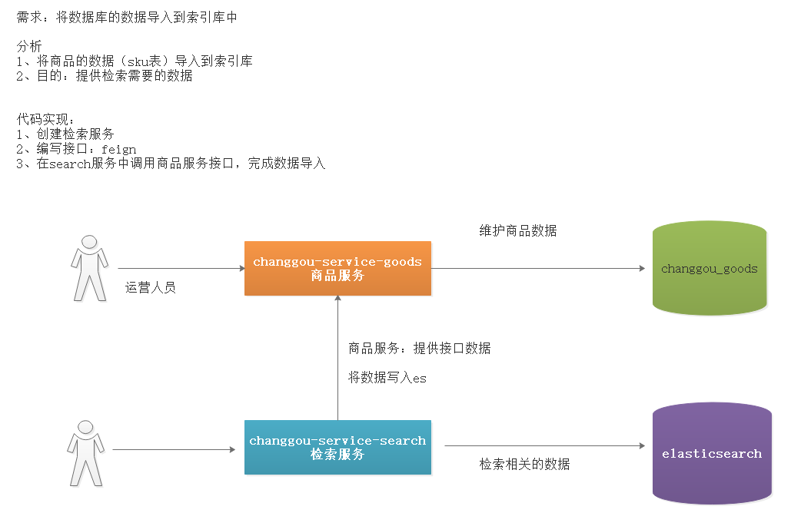

图二


## 5.1 SpringData Elasticsearch介绍

### 5.1.1 SpringData介绍

Spring Data是一个用于简化数据库访问，并支持云服务的开源框架。其主要目标是使得对数据的访问变得方便快捷，并支持map-reduce框架和云计算数据服务。 Spring Data可以极大的简化JPA的写法，可以在几乎不用写实现的情况下，实现对数据的访问和操作。除了CRUD外，还包括如分页、排序等一些常用的功能。

Spring Data的官网：http://projects.spring.io/spring-data/


### 5.1.2 SpringData ES介绍

Spring Data ElasticSearch 基于 spring data API 简化 elasticSearch操作，将原始操作elasticSearch的客户端API 进行封装 。Spring Data为Elasticsearch项目提供集成搜索引擎。Spring Data Elasticsearch POJO的关键功能区域为中心的模型与Elastichsearch交互文档和轻松地编写一个存储库数据访问层。 官方网站：http://projects.spring.io/spring-data-elasticsearch/ 


## 5.2 搜索工程搭建

创建搜索微服务工程，`<changgou-service-search>`,该工程主要提供搜索服务以及索引数据的更新操作。

### 5.2.1 API工程搭建

首先创建search的API工程,在changgou-service-api中`创建changgou-service-search-api工程`，如下图：

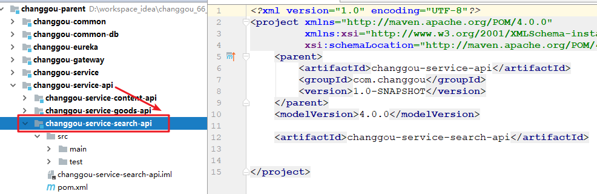

pom.xml如下：

```xml
<?xml version="1.0" encoding="UTF-8"?>
<project xmlns="http://maven.apache.org/POM/4.0.0"
         xmlns:xsi="http://www.w3.org/2001/XMLSchema-instance"
         xsi:schemaLocation="http://maven.apache.org/POM/4.0.0 http://maven.apache.org/xsd/maven-4.0.0.xsd">
    <parent>
        <artifactId>changgou-service-api</artifactId>
        <groupId>com.changgou</groupId>
        <version>1.0-SNAPSHOT</version>
    </parent>
    <modelVersion>4.0.0</modelVersion>
    <artifactId>changgou-service-search-api</artifactId>

    <dependencies>
        <!--SpringDataES依赖-->
        <dependency>
            <groupId>org.springframework.boot</groupId>
            <artifactId>spring-boot-starter-data-elasticsearch</artifactId>
        </dependency>
    </dependencies>
</project>
```


### 5.2.2 搜索微服务搭建

在changgou-service中`搭建changgou-service-search微服务`，并进行相关配置。

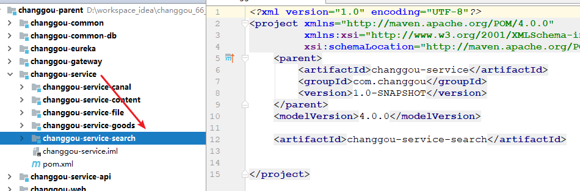

**pom.xml配置**

```xml
<?xml version="1.0" encoding="UTF-8"?>
<project xmlns="http://maven.apache.org/POM/4.0.0"
         xmlns:xsi="http://www.w3.org/2001/XMLSchema-instance"
         xsi:schemaLocation="http://maven.apache.org/POM/4.0.0 http://maven.apache.org/xsd/maven-4.0.0.xsd">
    <parent>
        <artifactId>changgou-service</artifactId>
        <groupId>com.changgou</groupId>
        <version>1.0-SNAPSHOT</version>
    </parent>
    <modelVersion>4.0.0</modelVersion>
    <artifactId>changgou-service-search</artifactId>

    <dependencies>
        <!--依赖search api-->
        <dependency>
            <groupId>com.changgou</groupId>
            <artifactId>changgou-service-search-api</artifactId>
            <version>1.0-SNAPSHOT</version>
        </dependency>
        
        <!--调用goods的接口-->
        <dependency>
            <groupId>com.changgou</groupId>
            <artifactId>changgou-service-goods-api</artifactId>
            <version>1.0-SNAPSHOT</version>
        </dependency>
    </dependencies>

</project>
```


**application.yml配置**

```properties
server:
  port: 18085
spring:
  application:
    name: search
  data:
    elasticsearch:
      cluster-name: my-application
      cluster-nodes: 192.168.211.132:9300
  # 覆盖同名的bean
  main:
    allow-bean-definition-overriding: true
#注册中心配置
eureka:
  client:
    service-url:
      defaultZone: http://127.0.0.1:7001/eureka
  instance:
    prefer-ip-address: true
#RPC远程连接
feign:
  hystrix:
    enabled: true
#集成超时配置
ribbon:
  ReadTimeout: 300000
#集成熔断
hystrix:
  command:
    default:
      execution:
        isolation:
          thread:
            timeoutInMilliseconds: 10000
```

配置说明：

```properties
connection-timeout:服务连接超时时间
socket-connect：HTTP请求超时时间
ribbon.ReadTimeout: Feign请求读取数据超时时间
timeoutInMilliseconds：feign连接超时时间
cluster-name：Elasticsearch的集群节点名称，这里需要和Elasticsearch集群节点名称保持一致
cluster-nodes：Elasticsearch节点通信地址
```


(3)启动类

`创建SearchApplication作为`搜索微服务工程的`启动类`，代码如下：

```java
@SpringBootApplication(exclude = {DataSourceAutoConfiguration.class})//启动类注解:排除数据库类
@EnableEurekaClient//开启注册中心客户端
@EnableFeignClients(basePackages = {"com.changguo.goods.feign"})//开启RPC远程调用客户端
@EnableElasticsearchRepositories(basePackages = {"com.changgou.search.dao"})//开启es扫描器
public class SearchApplication {

    public static void main(String[] args) {
        /**
        * Springboot整合Elasticsearch 在项目启动前设置一下的属性，防止报错
        * 解决netty冲突后初始化client时还会抛出异常
        * availableProcessors is already set to [12], rejecting [12]
        * 程序的其他地方使用了Netty影响在实例化传输客户端之前初始化处理器的数量
        ***/
        System.setProperty("es.set.netty.runtime.available.processors", "false");
        //run一下
        SpringApplication.run(SearchApplication.class,args);
    }
}
```

分别创建对应的包，dao、service、controller，如下图：

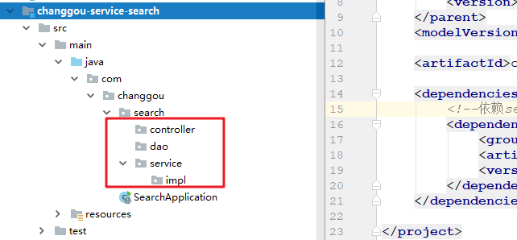


## 5.3 数据导入

现在需要将数据从数据库中查询出来，然后将数据导入到ES中。


数据导入流程如下：

```properties
1.请求search服务,调用数据导入地址
2.根据注册中心中的注册的goods服务的地址，使用Feign方式查询所有已经审核的Sku
3.使用SpringData Es将查询到的Sku集合导入到ES中
```


### 5.3.2 商品微服务提供接口数据

#### 5.3.2.1 编写SkuService

`修改changgou-service-goods微服务`，添加搜索审核`通过的Sku`，供search微服务调用。`下面都是针对goods微服务的操作`。

`修改SkuService接口`，添加根据状态查询Sku方法，代码如下：

```java
/**
     * @author 栗子 
     * @Description 将正常状态的库存信息保存到索引库
     * @Date 23:43 2019/8/15
     * @param status
     * @return java.util.List<com.changgou.goods.pojo.Sku>
     **/
    List<Sku> findSkusByStatus(String status);
```


`修改SkuServiceImpl`，添加根据状态查询Sku实现方法，代码如下：

```java
/**
 * @author wzw
 * 将正常状态的库存信息保存到索引库
 * @Date 21:20 2020/12/13
 * @param status
 * @return java.util.List<com.changgou.goods.pojo.Sku>
**/
@Override
public List<Sku> findSkusByStatus(String status) {
    //用来封装条件
    Sku sku = new Sku();
    //设置条件
    sku.setStatus(status);
    //实现功能
    return skuMapper.select(sku);
}
```


#### 5.3.2.2 编写SkuController

`修改com.changgou.goods.controller.SkuController`，添加根据审核状态查询Sku方法，代码如下：

```java
/**
 * @param status
 * @return java.util.List<com.changgou.goods.pojo.Sku>
 * @author wzw
 * 将正常状态的库存信息保存到索引库
 * @Date 21:20 2020/12/13
 **/
@GetMapping("/findSkusByStatus/{status}")
public Result<List<Sku>> findSkusByStatus(@PathVariable(value = "status") String status) {
    //实现功能
    List<Sku> list = skuService.findSkusByStatus(status);
    //返回值
    return new Result(true, StatusCode.OK, "将正常状态的库存信息保存到索引库 成功", list);
}
```


#### 5.3.2.3 编写Feign

`修改changgou-service-goods-api工程`，在com.changgou.goods.feign.SkuFeign上添加findSkuList方法，代码如下：

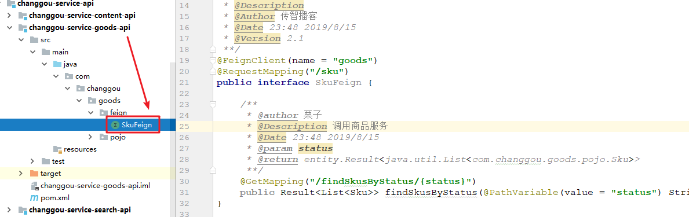

```java
@FeignClient(name = "goods")//Feign接口(要和被调用工程的application.yml文件中Spring的name一致)
@RequestMapping("/sku")
public interface SkuFeign {

    /**
     * @author 栗子
     * @Description 调用商品服务
     * @Date 23:48 2019/8/15
     * @param status
     * @return entity.Result<java.util.List<com.changgou.goods.pojo.Sku>>
     **/
    @GetMapping("/findSkusByStatus/{status}")
    public Result<List<Sku>> findSkusByStatus(@PathVariable(value = "status") String status);
}
```


### 5.3.1 搜索微服务完成数据导入

#### 5.3.1.1 文档映射Bean创建

搜索商品的时候，会根据如下属性搜索数据,并且不是所有的属性都需要分词搜索，我们创建JavaBean，将JavaBean数据存入到ES中要以搜索条件和搜索展示结果为依据，部分关键搜索条件分析如下：

```properties
1.可能会根据商品名称搜素，而且可以搜索商品名称中的任意一个词语，所以需要分词
2.可能会根据商品分类搜索，商品分类不需要分词
3.可能会根据商品品牌搜索，商品品牌不需要分词
4.可能会根据商品商家搜索，商品商家不需要分词
5.可能根据规格进行搜索，规格时一个键值对结构，用Map
```

根据上面的分析，我们可以`在changgou-service-search-api工程`中创建com.changgou.search.pojo.SkuInfo，如下

```java
import org.springframework.data.annotation.Id;
import org.springframework.data.elasticsearch.annotations.Document;
import org.springframework.data.elasticsearch.annotations.Field;
import org.springframework.data.elasticsearch.annotations.FieldType;

import java.io.Serializable;
import java.util.Date;
import java.util.Map;

/**
 * @Author: wzw
 * @Date: 2020/12/13 21:40
 * @version: 1.8
 * @Document(es的索引,类型=文档)
 */
@Document(indexName = "skuinfo",type = "docs")
public class SkuInfo implements Serializable {
    //商品id，同时也是商品编号
    @Id
    private Long id;

    //SKU名称
    @Field(type = FieldType.Text, analyzer = "ik_smart")
    private String name;

    //商品价格，单位为：元
    @Field(type = FieldType.Double)
    private Long price;

    //库存数量
    private Integer num;

    //商品图片
    private String image;

    //商品状态，1-正常，2-下架，3-删除
    private String status;

    //创建时间
    private Date createTime;

    //更新时间
    private Date updateTime;

    //是否默认
    private String isDefault;

    //SPUID
    private Long spuId;

    //类目ID
    private Long categoryId;

    //类目名称 Keyword 存入es时不分词
    @Field(type = FieldType.Keyword)
    private String categoryName;

    //品牌名称
    @Field(type = FieldType.Keyword)
    private String brandName;

    //规格
    private String spec;

    //规格参数
    private Map<String,Object> specMap;

	//...略
}
```


#### 5.3.2.2 Dao创建

修改changgou-service-search工程，`创建com.changgou.search.dao.SkuEsMapper接口`,该接口主要`用于索引数据操作`，主要使用它来实现将数据导入到ES索引库中，代码如下：

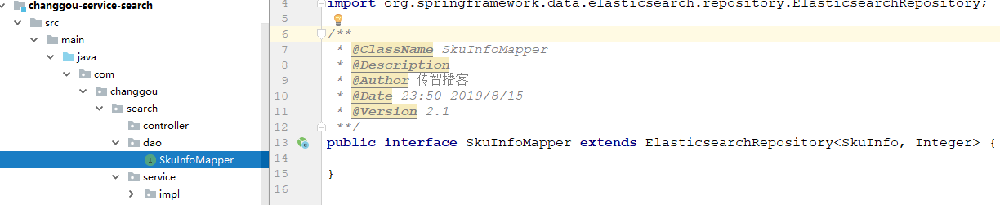

```java
/**
 * @Author: wzw
 * @Date: 2020/12/13 22:02
 * @version: 1.8
 * 注意:继承es功能封装接口ElasticsearchRepository<pojo,整数>
 */
public interface SkuInfoMapper extends ElasticsearchRepository<SkuInfo, Long> {

}
```


#### 5.3.2.3 Service创建

`修改changgou-service-search工程`，创建com.changgou.search.service.SkuInfoService,代码如下：

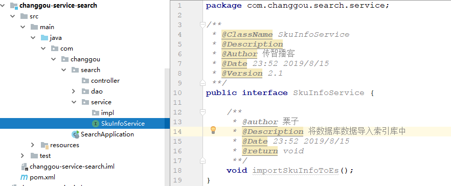

```java
public interface SkuInfoService {

    /**
     * @author 栗子
     * @Description 将数据库数据导入索引库中
     * @Date 23:52 2019/8/15
     * @return void
     **/
    void importSkuInfoToEs();
}
```


`修改changgou-service-search工程`，创建com.changgou.search.service.impl.SkuInfoServiceImpl,实现Sku数据导入到ES中，代码如下：

```java
@Service
public class SkuInfoServiceImpl implements SkuInfoService {
    
    //注入Feign
    @Autowired
    private SkuFeign skuFeign;

    //注入SkuInfoMapping
    @Autowired(required = false)
    private SkuInfoMapper skuInfoMapper;
    
    /**
     * @author wzw
     * 将数据库数据导入索引库中
     * @Date 22:10 2020/12/13
     * @param 
     * @return void
    **/
    @Override
    public void importSkuInfoToEs() {
        //1.通过Feign调用商品微服务接口
        //实现功能:查询商品的库存列表数据	
        Result<List<Sku>> result = skuFeign.findSkusByStatus("1");
        //2.将json格式数据转为string格式
        String text = JSON.toJSONString(result.getData());
        //3.将string格式数据转为SkuInfo对象
        List<SkuInfo> skuInfos = JSON.parseArray(text, SkuInfo.class);
        //4.处理动态字段(转换套娃内容)
        //循环所有对象
        for (SkuInfo skuInfo : skuInfos) {
            //获取规格
            String spec = skuInfo.getSpec();
            //将json格式规格的内容封装到map中
            Map<String,Object> map = JSON.parseObject(spec, Map.class);
            //存入准备好的map属性中
            skuInfo.setSpecMap(map);
        }
        //5.将数据存入Es中
        skuInfoMapper.saveAll(skuInfos);
    }
}

```


#### 5.3.2.4 控制层配置

`修改changgou-service-search工程`，在com.changgou.search.controller.SkuController类中`添加`如下方法`调用`上述导入方法，代码如下

```java
@RestController
@RequestMapping("/search")
public class SkuInfoController {
    //注入service
    @Autowired
    private SkuInfoService skuInfoService;

    /**
     * @author wzw
     * 数据导入
     * @Date 22:28 2020/12/13
     * @param 
     * @return entity.Result
    **/
    @GetMapping("/import")
    public Result importData(){
        //实现功能
        skuInfoService.importSkuInfoToEs();
        //返回结果
        return new Result(true, StatusCode.OK, "数据导入成功");
    }
}
```


#### 5.3.2.5 修改启动类

启动类中需要开启Feign客户端，并且需要添加ES包扫描，代码如下：

```java
@SpringBootApplication(exclude={DataSourceAutoConfiguration.class})
@EnableEurekaClient
@EnableFeignClients(basePackages = "com.changgou.goods.feign")
@EnableElasticsearchRepositories(basePackages = "com.changgou.search.dao")
public class SearchApplication {

    public static void main(String[] args) {
        /**
        * Springboot整合Elasticsearch 在项目启动前设置一下的属性，防止报错
        * 解决netty冲突后初始化client时还会抛出异常
        * java.lang.IllegalStateException: availableProcessors is already set to [12], rejecting [12]
        ***/
        // System.setProperty("es.set.netty.runtime.available.processors", "false");
        SpringApplication.run(SearchApplication.class,args);
    }
}
```


### 5.3.3 测试

#### 访问连接

调用http://localhost:18085/search/import进行测试

#### 注意

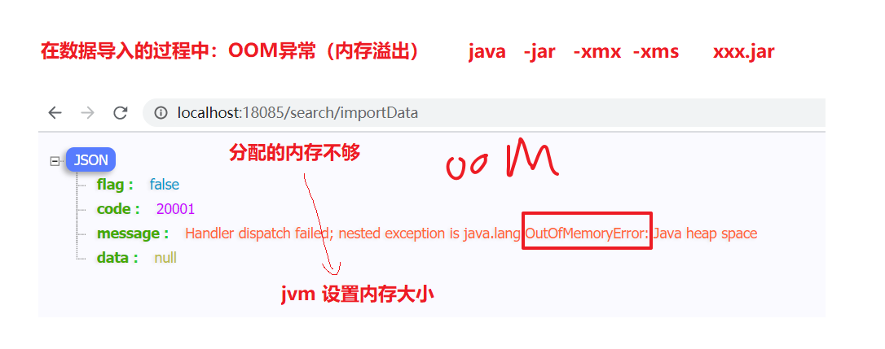

~~~properties
注意：-server -XX:PermSize=128M -XX:MaxPermSize=256m

-XX:PermSize：非堆区初始化内存大小
-XX:MaxPermSize：非堆去内存最大值

JVM按照其存储数据的内容将所需内存分配为堆区与非堆区两个部分：所谓堆区即为通过new的方式创建的对象（类实例）所占用的内存空间；非堆区即为代码、常量、外部访问（如文件访问流所占资源）等。然而虽然java的垃圾回收机制虽然能够很好的解决内存浪费的问题，但是这种机制也仅仅的是回收堆区的资源。
~~~

修改位置


#### 结果

打开es-head可以看到如下数据：

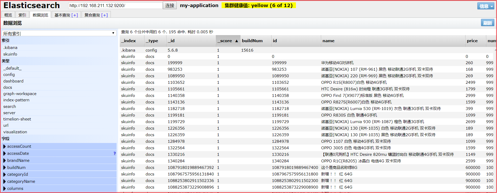


# 6 关键字搜索


我们先使用SpringDataElasticsearch实现一个简单的搜索功能，先实现根据关键字搜索，从上面搜索图片可以看得到，每次搜索的时候，除了关键字外，还有可能有品牌、分类、规格等，后台接收搜索条件使用Map接收比较合适。

### 分析(接收和返回对象)


## 6.1 服务层实现

修改search服务的com.changgou.search.service.SkuInfoService,添加搜索方法，代码如下：

```java
/**
     * @author 栗子 
     * @Description 检索
     * @Date 0:17 2019/8/16
     * @param searchMap
     * @return java.util.Map<java.lang.String,java.lang.Object>
     **/
    Map<String, Object> search(Map<String, String> searchMap);
```


修改search服务的com.changgou.search.service.impl.SkuInfoServiceImpl,添加搜索实现方法,代码如下：

```java
/**
 * @author wzw
 * 前台检索
 * @Date 10:33 2020/12/14
 * @param searchMap
 * @return java.util.Map<java.lang.String,java.lang.Object>
**/
@Override
public Map<String, Object> search(Map<String, String> searchMap) {
    //1.构建检索条件(后期由多个条件检索,因此我么专门封装一个方法)
    NativeSearchQueryBuilder builder = builderBasicQuery(searchMap);
    //2.根据关键字检索
    Map<String, Object> map = searchForPage(builder);
    //返回结果集
    return map;
}
/**
 * @author wzw
 * 根据条件查询并封装数据
 * @Date 0:03 2020/12/14
 * @param builder
 * @return java.util.Map<java.lang.String,java.lang.Object>
 **/
private Map<String,Object> searchForPage(NativeSearchQueryBuilder builder) {
    //获取条件对象
    NativeSearchQuery build = builder.build();
    //实现功能:根据根据条件分页查询
    AggregatedPage<SkuInfo> page = elasticsearchTemplate.queryForPage(build,SkuInfo.class);
    //结果集
    List<SkuInfo> rows = page.getContent();
    //总条数
    long totalElements = page.getTotalElements();
    //总页数
    int totalPages = page.getTotalPages();
    //创建Map,封装结果集
    HashMap<String, Object> map = new HashMap<>();
    map.put("rows", rows);
    map.put("totalElements", totalElements);
    map.put("totalPages", totalPages);
    //返回结果集
    return map;
}
/**
 * @author wzw
 * 封装检索条件
 * @Date 0:01 2020/12/14
 * @param searchMap 条件的检索
 * @return org.springframework.data.elasticsearch.core.query.NativeSearchQueryBuilder
 **/
private NativeSearchQueryBuilder builderBasicQuery(Map<String, String> searchMap) {
    //新建对象NativeSearchQueryBuilder添加条件
    NativeSearchQueryBuilder builder = new NativeSearchQueryBuilder();
    //判断条件是否为空
    if (searchMap != null) {
        //获取map中的值
        String keywords = searchMap.get("keywords");
        //判断值是否为空
        if (!StringUtils.isEmpty(keywords)) {
            //不为空:封装条件,采用es的方式:query(match)
            builder.withQuery(QueryBuilders.matchQuery("name", keywords));
        }
    }
    //返回封装条件的对象
    return builder;
}
```

### 注意

* 为了让搜索更清晰，我们将每个步骤封装成独立的方法了。
* 使用NativeSearchQueryBuilder中思维


## 6.2 控制层实现

修改com.changgou.search.controller.SkuController，在控制层调用Service层即可，代码如下：

```java
/**
 * @author wzw
 * 检索
 * @Date 16:15 2020/12/14
 * @param searchMap
 * @return java.util.Map<java.lang.String,java.lang.Object>
**/
@GetMapping
public Map<String, Object> search(@RequestParam(required = false) Map<String, String> searchMap) {
    //实现功能
    Map<String, Object> resultMap = skuInfoService.search(searchMap);
    //返回值
    return resultMap;
}
```


## 6.3 测试

### 6.3.1注意

* 路径中的key(keywords)不能乱要名字
* 因为在封装索引条件的时候,用来获取Value值 的
* 所以这里的key必须和ServieImpll封装方法的key一致

### 6.3.2访问连接

使用浏览器：输入`<http://localhost:18085/search?keywords=华为手机>`

### 6.3.3测试结果

选中get提交


# 7 分类统计

## 7.1 分类统计分析

看下面的SQL语句，我们在执行搜索的时候，第1条SQL语句是执行搜，第2条语句是根据分类名字分组查看有多少分类，大概执行了2个步骤就可以获取数据结果以及分类统计，我们可以发现他们的搜索条件完全一样。

```sql
-- 查询所有
SELECT * FROM tb_sku WHERE name LIKE '%手机%';
-- 根据分类名字分组查询
SELECT category_name FROM  tb_sku WHERE name LIKE '%手机%' GROUP BY category_name;
```


我们每次执行搜索的时候，需要显示商品分类名称，这里要显示的分类名称其实就是符合搜素条件的所有商品的分类集合，我们可以按照上面的实现思路，使用ES根据分组名称做一次分组查询即可实现。


## 7.2 分类分组统计实现

修改search微服务的`com.changgou.search.service.impl.SkuInfoServiceImpl类`，添加一个分类分组搜索，代码如下：

### 注意

* 聚合查询对应数据库的内容


* 多条件的分词的getBuckets内容


* 对应的ES字段

```java
/**
 * @author wzw
 * 分类分组统计实现
 * @Date 17:58 2020/12/14
 * @param builder 查询条件
 * @return java.util.List<java.lang.String> 商品分类后的值
**/
private List<String> searchCategoryList(NativeSearchQueryBuilder builder) {
    //添加分组条件
    //1.实现功能:聚合(分组)查询(别名,es中的字段)  
    //addAggregation:添加聚合条件
    builder.addAggregation(AggregationBuilders.terms("skuCategory").field("categoryName"));
    //2.实现功能:根据条件查询
    AggregatedPage<SkuInfo> aggregatedPage = elasticsearchTemplate.queryForPage(builder.build(), SkuInfo.class);
    //3.获取分组结果集
    Aggregations aggregations = aggregatedPage.getAggregations();
    //4.处理分组结果集
    //获取单个对象
    StringTerms stringTerms = aggregations.get("skuCategory");
    //多条件的分词
    List<StringTerms.Bucket> buckets = stringTerms.getBuckets();
    //创建List集合
    List<String> list = new ArrayList<>();
    //循环分词后的对象
    for (StringTerms.Bucket bucket : buckets) {
        //添加到list集合中
        list.add(bucket.getKeyAsString());
    }
    //5.返回结果集
    return list;
}
```

​	

在搜索`search方法中`调用上面分类分组搜索，代码如下：	


上图代码如下：

```java
//3.分类分组统计实现
//实现功能:查询分类
List<String> categoryList = searchCategoryList(builder);
//添加到map中
resultMap.put("categoryList",categoryList);
```


## 7.3 测试

### 注意

* keywords条件
* 

请求http://localhost:18085/search?keywords=华为手机

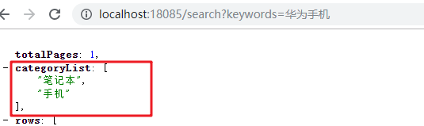


