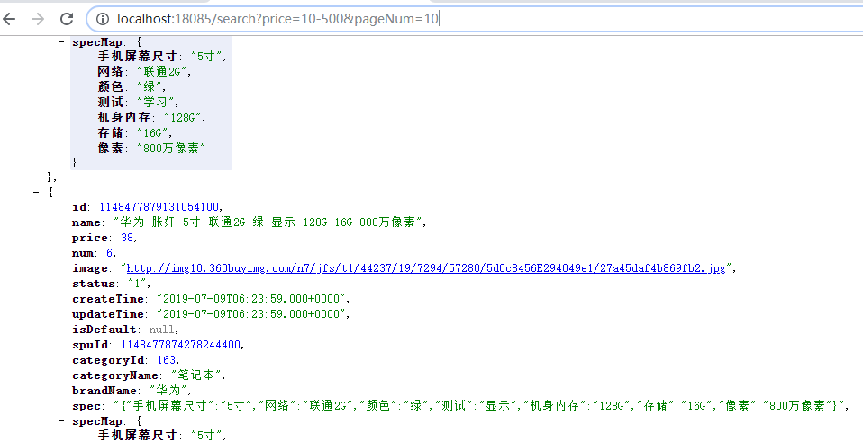

# 第6章 商品搜索

课程回顾：

1、如何理解的es       elasticsearch本身就是一个数据库（索引库


- MySQL中查询：可以       tb_article        MYISAM  xxx.MYI    xxx.MYD    InnoDB
  - select * from tb_article where title like ?  or content  like ?         (全表扫描)       
    - 对字段创建索引    crate index  字段 
  - 检索过程中：关键字高亮
  - 对结果进行排名（ 得分）
- ES：倒排索引文件     select  * from  tb_article  where  id  in (1, 200, 10000, 9999)
  - 索引：单词--->docID
  - 数据：docID-Document


2、maven仓库无法下载

- 配置：略
- 有些jar包：本身就无法下载        仓库没有   
  - 将jar安装到本地仓库    mvn   install
- 企业开发：搭建私服（局域网）

3、极其慢： 本地


检索

1、相关服务的安装

- es的安装
- ik的配置
- es的客户端管理工具
  - head插件的安装
  - kibana安装，功能比head丰富、强大

2、学习DSL语句---->类似SQL语句

- 索引的操作（建库建表）
  - 查询索引
  - 创建索引
    - 创建映射 （age  type="long"）
  - 删除索引
- 文档的操作
  - 添加文档数据
  - 更新文档数据（PUT/POST）
  - 删除文档
  - 查询文档
    - 根据id查询
    - 查询所有
    - 对结果排序（sort）
    - 对结果分页（from、size）
- 对文档数据的过滤（继续添加查询条件）
  - 根据term、terms、exists、range、bool、prefix、math、multi_match

3、将数据库数据导入索引库

- SpringData集成ES的开发要求
  - pojo：与索引库中的文档进行映射
  - dao：继承ElasticsearchRepository<T,   ID>
    - 扫描dao
- 提供的操作es的客户端对象：ElasticsearchTemplate
- 导入过程：
  - OOM：内存溢出    配置堆内存大小
  - time-out：配置文件中延长超时时间

4、根据关键字检查


学习目标：检索

1、统计商品分类列表

2、统计商品品牌列表

3、统计商品规格列表

4、条件过滤

- 根据分类、品牌、规格、价格进行过滤

5、检索结果分页、排序

6、检索关键字高亮显示


~~~sql
-- 需求：统计商品分类列表数据  思路
-- 根据关键字查询
SELECT * FROM tb_sku WHERE NAME LIKE '%黑马%'

-- 统计(分组查询)商品的分类
SELECT category_name FROM tb_sku WHERE NAME LIKE '%黑马%' GROUP BY category_name

-- 需求：统计商品品牌列表数据
SELECT brand_name FROM tb_sku WHERE NAME LIKE '%黑马%' GROUP BY brand_name
~~~


# 1. 品牌统计


用户搜索的时候，除了使用分类搜索外，还有可能使用品牌搜索，所以我们还需要显示品牌数据和规格数据，品牌数据和规格数据的显示比较容易，都可以考虑使用分类统计的方式进行分组实现。


## 1.1 品牌统计分析

看下面的SQL语句，我们在执行搜索的时候，第1条SQL语句是执行搜，第2条语句是根据品牌名字分组查看有多少品牌，大概执行了2个步骤就可以获取数据结果以及品牌统计，我们可以发现他们的搜索条件完全一样。

```sql
-- 查询所有
SELECT * FROM tb_sku WHERE name LIKE '%手机%';
-- 根据品牌名字分组查询
SELECT brand_name FROM  tb_sku WHERE name LIKE '%手机%' GROUP BY brand_name;
```

我们每次执行搜索的时候，需要显示商品品牌名称，这里要显示的品牌名称其实就是符合搜素条件的所有商品的品牌集合，我们可以按照上面的实现思路，使用ES根据分组名称做一次分组查询即可实现。


## 1.2 品牌分组统计实现

### 注意


修改search微服务的com.changgou.search.service.impl.SkuInfoServiceImpl类，添加一个品牌分组搜索，代码如下：


上图代码如下：

```java
/**
 * @author wzw
 * 前台检索
 * @Date 10:33 2020/12/14
 * @param searchMap
 * @return java.util.Map<java.lang.String,java.lang.Object>
**/
@Override
public Map<String, Object> search(Map<String, String> searchMap) {
    //1.实现功能:根据关键字查询
    //构建检索条件(后期由多个条件检索,因此我么专门封装一个方法)
    NativeSearchQueryBuilder builder = builderBasicQuery(searchMap);
    //根据关键字检索
    Map<String, Object> resultMap = searchForPage(builder);
    //2.分类分组统计实现
    //实现功能:查询分类分组(条件)
    List<String> categoryList = searchCategoryList(builder);
    //添加到map中
    resultMap.put("categoryList",categoryList);
    //3.实现功能:统计商品品牌列表数据
    //实现功能:品牌查询 (条件)
    List<String> brandList = searchBrandList(builder);
    //添加到Map中
    resultMap.put("brandList", brandList);
    //4.返回结果集
    return resultMap;
}

/**
 * @author wzw
 * 实现品牌查询
 * @Date 19:56 2020/12/15
 * @param builder
 * @return java.util.List<java.lang.String>
**/
private List<String> searchBrandList(NativeSearchQueryBuilder builder) {
    //1.聚合(分组)查询(别名,es中字段名)
    builder.addAggregation(AggregationBuilders.terms("skuBrand").field("brandName"));
    //2.实现功能:查询品牌的集合
    AggregatedPage<SkuInfo> aggregatedPage = elasticsearchTemplate.queryForPage(builder.build(), SkuInfo.class);
    //3.处理分组结果集
    List<String> list = getAggregationList(aggregatedPage, "skuBrand");
    //5.返回结果集
    return list;
}
/**
 * @author wzw
 * 3.处理分组结果集
 * @Date 19:32 2020/12/15
 * @param aggregatedPage 查询的结果
 * @param skuName 别名
 * @return java.util.List<java.lang.String>
**/
private List<String> getAggregationList(AggregatedPage<SkuInfo> aggregatedPage, String skuName) {
    //获取分组结果集
    Aggregations aggregations = aggregatedPage.getAggregations();
    //获取单个对象
    StringTerms stringTerms = aggregations.get(skuName);
    //多条件的分词
    List<StringTerms.Bucket> buckets = stringTerms.getBuckets();
    //创建List集合
    List<String> list = new ArrayList<>();
    //循环分词后的对象
    for (StringTerms.Bucket bucket : buckets) {
        //添加到list集合中
        list.add(bucket.getKeyAsString());
    }
    return list;
}
```


## 1.3 测试

使用PostMan请求http://localhost:18085/search?keywords=王子威


# 2. 规格统计


用户搜索的时候，除了使用分类、品牌搜索外，还有可能使用规格搜索，所以我们还需要显示规格数据，规格数据的显示相比上面2种实现略微较难一些，需要对数据进行处理，我们也可以考虑使用分类统计和品牌统计的方式进行分组实现。


## 2.1 规格统计分析

看下面的SQL语句，我们在执行搜索的时候，第1条SQL语句是执行搜，第2条语句是根据规格分组查看有多少规格，大概执行了2个步骤就可以获取数据结果以及规格统计，我们可以发现他们的搜索条件完全一样。

```sql
-- 查询所有
SELECT * FROM tb_sku WHERE name LIKE '%手机%';
-- 根据规格名字分组查询
SELECT spec FROM  tb_sku WHERE name LIKE '%手机%' GROUP BY spec;
```

上述SQL语句执行后的结果如下图：


获取到的规格数据我们发现有重复，不过也可以解决，解决思路如下：

```
1.获取所有规格数据
2.将所有规格数据转换成Map
3.定义一个Map<String,Set>,key是规格名字，防止重复所以用Map，valu是规格值，规格值有多个，所以用集合，为了防止规格重复，用Set去除重复
4.循环规格的Map，将数据填充到定义的Map<String,Set>中
```


我们每次执行搜索的时候，需要显示商品规格数据，这里要显示的规格数据其实就是符合搜素条件的所有商品的规格集合，我们可以按照上面的实现思路，使用ES根据分组名称做一次分组查询，并去除重复数据即可实现。


## 2.2 规格统计分组实现

### 注意


### 功能实现

修改search微服务的com.changgou.search.service.impl.SkuInfoServiceImpl类，添加一个规格分组搜索，代码如下：


上图代码如下：

```java
/**
 * @author wzw
 * 前台检索
 * @Date 10:33 2020/12/14
 * @param searchMap
 * @return java.util.Map<java.lang.String,java.lang.Object>
**/
@Override
public Map<String, Object> search(Map<String, String> searchMap) {
    //1.实现功能:根据关键字查询
    //构建检索条件(后期由多个条件检索,因此我么专门封装一个方法)
    NativeSearchQueryBuilder builder = builderBasicQuery(searchMap);
    //根据关键字检索
    Map<String, Object> resultMap = searchForPage(builder);
    //2.分类分组统计实现
    //实现功能:查询分类分组(条件)
    List<String> categoryList = searchCategoryList(builder);
    //添加到map中
    resultMap.put("categoryList",categoryList);
    //3.统计商品品牌列表数据
    //实现功能:根据品牌查询 (条件)
    List<String> brandList = searchBrandList(builder);
    //添加到Map中
    resultMap.put("brandList", brandList);
    
    //=======加入=======
    //4.统计规格列表
    //实现功能:通过规格列表
    Map<String, Set<String>> specMap = searchSpecMap(builder);
    //添加到Map中
    resultMap.put("specMap",specMap);
    //=======结束=======
    
    //4.返回结果集
    return resultMap;
}

/**
  * @author wzw
  * 实现功能:通过规格列表
  * @Date 20:37 2020/12/15
  * @param builder 封装的条件
  * @return java.util.Map<java.lang.String,java.util.Set<java.lang.String>>
 **/
 private Map<String,Set<String>> searchSpecMap(NativeSearchQueryBuilder builder) {
     //1.聚合(分组)查询(别名,es中的字段)
     builder.addAggregation(AggregationBuilders.terms("skuSpec").field("spec.keyword").size(10000));
     //2.实现功能:查询品牌的集合
     AggregatedPage<SkuInfo> aggregatedPage = elasticsearchTemplate.queryForPage(builder.build(), SkuInfo.class);
     //3.处理分组结果集
     List<String> list = getAggregationList(aggregatedPage, "skuSpec");
     //4.将集合数据转入map中
     Map<String, Set<String>> map = pullMap(list);
     //5.返回结果集map<规格,set集合<规格选项>>中
     return map;
 }
 /**
  * @author wzw
  * 将集合数据转入map中
  * @Date 21:37 2020/12/15
  * @param list
  * @return java.util.Map<java.lang.String,java.util.Set<java.lang.String>>
 **/
 private Map<String, Set<String>> pullMap(List<String> list) {
     //1.创建最终返回结果
     Map<String, Set<String>> map = new HashMap<>();
     //2.处理规格结果集
     for (String spec : list) {
         //2.1将json转成map
         Map<String,String> specMap = JSON.parseObject(spec, Map.class);
         //2.2将map装入set格式
         Set<Map.Entry<String, String>> entries = specMap.entrySet();
         //2.3循环set内容
         for (Map.Entry<String, String> entry : entries) {
             //2.3.1获取规格
             String key = entry.getKey();
             //2.3.2规格选项
             String value = entry.getValue();
             //2.3.3判断 是否有该规格(比如书是没有规格的)
             Set<String> set = map.get(key);
             //2.3.4非空判断(有就不需要覆盖)
             if (set == null) {
                 //2.3.5防止二次new,替换set内容
                 set = new HashSet<>();
             }
             //2.3.6添加内容
             set.add(value);
             //2.3.7添加到最终map<规格,set集合<规格选项>>中
             map.put(key, set);
         }
     }
     //3.返回最终map
     return map;
 }
 /**
  * @author wzw
  * 3.处理分组结果集
  * @Date 19:32 2020/12/15
  * @param aggregatedPage 查询的结果
  * @param skuName 别名
  * @return java.util.List<java.lang.String>
  **/
 private List<String> getAggregationList(AggregatedPage<SkuInfo> aggregatedPage, String skuName) {
     //获取分组结果集
     Aggregations aggregations = aggregatedPage.getAggregations();
     //获取单个对象
     StringTerms stringTerms = aggregations.get(skuName);
     //多条件的分词
     List<StringTerms.Bucket> buckets = stringTerms.getBuckets();
     //创建List集合
     List<String> list = new ArrayList<>();
     //循环分词后的对象
     for (StringTerms.Bucket bucket : buckets) {
         //将key添加到list集合中
         list.add(bucket.getKeyAsString());
     }
     //返回结果
     return list;
 }
```


## 2.3 测试

使用Postman测试访问http://localhost:18085/search?keywords=王子威 

 效果如下：


# 3 条件筛选 


- 需求：根据商品的分类进行过滤（需要干啥：继续加条件）
- 需求：根据商品品牌过滤
- 需求：根据商品规格过滤
- 需求：根据商品的价格过滤


需求：对结果进行排序

分析：将排序的字段以及排序的规则传递过来。


需求：对结果进行分页


用户有可能会根据分类搜索、品牌搜索，还有可能根据规格搜索，以及价格搜索和排序操作。根据分类和品牌搜索的时候，可以直接根据指定域搜索，而规格搜索的域数据是不确定的，价格是一个区间搜索，所以我们可以分为三段时间，先实现分类、品牌搜素，再实现规格搜索，然后实现价格区间搜索。


## 3.1 分类、品牌筛选

### 3.1.1 需求分析

页面每次向后台传入对应的分类和品牌，后台据分类和品牌进行条件过滤即可。

### 3.1.2 代码实现

修改搜索微服务com.changgou.search.service.impl.SkuInfoServiceImpl的buildBasicQuery方法，添加分类和品牌过滤，代码如下：


上图代码如下：

```java
/**
 * @author wzw
 * 封装检索条件
 * @Date 0:01 2020/12/14
 * @param searchMap 条件的检索
 * @return org.springframework.data.elasticsearch.core.query.NativeSearchQueryBuilder
 **/
private NativeSearchQueryBuilder builderBasicQuery(Map<String, String> searchMap) {
    //封装检索条件:新建对象NativeSearchQueryBuilder添加条件
    NativeSearchQueryBuilder builder = new NativeSearchQueryBuilder();
    //封装过滤条件:
    BoolQueryBuilder boolQuery = QueryBuilders.boolQuery();
    //判断条件是否为空
    if (searchMap != null) {
        //实现功能:1、根据关键字检索
        // 获取map中的值
        String keywords = searchMap.get("keywords");
        //判断值是否为空
        if (!StringUtils.isEmpty(keywords)) {
            //不为空:封装条件,采用es的方式:query(match)
            //根据es中的字段name来查询
            builder.withQuery(QueryBuilders.matchQuery("name", keywords));
        }
        //实现功能:2.根据商品分类过来
        //获取map中的值
        String category = searchMap.get("category");
        //空值判断
        if (!StringUtils.isEmpty(category)) {
            //为空:查询数据(根据es中的字段categoryName来查询,条件)
            boolQuery.must(QueryBuilders.matchQuery("categoryName",category));
        }
        //实现功能:3、根据品牌过滤
        String brand = searchMap.get("brand");
        //空值判断
        if (!StringUtils.isEmpty(brand)) {
            //为空:查询数据(根据es中的字段categoryName来查询,条件)
            boolQuery.must(QueryBuilders.matchQuery("brandName",brand));
        }
    }
    //添加过滤条件
    builder.withFilter(boolQuery);
    
    //返回封装条件的对象
    return builder;
}
```


### 3.1.3 测试

测试效果如下：

访问地址：`<http://localhost:18085/search?keywords=华为手机&category=手机&brand=小米> `


## 3.2 规格过滤

#### 3.2.1 需求分析


规格这一块，需要向后台发送规格名字以及规格值，我们可以按照一定要求来发送数据，例如规格名字以特殊前缀提交到后台：`spec_网络制式：电信4G、spec_显示屏尺寸：4.0-4.9英寸`

后台接到数据后，可以根据前缀spec_来区分是否是规格，如果以`spec_xxx`开始的数据则为规格数据，需要根据指定规格找信息。


上图是规格的索引存储格式，真实数据在spechMap.规格名字.keyword中，所以找数据也是按照如下格式去找：

`spechMap.规格名字.keyword`

#### 3.2.2 代码实现

修改com.changgou.search.service.impl.SkuServiceImpl的buildBasicQuery方法，增加规格查询操作，代码如下：


上图代码如下：

```java
//实现功能:4.根据规格过滤
// 获取条件(规格的value有很多)
Set<String> keys = searchMap.keySet();
//循环key
for (String key : keys) {
    //判断前缀:以spec_开头,都是规格条件(所以在前台发请求的时候要特别注意)
    if (key.startsWith("spec_")){
        //es中规格字段:specMap.Xxx.keyword ,条件
        // substring截取掉spec_
        boolQuery.must(QueryBuilders.matchQuery("specMap."+key.substring(5)+".keyword", searchMap.get(key)));
    }
}
```


#### 3.2.3 测试

##### 注意

* & = and :两个true才是true
* || = or :只有一个true 就是true

访问地址：`<http://localhost:18085/search?keywords==华为手机&category=手机&brand=小米&spec_网络=移动3G> `


## 3.3 价格区间查询

### 3.3.1 需求分析


价格区间查询，每次需要将价格传入到后台，前端传入后台的价格大概是`price=0-500`或者`price=500-1000`依次类推，最后一个是`price=3000`,后台可以根据-分割，如果分割得到的结果最多有2个，第1个表示`x<price`，第2个表示`price<=y`。


### 3.3.2 代码实现

修改com.changgou.search.service.impl.SkuServiceImpl的buildBasicQuery方法，增加价格区间查询操作，代码如下：


上图代码如下：

```java
// 5、价格区间段过滤
//价格:区间的[500-1000] or xxx以上
String price = searchMap.get("price");
//空判断
if (!StringUtils.isEmpty(price)){
    //分割出[500,1000]
    String[] priceArray = price.split("-");
    // [min-max]
    // >=，大于等于  or Xxx以上
    boolQuery.must(QueryBuilders.rangeQuery("price").gte(priceArray[0])); 
    
    //确保范围
    if (priceArray.length == 2){
        // <=，小于等于
        boolQuery.must(QueryBuilders.rangeQuery("price").lte(priceArray[1])); 
    }
}
```


### 3.3.3 测试

访问地址：`<http://localhost:18085/search?price=10-500>`


效果如下(部分数据)：

```json
 [
        {
            "id": 1088256019328536576,
            "name": "守护宝幼儿安全手环",
            "price": 500,
            "num": 100,
            "image": "http://img10.360buyimg.com/n1/s450x450_jfs/t3457/294/236823024/102048/c97f5825/58072422Ndd7e66c4.jpg",
            "status": "1",
            "createTime": "2019-01-24T10:03:48.000+0000",
            "updateTime": "2019-01-24T10:03:48.000+0000",
            "isDefault": null,
            "spuId": 1088256019315953664,
            "categoryId": 1108,
            "categoryName": "户外工具",
            "brandName": "守护宝",
            "spec": "{\"颜色\":\"红\",\"机身内存\":\"64G\"}",
            "specMap": {
                "颜色": "红",
                "机身内存": "64G"
            }
        },
        {
            "id": 1088256014043713536,
            "name": "计步器小米手环，适用老人、小孩",
            "price": 800,
            "num": 100,
            "image": "http://img10.360buyimg.com/n1/s450x450_jfs/t3457/294/236823024/102048/c97f5825/58072422Ndd7e66c4.jpg",
            "status": "1",
            "createTime": "2019-01-24T10:03:47.000+0000",
            "updateTime": "2019-01-24T10:03:47.000+0000",
            "isDefault": null,
            "spuId": 1088256014026936320,
            "categoryId": 1192,
            "categoryName": "小家电",
            "brandName": "小米",
            "spec": "{\"颜色\":\"红\",\"机身内存\":\"64G\"}",
            "specMap": {
                "颜色": "红",
                "机身内存": "64G"
            }
        }
    ]
```


# 4 搜索排序

## 4.1 排序分析


排序这里总共有根据价格排序、根据评价排序、根据新品排序、根据销量排序，排序要想实现非常简单，只需要告知排序的域以及排序方式即可实现。

价格排序：只需要根据价格高低排序即可，降序价格高->低，升序价格低->高

评价排序：评价分为好评、中评、差评，可以在数据库中设计3个列，用来记录好评、中评、差评的量，每次排序的时候，好评的比例来排序，当然还要有条数限制，评价条数需要超过N条。

新品排序：直接根据商品的发布时间或者更新时间排序。

销量排序：销量排序除了销售数量外，还应该要有时间段限制。


## 4.2 排序实现

这里我们不单独针对某个功能实现排序，我们只需要在后台接收2个参数，分别是排序域名字和排序方式，代码如下：


上图代码如下：

```java
// 6、结果排序
String sortRule = searchMap.get("sortRule");    //排序规则(名字自定义)
String sortField = searchMap.get("sortField");  // 排序字段
//空判断
if (!StringUtils.isEmpty(sortField) && !StringUtils.isEmpty(sortRule)){
    //排序withSort(字段.排序规则)
    builder.withSort(SortBuilders.fieldSort(sortField).order(SortOrder.valueOf(sortRule)));
}
```

测试：`<http://localhost:18085/search?price=497-499&pageNum=2&sortField=price&sortRule=DESC>`


# 5 搜索分页

## 5.1 分页分析


页面需要实现分页搜索，所以我们后台每次查询的时候，需要实现分页。用户页面每次会传入当前页和每页查询多少条数据，当然如果不传入每页显示多少条数据，默认查询30条即可。


## 5.2 分页实现

分页使用PageRequest.of( pageNo- 1, pageSize);实现，第1个参数表示第N页，从0开始，第2个参数表示每页显示多少条，实现代码如下：


上图代码如下：

```java
private NativeSearchQueryBuilder builderBasicQuery(Map<String, String> searchMap) {
    NativeSearchQueryBuilder builder = new NativeSearchQueryBuilder();
    // 构建过滤查询对的query对象
    BoolQueryBuilder boolQueryBuilder = QueryBuilders.boolQuery();
    // 开始构建检索条件
    if (searchMap != null){
        // 1、根据关键字检索 keywords
        String keywords = searchMap.get("keywords");
        if (!StringUtils.isEmpty(keywords)){
            builder.withQuery(QueryBuilders.matchQuery("name", keywords));
        }
        // 2、根据商品分类过滤  category
        String category = searchMap.get("category");
        if (!StringUtils.isEmpty(category)){
            boolQueryBuilder.must(QueryBuilders.matchQuery("categoryName", category));
        }
        // 3、根据品牌进行过滤 brand
        String brand = searchMap.get("brand");
        if (!StringUtils.isEmpty(brand)){
            boolQueryBuilder.must(QueryBuilders.matchQuery("brandName", brand));
        }
        // 4、根据规格进行过滤  spec_内存：32G   spec_颜色：白色
        // map:{keywords:黑马,category:手机,brand：小米,spec_内存：32G,spec_颜色：白色}
        Set<String> set = searchMap.keySet();
        for (String key : set) {
            if (key.startsWith("spec_")){
                boolQueryBuilder.must(QueryBuilders.matchQuery("specMap."+key.substring(5)+".keyword",searchMap.get(key)));
            }
        }
        // 5、根据价格的区间段过滤  price：100-500   1000以上
        String price = searchMap.get("price");
        if (!StringUtils.isEmpty(price)){
            String[] prices = price.split("-");
            boolQueryBuilder.must(QueryBuilders.rangeQuery("price").gte(prices[0]));
            if (prices.length == 2){
                boolQueryBuilder.must(QueryBuilders.rangeQuery("price").lte(prices[1]));
            }
        }

        // 6、根据价格排序（价格、销量、新品）
         // 排序字段
        String sortField = searchMap.get("sortField"); 
        // 排序规则
        String sortRule = searchMap.get("sortRule");  
        //非空判断
        if (!StringUtils.isEmpty(sortField)){   
            //排序查询
            builder.withSort(SortBuilders.fieldSort(sortField).order(SortOrder.valueOf(sortRule)));
                                            }

    }
    // 添加过滤条件
    builder.withFilter(boolQueryBuilder); 
    //=========分页查询开始============
    //获取前端传过来的页码
    String pageNum = searchMap.get("pageNum");
    //非空判断
    if (StringUtils.isEmpty(pageNum)){
        // 默认第一页(不能为空)
        pageNum = "1";  
    }
    // 起始行 = （当前页码 - 1）* 每页显示的条数
    int page = Integer.parseInt(pageNum) - 1;    
     // 每页显示的条数
    int size = 2; 
    //设置分页条件
    Pageable pageable = PageRequest.of(page, size);
     // 实现功能:分页查询
    builder.withPageable(pageable);
    //=========分页查询结束============
    //返回结果集
    return builder;
}
```


测试如下：`<http://localhost:18085/search?price=10-500&pageNum=10>`




# 6 高亮显示

高亮：对检索的关键字添加HTML标签（通过样式进行修饰）


需求：对检索的商品名称中包含的关键字进行高亮显示。

实现：添加高亮的条件。


## 6.1 高亮分析


高亮显示是指根据商品关键字搜索商品的时候，显示的页面对关键字给定了特殊样式，让它显示更加突出，如上图商品搜索中，关键字编程了红色，其实就是给定了红色样式。


## 6.2 高亮搜索实现步骤解析

将之前的搜索换掉，换成高亮搜索，我们需要做3个步骤：

```
1.指定高亮域，也就是设置哪个域需要高亮显示
  设置高亮域的时候，需要指定前缀和后缀，也就是关键词用什么html标签包裹，再给该标签样式
2.高亮搜索实现
3.将非高亮数据替换成高亮数据
```

第1点，例如在百度中搜索数据的时候，会有2个地方高亮显示，分别是标题和描述，商城搜索的时候，只是商品名称高亮显示了。而高亮显示其实就是添加了样式，例如`<span style="color:red;">笔记本</span>`,而其中span开始标签可以称为前缀，span结束标签可以称为后缀。

第2点，高亮搜索使用ElasticsearchTemplate实现。

第3点，高亮搜索后，会搜出非高亮数据和高亮数据，高亮数据会加上第1点中的高亮样式，此时我们需要将非高亮数据换成高亮数据即可。例如非高亮:`华为笔记本性能超强悍`  高亮数据：`华为<span style="color:red;"笔记本</span>性能超强悍`,将非高亮的换成高亮的，到页面就能显示样式了。


## 6.3 高亮代码实现

删掉之前com.changgou.search.service.impl.SkuServiceImpl的searchList方法搜索代码，用下面高亮搜索代码替换：


上图代码如下：

```java
/**
 * @author wzw
 * 根据条件查询并封装数据
 * @Date 0:03 2020/12/14
 * @param builder
 * @return java.util.Map<java.lang.String,java.lang.Object>
 **/
private Map<String,Object> searchForPage(NativeSearchQueryBuilder builder) {
    //1.设置高亮条件(对es的name字段包含的关键字进行高亮)
    HighlightBuilder.Field field = new HighlightBuilder.Field("name");
    //2.创建高亮html
    //开始
    field.preTags("<font color='red'>");
    //结束
    field.postTags("</font>");
    //3.封装高亮到条件中
    builder.withHighlightFields(field);
    //4.实现功能:设置高亮到关键字上
    SearchResultMapper searchResultMapper = new SearchResultMapper(){
        @Override
        public <T> AggregatedPage<T> mapResults(SearchResponse response, Class<T> clazz, Pageable pageable) {
            //封装高亮结果集
            ArrayList<T> content = new ArrayList<>();
            //获取高亮结果集(命中数据集合)
            SearchHits hits = response.getHits();
            if (hits != null) {
                //循环结果集
                for (SearchHit hit : hits) {
                    //获取单个数据
                    String result = hit.getSourceAsString();
                    //将结果集转成一个个的pojo
                    SkuInfo skuInfo = JSON.parseObject(result, SkuInfo.class);
                    //获取的html高亮的语句
                    HighlightField highlightField = hit.getHighlightFields().get("name");
                    //非空判断
                    if (highlightField != null) {
                        //获取高亮结果集
                        Text[] texts = highlightField.getFragments();
                        //将高亮名称 替换掉 普通的商品name结果
                        skuInfo.setName(texts[0].toString());
                    }
                    //添加高亮对象到list中
                    content.add((T)skuInfo);
                }
            }
            //将普通的Content进行替换(被设置高亮的list结果集,分页,总高亮数)
            return new AggregatedPageImpl<>(content, pageable, hits.getTotalHits());
        }
    };
    //获取条件对象
    NativeSearchQuery build = builder.build();
    //实现功能:根据根据条件分页查询(条件,pojo字节码,高亮对象)
    AggregatedPage<SkuInfo> page = elasticsearchTemplate.queryForPage(build,SkuInfo.class,searchResultMapper);
    //结果集
    List<SkuInfo> rows = page.getContent();
    //总条数
    long totalElements = page.getTotalElements();
    //总页数
    int totalPages = page.getTotalPages();
    //创建Map,封装结果集
    HashMap<String, Object> map = new HashMap<>();
    map.put("rows", rows);
    map.put("totalElements", totalElements);
    map.put("totalPages", totalPages);
    //返回结果集
    return map;
}
```


## 6.4 测试

测试：`<http://localhost:18085/search?keywords=小米手机>`


# 7 分组查询优化-作业

~~~java
package com.changgou.search.service.impl;

import com.alibaba.fastjson.JSON;
import com.changgou.goods.feign.SkuFeign;
import com.changgou.goods.pojo.Sku;
import com.changgou.pojo.SkuInfo;
import com.changgou.search.dao.SkuInfoMapper;
import com.changgou.search.service.SkuInfoService;
import entity.Result;
import org.elasticsearch.action.search.SearchResponse;
import org.elasticsearch.common.text.Text;
import org.elasticsearch.index.query.BoolQueryBuilder;
import org.elasticsearch.index.query.QueryBuilders;
import org.elasticsearch.search.SearchHit;
import org.elasticsearch.search.SearchHits;
import org.elasticsearch.search.aggregations.AggregationBuilders;
import org.elasticsearch.search.aggregations.Aggregations;
import org.elasticsearch.search.aggregations.bucket.terms.StringTerms;
import org.elasticsearch.search.fetch.subphase.highlight.HighlightBuilder;
import org.elasticsearch.search.fetch.subphase.highlight.HighlightField;
import org.elasticsearch.search.sort.SortBuilders;
import org.elasticsearch.search.sort.SortOrder;
import org.springframework.beans.factory.annotation.Autowired;
import org.springframework.data.domain.PageRequest;
import org.springframework.data.domain.Pageable;
import org.springframework.data.elasticsearch.core.ElasticsearchTemplate;
import org.springframework.data.elasticsearch.core.SearchResultMapper;
import org.springframework.data.elasticsearch.core.aggregation.AggregatedPage;
import org.springframework.data.elasticsearch.core.aggregation.impl.AggregatedPageImpl;
import org.springframework.data.elasticsearch.core.query.NativeSearchQuery;
import org.springframework.data.elasticsearch.core.query.NativeSearchQueryBuilder;
import org.springframework.stereotype.Service;
import org.springframework.util.StringUtils;

import java.util.*;

/**
 * @Author: wzw
 * @Date: 2020/12/13 22:09
 * @version: 1.8
 */
@Service
public class SkuInfoServiceImpl implements SkuInfoService {

    //注入(RPC远程调用)Feign
    @Autowired
    private SkuFeign skuFeign;

    //注入(Dao)SkuInfoMapping
    @Autowired
    private SkuInfoMapper skuInfoMapper;

    //注入es模板:ElasticsearchTemplate
    @Autowired
    private ElasticsearchTemplate elasticsearchTemplate;

    /**
     * @author wzw
     * 将数据库数据导入索引库中
     * @Date 22:10 2020/12/13
     * @param 
     * @return void
    **/
    @Override
    public void importSkuInfoToEs() {
        //1.通过Feign调用商品微服务接口
        Result<List<Sku>> result = skuFeign.findSkusByStatus("1");
        //2.将json格式数据转为string格式
        String text = JSON.toJSONString(result.getData());
        //3.将string格式数据转为SkuInfo对象
        List<SkuInfo> skuInfos = JSON.parseArray(text, SkuInfo.class);
        //4.处理动态字段(转换套娃内容)
        //循环所有对象
        for (SkuInfo skuInfo : skuInfos) {
            //获取规格
            String spec = skuInfo.getSpec();
            //将json格式规格的内容封装到map中
            Map<String,Object> map = JSON.parseObject(spec, Map.class);
            //存入准备好的map属性中
            skuInfo.setSpecMap(map);
        }
        //5.将数据存入Es中
        skuInfoMapper.saveAll(skuInfos);
    }

    /**
     * @author wzw
     * 前台检索
     * @Date 10:33 2020/12/14
     * @param searchMap 条件
     * @return java.util.Map<java.lang.String,java.lang.Object>
    **/
    @Override
    public Map<String, Object> search(Map<String, String> searchMap) {
        //1.实现功能:根据关键字查询
        //构建检索条件(后期由多个条件检索,因此我么专门封装一个方法)
        NativeSearchQueryBuilder builder = builderBasicQuery(searchMap);
        //根据关键字检索
        Map<String, Object> resultMap = searchForPage(builder);

        //4.返回结果集
        // 获取所有分组结果
        Map<String, Object> map = groupList(builder);
        //将分组结果map放到resultMap中
        resultMap.putAll(map);

        //返回结果集
        return resultMap;
    }

    // 获取所有分组结果
    private Map<String, Object> groupList(NativeSearchQueryBuilder builder) {

        //1.聚合(分组)查询(别名,es中字段名)
        builder.addAggregation(AggregationBuilders.terms("skuCategory").field("categoryName").size(10));
        //1.聚合(分组)查询(别名,es中的字段)
        builder.addAggregation(AggregationBuilders.terms("skuSpec").field("spec.keyword").size(10000));
        //1.聚合(分组)查询(别名,es中字段名)
        builder.addAggregation(AggregationBuilders.terms("skuBrand").field("brandName").size(10));


        //2.实现功能:查询
        AggregatedPage<SkuInfo> aggregatedPage = elasticsearchTemplate.queryForPage(builder.build(), SkuInfo.class);
        //获取分组结果集
        Aggregations aggregations = aggregatedPage.getAggregations();

        //3.获取分组结果集
        List<String> categoryList = getAggregationList(aggregations, "skuCategory");
        //3.处理分组结果集
        List<String> list = getAggregationList(aggregations, "skuSpec");
        //将集合数据转入map中
        Map<String, Set<String>> resultMap = pullMap(list);
        //3.处理分组结果集
        List<String> brandList = getAggregationList(aggregations, "skuBrand");


        // 封装数据
        Map<String, Object> map = new HashMap<>();
        map.put("brandList", brandList);
        map.put("categoryList", categoryList);
        map.put("specList", resultMap);
        //返回结果集
        return map;
    }


    /**
     * @author wzw
     * 将集合数据转入map中
     * @Date 21:37 2020/12/15
     * @param list
     * @return java.util.Map<java.lang.String,java.util.Set<java.lang.String>>
    **/
    private Map<String, Set<String>> pullMap(List<String> list) {
        //1.创建最终返回结果
        Map<String, Set<String>> map = new HashMap<>();
        //2.处理规格结果集
        for (String spec : list) {
            //2.1将json转成map
            Map<String,String> specMap = JSON.parseObject(spec, Map.class);
            //2.2将map装入set格式
            Set<Map.Entry<String, String>> entries = specMap.entrySet();
            //2.3循环set内容
            for (Map.Entry<String, String> entry : entries) {
                //2.3.1获取规格
                String key = entry.getKey();
                //2.3.2规格选项
                String value = entry.getValue();
                //2.3.3判断 是否有该规格(比如书是没有规格的)
                Set<String> set = map.get(key);
                //2.3.4非空判断(有就不需要覆盖)
                if (set == null) {
                    //2.3.5防止二次new,替换set内容
                    set = new HashSet<>();
                }
                //2.3.6添加内容
                set.add(value);
                //2.3.7添加到最终map<规格,set集合<规格选项>>中
                map.put(key, set);
            }
        }
        //3.返回最终map
        return map;
    }

    /**
     * @author wzw
     * 3.处理分组结果集
     * @Date 19:32 2020/12/15
     * @param aggregations 查询的结果
     * @param skuName 别名
     * @return java.util.List<java.lang.String>
     **/
    private List<String> getAggregationList(Aggregations aggregations, String skuName) {
        //获取单个对象
        StringTerms stringTerms = aggregations.get(skuName);
        //多条件的分词
        List<StringTerms.Bucket> buckets = stringTerms.getBuckets();
        //创建List集合
        List<String> list = new ArrayList<>();
        //循环分词后的对象
        for (StringTerms.Bucket bucket : buckets) {
            //将key添加到list集合中
            list.add(bucket.getKeyAsString());
        }
        //返回结果
        return list;
    }


    /**
     * @author wzw
     * 根据条件查询并封装数据
     * @Date 0:03 2020/12/14
     * @param builder
     * @return java.util.Map<java.lang.String,java.lang.Object>
     **/
    private Map<String,Object> searchForPage(NativeSearchQueryBuilder builder) {
        //1.设置高亮条件(对es的name字段包含的关键字进行高亮)
        HighlightBuilder.Field field = new HighlightBuilder.Field("name");
        //2.创建高亮html
        //开始
        field.preTags("<font color='red'>");
        //结束
        field.postTags("</font>");
        //3.封装高亮到条件中
        builder.withHighlightFields(field);
        //4.实现功能:设置高亮到关键字上
        SearchResultMapper searchResultMapper = new SearchResultMapper(){
            @Override
            public <T> AggregatedPage<T> mapResults(SearchResponse response, Class<T> clazz, Pageable pageable) {
                //封装高亮结果集
                ArrayList<T> content = new ArrayList<>();

                //获取高亮结果集(命中数据集合)
                SearchHits hits = response.getHits();
                if (hits != null) {
                    //循环结果集
                    for (SearchHit hit : hits) {
                        //获取单个数据
                        String result = hit.getSourceAsString();
                        //将结果集转成一个个的pojo
                        SkuInfo skuInfo = JSON.parseObject(result, SkuInfo.class);
                        //获取的html高亮的语句
                        HighlightField highlightField = hit.getHighlightFields().get("name");
                        //非空判断
                        if (highlightField != null) {
                            //获取高亮结果集
                            Text[] texts = highlightField.getFragments();
                            //将高亮名称 替换掉 普通的商品name结果
                            skuInfo.setName(texts[0].toString());
                        }
                        //添加高亮对象到list中
                        content.add((T)skuInfo);
                    }
                }
                //将普通的Content进行替换(被设置高亮的list结果集,分页,总高亮数)
                return new AggregatedPageImpl<>(content, pageable, hits.getTotalHits());
            }
        };

        //获取条件对象
        NativeSearchQuery build = builder.build();
        //实现功能:根据根据条件分页查询(条件,pojo字节码,高亮对象)
        AggregatedPage<SkuInfo> page = elasticsearchTemplate.queryForPage(build,SkuInfo.class,searchResultMapper);
        //结果集
        List<SkuInfo> rows = page.getContent();

        //总条数
        long totalElements = page.getTotalElements();
        //总页数
        int totalPages = page.getTotalPages();
        //创建Map,封装结果集
        HashMap<String, Object> map = new HashMap<>();
        map.put("rows", rows);
        map.put("totalElements", totalElements);
        map.put("totalPages", totalPages);
        //返回结果集
        return map;
    }

    /**
     * @author wzw
     * 封装检索条件
     * @Date 0:01 2020/12/14
     * @param searchMap 条件的检索
     * @return org.springframework.data.elasticsearch.core.query.NativeSearchQueryBuilder
     **/
    private NativeSearchQueryBuilder builderBasicQuery(Map<String, String> searchMap) {
        //封装检索条件:新建对象NativeSearchQueryBuilder添加条件
        NativeSearchQueryBuilder builder = new NativeSearchQueryBuilder();
        //封装过滤条件:
        BoolQueryBuilder boolQuery = QueryBuilders.boolQuery();

        //判断条件是否为空
        if (searchMap != null) {
            //实现功能:1、根据关键字检索
            // 获取map中的值
            String keywords = searchMap.get("keywords");
            //判断值是否为空
            if (!StringUtils.isEmpty(keywords)) {
                //不为空:封装条件,采用es的方式:query(match)
                //根据es中的字段name来查询
                builder.withQuery(QueryBuilders.matchQuery("name", keywords));
            }

            //实现功能:2.根据商品分类过来
            //获取map中的值
            String category = searchMap.get("category");
            //空值判断
            if (!StringUtils.isEmpty(category)) {
                //为空:查询数据(根据es中的字段categoryName来查询,条件)
                boolQuery.must(QueryBuilders.matchQuery("categoryName",category));
            }

            //实现功能:3、根据品牌过滤
            String brand = searchMap.get("brand");
            //空值判断
            if (!StringUtils.isEmpty(brand)) {
                //为空:查询数据(根据es中的字段categoryName来查询,条件)
                boolQuery.must(QueryBuilders.matchQuery("brandName",brand));
            }

            //实现功能:4.根据规格过滤
            // 获取条件(规格的value有很多)
            Set<String> keys = searchMap.keySet();
            //循环key
            for (String key : keys) {
                //判断前缀:以spec_开头,都是规格条件(所以在前台发请求的时候要特别注意)
                if (key.startsWith("spec_")){
                    //es中规格字段:specMap.Xxx.keyword ,条件
                    // substring截取掉spec_
                    boolQuery.must(QueryBuilders.matchQuery("specMap."+key.substring(5)+".keyword", searchMap.get(key)));
                }
            }

            //实现功能:5、价格区间段过滤
            //价格:区间的格式:[500-1000] or xxx以上
            String price = searchMap.get("price");
            //空判断
            if (!StringUtils.isEmpty(price)){
                //分割出[500,1000]
                String[] priceArray = price.split("-");
                //范围查询[min,max]
                //>= 大于等于 或 多少以上
                boolQuery.must(QueryBuilders.rangeQuery("price").gte(priceArray[0]));
                //确保范围
                if (priceArray.length == 2) {
                    //<= 小于等于
                    boolQuery.must(QueryBuilders.rangeQuery("price").lte(priceArray[1]));
                }
            }

            //实现功能:6、结果排序
            //排序规则(名字自定义)
            String sortRule = searchMap.get("sortRule");
            // 排序字段
            String sortField = searchMap.get("sortField");
            //空判断
            if (!StringUtils.isEmpty(sortField) && !StringUtils.isEmpty(sortRule)) {
                //排序withSort(字段.排序规则)
                builder.withSort(SortBuilders.fieldSort(sortField).order(SortOrder.valueOf(sortRule)));
            }
        }
        //添加过滤条件
        builder.withFilter(boolQuery);
        //=========分页查询开始============
        //获取前端传过来的页码
        String pageNum = searchMap.get("pageNum");
        //非空判断
        if (StringUtils.isEmpty(pageNum)) {
            //默认值:第一页(不能为空)
            pageNum = "1";
        }
        //起始行 = (当前页码 - 1 ) * 每页显示的条数
        int page = Integer.parseInt(pageNum) - 1;
        //设置默认值:每页显示的条数
        int size = 2;
        //设置分页条件
        PageRequest pageable = PageRequest.of(page, size);
        //实现功能:分页查询
        builder.withPageable(pageable);
        //=========分页查询结束============

        //返回封装条件的对象
        return builder;
    }
}

~~~

#### 测试

简化工程只要能访问就行:http://localhost:18085/search?keywords=王子威