# 第7章 Thymeleaf实现静态页

课程回顾：检索

1、统计商品的分类、统计商品的品牌、统计商品的规格列表

- 查询的动作：聚合查询（MySQL：分组查询）

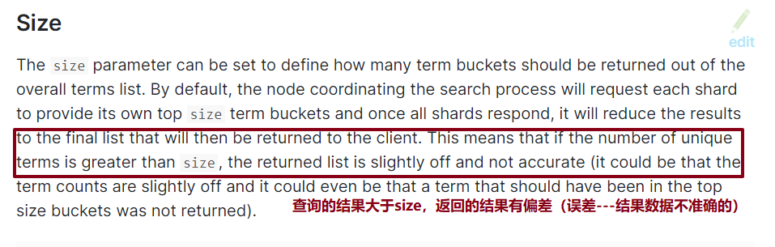

2、根据条件对商品进行过滤

- 将条件拼接到DSL语句

3、对商品列表进行排序、商品列表进行分页

4、对检索的关键字高亮显示：添加条件。


学习目标

+ Thymeleaf的介绍
+ Thymeleaf的入门
+ Thymeleaf的语法及标签
+ 商品的检索页面操作【完成】
+ 商品详情页静态化工程搭建
+ 商品详情页静态化功能实现


# 1 Thymeleaf介绍

Thymeleaf静态页面化技术

模板原理：模板    +   数据   =      输出（**生成静态页面HTML**、xml、代码等）

​        栗子：月饼模具   +      面粉      =     月饼

模板技术：Thymeleaf、freemarker、velocity。

模板的后缀名：freemarker（官方建议：xxx.ftl    **xxx.html**）

它的特点便是：**开箱即用**（springboot与Thymeleaf进行了整合）


​	thymeleaf是一个XML/XHTML/HTML5`模板引擎`，可用于Web与非Web环境中的应用开发。它是一个开源的Java库，基于Apache License 2.0许可，由Daniel Fernández创建，该作者还是Java加密库Jasypt的作者。

Thymeleaf提供了一个用于整合Spring MVC的可选模块，在应用开发中，你可以使用Thymeleaf来完全代替JSP或其他模板引擎，如Velocity、FreeMarker等。Thymeleaf的主要目标在于提供一种可被浏览器正确显示的、格式良好的模板创建方式，因此也可以用作静态建模。你可以使用它创建经过验证的XML与HTML模板。相对于编写逻辑或代码，开发者只需将标签属性添加到模板中即可。接下来，这些标签属性就会在DOM（文档对象模型）上执行预先制定好的逻辑。


它的特点便是：开箱即用，Thymeleaf允许您处理六种模板，每种模板称为模板模式：

- XML
- 有效的XML
- XHTML
- 有效的XHTML
- HTML5
- 旧版HTML5

所有这些模式都指的是格式良好的XML文件，但*Legacy HTML5*模式除外，它允许您处理HTML5文件，其中包含独立（非关闭）标记，没有值的标记属性或不在引号之间写入的标记属性。为了在这种特定模式下处理文件，Thymeleaf将首先执行转换，将您的文件转换为格式良好的XML文件，这些文件仍然是完全有效的HTML5（实际上是创建HTML5代码的推荐方法）[1](https://www.thymeleaf.org/doc/tutorials/2.1/usingthymeleaf.html#fn1)。

另请注意，验证仅适用于XML和XHTML模板。

然而，这些并不是Thymeleaf可以处理的唯一模板类型，并且用户始终能够通过指定在此模式下*解析*模板的方法和*编写*结果的方式来定义他/她自己的模式。这样，任何可以建模为DOM树（无论是否为XML）的东西都可以被Thymeleaf有效地作为模板处理。


# 2 Springboot整合thymeleaf

使用springboot 来集成使用Thymeleaf可以大大减少单纯使用thymleaf的代码量，所以我们接下来使用springboot集成使用thymeleaf.

实现的步骤为：

+ 创建一个sprinboot项目
+ 添加thymeleaf的起步依赖
+ 添加spring web的起步依赖
+ 编写html 使用thymleaf的语法获取变量对应后台传递的值
+ 编写controller 设置变量的值到model中


## 2.1 创建工程

创建一个独立的工程springboot-thymeleaf,该工程为案例工程，不需要放到changgou-parent工程中。

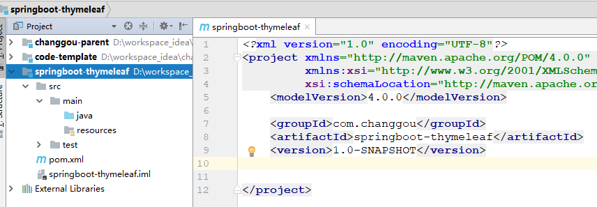

**pom.xml依赖**

```xml
<?xml version="1.0" encoding="UTF-8"?>
<project xmlns="http://maven.apache.org/POM/4.0.0"
         xmlns:xsi="http://www.w3.org/2001/XMLSchema-instance"
         xsi:schemaLocation="http://maven.apache.org/POM/4.0.0 http://maven.apache.org/xsd/maven-4.0.0.xsd">
    <modelVersion>4.0.0</modelVersion>

    <groupId>com.itheima</groupId>
    <artifactId>springboot-thymeleaf</artifactId>
    <version>1.0-SNAPSHOT</version>

    <parent>
        <groupId>org.springframework.boot</groupId>
        <artifactId>spring-boot-starter-parent</artifactId>
        <version>2.1.4.RELEASE</version>
    </parent>

    <dependencies>
        <!--web起步依赖-->
        <dependency>
            <groupId>org.springframework.boot</groupId>
            <artifactId>spring-boot-starter-web</artifactId>
        </dependency>

        <!--thymeleaf配置-->
        <dependency>
            <groupId>org.springframework.boot</groupId>
            <artifactId>spring-boot-starter-thymeleaf</artifactId>
        </dependency>
    </dependencies>
</project>
```


## 2.2 创建html

在resources中创建templates目录，在templates目录创建 demo.html,代码如下：

```html
<!DOCTYPE html>
<!--1.引入thymelear的标签-->
<html xmlns:th="http://www.thymeleaf.org">
<head>
    <title>Thymeleaf的入门</title>
    <!--编码格式-->
    <meta http-equiv="Content-Type" content="text/html; charset=UTF-8"/>
</head>
<body>
<!--展现文本数据:输出hello数据-->
<p th:text="${hello}"></p>
</body>
</html>
```

解释：

`<html xmlns:th="http://www.thymeleaf.org">`:这句声明使用thymeleaf标签

`<p th:text="${hello}"></p>`:这句使用 th:text="${变量名}" 表示 使用thymeleaf获取文本数据，类似于EL表达式。


## 2.3 application.yml配置

创建application.yml,并设置thymeleaf的缓存设置，设置为false。默认加缓存的。

```yaml
spring:
  thymeleaf:
    cache: false
```

在这里，其实还有一些默认配置，比如:

* 视图前缀：classpath:/templates/

* 视图后缀：.html

`org.springframework.boot.autoconfigure.thymeleaf.ThymeleafProperties`部分源码如下：

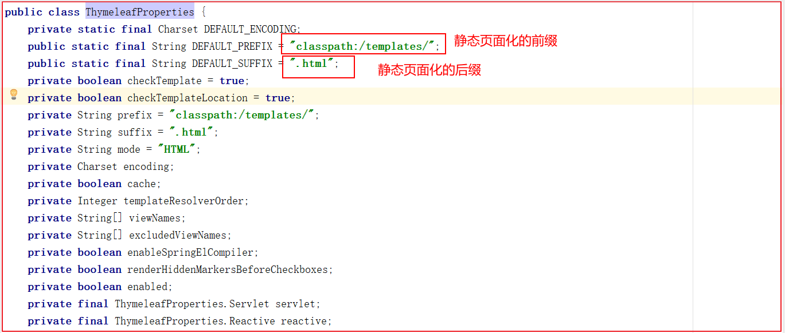


## 2.4 编写启动类

创建启动类`com.changgou.ThymeleafApplication`，代码如下：

```java
@SpringBootApplication
public class ThymeleafApplication {

    public static void main(String[] args) {
        SpringApplication.run(ThymeleafApplication.class,args);
    }
}
```


## 2.5 编写控制层

创建controller用于测试后台 设置数据到model中。

创建com.itheima.controller.TestController，代码如下：

```java
@Controller //因为返回的是视图view,所以要Controller
public class TestController {

    @RequestMapping("/demo")
    public String demo(Model model){
		//打印
        System.out.println("hello, thymeleaf");
        //将数据放到模板中(key=EL表达式中的变量名,导入的数据)
        model.addAttribute("hello", "hello, thymeleaf");
        //返回内容,页面展示
        return "demo";
    }
}
```


## 2.6 测试

启动系统，并在浏览器访问

```
http://localhost:8080/demo
```

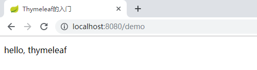


# 3 Thymeleaf基本语法

## 3.1 th:action

定义后台控制器路径，类似`<form>`标签的action属性。 

例如：

```html
<form th:action="@{/demo}">
    <input type="submit">
</form>
```

表示提交的请求地址为`/test/hello`


## 3.2 th:each

`对象遍历`，功能类似jstl中的`<c:forEach>`标签。 

`创建com.itheima.model.User类`,代码如下：

```java
public class User {
    private Integer id;
    private String name;
    private String address;
    // Constructor
    // ..get..set
}
```


Controller层中`添加List<pojo>数据`

```java
/***
 * 访问/test/hello  跳转到demo1页面
 * @param model
 * @return
 */
@RequestMapping("/hello")
public String hello(Model model){
    model.addAttribute("hello","hello welcome");

    //集合数据
    List<User> users = new ArrayList<User>();
    users.add(new User(1,"张三","深圳"));
    users.add(new User(2,"李四","北京"));
    users.add(new User(3,"王五","武汉"));
    //将数据放到模板中
    model.addAttribute("users",users);
    //返回view
    return "demo";
}
```


模板demo.html中页面输出

```html
<!--表格-->
<table>
        <tr>
            <td>编号index</td>
            <td>编号count</td>
            <td>id</td>
            <td>姓名</td>
            <td>地址</td>
        </tr>
    	<!--遍历集合(Users)=别名,状态:对象-->
        <tr th:each="user,userStat:${users}">
            <!--展现文本数据:编号索引:从0开始-->
            <td th:text="${userStat.index}"></td>
            <!--展现文本数据:编号总和:从1开始-->
            <td th:text="${userStat.count}"></td>
            <!--展现文本数据:User对象中的属性-->
            <td th:text="${user.id}"></td>
            <td th:text="${user.name}"></td>
            <td th:text="${user.address}"></td>
        </tr>

    </table>
```


测试效果

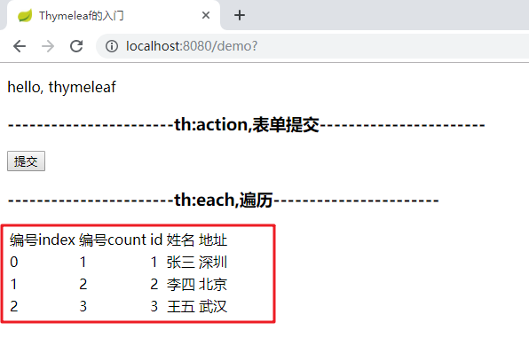


## 3.3 Map输出

后台Controller`添加Map数据`

```java
//Map定义
Map<String,Object> dataMap = new HashMap<String,Object>();
dataMap.put("No","123");
dataMap.put("address","深圳");
//添加到model
model.addAttribute("dataMap",dataMap);
```


模板demo.html中页面输出

```html
<!--展现文本数据:根据map中的key输出value-->
<span th:text="${dataMap.No}"></span>
<span th:text="${dataMap.address}"></span>

<br>

<!--遍历Map集合中的key和value-->
<em th:each="map:${dataMap}">
    <span th:text="${map.key}"></span>
    <span th:text="${map.value}"></span>
</em>
```


测试效果

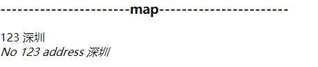


## 3.4 数组输出

后台Controller中`添加数组`

```java
//存储一个数组
String[] names = {"张三","李四","王五"};
model.addAttribute("names",names);
```

模板demo.html中页面输出

```html
<!--遍历数组,model中的key和value(数组)-->
<em th:each="name:${names}">
    <!--展示数据-->
    <span th:text="${name}"></span>
</em>
```


测试效果


## 3.5 Date输出

后台`添加日期`

```java
//日期
model.addAttribute("now",new Date());
```

页面输出

```php+HTML
<!--thymeleaf中以#开头的都是它提供的内置函数,例子(#Xxx)-->
<!--展示文本:转换日期时间格式(model中的key,'输出的日期格式')-->
<span th:text="${#dates.format(now, 'yyyy-MM-dd hh:mm:ss')}"></span>
```


测试效果


## 3.6 th:if条件

后台添加年龄

```java
//if条件
model.addAttribute("age",22);
```


页面输出

```html
<!--<th:if判断:直接在EL表达式中写条件>判断成功后显示的值-->
<span th:if="${age>=18}">成年了</span>
```


测试效果


## 3.7 th:fragment 定义一个模块

可以定义一个独立的模块，`创建一个footer.html页面`代码如下：

`[有问题:不知道对应的关系怎么看]`

```html
<!DOCTYPE html>
<html xmlns:th="http://www.thymeleaf.org">
<head>
    <meta http-equiv="Content-Type" content="text/html;charset=charset=utf-8">
    <title>fragment</title>
</head>
<body>
<!--被引入其他页面中的公共内容:id可以随便设置,但"copy值要对应被引入的内容"-->
<div id="C" th:fragment="copy" >
    关于我们<br/>
</div>	
</body>
```


## 3.8 th:include

可以直接引入`th:fragment`,在demo1.html中引入如下代码：

`可以将公共页面提出来,哪个页面用给哪个页面引用`

```html
<!--引入其他页面中的公共内容:copy对应上面的内容-->
<div id="A" th:include="footer::copy"></div>
```


效果如下：

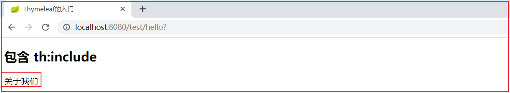


# 4 搜索页面渲染

1、检索的页面：消费者使用的（客户端就可以去调用接口数据）。

- 搭建客户端工程
- 客户端调用search服务的接口数据（在页面展示）

2、检索页面展示的数据：后台提供的业务数据（changgou-service-search）


## 4.1 搜索分析

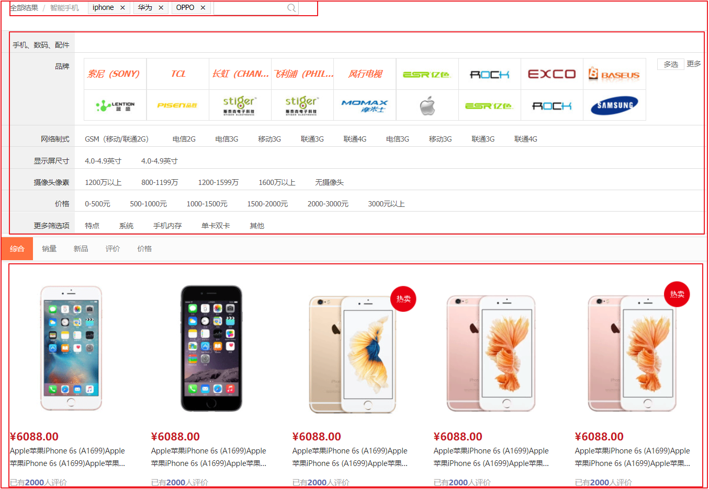

搜索页面要显示的内容主要分为3块。

1)搜索的数据结果

2)筛选出的数据搜索条件

3)用户已经勾选的数据条件


## 4.2 搜索页面工程搭建

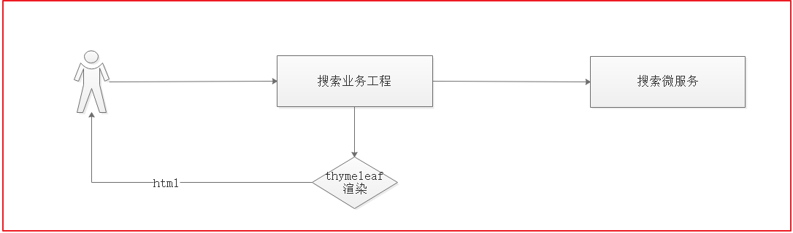

搜索的业务流程如上图，用户每次搜索的时候，先经过搜索业务工程，搜索业务工程调用搜索微服务工程，这里搜索业务工程单独挪出来的原因是它这里涉及到了模板渲染以及其他综合业务处理，以后很有可能会有移动端的搜索和PC端的搜索，后端渲染如果直接在搜索微服务中进行，会对微服务造成一定的侵入，不推荐这么做，推荐微服务独立，只提供服务，如果有其他页面渲染操作，可以搭建一个独立的消费工程调用微服务达到目的。


### 4.2.1 工程创建

在changgou-web工程中创建changgou-web-search工程,并在changgou-web的pom.xml中引入如下依赖：


```xml
<dependencies>
    <!--thymeleaf页面静态化-->
    <dependency>
        <groupId>org.springframework.boot</groupId>
        <artifactId>spring-boot-starter-thymeleaf</artifactId>
    </dependency>
    <dependency>
        <groupId>org.springframework.boot</groupId>
        <artifactId>spring-boot-starter-web</artifactId>
    </dependency>
    <dependency>
        <groupId>org.springframework.cloud</groupId>
        <artifactId>spring-cloud-starter-netflix-eureka-client</artifactId>
    </dependency>
    <!--feign-->
    <dependency>
        <groupId>org.springframework.cloud</groupId>
        <artifactId>spring-cloud-starter-openfeign</artifactId>
    </dependency>
    <!--amqp-->
    <dependency>
        <groupId>org.springframework.boot</groupId>
        <artifactId>spring-boot-starter-amqp</artifactId>
    </dependency>
    <!--search API依赖-->
    <dependency>
        <groupId>com.changgou</groupId>
        <artifactId>changgou-service-search-api</artifactId>
        <version>1.0-SNAPSHOT</version>
    </dependency>
</dependencies>
```

### 4.2.2 编写application.yml文件

~~~yaml
server:
  port: 18086
eureka:
  client:
    service-url:
      defaultZone: http://127.0.0.1:7001/eureka
  instance:
    prefer-ip-address: true
feign:
  hystrix:
    enabled: true
spring:
  thymeleaf:
    cache: false
  application:
    name: search-web
  main:
    allow-bean-definition-overriding: true
ribbon:
  ReadTimeout: 300000
hystrix:
  command:
    default:
      execution:
        isolation:
          thread:
            timeoutInMilliseconds: 10000
~~~


### 4.2.3 创建启动类

修改changgou-web-search,添加启动类com.changgou.SearchWebApplication，代码如下：

```java
@SpringBootApplication//启动类注解
@EnableEurekaClient//启动注册中心客户端
@EnableFeignClients(basePackages = "com.changgou.search.feign")//开启Feign客户端(feign包)
public class SearchWebApplication {
    public static void main(String[] args) {
        SpringApplication.run(WebSearchApplication.class,args);
    }
}
```


### 4.2.4 添加静态资源和页面

将`资源`中的

* `页面/前端页面/search.html`拷贝到工程的`resources/templates`目录下
* js、css等拷贝到`static`目录下，如下图：

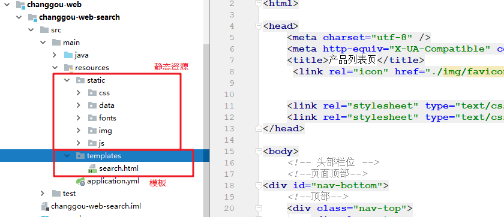


### 4.2.5 搜索调用

在changgou-web-search中`创建com.changgou.search.controller.SearchController类`,实现调用搜索，代码如下：

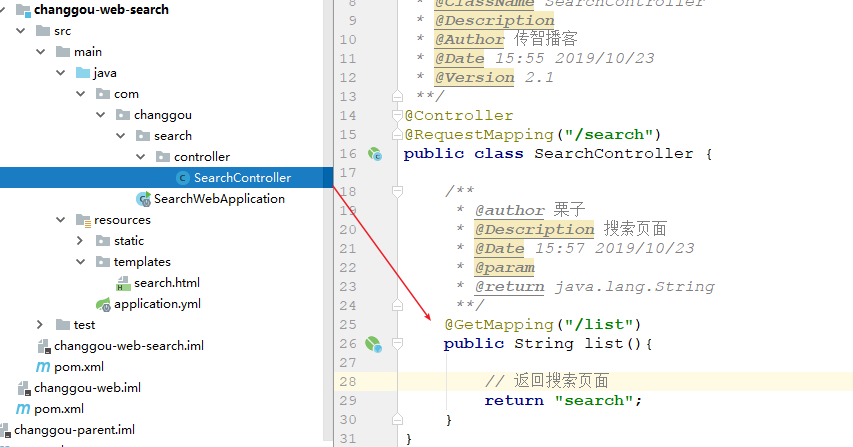

```java
@Controller //因为返回的是视图view,所以要Controller
@RequestMapping("/search")
public class SearchController {

    /**
     * @author 栗子
     * @Description 搜索页面回显数据
     * @Date 22:56 2019/8/18
     * @param searchMap
     * @param model
     * @return java.lang.String
     **/
    @GetMapping("/list")
    public String list(){
     
        // 视图地址
        return "search";
    }
}
```


### 4.2.6 HTML引入thymeleaf标签

在search.html的头部引入thymeleaf标签

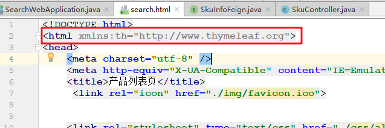

```xml
<!--引入thymeleaf的标签-->
<html xmlns:th="http://www.thymeleaf.org">
```


### 4.2.7 访问测试

启动服务并且测试，访问：`http://localhost:18086/search/list`,效果如下：

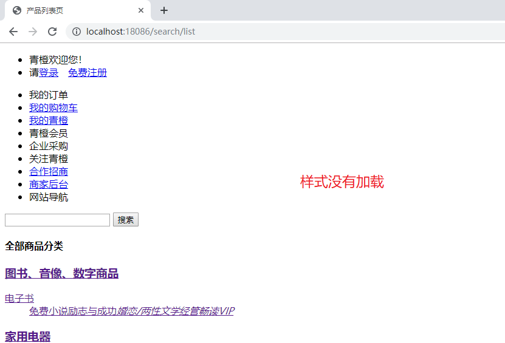

### 4.2.8 样式加载

- 修改模板

修改search.html模板数据：将加载css、js等文件设置成绝对路径，去掉**“.”**

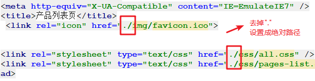

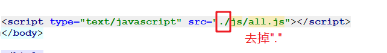

- 启动服务在测试访问

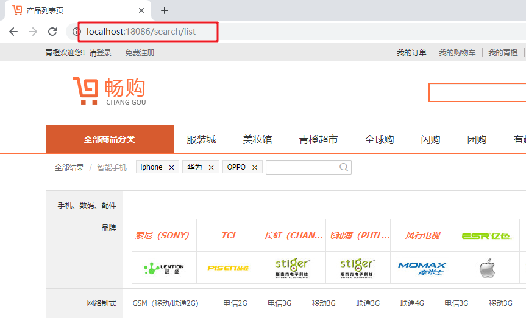


## 4.3 搜索页面数据填充

后端搜索到数据后，前端页面进行数据显示，显示的数据分为3部分

```properties
1)搜索的数据结果
2)筛选出的数据搜索条件
3)用户已经勾选的数据条件
```


### 4.3.1 编写SkuInfoFeign

由于我们客户端（前端）需要调用检索服务提供的数据，因此我们需要通过feign调用。`在changgou-service-search-api工程`下创建SkuInfoFeign。

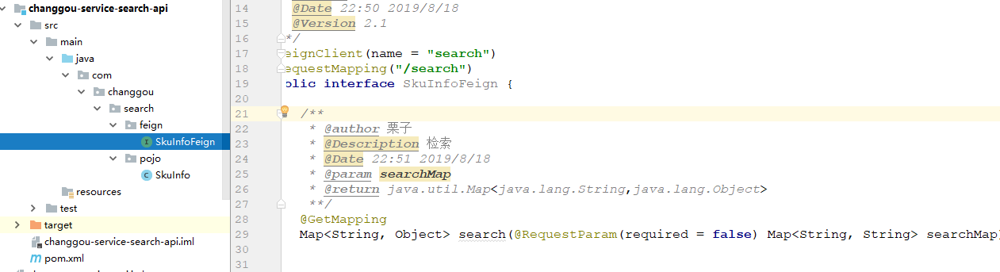

修改changgou-service-search-api，添加`com.changgou.search.feign.SkuInfoFeign`，实现调用搜索，代码如下：

```java
@FeignClient(name = "search")
@RequestMapping("/search")
public interface SkuInfoFeign {

    /**
     * @author 栗子
     * @Description 检索
     * @Date 22:51 2019/8/18
     * @param searchMap
     * @return java.util.Map<java.lang.String,java.lang.Object>
     **/
    @GetMapping
    Map<String, Object> search(@RequestParam(required = false) Map<String, String> searchMap);
}
```


### 4.3.2 更新SearchController

在SearchController中需要通过feign调用搜索服务，并且将数据封装到model域中，然后在页面进行回显。（`<需要在changgou-web-search工程中添加对search-api工程的依赖>`）

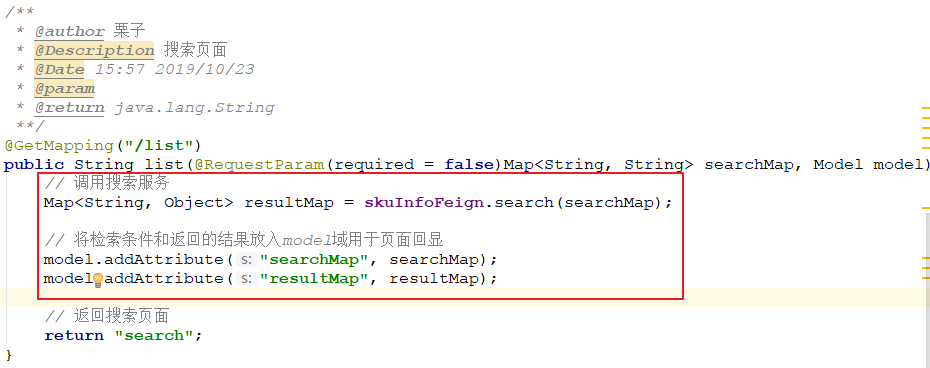

~~~java
public class SearchController {

    @Autowired(required = false)
    private SkuInfoFeign skuInfoFeign;

    /**
     * @author 栗子
     * @Description 搜索页面
     * @Date 15:57 2019/10/23
     * @param
     * @return java.lang.String
     **/
    @GetMapping("/list")
    public String list(@RequestParam(required = false)Map<String, String> searchMap, Model model){
        // 调用搜索服务
        Map<String, Object> resultMap = skuInfoFeign.search(searchMap);

        // 将检索条件和返回的结果放入model域用于页面回显
        model.addAttribute("searchMap", searchMap);
        model.addAttribute("resultMap", resultMap);

        // 返回搜索页面
        return "search";
    }
}
~~~


### 4.3.3 数据回显

用户每次输入关键字的时候，直接根据关键字搜索，关键字搜索的数据会存储到`result.rows`中，页面每次根据result获取rows，然后循环输出即可,同时页面的搜索框每次需要回显搜索的关键词。

实现思路

```properties
1.前端表单提交搜索的关键词
2.后端根据关键词进行搜索
3.将搜索条件存储到Model中
4.页面循环迭代输出数据
5.搜索表单回显搜索的关键词
```


#### 4.3.3.1 回显搜索关键字

修改search.html

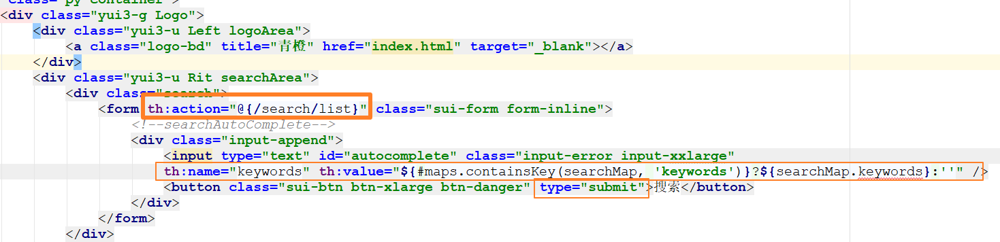

**注意：搜索按钮为submit提交。**

~~~html
<form th:action="@{/search/list}" class="sui-form form-inline">
    <!--searchAutoComplete-->
    <div class="input-append">
        <input type="text" id="autocomplete" class="input-error input-xxlarge"
               th:name="keywords" th:value="${#maps.containsKey(searchMap, 'keywords')}?${searchMap.keywords}:''" />
        <button class="sui-btn btn-xlarge btn-danger" type="submit">搜索</button>
    </div>
</form>
~~~


#### 4.3.3.2 回显商品列表

修改search.html，代码如下：

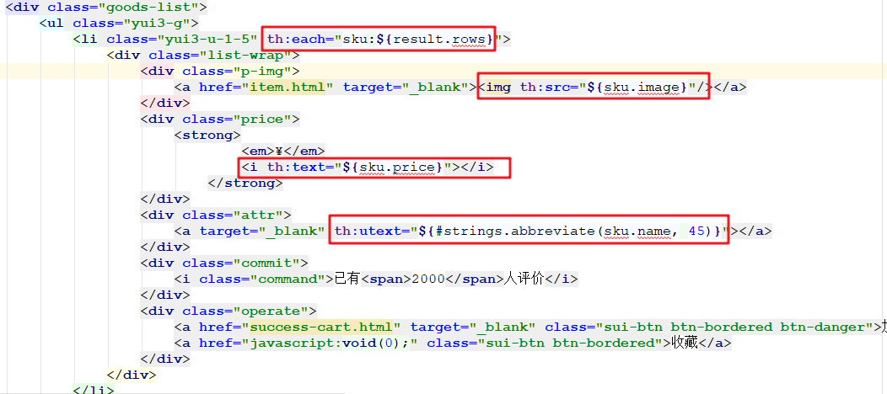

~~~html
<div class="goods-list">
    <ul class="yui3-g">
        <!--遍历商品列表数据:存在map中:SearchServiceImpl中就添加数据到map中了-->
        <li class="yui3-u-1-5" th:each="sku:${resultMap.rows}">
            <div class="list-wrap">
                <div class="p-img">
 					<!--SkuInfo中的属性-->           
                    <a href="item.html"  target="_blank">
                        <!--展示图片-->
                        
                    </a>
                </div>
                <div class="price">
                    <strong>
                        <em>¥</em>
                        <!--展示价格-->
                        <i th:text="${sku.price}"></i>
                    </strong>
                </div>
                <div class="attr">
                    <!--只展示40个字符的商品名:函数(字段,个数(可变))-->
                    <a target="_blank" th:utext="${#strings.abbreviate(sku.name, 40)}"></a>
                </div>
                <div class="commit">
                    <i class="command">已有<span>2000</span>人评价</i>
                </div>
                <div class="operate">
                    <a href="success-cart.html" target="_blank" class="sui-btn btn-bordered btn-danger">加入购物车</a>
                    <a href="javascript:void(0);" class="sui-btn btn-bordered">收藏</a>
                </div>
            </div>
        </li>
    </ul>
</div>
~~~


#### 4.3.3.3 测试

搜索`华为`关键字,效果如下：

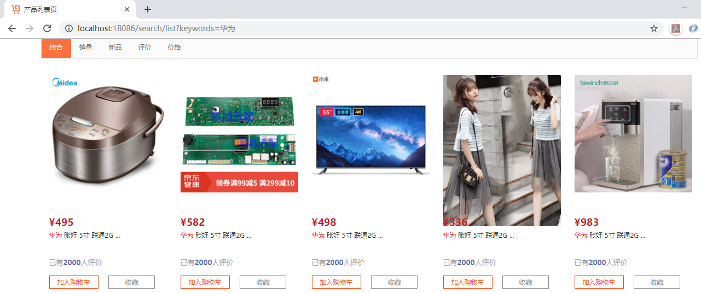


## 4.4 过滤条件回显

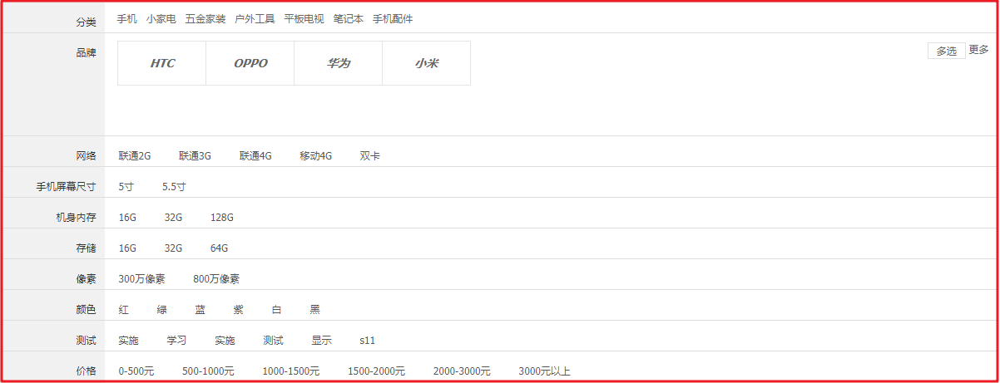

搜索条件除了关键字外，还有分类、品牌、以及规格，这些在我们前面已经将数据存入到了Map中，我们可以直接从Map中将数据取出，然后在页面输出即可。

分类：`resultMap.categoryList`

品牌：`resultMap.brandList`

规格：`resultMap.specList`


### 4.4.1 修改search.html

代码如下：

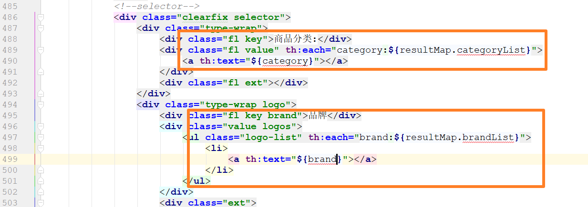

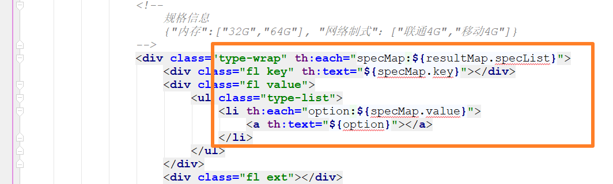

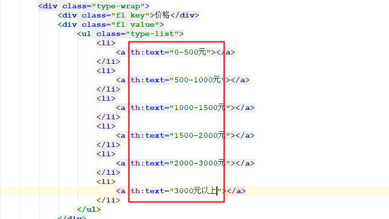

上图代码如下：

```html
<!--商品分类列表-->
<div class="type-wrap">
    <div class="fl key">商品分类:</div>
    <!--循环商品分类:-->
    <div class="fl value" th:each="category:${resultMap.categoryList}">
        <!--展示商品分类-->
        <a th:text="${category}"></a>
    </div>
    <div class="fl ext"></div>
</div>
<div class="type-wrap logo">
    <div class="fl key brand">品牌</div>
    <div class="value logos">
        <!--遍历品牌-->
        <ul class="logo-list" th:each="brand:${resultMap.brandList}">
            <li>
                <!--展示品牌-->
                <a th:text="${brand}"></a>
            </li>
        </ul>
    </div>
    <div class="ext">
        <a href="javascript:void(0);" class="sui-btn">多选</a>
        <a href="javascript:void(0);">更多</a>
    </div>
</div>
<!--商品规格列表-->
<!--
规格信息
{"内存":["32G","64G"], "网络制式"：["联通4G","移动4G"]}
-->
<!--遍历规格-->
<div class="type-wrap" th:each="specMap:${resultMap.specList}">
    <!--展示key:"内存"-->
    <div class="fl key" th:text="${specMap.key}"></div>
    <div class="fl value">
        <ul class="type-list">
            <!--遍历set:-->
            <li th:each="option:${specMap.value}">
                <!--展示value:["32G","64G"]-->
                <a th:text="${option}"></a>
            </li>
        </ul>
    </div>
    <div class="fl ext"></div>
</div>
<div class="type-wrap">
    <div class="fl key">价格</div>
    <div class="fl value">
        <ul class="type-list">
            <li>
                <a th:text="0-500元"></a>
            </li>
            <li>
                <a th:text="500-1000元"></a>
            </li>
            <li>
                <a th:text="1000-1500元"></a>
            </li>
            <li>
                <a th:text="1500-2000元"></a>
            </li>
            <li>
                <a th:text="2000-3000元"></a>
            </li>
            <li>
                <a th:text="3000元以上"></a>
            </li>
        </ul>
    </div>
    <div class="fl ext">
    </div>
</div>
```


### 4.4.2 测试

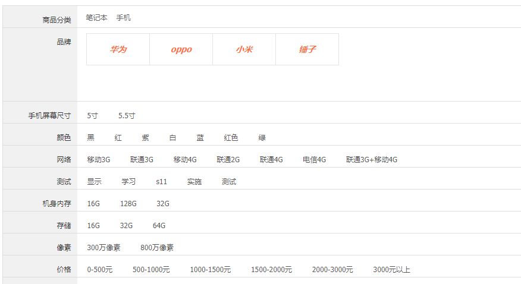


## 4.5 用户通过条件过滤

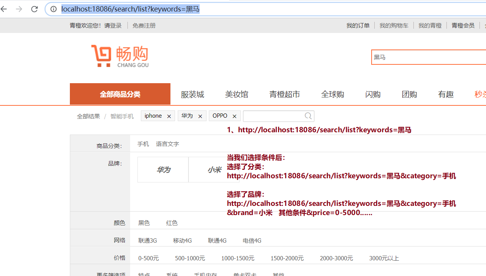

需求：根据条件进行过滤，本质上需要完成的就是：拼接的条件


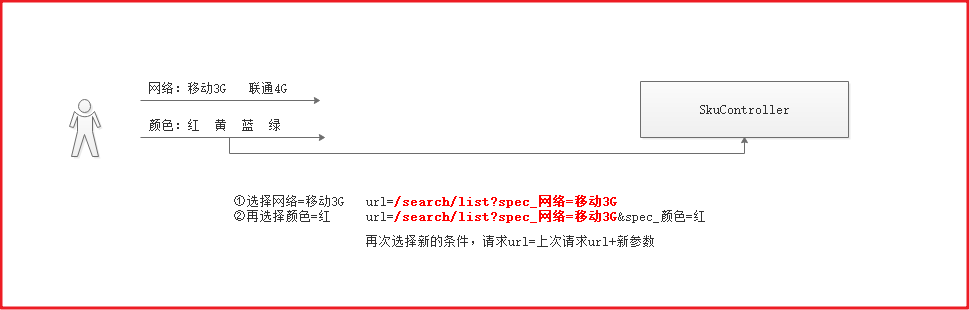

用户每次点击搜索的时候，其实在上次搜索的基础之上加上了新的搜索条件，也就是在上一次请求的URL后面追加了新的搜索条件，我们可以在后台每次拼接组装出上次搜索的URL，然后每次将URL存入到Model中，页面每次点击不同条件的时候，从Model中取出上次请求的URL，然后再加上新点击的条件参数实现跳转即可。

### 4.5.1 勾选过滤条件

#### 4.5.1.1 组装url

修改SearchController，添加组装URL的方法，并将组装好的URL存储起来,代码如下：

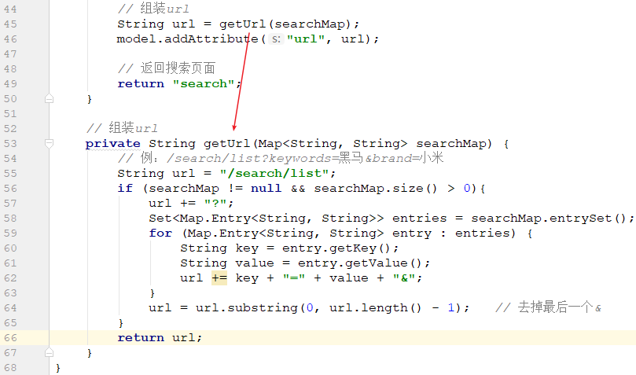

```java
@Controller
@RequestMapping("/search")
public class SearchController {

    @Autowired(required = false)
    private SkuInfoFeign skuInfoFeign;

    /**
     * @author 栗子
     * @Description 搜索页面
     * @Date 15:57 2019/10/23
     * @param
     * @return java.lang.String
     **/
    @GetMapping("/list")
    public String list(@RequestParam(required = false)Map<String, String> searchMap, Model model){
        // 调用搜索服务
        Map<String, Object> resultMap = skuInfoFeign.search(searchMap);

        // 将检索条件和返回的结果放入model域用于页面回显
        model.addAttribute("searchMap", searchMap);
        model.addAttribute("resultMap", resultMap);

        // 调用自定义方法,组装url
        String url = getUrl(searchMap);
        //添加到model中
        model.addAttribute("url", url);

        // 返回搜索页面
        return "search";
    }

    // 组装url
    private String getUrl(Map<String, String> searchMap) {
        // 例：/search/list?keywords=黑马&brand=小米
        //获取映射路径
        String url = "/search/list";
        //非空判断
        if (searchMap != null && searchMap.size() > 0){
            ///search/list?
            //第一次拼接要以?开始,后面采用&
            url += "?";
            //将map转set集合
            Set<Map.Entry<String, String>> entries = searchMap.entrySet();
            //遍历set集合
            for (Map.Entry<String, String> entry : entries) {
                //获取条件字段key
                String key = entry.getKey();
                //获取条件value
                String value = entry.getValue();
                
                //拼接条件
                //es:/search/list?keywords=黑马&brand=小米&
                url += key + "=" + value + "&";
            }
            // 截取字符窜:去掉最后一个&
            // es:/search/list?keywords=黑马&brand=小米
            url = url.substring(0, url.length() - 1);   
        }
        //返回拼接完的结果
        return url;
    }
}
```


#### 4.5.1.2 地址栏显示url

在检索页面选择过滤条件，并且将url显示地址栏

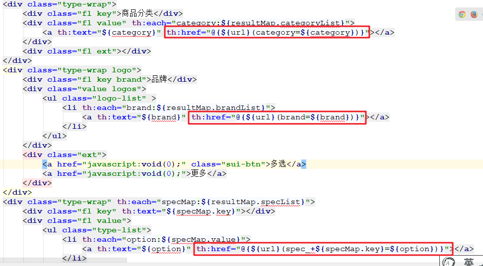


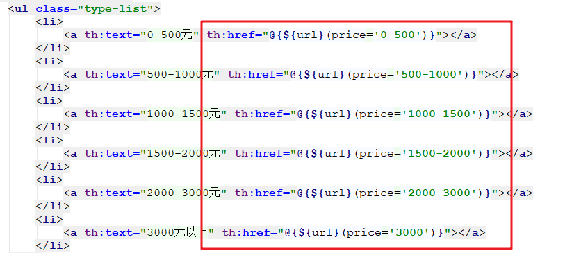

~~~html
<div class="type-wrap">
    <div class="fl key">商品分类</div>
    <div class="fl value" th:each="category:${result.categoryList}">
         <!--提交将拼好的url路径放到这里数据(格式key=value)-->
        <a th:text="${category}" th:href="@{${url}(category=${category})}"></a>
    </div>
    <div class="fl ext"></div>
</div>
<div class="type-wrap logo">
    <div class="fl key brand">品牌</div>
    <div class="value logos">
        <ul class="logo-list">
            <li th:each="brand:${result.brandList}">
                <!--提交将拼好的url路径放到这里数据(格式key=value)-->
                <a th:text="${brand}" th:href="@{${url}(brand=${brand})}"></a>
            </li>
        </ul>
    </div>
    <div class="ext">
        <a href="javascript:void(0);" class="sui-btn">多选</a>
        <a href="javascript:void(0);">更多</a>
    </div>
</div>
<div class="type-wrap" th:each="specMap:${result.specList}">
    <div class="fl key" th:text="${specMap.key}"></div>
    <div class="fl value">
        <ul class="type-list">
            <li th:each="option:${specMap.value}">
                 <!--提交将拼好的url路径放到这里数据(前缀_key=value)-->
                <a th:text="${option}" th:href="@{${url}(spec_+${specMap.key}=${option})}"></a>
            </li>
        </ul>
    </div>
    <div class="fl ext"></div>
</div>
<div class="type-wrap">
    <div class="fl key">价格</div>
    <div class="fl value">
        <ul class="type-list">
            <li>
                <!--提交将拼好的url路径放到这里数据(价格写死的)-->
                <a th:text="0-500元" th:href="@{${url}(price='0-500')}"></a>
            </li>
            <li>
                <a th:text="500-1000元" th:href="@{${url}(price='500-1000')}"></a>
            </li>
            <li>
                <a th:text="1000-1500元" th:href="@{${url}(price='1000-1500')}"></a>
            </li>
            <li>
                <a th:text="1500-2000元" th:href="@{${url}(price='1500-2000')}"></a>
            </li>
            <li>
                <a th:text="2000-3000元" th:href="@{${url}(price='2000-3000')}"></a>
            </li>
            <li>
                <a th:text="3000元以上" th:href="@{${url}(price='3000')}"></a>
            </li>
        </ul>
    </div>
    <div class="fl ext">
    </div>
</div>
~~~


### 4.5.2 隐藏已选过滤条件

- 需求：将用户选择后的条件就不用展示了。

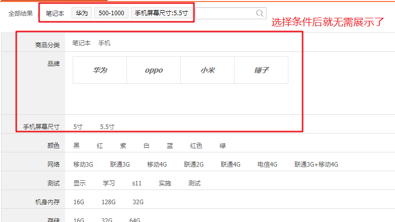


- 修改search.html页面   `<th:unless:条件不成立时显示>`

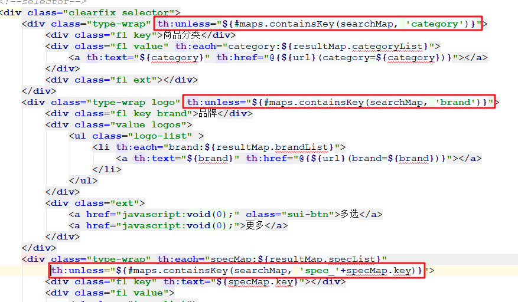


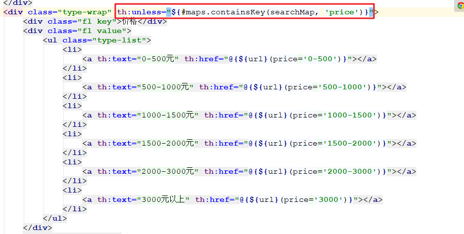

```html
th:unless=""：条件不成立的时候显示
<div class="type-wrap" th:unless="${#maps.containsKey(searchMap, '存入map时的key')}">
```


### 4.5.3 展示用户已勾选条件

- 修改search.html页面：

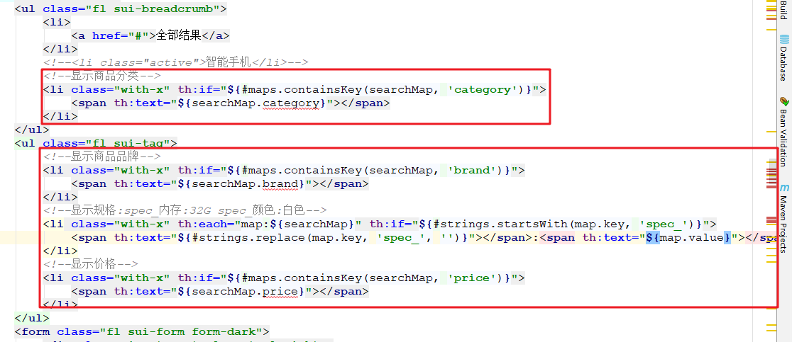

~~~html
<ul class="fl sui-breadcrumb">
    <li>
        <a href="#">全部结果</a>
    </li>
    <!--<li class="active">智能手机</li>-->
    <!--显示商品分类-->
    <!--判断是否包含key:maps函数(map,"map中的key")-->
    <li class="with-x" th:if="${#maps.containsKey(searchMap, 'category')}">
        <span th:text="${searchMap.category}"></span>
    </li>
</ul>
<ul class="fl sui-tag">
    <!--显示商品品牌-->
    <li class="with-x" th:if="${#maps.containsKey(searchMap, 'brand')}">
        <span th:text="${searchMap.brand}"></span>
    </li>
    <!--显示规格:spec_内存:32G spec_颜色:白色-->
    <!--遍历map,函数判断key以spec_开头-->
    <li class="with-x" th:each="map:${searchMap}" th:if="${#strings.startsWith(map.key, 'spec_')}">
        <!--key:value == 颜色:红色-->
        <!--函数.替换掉key中的前缀spec_为空-->
        <span th:text="${#strings.replace(map.key, 'spec_', '')}"></span>:<span th:text="${map.value}"></span>
    </li>
    <!--显示价格-->
    <li class="with-x" th:if="${#maps.containsKey(searchMap, 'price')}">
        <span th:text="${searchMap.price}"></span>
    </li>
</ul>
~~~


- 测试

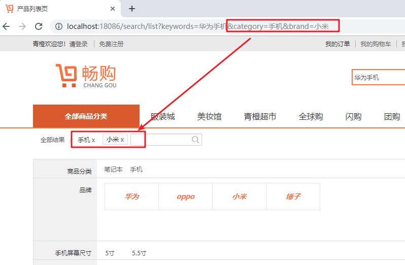


## 4.6 移除用户已选过滤条件

- 需求:将条件从地址栏中删除

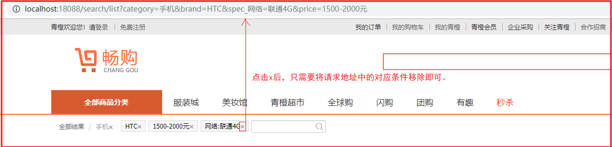

如上图，用户点击条件搜索后，要将选中的条件显示出来，并提供移除条件的`x`按钮,显示条件我们可以从searchMap中获取，移除其实就是将之前的请求地址中的指定条件删除即可。

- 移除搜素条件

`修改search.html`，移除分类、品牌、价格、规格搜索条件，代码如下：


```html
<!--举例规格-->
th:href="@{${url}(spec_+${specMap.key}=${option})}"
```


## 4.7 分页

真实的分页应该像百度那样，如下图：


- 服务器端：完成的数据的分页（将这些数据存到ResultMap）
- 客户端（前端）：对数据进行分页，提供分页对象。
  - 提供了分页对象。


### 4.7.1 分页工具类定义

在comm工程中添加Page分页对象，代码如下：

```java
public class Page <T> implements Serializable{

	// 页数（第几页）
	private long currentpage;

	// 查询数据库里面对应的数据有多少条
	private long total; // 从数据库查处的总记录数

	// 每页查5条
	private int size;

	// 下页
	private int next;
	
	private List<T> list;

	// 最后一页
	private int last;
	
	private int lpage;
	
	private int rpage;
	
	//从哪条开始查
	private long start;
	
	//全局偏移量
	public int offsize = 2;
	
	public Page() {
		super();
	}

	/****
	 *
	 * @param currentpage
	 * @param total
	 * @param pagesize
	 */
	public void setCurrentpage(long currentpage,long total,long pagesize) {
		//可以整除的情况下
		long pagecount =  total/pagesize;

		//如果整除表示正好分N页，如果不能整除在N页的基础上+1页
		int totalPages = (int) (total%pagesize==0? total/pagesize : (total/pagesize)+1);

		//总页数
		this.last = totalPages;

		//判断当前页是否越界,如果越界，我们就查最后一页
		if(currentpage>totalPages){
			this.currentpage = totalPages;
		}else{
			this.currentpage=currentpage;
		}

		//计算start
		this.start = (this.currentpage-1)*pagesize;
	}

	//上一页
	public long getUpper() {
		return currentpage>1? currentpage-1: currentpage;
	}

	//总共有多少页，即末页
	public void setLast(int last) {
		this.last = (int) (total%size==0? total/size : (total/size)+1);
	}

	/****
	 * 带有偏移量设置的分页
	 * @param total
	 * @param currentpage
	 * @param pagesize
	 * @param offsize
	 */
	public Page(long total,int currentpage,int pagesize,int offsize) {
		this.offsize = offsize;
		initPage(total, currentpage, pagesize);
	}

	/****
	 *
	 * @param total   总记录数
	 * @param currentpage	当前页
	 * @param pagesize	每页显示多少条
	 */
	public Page(long total,int currentpage,int pagesize) {
		initPage(total,currentpage,pagesize);
	}

	/****
	 * 初始化分页
	 * @param total
	 * @param currentpage
	 * @param pagesize
	 */
	public void initPage(long total,int currentpage,int pagesize){
		//总记录数
		this.total = total;
		//每页显示多少条
		this.size=pagesize;

		//计算当前页和数据库查询起始值以及总页数
		setCurrentpage(currentpage, total, pagesize);

		//分页计算
		int leftcount =this.offsize,	//需要向上一页执行多少次
				rightcount =this.offsize;

		//起点页
		this.lpage =currentpage;
		//结束页
		this.rpage =currentpage;

		//2点判断
		this.lpage = currentpage-leftcount;			//正常情况下的起点
		this.rpage = currentpage+rightcount;		//正常情况下的终点

		//页差=总页数和结束页的差
		int topdiv = this.last-rpage;				//判断是否大于最大页数

		/***
		 * 起点页
		 * 1、页差<0  起点页=起点页+页差值
		 * 2、页差>=0 起点和终点判断
		 */
		this.lpage=topdiv<0? this.lpage+topdiv:this.lpage;

		/***
		 * 结束页
		 * 1、起点页<=0   结束页=|起点页|+1
		 * 2、起点页>0    结束页
		 */
		this.rpage=this.lpage<=0? this.rpage+(this.lpage*-1)+1: this.rpage;

		/***
		 * 当起点页<=0  让起点页为第一页
		 * 否则不管
		 */
		this.lpage=this.lpage<=0? 1:this.lpage;

		/***
		 * 如果结束页>总页数   结束页=总页数
		 * 否则不管
		 */
		this.rpage=this.rpage>last? this.last:this.rpage;
	}

	public long getNext() {
		return  currentpage<last? currentpage+1: last;
	}

	public void setNext(int next) {
		this.next = next;
	}

	public long getCurrentpage() {
		return currentpage;
	}

	public long getTotal() {
		return total;
	}

	public void setTotal(long total) {
		this.total = total;
	}

	public long getSize() {
		return size;
	}

	public void setSize(int size) {
		this.size = size;
	}

	public long getLast() {
		return last;
	}

	public long getLpage() {
		return lpage;
	}

	public void setLpage(int lpage) {
		this.lpage = lpage;
	}

	public long getRpage() {
		return rpage;
	}

	public void setRpage(int rpage) {
		this.rpage = rpage;
	}

	public long getStart() {
		return start;
	}

	public void setStart(long start) {
		this.start = start;
	}

	public void setCurrentpage(long currentpage) {
		this.currentpage = currentpage;
	}

	/**
	 * @return the list
	 */
	public List<T> getList() {
		return list;
	}

	/**
	 * @param list the list to set
	 */
	public void setList(List<T> list) {
		this.list = list;
	}
}
```


### 4.7.2 修改商品检索代码

由于这里需要获取分页信息，我们可以在`changgou-service-search`服务中修改搜索方法实现获取分页数据，修改`com.changgou.search.service.impl.SkuServiceImpl`的(根据关键字检索)searchForPage方法，在return之前添加如下方法获取份额与数据：

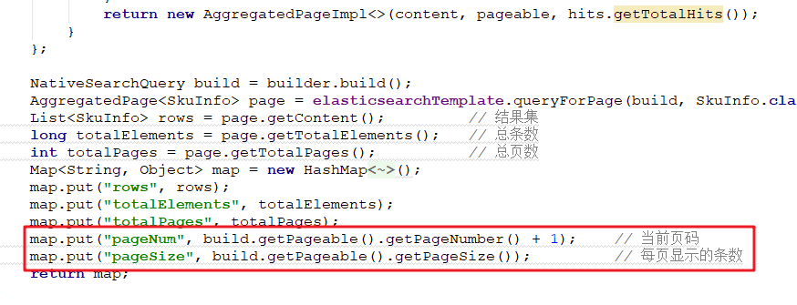

```java
// 当前页码
map.put("pageNum", build.getPageable().getPageNumber() + 1);    
// 每页显示的条数
map.put("pageSize", build.getPageable().getPageSize()); 
```


### 4.7.3 更新SearchController代码

修改SkuController类的list的方法中添加,实现分页信息封装，代码如下：

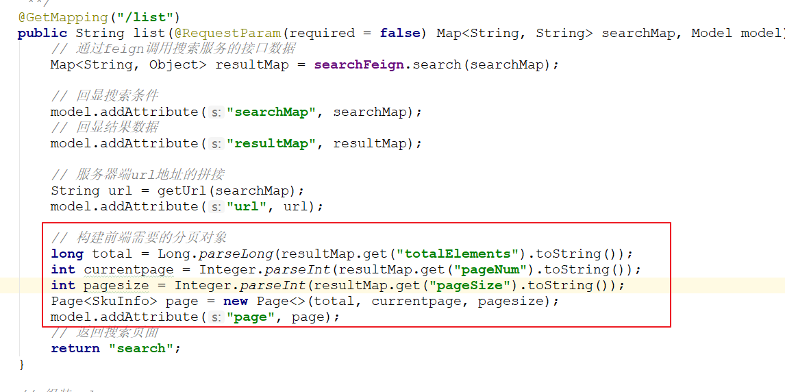

````java
//===构造前端需要的分页对象==
        //获取总条数
        long totalElements = Long.parseLong(resultMap.get("totalElements").toString());
        //获取当前页码
        int pageNum = Integer.parseInt(resultMap.get("pageNum").toString());
        //获取每页数量
        int pageSize = Integer.parseInt(resultMap.get("pageSize").toString());
        //实现功能:调用工具类实现分页功能
        Page<SkuInfo> page = new Page<>(totalElements, pageNum, pageSize);
        //添加到model中
        model.addAttribute("page", page);
````


### 4.7.4 页面分页实现

修改search.html，实现分页查询，代码如下：


~~~html
<ul>
    <li class="prev disabled">
        <a th:href="@{${url}(pageNum=${page.upper})}">上一页</a>
    </li>
    <!--th:class样式-->
    <li th:each="i:${#numbers.sequence(page.lpage, page.rpage)}" th:class="${i}==${page.currentpage }?'active':'' ">
        <a th:href="@{${url}(pageNum=${i})}" th:text="${i}">1</a>
    </li>
    <li class="next">
        <a th:href="@{${url}(pageNum=${page.next})}">下一页</a>
    </li>
</ul>
<div><span>共<i th:text="${page.last}"></i>页&nbsp;</span><span>
~~~

### 4.7.5 重复pageNum

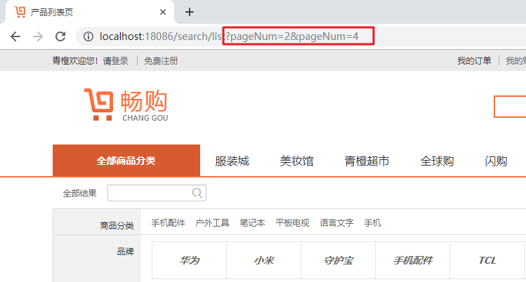

注意：每次如果搜条件发生变化都要从第1页查询，而点击下一页的时候，分页数据在页面给出，不需要在后台拼接的url中给出，所以在拼接url的时候，需要过滤掉分页参数，修改`changgou-web-search`的控制层`com.changgou.search.controller.SkuController`的url拼接方法，代码如下：

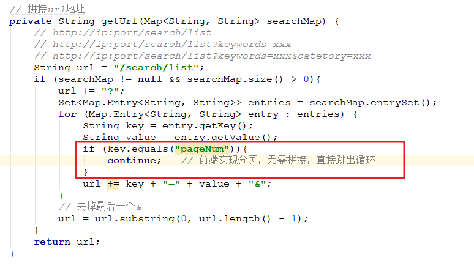


```java
//判断是否是分页条件
if (key.equals("pageNum")) {
    //前端实现分页,无需拼接,直接跳出循环
    continue;
}
```


## 4.8 特殊关键字处理(学员作业)

如果请求以GET请求，参数会拼接到URL上去，此时后台传输数据的时候，会将`+>`等特殊字符变成空格，我们需要对它进行转义，我们这里很有可能在规格中存在特殊字符，例如`移动3G+联通3G`这里的加号就属于特殊字符，我们可以在后台接收的参数那里做统一处理。

`修改com.changgou.search.controller.SkuController类`,添加一个方法处理提交的参数，代码如下：

```java
/****
 * 替换特殊字符
 * @param searchMap
 */
public void handlerSearchMap(Map<String,String> searchMap){
    if(searchMap!=null){
        for (Map.Entry<String, String> entry : searchMap.entrySet()) {
            if(entry.getKey().startsWith("spec_")){
                entry.setValue(entry.getValue().replace("+","%2B"));
            }
        }
    }
}
```

每次执行的时候，调用上面搜索方法处理。

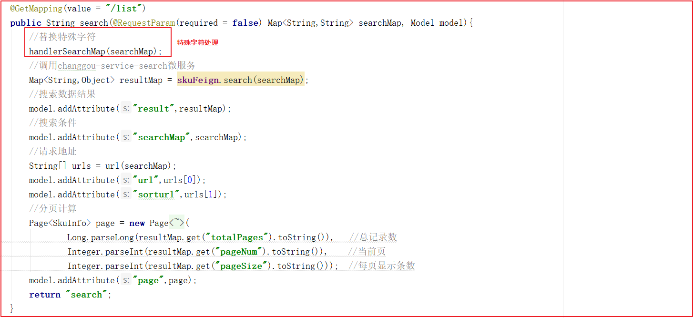

```java
//自定义方法:替换特殊字符
handlerSearchMap(searchMap);
```


`修改changgou-service-search微服务`的SkuServiceImpl类的buildBasicQuery方法，添加将`\\`替换的操作，代码如下：

`注意:规格筛选已经写过了,加入红框的内容即可`

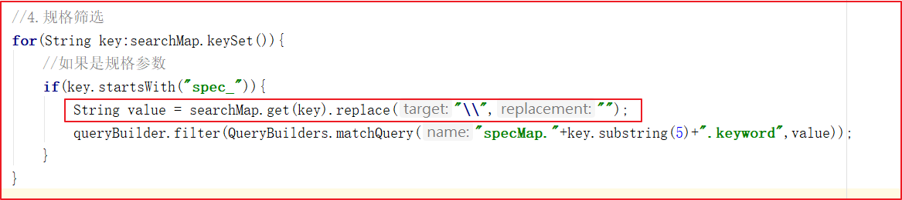

页面显示也做下简单处理即可,修改search.html，代码如下：

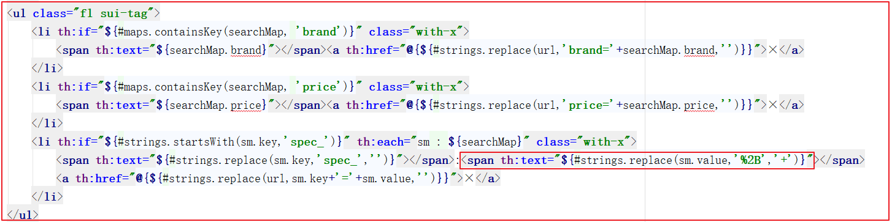


# 5 畅购商品详情页

需求：生成商品详情的静态页。

实现：模板（提供）     +       数据（业务数据）      =      输出（生成静态页面）

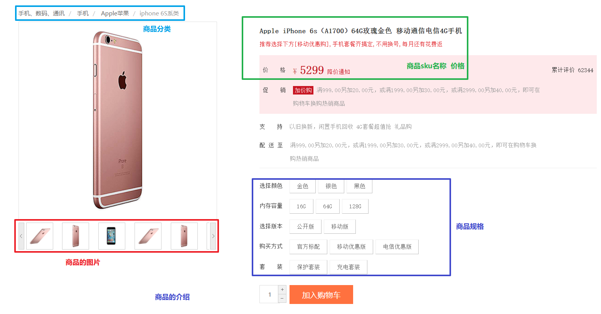

静态页面需要的数据有：

1、商品的基本信息（商品介绍、包装清单、售后服务）：**tb_spu表**

2、商品的分类：**tb_category表**

3、商品对应的库存：**tb_sku表**

4、商品的图片列表：**tb_spu表，图片列表 images**

5、商品的规格列表：**tb_spu表，规格列表 spec_items **


- 生成的静态页面给用户访问的，创建一个独立的客户端应用。
  - 生成静态页面：需要的业务数据，通过goods服务提供
    - goods提供接口数据。
  - 用户访问生成好的静态页面


代码实现：

- 创建静态化服务的客户端工程
- 编写相关相关接口
- 客户端程序：调用接口，并且生成静态页面


## 5.1 需求分析

当系统审核完成商品，需要将商品详情页进行展示，那么采用静态页面生成的方式生成，并部署到高性能的web服务器中进行访问是比较合适的。所以，开发流程如下图所示：

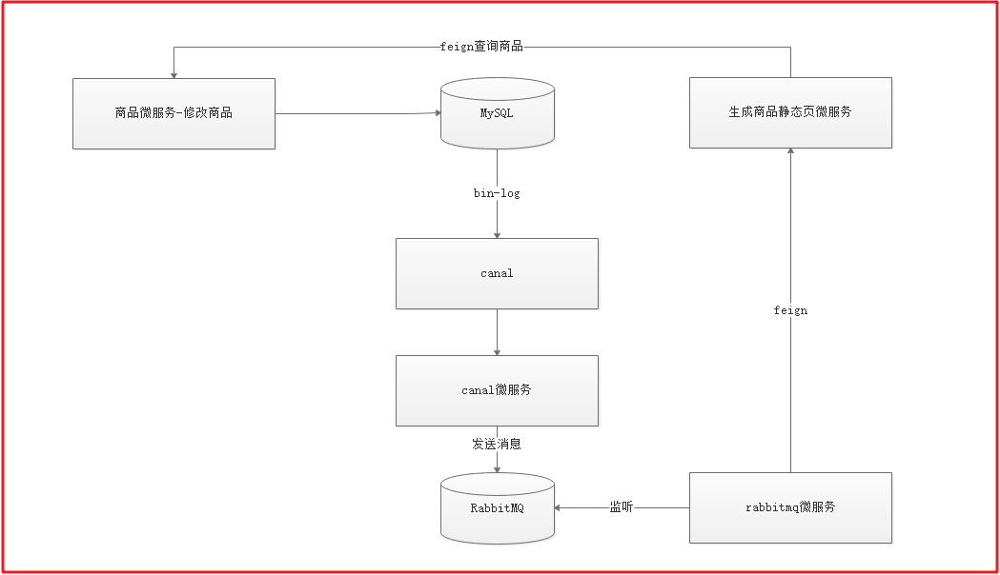

此处MQ我们使用Rabbitmq即可。

执行步骤解释：

+ 系统管理员（商家运维人员）修改或者审核商品的时候，会触发canal监控数据
+ canal微服务获取修改数据后，向RabbitMQ发送消息
+ 创建一个RabbitMQ微服务监听消息，并调用生成静态页微服务
+ 静态页微服务只负责使用thymeleaf的模板技术生成静态页
+ 运维部署静态页到服务器上，并部署nginx作为http服务器
+ 用户在浏览器中输入地址访问网关路由到nginx并展示静态页面。


## 5.2 商品静态化微服务创建

### 5.2.1 需求分析

该微服务只用于生成商品静态页，不做其他事情。


### 5.2.2 搭建项目

#### 5.2.2.1 创建工程

在changgou-web下创建一个名称为changgou-web-item的模块,如图：

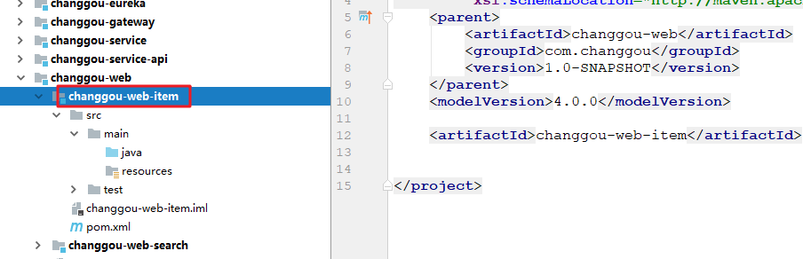


changgou-web-item中添加起步依赖，如下

```xml
<?xml version="1.0" encoding="UTF-8"?>
<project xmlns="http://maven.apache.org/POM/4.0.0"
         xmlns:xsi="http://www.w3.org/2001/XMLSchema-instance"
         xsi:schemaLocation="http://maven.apache.org/POM/4.0.0 http://maven.apache.org/xsd/maven-4.0.0.xsd">
    <parent>
        <artifactId>changgou-web</artifactId>
        <groupId>com.changgou</groupId>
        <version>1.0-SNAPSHOT</version>
    </parent>
    <modelVersion>4.0.0</modelVersion>
    <artifactId>changgou-web-item</artifactId>

    <dependencies>
	    <!--生成模板-->        
        <dependency>
            <groupId>org.springframework.boot</groupId>
            <artifactId>spring-boot-starter-thymeleaf</artifactId>
        </dependency>
        <!--api 模块-->
        <dependency>
            <groupId>com.changgou</groupId>
            <artifactId>changgou-service-goods-api</artifactId>
            <version>1.0-SNAPSHOT</version>
        </dependency>
    </dependencies>
</project>
```


#### 5.2.2.2 创建application.yml文件

```yaml
server:
  port: 18087
eureka:
  client:
    service-url:
      defaultZone: http://127.0.0.1:7001/eureka
  instance:
    prefer-ip-address: true
feign:
  hystrix:
    enabled: true
spring:
  thymeleaf:
    cache: false
  application:
    name: item
  main:
    allow-bean-definition-overriding: true
#超时配置
ribbon:
  ReadTimeout: 300000
# 生成静态页的位置(要改动:改成自己的文件路径)
pagepath: D:/workspace_idea/changgou_66_test/changgou-parent/changgou-web/changgou-web-item/src/main/resources/templates/items
```


#### 5.2.2.3 创建启动类

创建启动类`com.changgou.ItemApplication`

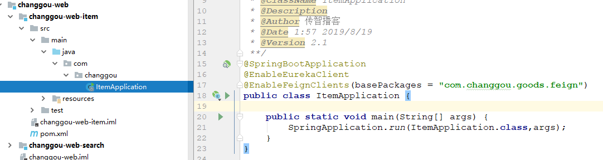

```java
@SpringBootApplication
@EnableEurekaClient
@EnableFeignClients(basePackages = "com.changgou.goods.feign")
public class ItemApplication {
    public static void main(String[] args) {
        SpringApplication.run(ItemApplication.class,args);
    }
}
```


## 5.3 创建Feign

商品详情页需要的数据：因此我们需要在changgou-service-goods-api工程创建对应的feign

1、商品分类（category）

2、商品信息（SPU）

3、库存信息（SKU）

### 5.3.1 创建CategoryFeign

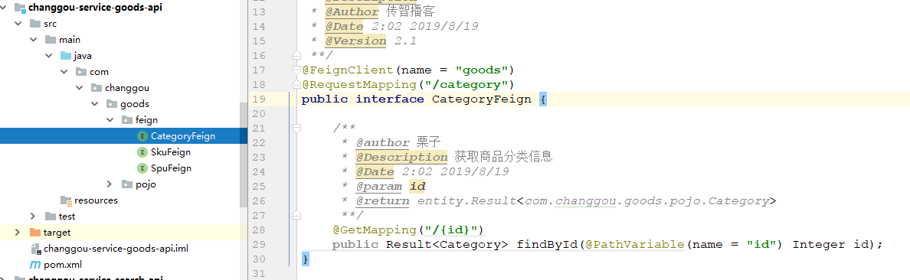

~~~java
@FeignClient(name = "goods")
@RequestMapping("/category")
public interface CategoryFeign {

    /**
     * @author 栗子
     * @Description 获取商品分类信息
     * @Date 2:02 2019/8/19
     * @param id
     * @return entity.Result<com.changgou.goods.pojo.Category>
     **/
    @GetMapping("/{id}")
    Result<Category> findById(@PathVariable(name = "id") Integer id);
}
~~~

### 5.3.2 创建SkuFeign

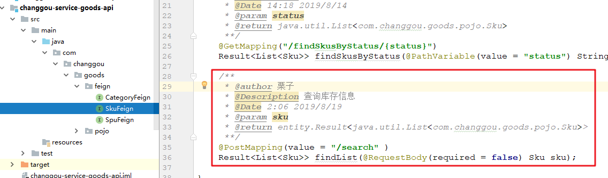

~~~java
/**
     * @author 栗子
     * @Description 查询库存信息
     * @Date 2:06 2019/8/19
     * @param sku
     * @return entity.Result<java.util.List<com.changgou.goods.pojo.Sku>>
     **/
    @PostMapping(value = "/search" )
    Result<List<Sku>> findList(@RequestBody(required = false) Sku sku);
~~~


### 5.3.1 创建SpuFeign

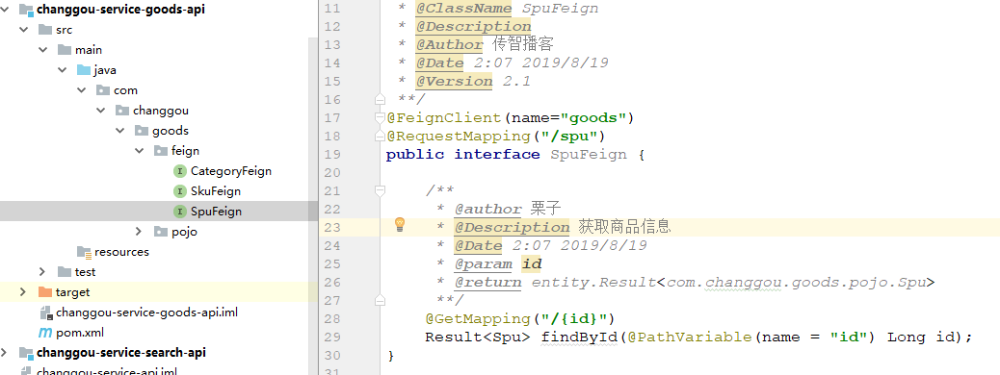

~~~java
@FeignClient(name="goods")
@RequestMapping("/spu")
public interface SpuFeign {

    /**
     * @author 栗子
     * @Description 获取商品信息
     * @Date 2:07 2019/8/19
     * @param id
     * @return entity.Result<com.changgou.goods.pojo.Spu>
     **/
    @GetMapping("/{id}")
    Result<Spu> findById(@PathVariable(name = "id") Long id);
}
~~~


## 5.3 生成静态页

### 5.3.1 需求分析

页面发送请求，传递要生成的静态页的的商品的SpuID.后台controller 接收请求，调用thyemleaf的原生API生成商品静态页。

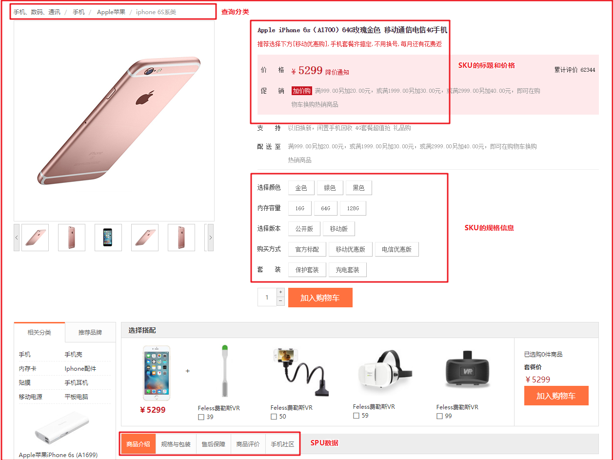

上图是要生成的商品详情页，从图片上可以看出需要查询SPU的3个分类作为面包屑显示，同时还需要查询SKU和SPU信息。


### 5.3.2 静态页生成代码

#### 5.3.2.1 创建Controller

在changgou-web-item中创建com.changgou.item.controller.PageController用于接收请求，测试生成静态页


```java
@RestController
@RequestMapping("/page")
public class PageController {

    //注入service
    @Autowired
    private PageService pageService;

	/**
     * @author 栗子 
     * @Description 生成静态页
     * @Date 2:24 2019/8/19
     * @param id
     * @return entity.Result
     **/
    @GetMapping("/createHtml/{id}")
    public Result createHtml(@PathVariable(name = "id") Long id){
        //生成静态页面
        pageService.createHtml(id);
        // 返回结果
        return new Result(true, StatusCode.OK,"ok");
    }
}
```


#### 5.3.2.2 创建service

接口：PageService

```java
public interface PageService {

    /**
     * @author 栗子 
     * @Description 生成静态页
     * @Date 2:21 2019/8/19
     * @param spuId
     * @return void
     **/
    void createHtml(Long spuId);
}
```


实现类：PageServiceImpl

注意:

* Context要的包

```java
@Service
public class PageServiceImpl implements PageService {

    //注入模板对象
    @Autowired
    private TemplateEngine templateEngine;

    //注入SkuFeign远程调用
    @Autowired(required = false)
    private SkuFeign skuFeign;

    //注入SpuFeign远程调用
    @Autowired(required = false)
    private SpuFeign spuFeign;

    //注入CategoryFeign远程调用
    @Autowired(required = false)
    private CategoryFeign categoryFeign;

    //注入yml文件中对应属性的内容
    @Value("${pagepath}")
    private String pagepath;

    /**
     * @author 栗子 
     * @Description 生成静态页
     * @Date 2:42 2019/8/19
     * @param spuId
     * @return void
     **/
    @Override
    public void createHtml(Long spuId) {
        try {
            //1.获取静态页面化技术数据
            //自定义方法:获取模板需要的数据
            Map<String, Object> dataModel = getDataModel(spuId);
            // 构建模板数据
            Context context = new Context();
            //设置数据
            context.setVariables(dataModel);
            
            // 2.指定静态页面生成的位置:参数3=>writer
            //new文件,并指定路径(路径在配置文件中,这里直接要value注入了)
            File dir = new File(pagepath);
            //空判断
            if (!dir.exists()){
                // 目录为空，创建多级目录
                dir.mkdirs();   
            }
            //拼接静态页面名==id.html
            File dest = new File(dir, spuId + ".html");
            
            // 3.生成页面(会有编译时异常)
            PrintWriter writer = new PrintWriter(dest, "UTF-8");
            
            //4.实现功能:模板对象(模板,数据,输出)
            templateEngine.process("item", context, writer);
            
        } catch (Exception e) {
            e.printStackTrace();
        }
    }

    /**
     * @author 栗子
     * @Description 获取模板需要的数据
     * @Date 2:34 2019/8/19
     * @param spuId
     * @return java.util.Map<java.lang.String,java.lang.Object>
     **/
    private Map<String,Object> getDataModel(Long spuId) {
        Map<String,Object> dataModel = new HashMap<>();
        // 1.实现功能:获取商品基本信息
        Result<Spu> spuResult = spuFeign.findById(spuId);
        //获取已查到的商品对象
        Spu spu = spuResult.getData();
        //添加到map中
        dataModel.put("spu", spu);
        
        // 2.获取库存信息
        //创建对象
        Sku sku = new Sku();
        //封装条件
        sku.setSpuId(spuId);
        //实现功能:查询集合获取商品库存信息
        Result<List<Sku>> skuResult = skuFeign.findList(sku);
        //获取查询到的数据集合
        List<Sku> skuList = skuResult.getData();
        //存到map中
        dataModel.put("skuList", skuList);
        
        // 3.商品分类信息(一级,二级,三级)目录
        //实现查找一级目录功能
        Category category1 = categoryFeign.findById(spu.getCategory1Id()).getData();
        //实现查找二级目录功能
        Category category2 = categoryFeign.findById(spu.getCategory2Id()).getData();
        //实现查找三级目录功能
        Category category3 = categoryFeign.findById(spu.getCategory3Id()).getData();
        //添加到map中
        dataModel.put("category1", category1);
        dataModel.put("category2", category2);
        dataModel.put("category3", category3);
        
        // 4.商品小图(以,号分割)
        String[] imageList = spu.getImages().split(",");
        // 添加到map中
        dataModel.put("imageList", imageList);
        
        // 5.商品规格
        Map<String, String> specificationList = JSON.parseObject(spu.getSpecItems(), Map.class);
        //添加到map中
        dataModel.put("specificationList", specificationList);
        
        // 6.返回map结果集
        return dataModel;
    }
}
```


#### 5.3.2.3 添加模板以及静态资源

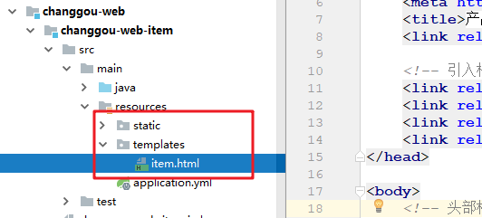


#### 5.3.2.4 静态资源过滤

`生成的静态页`我们可以`先放到changgou-web-item工程中`，后面`项目实战`的时候可以挪出来`放到Nginx指定发布目录`。一会儿我们将生成的静态页放到resources/templates/items目录下,所以请求该目录下的静态页需要直接到该目录查找即可。

我们创建一个EnableMvcConfig类，开启静态资源过滤，代码如下：

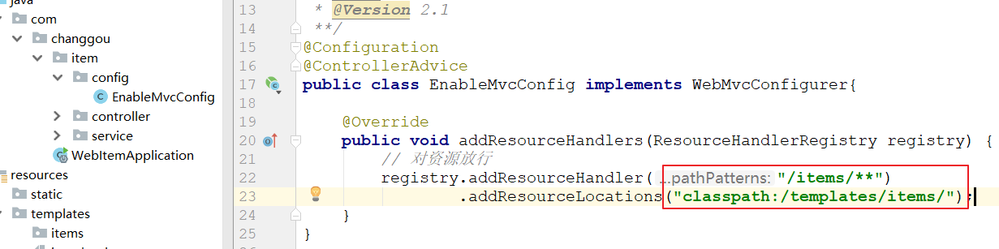

```java
@Configuration
@ControllerAdvice  //增强:放行
public class EnableMvcConfig implements WebMvcConfigurer{

    /**
     * @author 栗子
     * @Description 对请求资源放行
     * @Date 2:52 2019/8/19
     * @param registry
     * @return void
     **/
    @Override
    public void addResourceHandlers(ResourceHandlerRegistry registry) {
        // 对资源放行(请求的路径).(静态页面所在的目录路径)
        registry.addResourceHandler("/items/**")
                .addResourceLocations("classpath:/templates/items/");
    }
}
```

#### 5.3.2.5 启动测试

生成静态页地址 :`数据库中spu的id`

`<http://localhost:18087/page/createHtml/1148477873514881024> `

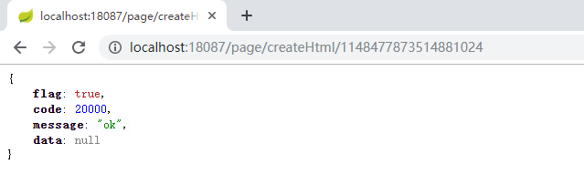

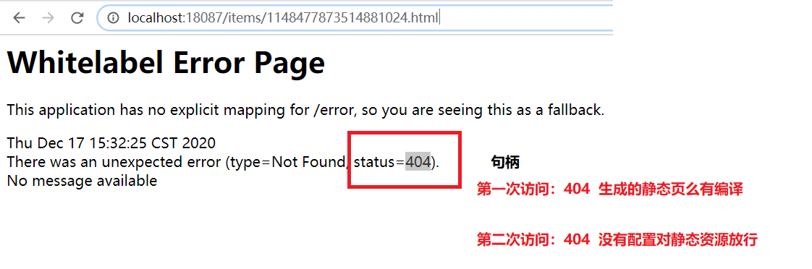


静态页生成后访问地址 `http://localhost:18087/items/1148477873514881024.html`

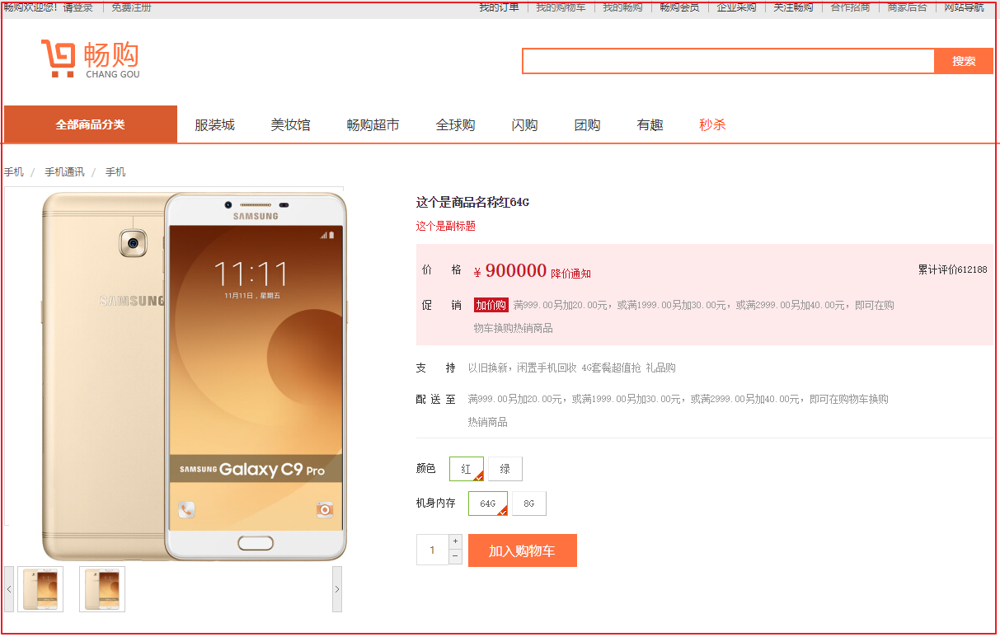


#### 5.3.2.6 模板说明


(1)面包屑数据

修改item.html，填充三个分类数据作为面包屑，代码如下：

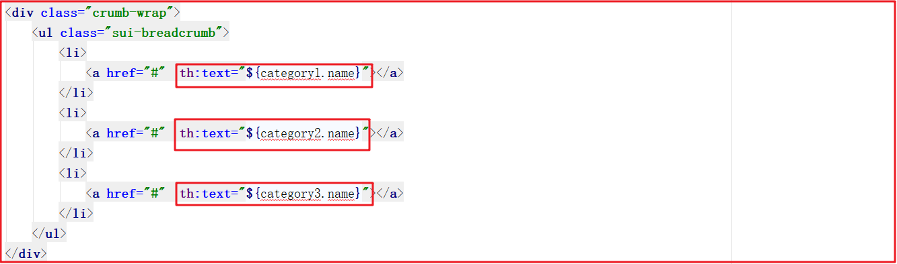


(2)商品图片

修改item.html，将商品图片信息输出，在真实工作中需要做空判断，代码如下：

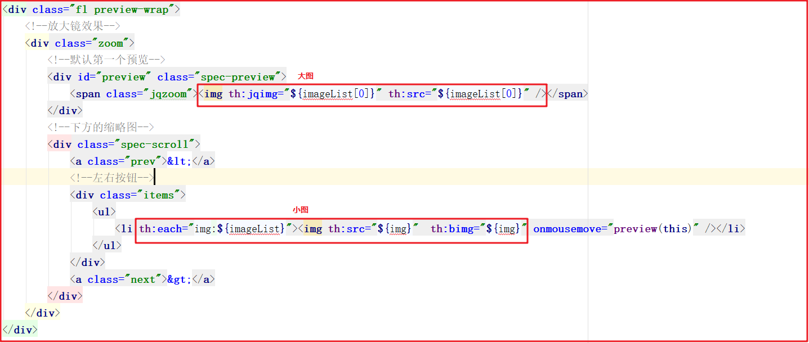


(3)规格输出

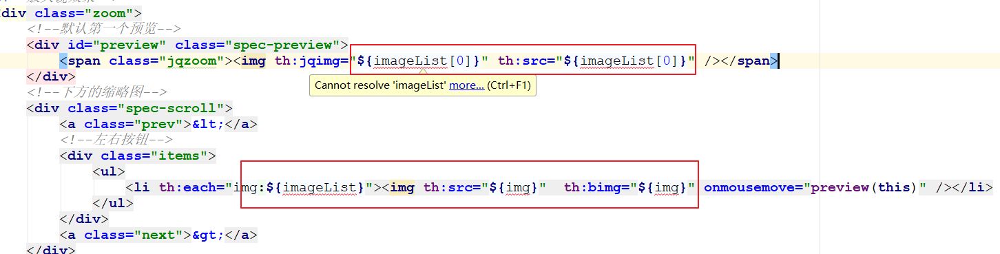


(4)默认SKU显示

静态页生成后，需要显示默认的Sku，我们这里默认显示第1个Sku即可，这里可以结合着Vue一起实现。可以先定义一个集合，再定义一个spec和sku，用来存储当前选中的Sku信息和Sku的规格，代码如下：

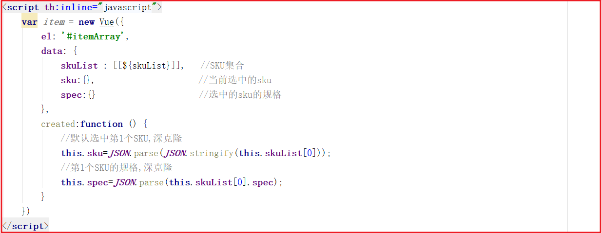


页面显示默认的Sku信息

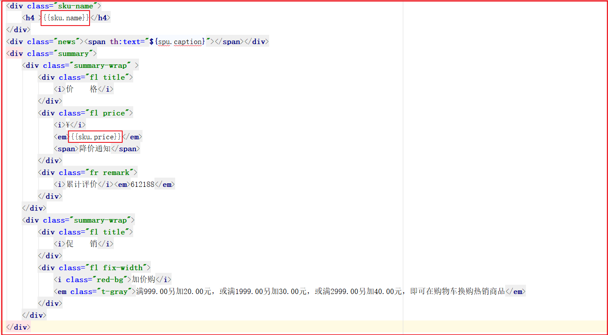


(5)记录选中的Sku

在当前Spu的所有Sku中spec值是唯一的，我们可以根据spec来判断用户选中的是哪个Sku，我们可以在Vue中添加代码来实现，代码如下：

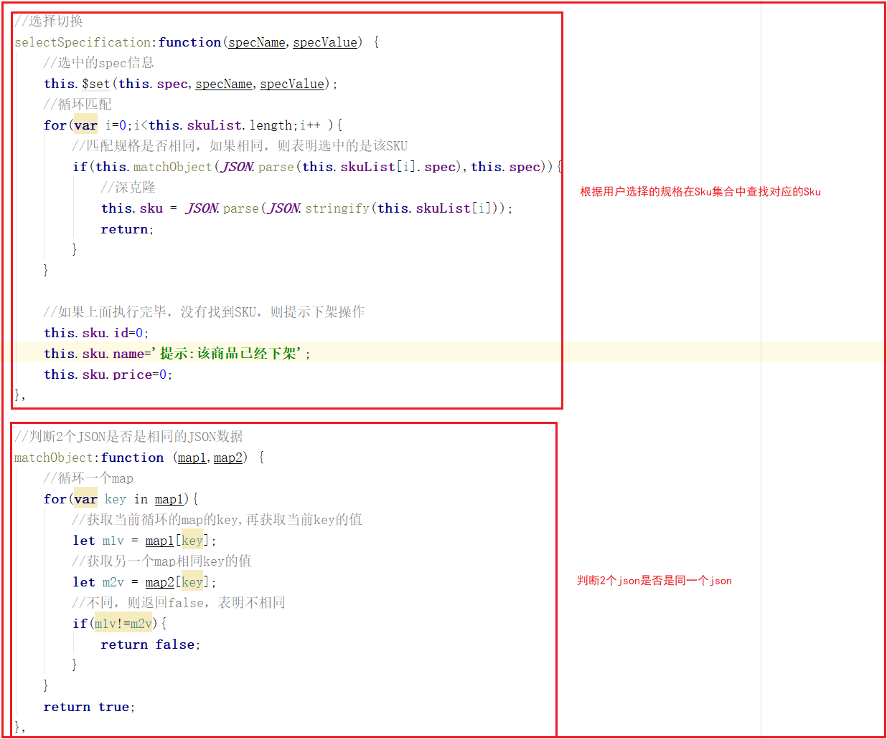


添加规格点击事件

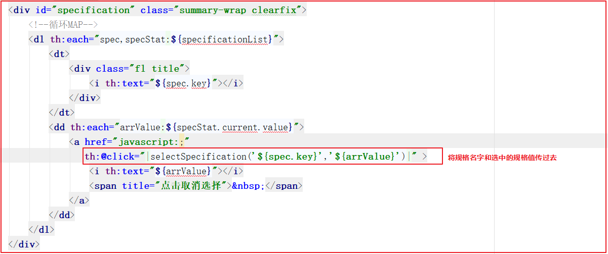


(6)样式切换

点击不同规格后，实现样式选中，我们可以根据每个规格判断该规格是否在当前选中的Sku规格中，如果在，则返回true添加selected样式，否则返回false不添加selected样式。

Vue添加代码：

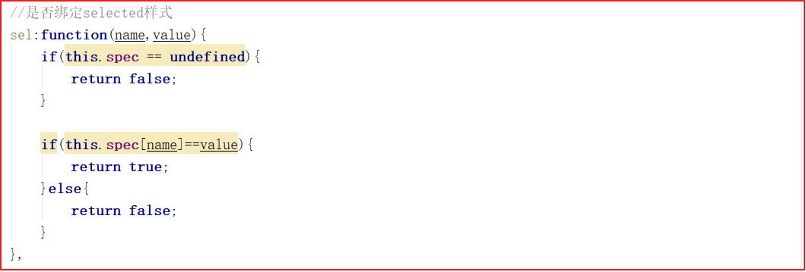


页面添加样式绑定，代码如下：

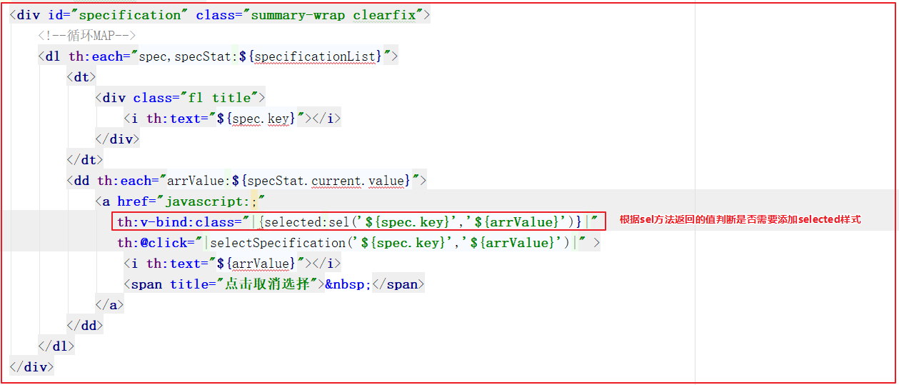


# 6 RabbitMQ微服务搭建

商品的上架。

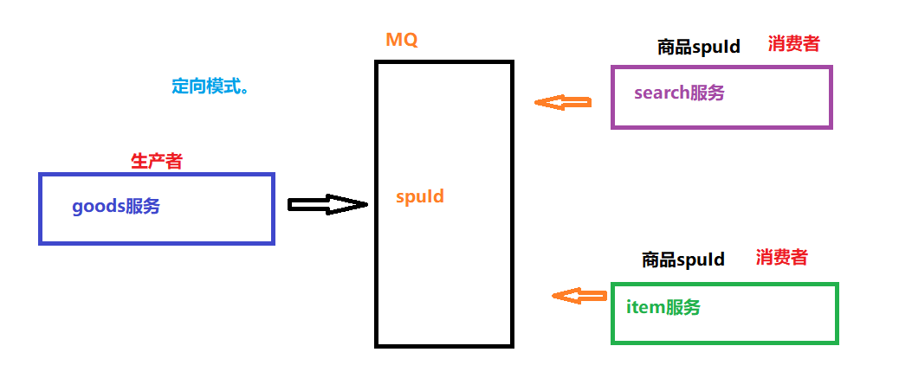


## 6.1 需求分析

当商品微服务上架商品之后，应当发送消息，我们可以将数据发送给RabbitMQ。

## 6.2 Goods微服务

### 6.2.1 添加依赖

**pom.xml依赖**

修改changgou-service-goods工程的pom.xml，引入如下依赖：

```xml
<!--MQ依赖-->
<dependency>
    <groupId>org.springframework.boot</groupId>
    <artifactId>spring-boot-starter-amqp</artifactId>
</dependency>
```


**application.yml配置**

application.yml文件，添加mq配置：

```properties
spring:
  rabbitmq:
    host: 192.168.211.132
    port: 5672
```


### 6.2.2 创建队列

我们在`启动类`中创建队列，在启动类中添加如下代码

~~~java
//创建search队列
@Bean
public Queue searchQueue(){
    return new Queue("search-queue", true);
}

//创建item队列
@Bean
public Queue itemQueue(){
    return new Queue("item-queue", true);
}

//创建交换机
@Bean
public Exchange goodsExchange(){
    return new DirectExchange("goods-exchange", true, false);
}

//交换机及与该两个队列绑定
//search队列和交换机
@Bean
public Binding bindQueueToExchangeBySearch(Exchange goodsExchange, Queue searchQueue) {
    return BindingBuilder.bind(searchQueue).to(goodsExchange).with("goods-routing-key").noargs();
}

//item队列和交换机
@Bean
public Binding bindQueueToExchangeByItem(Exchange goodsExchange,Queue itemQueue) {
    return BindingBuilder.bind(itemQueue).to(goodsExchange).with("goods-routing-key").noargs();
}
~~~

### 6.2.3 发送消息

修改SpuServiceImpl中的isShow方法中添加,。

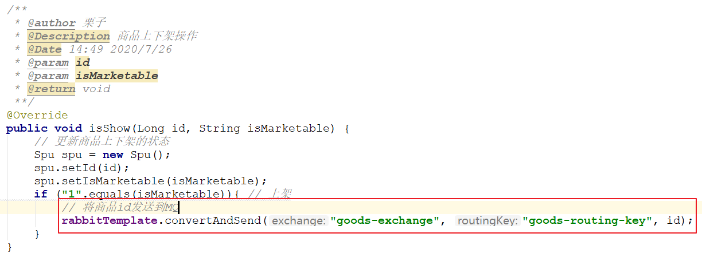

`先注入模板后再实现功能`

```java
//注入MQ的模板
@Autowired
private RabbitTemplate rabbitTemplate;
```

```java
//实现功能:发送消息到MQ中
rabbitTemplate.convertAndSend("goods-exchange","goods-routing-key",String.valueOf(spuId));
```


## 6.3 Item微服务

### 6.3.1 添加依赖

(1)引入依赖

```xml
<!--MQ依赖-->
<dependency>
    <groupId>org.springframework.boot</groupId>
    <artifactId>spring-boot-starter-amqp</artifactId>
</dependency>
```


(2)RabbitMQ配置

在application.yml中引入rabbitmq配置，代码如下：

```properties
#rabbitmq配置
spring:
  rabbitmq:
    host: 192.168.211.132
    port: 5672
```


### 6.3.2 编写监听器

changgou-web-item中通过MQ监听消息并生成静态页。

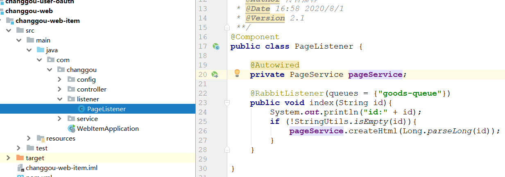

```java
/**
 * @ClassName PageListener
 * @Description
 * @Author 传智播客
 * @Date 16:58 2020/8/1
 * @Version 2.1
 **/
@Component
public class PageListener {

    //注入service
    @Autowired
    private PageService pageService;

    @RabbitListener(queues = {"goods-queue"})
    public void index(String id) {
        System.out.println("id = " + id);
        //判空
        if (!StringUtils.isEmpty(id)) {
            //实现功能:调用创建静态方法
            pageService.createHtml(Long.parseLong(id));
        }
    }

}
```

## 6.3 search微服务

(1)引入依赖

```xml
<!--MQ依赖-->
<dependency>
    <groupId>org.springframework.boot</groupId>
    <artifactId>spring-boot-starter-amqp</artifactId>
</dependency>
```


(2)RabbitMQ配置

在application.yml中引入rabbitmq配置，代码如下：

```properties
#rabbitmq配置
spring:
  rabbitmq:
    host: 192.168.211.132
    port: 5672
```


再changgou-service-search中写个输出


### 测试

#### 注意

* 要先执行发送消息到队列的操作再启动item
* 不然会导致队列中没数据,项目包没对应-队列模块

1.先执行方法,发送消息到队列中:http://localhost:18081/spu/isShow/1338756558632390656/1


2.访问数据库的MQ:http://192.168.211.132:15672/#/queues


3.启动2个消费者,过滤器自动执行:从队列中拿数据


